# Authentication

Before a system can authorize or restrict anything, it first needto know the **identity of the requester**, whether a **user**, a **service**, a **device** or a **third-party application**. This process of identifying the requester is called **authentication**.

"Authentication is the first step in any security process and is crucial for ensuring that only legitimate users or entities can access resources."

"Authentication verifies that the user or service trying to access our system is who they claim to be."

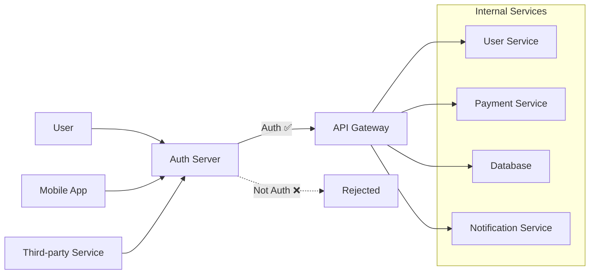
---

 # Most Common Authentication WRONG concepts

- Authentication methods are not the same as authentication frameworks. Authentication methods refer to the specific techniques used to verify identity (e.g., password, token, biometric), while authentication frameworks are structured systems that implement these methods (e.g., OAuth2, OpenID Connect, SAML).

- JWT (JSON Web Token) is not an authentication framework; it is a token format that can be used within various authentication methods. It is often used for stateless authentication, where the server does not need to store session information.

- Bearer authentication is a method of transmitting access tokens (like JWTs) in HTTP headers. It is not an authentication framework itself but a way to present credentials.

- OAuth2 is not an authentication method; it is an authorization framework that allows third-party applications to access user resources without exposing credentials. It can be used in conjunction with authentication methods but does not perform authentication on its own.

- SSO (Single Sign-On) is a user authentication process that allows a user to access multiple applications with one set of login credentials. It is not an authentication method but rather a user experience feature that can be implemented using various authentication methods and frameworks.

---

# Summary of Authentication Concepts

1. **Basics**: Authentication is the process of verifying the identity of a user or entity. It ensures that the requester is who they claim to be before granting access to resources. This can be done through various methods, such as *passwords*, *biometrics*, or *tokens*. It is the first step in any security process and is crucial for maintaining the integrity and confidentiality of a system.

2. **Digest**: Digest authentication is a method that uses a challenge-response mechanism to verify the identity of a user. It involves hashing the credentials and sending them over the network, providing better security than basic authentication. It helps prevent attacks like *man-in-the-middle*, *replay attacks*, and *eavesdropping* by using *nonces* and *timestamps*.

3. **API Keys**: API keys are unique identifiers used to *authenticate requests* made to an API. They are often used for server-to-server communication and can be included in request headers or query parameters. While they provide a simple way to authenticate, they should be kept secret and rotated regularly to maintain security.

4. **Session**: Session-based authentication involves creating a session on the server after a user successfully logs in. The server generates a *unique session ID*, which is sent to the client and *stored in cookies*. This session ID is used to *authenticate subsequent requests*. Sessions can be managed with expiration times and can be invalidated upon logout or after a period of inactivity.

5. **Bearer & JWT**: Bearer authentication is a method where the client sends a *token* (like a JWT) in the HTTP header to authenticate requests. JWTs are *self-contained tokens* that include claims about the user and can be verified without server-side storage. They are often used in stateless authentication systems, allowing for scalable and efficient authentication.

6. **Access & Refresh Tokens**: Access tokens are short-lived tokens used to access protected resources, while refresh tokens are long-lived tokens used to obtain new access tokens without requiring the user to re-authenticate. This mechanism *enhances security* by *limiting the exposure of access tokens* and allowing for seamless user experiences.

7. **OAuth2**: OAuth2 is an *authorization framework* that allows third-party applications to access user resources without exposing credentials. It defines various *grant types* (like authorization code, implicit, client credentials, and resource owner password credentials) to accommodate different use cases. OAuth2 is often used in conjunction with authentication methods to provide secure access to APIs.

8. **OpenID Connect**: OpenID Connect is an *authentication layer* built on top of OAuth2. It allows clients to verify the identity of users based on the authentication performed by an authorization server. It provides *ID tokens* that contain user information and can be used for *single sign-on* (SSO) and identity federation.

9. **SSO (SAML, OIDC, OAuth2)**: Single Sign-On (SSO) is a user authentication process that allows users to access multiple applications with one set of login credentials. It can be implemented using various protocols like *SAML* (Security Assertion Markup Language), *OpenID Connect* (OIDC), and *OAuth2*. SSO enhances user experience by reducing the need for multiple logins and improves security by centralizing authentication.

---

# What is Authentication?

Authentication is the process of verifying the identity of a user or entity. It ensures that the requester is who they claim to be before granting access to resources. This can be done through various methods, such as *passwords*, *biometrics*, or *tokens*. It is the first step in any security process and is crucial for maintaining the integrity and confidentiality of a system.

# Authentication flow

When a user or service attempts to access a system, the first step is to determine their identity. This is done through an authentication process that verifies the credentials provided by the requester.

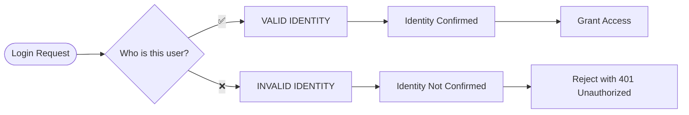

# Enter System

Once the identity is confirmed, the system can then proceed to authorize access to specific resources based on predefined permissions.

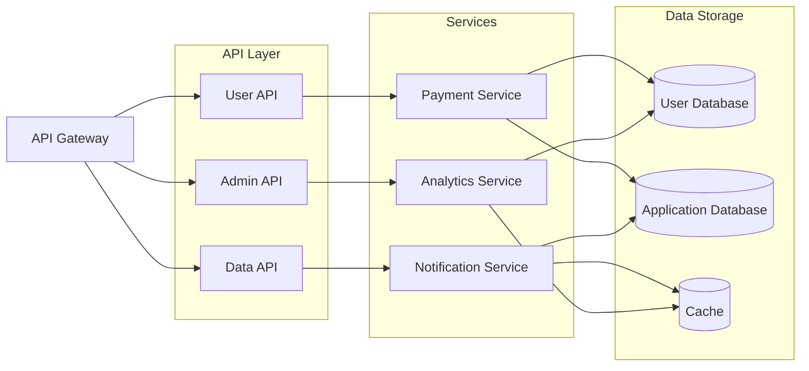

---

# 1. Basic Authentication Flow

In this flow, the client first makes a request to the server. If the server requires authentication, it responds with a 401 Unauthorized status and a WWW-Authenticate header indicating that Basic authentication is required. The client then resends the request with the Authorization header containing the Base64-encoded credentials. The server validates the credentials and either grants access or denies it based on their validity.

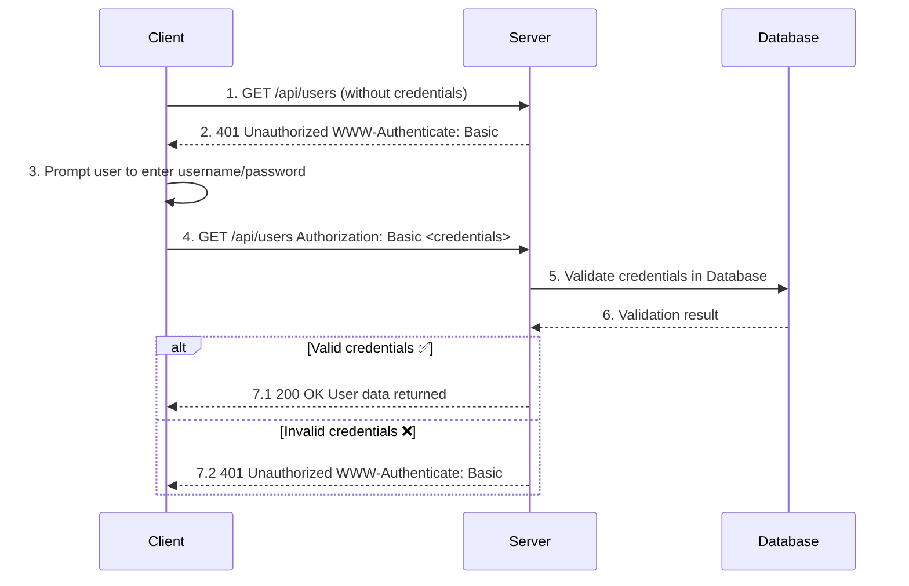

The problem with this method is that they're easily reversible, only secure with HTTPS and rarely used in production, this means that the credentials are sent with every request, which can be intercepted if not properly secured. Additionally, it does not provide a way to manage sessions or tokens, making it less flexible for modern applications that require more complex authentication mechanisms.

---

# 2. Digest Authentication Flow

Digest authentication is a more secure method than Basic authentication. It uses a challenge-response mechanism to verify the identity of the user without sending the password in plaintext. The server sends a nonce (a unique value) to the client, which the client uses to create a hashed response based on the password and other parameters. This hashed response is then sent back to the server for verification.

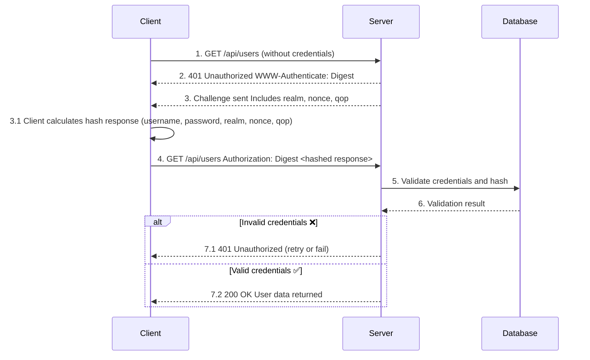

This is better than Basic authentication as it does not send the password in plaintext and uses MD5 hashing to create a response. However, it is still considered outdated and is rarely used in modern applications due to vulnerabilities in the MD5 algorithm and the complexity of implementing it correctly.

---

# 3. API Key Authentication Flow

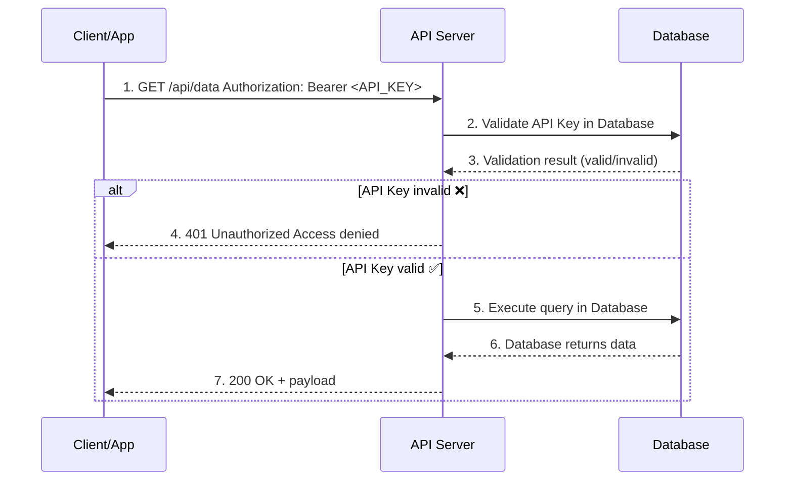

This diagram shows:

- The Client/App sends a request with the API Key.
- The API Server validates the key.
- If invalid → returns 401 Unauthorized.
- If valid → queries the Database, receives the data, and responds with 200 OK.

Using API keys is a simple way to authenticate requests, especially for server-to-server communication. However, they should be kept secret and rotated regularly to maintain security. Additionally, API keys do not provide user-level authentication and are not suitable for scenarios where user identity needs to be verified.

The API key can be similar to JWTs but it is not a token format, in API key authentication, the key is usually a static string that identifies the client or application, while JWTs are dynamic tokens that can carry informations about the user and have expiration times. API keys are often used for service-to-service authentication, while JWTs are more commonly used for user authentication in web applications.

---

# 4. Session-Based Authentication Flow

Session-based authentication is a common method used in web applications. It involves creating a session on the server after a user successfully logs in. The server then sends a session ID to the client, usually stored in a cookie. For subsequent requests, the client sends the session ID, and the server validates it to authenticate the user.

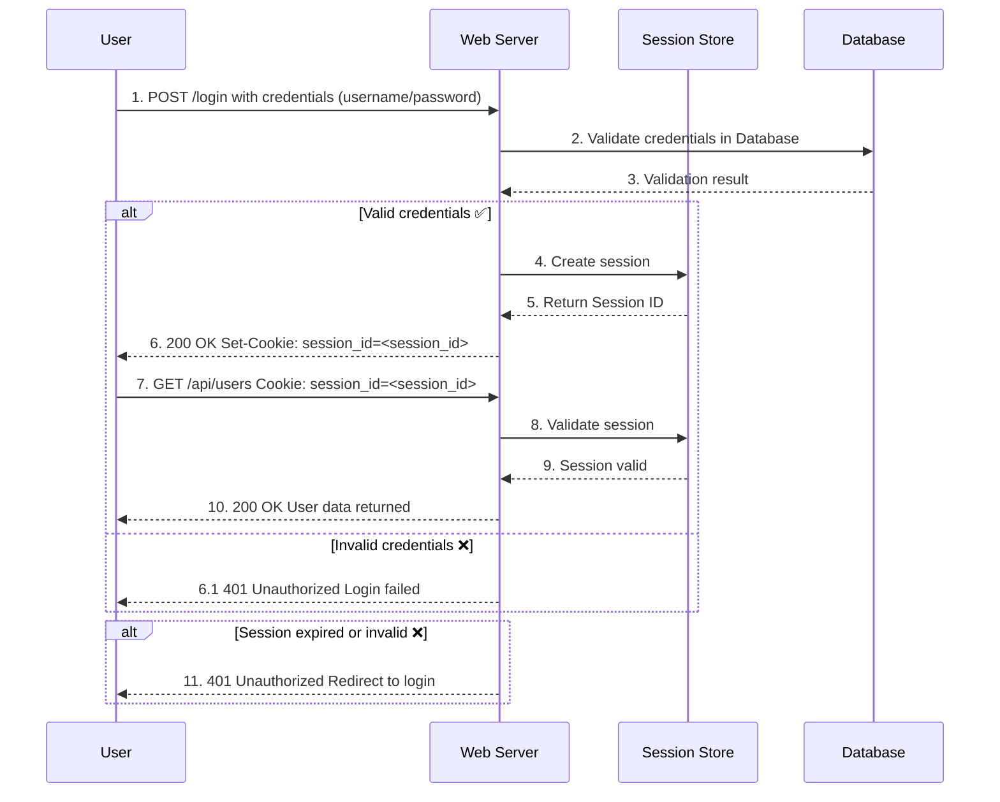

A session-based authentication flow typically involves the following steps:
1. The user submits their credentials (username and password) to the server.
2. The server validates the credentials and creates a session, generating a unique session ID.
3. The session ID is sent back to the client, usually stored in a cookie.
4. For subsequent requests, the client includes the session ID in the request headers or cookies.
5. The server validates the session ID against its session store to authenticate the user.
6. If the session is valid, the server processes the request and returns the appropriate response.
7. If the session is invalid or expired, the server responds with an error (e.g., 401 Unauthorized) and may redirect the user to the login page.

This method is widely used because it allows the server to maintain state and manage user sessions effectively. However, it requires server-side storage of session data, which can become a scalability concern for large applications. Additionally, session IDs must be protected against theft (e.g., through secure cookies) to prevent unauthorized access.

With the rise of stateless architectures and microservices, session-based authentication is less favored compared to token-based methods like JWTs, which do not require server-side session storage and can be more easily scaled across distributed systems.

---

# 5. Bearer Token & JWT Authentication Flow

Instead of session-based authentication, many modern applications use token-based authentication, such as Bearer tokens and JSON Web Tokens (JWTs). In this flow, after a user successfully logs in, the server issues a JWT, which the client includes in the Authorization header of subsequent requests.

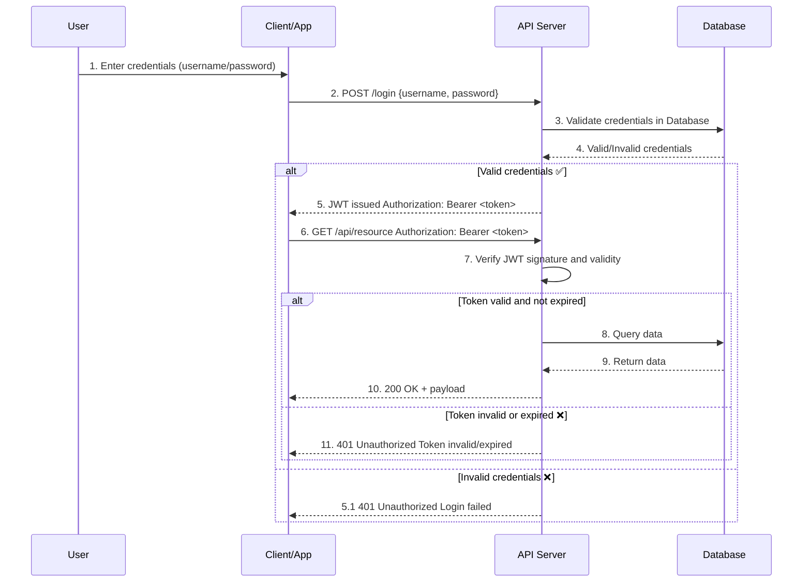

The most common type of token used in this flow is the JWT, which is a self-contained token that includes claims about the user and can be verified without server-side storage. This allows for stateless authentication, making it easier to scale applications across distributed systems. JWT carry withself information about the user, such as their ID, roles, and permissions, in a JSON format, which can be decoded and verified by the server.

The downside of using JWTs is that they can become large in size, especially if they contain many claims, which can impact performance. Additionally, since JWTs are stateless, revoking them before their expiration time can be challenging, requiring additional mechanisms like token blacklisting or short-lived tokens with refresh tokens.

---

# 6. Access & Refresh Token Flow

In this flow, the server issues two tokens upon successful authentication: an access token and a refresh token. The access token is short-lived and used to access protected resources, while the refresh token is long-lived and used to obtain a new access token when the current one expires.

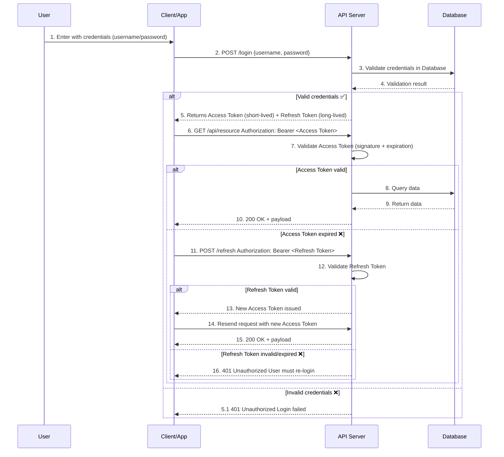

This flow enhances security by limiting the exposure of access tokens and allowing for seamless user experiences. Access tokens are typically short-lived (e.g., 15 minutes to 1 hour), while refresh tokens can last much longer (e.g., days or weeks). This reduces the risk of token theft and misuse, as stolen access tokens will expire quickly.

*XSS (Cross-Site Scripting)* attacks can be a concern with *refresh tokens*, especially if they are stored in local storage or accessible via JavaScript. To mitigate this risk, refresh tokens should be stored in HTTP-only cookies, which are not accessible via JavaScript, reducing the attack surface for XSS vulnerabilities. The use of secure cookies with the `HttpOnly` and `Secure` flags helps protect refresh tokens from being accessed by malicious scripts, ensuring that they are only sent over HTTPS connections and are not exposed to client-side code.

---

# 7. OAuth2 Flow

OAuth2 is an authorization framework that allows third-party applications to access user resources without exposing credentials. It defines various grant types to accommodate different use cases, such as the authorization code flow, implicit flow, client credentials flow, and resource owner password credentials flow.

It's important to remember that OAuth2 is primarily an *authorization framework*, not an *authentication method*. However, it can be used in conjunction with authentication methods to provide secure access to APIs and resources.

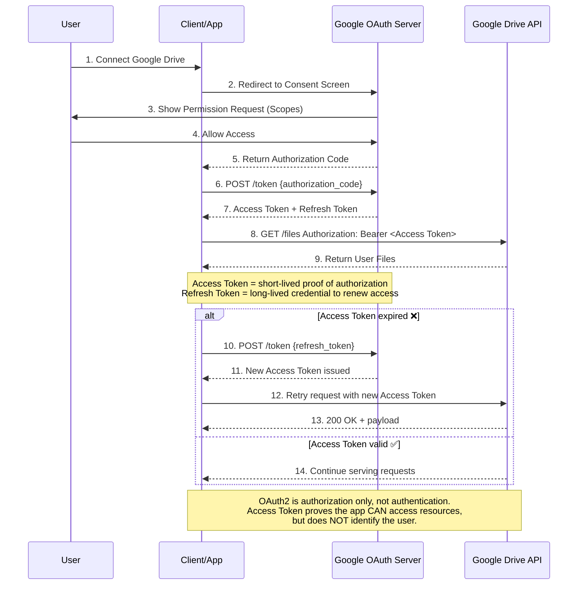

In this diagram, the user initiates the OAuth2 flow by connecting their Google Drive account to a third-party application. The application redirects the user to the Google OAuth server, where they are presented with a consent screen requesting permission to access specific resources (scopes). Upon granting access, the OAuth server returns an authorization code to the application. The application then exchanges the authorization code for an access token and a refresh token. To this point, the access token allows the application to access the user's resources on Google Drive without exposing the user's credentials. If the access token expires, the application can use the refresh token to obtain a new access token without requiring the user to re-authenticate.

---

# 8. OpenID Connect Flow

OpenID Connect (OIDC) is an authentication layer *built on top of OAuth2*. It allows clients to verify the identity of users based on the authentication performed by an authorization server. OIDC *provides ID tokens* that contain user information and can be used for single sign-on (SSO) and identity federation.

In this flow, after the user authenticates with the authorization server, an ID token is issued along with the access token. The ID token contains claims about the user, such as their unique identifier, email, and other profile information. The client can use this ID token to authenticate the user and establish a session.

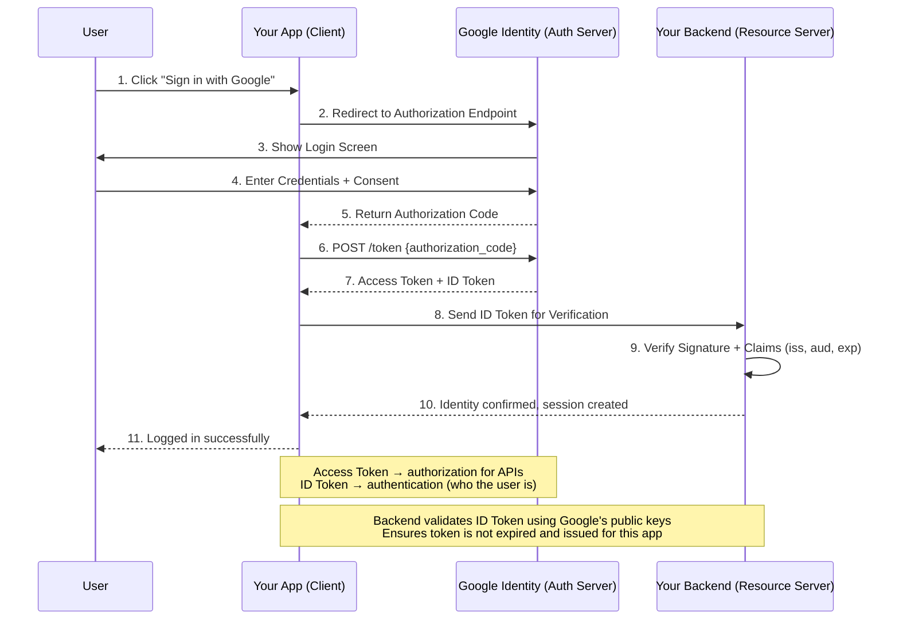

In this flow, the user initiates the login process by clicking "Sign in with Google." The application redirects the user to Google's authorization endpoint, where they log in and grant consent. Google then returns an authorization code to the application, which exchanges it for an access token and an ID token. The ID token is sent to the backend for verification, confirming the user's identity and allowing the backend to create a session for the user.

---

# 9. SSO (Single Sign-On) Flow

Single Sign-On (SSO) is a user experience feature, not an authentication method. It allows users to access multiple applications with one set of login credentials. SSO can be implemented using multiple services and protocols, such as *SAML* (Security Assertion Markup Language), *OpenID Connect* (OIDC), and *OAuth2*. The goal of SSO is to enhance user experience by reducing the need for multiple logins and improving security by centralizing authentication.

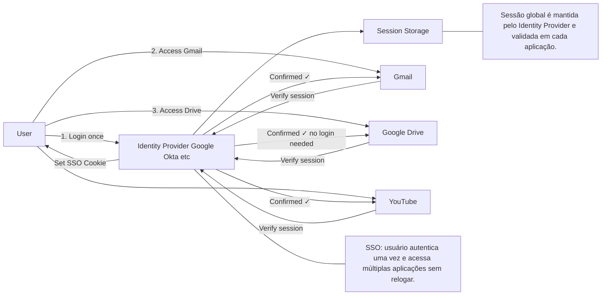

In this flow, the user logs in once with the Identity Provider (IdP), which sets a global SSO session. When the user accesses different applications (like Gmail, Google Drive, and YouTube), each application verifies the session with the IdP. If the session is valid, access is granted without requiring the user to log in again.

Let's say the user logs in to Gmail first. The IdP sets a session cookie for the user. When the user then tries to access Google Drive, the application checks with the IdP to verify the session. Since the session is valid, the user is granted access without needing to log in again. The same process occurs when accessing YouTube.