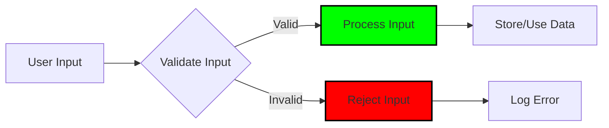
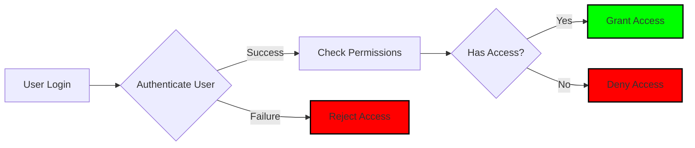
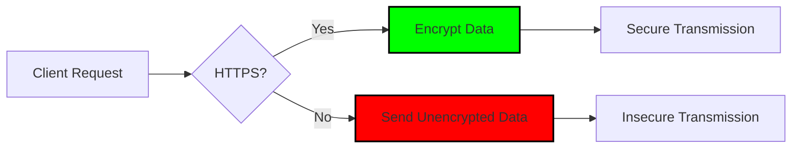
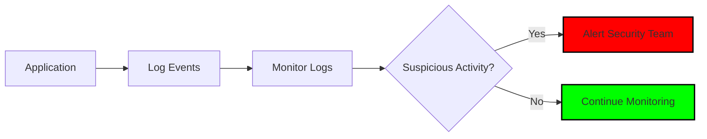

# OWASP (Open Web Application Security Project)

is a nonprofit foundation that works to improve the security of software. It provides a wealth of resources, including guidelines, tools, and best practices for developers and organizations to enhance the security of their applications.

# Implement Proper Password Strength Controls

A key concern when using passwword for authentication is ensuring that users create strong passwords that are difficult for attackers to guess or crack. Implementing proper password strength controls can significantly enhance the security of your application. Here are some best practices to consider:

- **Enforce Minimum Length**: Require passwords to be at least 8-12 characters long. Longer passwords are generally more secure.

- **Require Complexity**: Encourage users to include a mix of uppercase letters, lowercase letters, numbers, and special characters in their passwords. This increases the number of possible combinations and makes brute-force attacks more difficult.

- **Avoid Common Passwords**: Implement checks against a list of commonly used passwords (e.g., "password", "123456", "qwerty") to prevent users from choosing easily guessable passwords.

- **Use Password Blacklists**: Maintain a blacklist of known compromised passwords and prevent users from using them. This can be done by integrating with services that provide lists of breached passwords.

- **Implement Password Expiration Policies**: While not always necessary, consider implementing policies that require users to change their passwords periodically. However, be cautious as frequent changes can lead to weaker passwords if users resort to predictable patterns.

- **Provide Feedback on Password Strength**: Offer real-time feedback to users as they create their passwords, indicating whether their chosen password meets the required strength criteria.

- **Encourage the Use of Passphrases**: Instead of single words, encourage users to create passphrases that are longer and easier to remember. For example, "CorrectHorseBatteryStaple" is a strong passphrase.

- **Implement Multi-Factor Authentication (MFA)**: While not directly related to password strength, adding an additional layer of security through MFA can significantly reduce the risk of unauthorized access, even if a password is compromised.

- **Educate Users**: Provide guidance and resources to educate users about the importance of strong passwords and how to create them. Awareness can lead to better password practices.

- **Regularly Review and Update Password Policies**: As attack methods evolve, regularly review and update your password policies to ensure they remain effective against new threats.

- **Use Secure Password Storage**: Ensure that passwords are stored securely using strong hashing algorithms (e.g., bcrypt, Argon2) and salting techniques to protect against password theft in case of a data breach.

- **Monitor for Suspicious Activity**: Implement monitoring and alerting mechanisms to detect unusual login attempts or patterns that may indicate a brute-force attack or credential stuffing.

- **Consider Passwordless Authentication**: Explore alternative authentication methods, such as passwordless authentication (e.g., magic links, biometric authentication), which can reduce the reliance on passwords and enhance security.

---

# Coding

When coding, it is essential to follow secure coding practices to prevent vulnerabilities that could be exploited by attackers. Here are some key considerations:

- **Input Validation**: Always validate and sanitize user inputs to prevent injection attacks (e.g., SQL injection, XSS). Use parameterized queries and prepared statements.

- **Authentication and Authorization**: Implement robust authentication mechanisms and ensure proper authorization checks are in place to restrict access to sensitive resources.

- **Error Handling**: Implement proper error handling to avoid exposing sensitive information in error messages. Use generic error messages for users and log detailed errors for developers.

- **Secure Communication**: Use HTTPS to encrypt data in transit and protect against eavesdropping and man-in-the-middle attacks. Ensure that SSL/TLS certificates are properly configured and up to date.

- **Regular Security Testing**: Conduct regular security testing, including penetration testing and code reviews, to identify and address vulnerabilities in your application.

- **Keep Dependencies Updated**: Regularly update third-party libraries and dependencies to patch known vulnerabilities. Use tools to monitor for security advisories related to your dependencies.

- **Implement Logging and Monitoring**: Set up logging and monitoring to detect suspicious activities and potential security breaches. Ensure that logs are stored securely and monitored for anomalies.

- **Use Security Headers**: Implement security headers (e.g., Content Security Policy, X-Frame-Options, X-XSS-Protection) to protect against common web vulnerabilities.

- **Educate Developers**: Provide training and resources to developers on secure coding practices and the latest security threats. Encourage a culture of security awareness within the development team.

- **Implement Secure Session Management**: Use secure session management techniques, such as setting appropriate session timeouts, using secure cookies, and regenerating session IDs after login.

- **Regularly Review and Update Security Practices**: Stay informed about the latest security threats and best practices. Regularly review and update your security policies and procedures to ensure they remain effective against evolving threats.

- **Use Security Tools and Frameworks**: Leverage security tools and frameworks that can help identify vulnerabilities and enforce security best practices in your codebase. Examples include static analysis tools, dependency checkers, and security-focused libraries.

- **Implement Role-Based Access Control (RBAC)**: Define roles and permissions within your application to ensure that users only have access to the resources necessary for their role. This minimizes the risk of unauthorized access.

- **Regularly Backup Data**: Implement a robust backup strategy to ensure that critical data can be restored in the event of a security breach or data loss incident. Store backups securely and test the restoration process regularly.