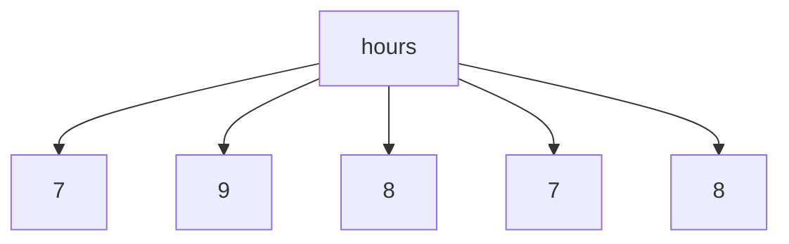
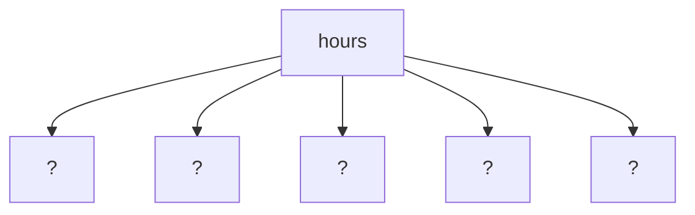
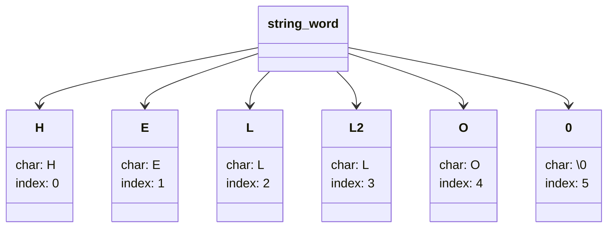
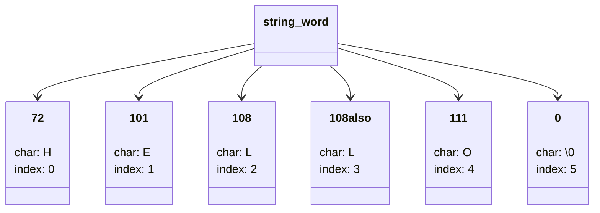

# Arrays

Let's explore arrays in C. An array is a collection of elements of the same type, stored in contiguous memory locations. Each element can be accessed using an index.

For example, an alarm clock can be represented as an array of integers, where each element represents a different time setting.



By storing this information in an array, we can easily access and manipulate the time settings for the alarm clock.

---

## Caracteristics

- **SIZE**: The number of elements in the array.

All array have a size, which is the number of elements it can hold. In C, the size of an array must be known at compile time and cannot be changed during runtime.

```c
int hours[5];
datatype name[size];
```

in this example, `hours` is an array of integers with a size of 5. The elements of the array can be accessed using their index, starting from 0.



Here, the `?` represents the uninitialized values of the array elements. In C, if an array is not explicitly initialized, its elements will contain garbage values.

- **TYPE**: The type of elements in the array.

Each array can hold elements of a specific data type, such as integers, floats, or characters. The type of the elements is specified when declaring the array.

```c
int hours[5]; // Array of integers
float temperatures[10]; // Array of floats
char letters[26]; // Array of characters
```

---

# Array Exercise

Create an array of size 5 where each element is two times the previous and the first element is 1. Then, print the array.

```c
#include <stdio.h>

int main() {
    int arr[5];
    arr[0] = 1; // First element is 1

    // Fill the array with each element being two times the previous
    for (int i = 1; i < 5; i++) {
        arr[i] = arr[i - 1] * 2;
    }

    // Print the array
    printf("Array elements: ");
    for (int i = 0; i < 5; i++) {
        printf("%d ", arr[i]);
    }
    printf("%i\n");

    return 0;
}
```

To compile and run the code, in terminal (supose the name of this file is `arrays.c`), you can use the following commands:

```bash
gcc arrays.c -o arrays
./arrays
```

gcc = GNU Compiler Collection, a compiler system that supports various programming languages, including C. It is used to compile C programs into executable files.

-o = option to specify the output file name for the compiled program. In this case, the output file will be named `arrays`.

---

## Strings

Strings in C are represented as arrays of characters. A string is a sequence of characters terminated by a null character (`\0`).

```c
string word = "Hello";
```



- the code `word[1]` would access the second character of the string, which is 'E'.
- the code `word[5]` would access the null character, which indicates the end of the string.

We also must know that all the characters are numbers in C, and each character has a corresponding ASCII value. For example, the character 'A' has an ASCII value of 65, while 'a' has an ASCII value of 97. In other words, what the computer is seeing is not the character itself, but its corresponding number in the ASCII table.



---

# Alphabetical Exercise

Check if a lowercase string's characters are in alphabetical order. If they are, print "YES", otherwise print "NO".

```c
#include <cs50.h>
#include <stdio.h>
#include <string.h>

int main(void)
{
    // get user's input
    string text = get_string("Input: ");

    // interate trough each element in the string
    for (int i = 0; i < strlen(text); i++)
    {
        if (text[i] < text[i + 1])
        {
            printf("NO\n");
            return 0;
        }
    }

    // if the loop completes without finding any characters out of order, print "YES"
    printf("YES\n");
    return 0;
}
```

 This is a simple program that checks if the characters in a lowercase string are in alphabetical order. It uses the `get_string` function from the CS50 library to get user input, and then iterates through each character in the string, comparing it to the next character. If any character is found to be greater than the next character, it prints "NO" and exits. If the loop completes without finding any characters out of order, it prints "YES".

 The output of the program will be "YES" if the characters are in alphabetical order, and "NO" if they are not.

 ```bash
Input: abcdefg
    Output: YES
```
```bash
Input: zyxwv
    Output: NO
```

---

## Command Line Arguments

What are some examples of programs we've seen that take command-line arguments? For example, the `hello` program takes a name as a command-line argument and prints a personalized greeting. The `caesar` program takes a key as a command-line argument and uses it to encrypt a message.

Another example is the `ls` command in Unix-based systems, which takes various command-line arguments to list files and directories in different ways. For instance, `ls -l` lists files in long format, while `ls -a` includes hidden files in the output.

## argc vs argv

```c
int main(int argc, string argv[])
```

In this declaration, `argc` is an integer that represents the number of command-line arguments passed to the program, including the program name itself. `argv` is an array of strings (character arrays) that contains the actual command-line arguments.

- **int argc** = (Argument Count) is always at least 1, because the program name is always included as the first argument. If no additional arguments are provided, `argc` will be 1, and `argv[0]` will contain the program name. This means that you can always access the program name using `argv[0]`, regardless of how many additional arguments are provided.

- **string argv[]** = (Argument Vector) is an array of strings that contains the actual command-line arguments passed to the program. The first element of `argv` (i.e., `argv[0]`) is always the name of the program itself, while subsequent elements (i.e., `argv[1]`, `argv[2]`, etc.) contain any additional arguments provided by the user.

Backing to caesar example, if the user runs the program with the command `./caesar 13`, then `argc` would be 2 (the program name and the key), and `argv[1]` would contain the string "13". If the user runs the program with no additional arguments, then `argc` would be 1, and `argv[0]` would contain the program name.

In the "$ ./alphabetical hello" example, `argc` would be 2 (the program name and the string "hello"), and `argv[1]` would contain the string "hello". If the user runs the program with no additional arguments, then `argc` would be 1, and `argv[0]` would contain the program name.

Same example using args:

```c
#include <cs50.h>
#include <stdio.h>
#include <string.h>
#include <ctype.h>

int main(int argc, string argv[])
{
    // get user's input
    if (argc != 2)
    {
        printf("Provide a string as a command-line argument.\n");
        return 1;
    }

    string text = argv[1];

    for (int i = 0; i < strlen(text); i++)
    {
        if (!isalpha(text[i]))
        {
            printf("Error: Input must be a string of letters only.\n");
            return 2;
        }
    }

    // interate trough each element in the string
    for (int i = 0; i < strlen(text); i++)
    {
        if (text[i] < text[i + 1])
        {
            printf("NO\n");
            return 0;
        }
    }
    
    // if the loop completes without finding any characters out of order, print "YES"
    printf("YES\n");
}
```

Usage:

```bash
$ ./alphabetical hello
    Output: NO
```
```bash
$ ./alphabetical abcdefg
    Output: YES
```
```bash
$ ./alphabetical 1234
    Output: Error: Input must be a string of letters only.
```
```bash
$ ./alphabetical
    Output: Provide a string as a command-line argument.
```

---

# Conclusion

We have explored arrays in C, including their characteristics, how to declare and initialize them, and how to access their elements using indices. We also discussed strings as arrays of characters and how to manipulate them. Additionally, we covered command-line arguments and how to use `argc` and `argv` to handle user input in C programs.

