# Kafka

Kafka is a distributed streaming platform that is used for building real-time data pipelines and streaming applications. It is designed to handle high throughput and low latency, making it suitable for processing large volumes of data in real-time.

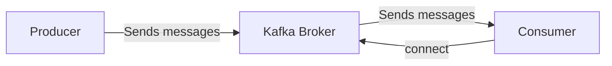

---

# Terminology

- **Broker**: A Kafka broker is a server that stores and serves messages to consumers. It is responsible for receiving messages from producers, storing them, and delivering them to consumers.

- **Partition**: A partition is a unit of storage in Kafka that allows for parallel processing of messages. Each topic can have multiple partitions, and each partition can be stored on different brokers.

- **Topic**: A topic is a category or feed name to which messages are published. Producers send messages to a specific topic, and consumers subscribe to that topic to receive messages.

- **Producer**: A producer is a client application that sends messages to a Kafka topic. It is responsible for creating and sending messages to the broker.

- **Consumer**: A consumer is a client application that reads messages from a Kafka topic. It subscribes to one or more topics and processes the messages as they arrive.

---

# Architecture (inside kafka broker)

Let's visualize the Kafka architecture with a diagram that illustrates the flow of messages from producers to consumers through topics and partitions. Here is a simple representation of the Kafka architecture.

Let's get an example of a sports news application, where producers send messages about soccer and basketball events to specific topics, and consumers subscribe to those topics to receive updates.

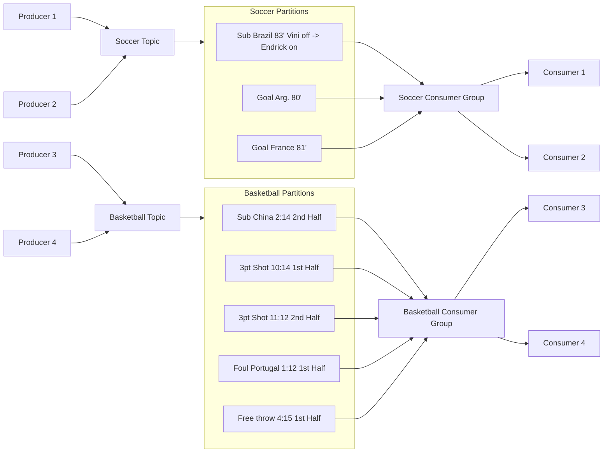

The diagram illustrates the flow of messages in a Kafka architecture. Producers send messages to specific topics, which are divided into partitions for parallel processing. Each partition can be consumed by different consumer groups, allowing for scalable and efficient message processing. Consumers within a group can read from the same partition, ensuring that messages are processed in order while enabling load balancing across multiple consumers.

---

# Under the hood

1. Producers create and publishes a message (message / Record Structure)

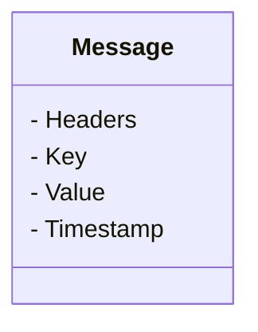

Explaining the message structure:

- **Headers**: Optional metadata that can be attached to the message. Headers can be used for various purposes, such as routing or filtering messages based on specific criteria.

- **Key**: An optional identifier that can be used to determine the partition to which the message will be sent. If a key is provided, Kafka uses it to ensure that messages with the same key are sent to the same partition, preserving order for those messages.

- **Value**: The actual content of the message. This is the data that the producer wants to send to the consumer. The value can be any type of data, such as text, JSON, or binary data.

- **Timestamp**: The time at which the message was created or sent. This can be useful for tracking when messages were produced and for implementing time-based processing or filtering.

Add a record via CLI

```bash
kafka-console-producer --broker-list localhost:9092 --topic random_topic
> key1: Hello, kafka with key1
> key2: Another message with key2
```

Add a record via kafka-python

```python
from kafka import KafkaProducer

# Create a Kafka producer instance
producer = KafkaProducer(bootstrap_servers='localhost:9092')

# Send a message with a key
producer.send('random_topic', key=b'key1', value=b'Hello, kafka with key1')

# Send a message without a key
producer.send('random_topic', value=b'Another message without a key')

# Flush the producer to ensure all messages are sent
producer.flush()

# Close the producer
producer.close()
```

Explaining the code:

- The code demonstrates how to create a Kafka producer using the `kafka-python` library. The producer is configured to connect to a Kafka broker running on `localhost:9092`.

- The producer sends two messages to the `random_topic`. The first message includes a key (`key1`), while the second message does not include a key. The key is used to determine the partition to which the message will be sent, ensuring that messages with the same key are sent to the same partition.

- The `flush()` method is called to ensure that all messages are sent to the broker before closing the producer. Finally, the producer is closed to release any resources it was using.

---

2. Kafka assigns the message to the correct topic, broker, and partition based on the key (if provided) or using a round-robin approach if no key is specified.

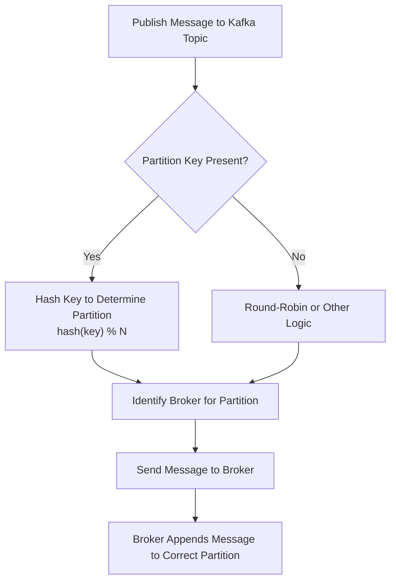

Explaining the flow:

- If a key is provided, Kafka uses a hashing function to determine which partition the message should go to. The hash of the key modulo the number of partitions (N) gives the partition number. This ensures that messages with the same key always go to the same partition, preserving order for those messages.

- If no key is provided, Kafka uses a round-robin or other logic to distribute messages evenly across available partitions. This helps balance the load and ensures that no single partition becomes a bottleneck.

- Once the partition is determined, Kafka identifies the broker responsible for that partition and sends the message to that broker. The broker then appends the message to the correct partition, making it available for consumers to read.

---

3. Message append to partition via append only log file (no update, no delete, no overwrite)

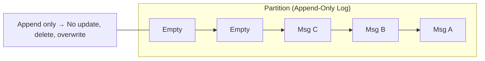

Each offset represents a unique position in the partition's log file. When a new message is appended, it is added to the end of the log, and the offset is incremented. This append-only approach ensures that messages are stored in the order they were received and allows for efficient sequential reads by consumers.

When a consumer reads messages from a partition, it keeps track of the offset of the last message it has processed. This allows the consumer to resume reading from the correct position in the log if it is restarted or if it needs to reprocess messages.

---

4. Conssumers read next message based on offset (no delete, no update, no overwrite)

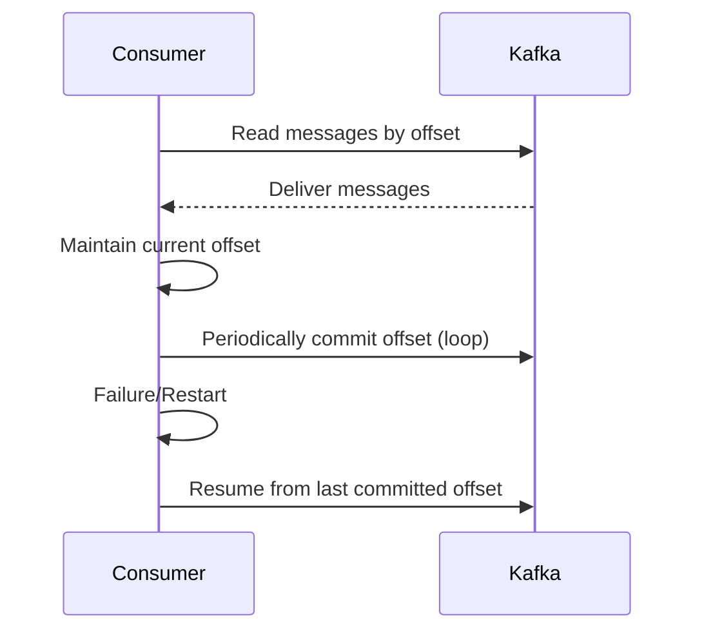

Explaining the flow:

- Consumers read messages from a Kafka partition based on the offset, which is a unique identifier for each message in the partition's log. The consumer keeps track of the current offset to know which message to read next.

- When a consumer reads messages, it maintains its current offset in memory. This allows the consumer to continue reading from the correct position in the log without losing track of where it left off.

- Consumers can periodically commit their offsets to Kafka, which allows them to persist their progress. This is useful in case of failures or restarts, as the consumer can resume reading from the last committed offset instead of starting over from the beginning of the partition.

- In the event of a failure or restart, the consumer can retrieve its last committed offset from Kafka and resume reading messages from that point, ensuring that no messages are missed or processed multiple times. This mechanism provides fault tolerance and reliability in message processing.

---

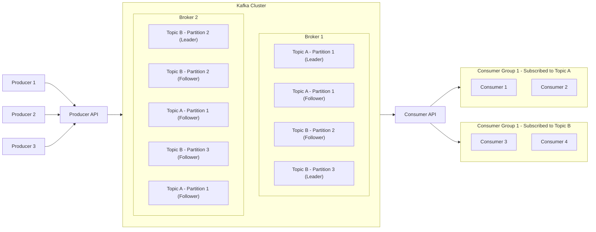

Explaining the flow:

- Producers send messages to the Kafka cluster through the Producer API. The API handles the communication with the Kafka brokers, ensuring that messages are sent to the appropriate topics and partitions.

- The Kafka cluster consists of multiple brokers, each responsible for managing specific partitions of topics. Each partition has a leader broker that handles read and write requests, while follower brokers replicate the data for fault tolerance.

- Consumers read messages from the Kafka cluster through the Consumer API. The API manages the communication with the brokers and ensures that consumers receive messages from the correct partitions.

- Consumer groups allow multiple consumers to work together to process messages from a topic. Each consumer in the group is assigned specific partitions to read from, enabling parallel processing and load balancing. Consumers within a group can read from different partitions, ensuring that messages are processed efficiently and in order.

---

# When to use

There are several scenarios where using Kafka is beneficial:

- **Real-time data processing**: Kafka is ideal for applications that require real-time processing of data streams, such as monitoring systems, fraud detection, and recommendation engines.

- **Event sourcing**: Kafka can be used to implement event sourcing architectures, where state changes are captured as a sequence of events. This allows for easy reconstruction of application state and auditing.

- **Log aggregation**: Kafka can be used to collect and aggregate logs from various sources, making it easier to analyze and monitor system behavior.

- **Data integration**: Kafka can serve as a central hub for integrating data from multiple sources, enabling seamless data flow between different systems and applications.

Let's get an example of a real-time data processing pipeline, where Kafka is used to collect, process, and analyze data streams in real-time. In this example, we will use Kafka to process user activity data from a web application.

Process can be done asynchronously, i.e. Youtube transcoding, where the user uploads a video and the system processes it in the background, notifying the user when it's ready.

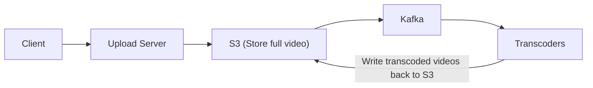

Explaining the flow:

- The client uploads a video to the upload server, which stores the full video in S3 (or any other storage service).

- The upload server sends a message to Kafka, indicating that a new video has been uploaded and is ready for processing.

- Kafka acts as a message broker, allowing the transcoders to subscribe to the topic and receive notifications about new videos that need to be processed.

- The transcoders process the videos asynchronously, converting them into different formats and resolutions as needed. Once the transcoding is complete, the processed videos are written back to S3 for storage and access by the client.

In-order processing can be done synchronously, i.e. a user submits a form and the system processes it immediately, returning a response to the user. (e.g. Twitter, where a user posts a tweet and the system processes it in real-time, making it immediately visible to other users.)

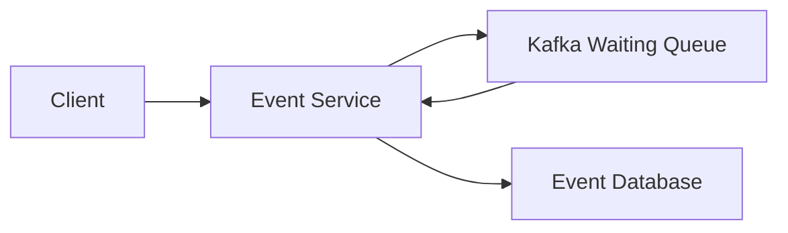

Decouple producer and consumer so they can scale independently. The producer can send messages to Kafka without waiting for the consumer to process them, allowing for better performance and responsiveness. The consumer can process messages at its own pace, ensuring that it can handle varying workloads without being overwhelmed.

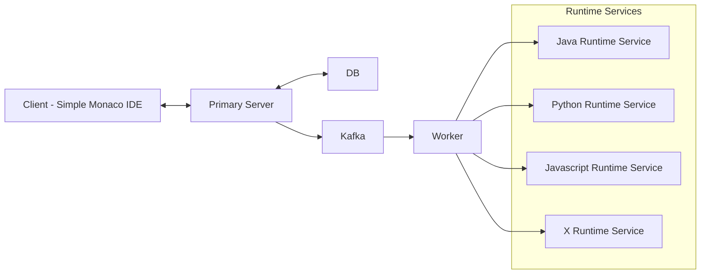

In this case, the client interacts with the primary server, which handles requests and communicates with the database.

The primary server sends messages to Kafka, which acts as a message broker, allowing the worker service to process tasks asynchronously.

The worker service can then distribute tasks to different runtime services (Java, Python, JavaScript, etc.) for execution, enabling a scalable and efficient processing pipeline.

Let's visualize the architecture of a scalable system that uses Kafka as a message broker to decouple the producer and consumer, allowing them to scale independently. The client interacts with the primary server, which communicates with the database and Kafka. The worker service processes tasks from Kafka and distributes them to various runtime services for execution.

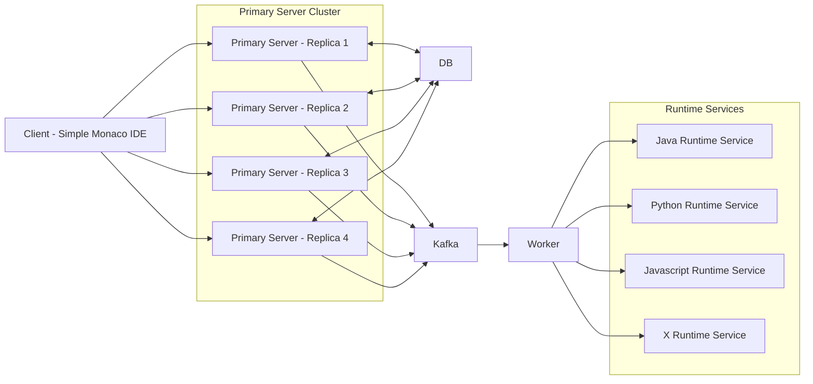

Notice that the client can connect to any of the primary server replicas, which allows for load balancing and fault tolerance. Each primary server replica can communicate with the database and Kafka independently, ensuring that the system can handle high traffic and maintain availability, without scaling the database or Kafka. The worker service processes tasks from Kafka and distributes them to the appropriate runtime services for execution, enabling a scalable and efficient processing pipeline.

---

In caso of a strem of messages, Kafka can be used to process the messages in real-time, allowing for immediate updates and responses. This is particularly useful in applications that require low latency and high throughput, such as financial trading platforms, online gaming, and social media comments.

<!-- 

| Commenter client | -> | Comment Management Service, kafka, Realtime messaging service | -> | Commenter client | -> | Comment Management Service | -> | DB |

-->

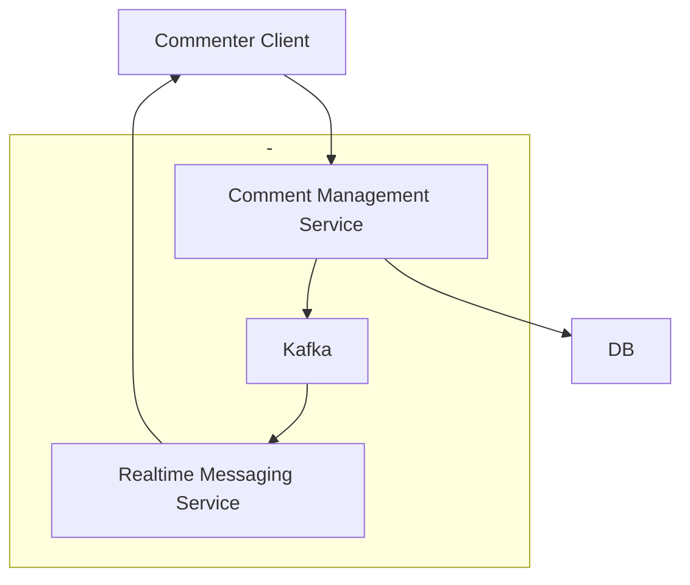

---

# Deep Dives

What You Should Know About Kafka for Deep Dives in Interviews

1. **Scalability**: Kafka is designed to handle large volumes of data and can scale horizontally by adding more brokers to the cluster. This allows for increased throughput and the ability to handle more producers and consumers.

    Constraints:
    - `Aim for < 1MB per message`: Kafka is optimized for handling smaller messages, and larger messages can lead to increased latency and reduced throughput. Keeping messages under 1MB helps maintain performance and efficiency.

    - `One broker up to 1TB data & 10k messages per second`: Kafka brokers can handle a significant amount of data and message throughput, but it's important to monitor resource usage and ensure that brokers are not overloaded. Proper partitioning and replication strategies can help distribute the load across multiple brokers.

    So, How to scale Kafka?

    - `More brokers`: Adding more brokers to the Kafka cluster allows for increased capacity and improved fault tolerance. Each broker can handle a portion of the partitions, distributing the load and allowing for better performance.

    - `Choose a good partition key`: Selecting an appropriate partition key is crucial for ensuring that messages are evenly distributed across partitions. A good partition key helps maintain order for related messages while preventing hotspots and ensuring that no single partition becomes a bottleneck.

    How to handle a hot partition?

    - `Remove the key`: If a specific partition is receiving a disproportionate amount of traffic, consider removing the key or changing the partitioning strategy to distribute messages more evenly across partitions.

    - `Compound key`: Using a compound key that combines multiple attributes (e.g., AdId and UserId) can help distribute messages more evenly across partitions, reducing the likelihood of hot partitions and improving overall performance.

    - `Backpressure` - Slow down the producer: Implementing backpressure mechanisms can help prevent producers from overwhelming the Kafka cluster. By slowing down the rate at which messages are produced, you can reduce the load on the brokers and allow consumers to catch up, preventing hot partitions and ensuring smooth operation.

---

# Fault Tolerance & Durability

Let's bring this example again:


Relevant Settings:

- `acks=all`: This setting ensures that the producer waits for acknowledgment from all in-sync replicas before considering a message as successfully sent. This provides strong durability guarantees, as it ensures that the message is replicated to multiple brokers before being acknowledged.

- `min.insync.replicas=2`: This setting specifies the minimum number of in-sync replicas that must acknowledge a write for it to be considered successful. In this case, at least two replicas must acknowledge the write, providing additional fault tolerance and ensuring that messages are not lost in the event of a broker failure.

- `replication.factor=3`: This setting determines the number of replicas for each partition. A replication factor of 3 means that each partition will have three copies stored on different brokers, providing redundancy and fault tolerance. If one broker fails, the other replicas can continue to serve messages, ensuring high availability.

- `retention.ms=604800000`: This setting specifies the retention period for messages in milliseconds. In this case, messages will be retained for 7 days (604,800,000 milliseconds) before being eligible for deletion. This allows consumers to read messages at their own pace and provides a buffer for processing delays.

All these settings are set at the topic level, allowing for fine-grained control over the behavior of individual topics. By configuring these settings appropriately, you can ensure that your Kafka deployment provides the desired level of fault tolerance, durability, and performance for your specific use case.

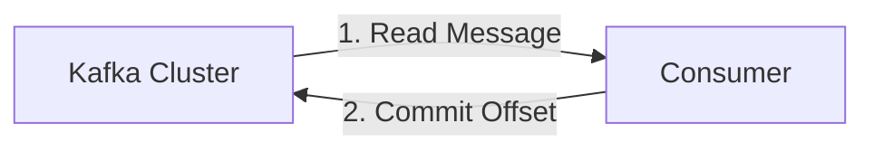

What happens when a consumer fails?

- The consumer group will detect the failure and trigger a rebalance, redistributing the partitions among the remaining consumers in the group. This ensures that message processing continues without interruption, even in the event of a consumer failure.

- When a broker fails, the leader for the affected partitions will be elected from the in-sync replicas. The new leader will take over responsibility for serving messages to consumers, ensuring that message processing continues without data loss.

- If a consumer group fails, the remaining consumers will detect the failure and trigger a rebalance, redistributing the partitions among the remaining consumers in the group. This ensures that message processing is always available, even in the event of a consumer group failure.

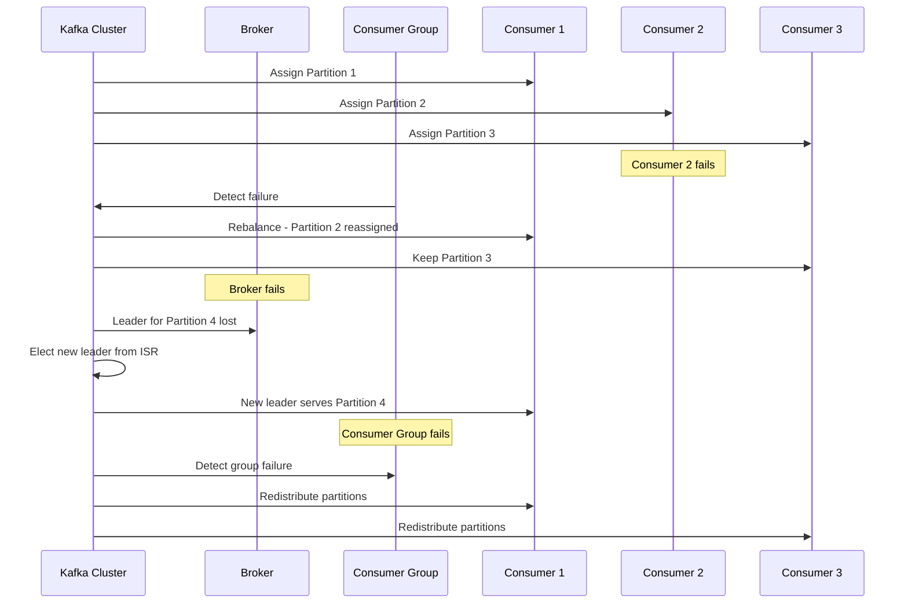

---

It is very import to know when Commit the offset, because it can lead to message loss or duplication if not handled correctly. For example, if a consumer processes a message but fails to commit the offset before crashing, it may reprocess the same message upon restart, leading to duplicate processing. Conversely, if a consumer commits the offset before fully processing a message and then crashes, that message may be lost.

---

# Errors & Retries

First , let's understand the difference between a transient error and a permanent error:

- **Transient Error**: A transient error is a temporary issue that can be resolved by retrying the operation. These errors are often caused by network issues, temporary unavailability of a service, or resource contention. Transient errors are typically recoverable and can be resolved without any changes to the application logic.

- **Permanent Error**: A permanent error is a non-recoverable issue that cannot be resolved by retrying the operation. These errors are often caused by misconfigurations, invalid input, or other issues that require changes to the application logic or environment. Permanent errors typically require intervention to fix the underlying problem before the operation can succeed.

---

### Producer Retries

When a producer encounters an error while sending a message, it can be configured to retry the operation a certain number of times before giving up. This is useful for handling transient errors that may occur due to temporary network issues or broker unavailability.

```python
def create_producer():
    producer = kafka.producer({
    retry: {
        retries: 5,  # number of retry attempts
        factor: 2,   # exponential backoff factor
        initialRetryTime: 100,  # in milliseconds
        maxRetryTime: 1000,  # maximum retry time in milliseconds
    }
    indepotent: true,  # ensure message ordering
    })
```

### Consumer Retries

When a consumer encounters an error while processing a message, it can be configured to retry the operation a certain number of times before giving up. This is useful for handling transient errors that may occur due to temporary issues with the message or the processing logic.

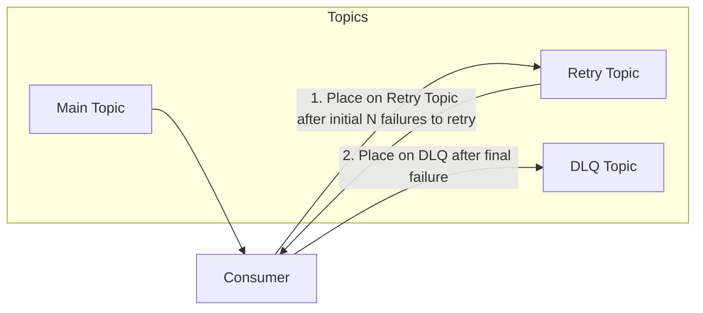

`DQL (Dead Letter Queue)`: Is a separate topic where messages that cannot be processed successfully after multiple retries are sent. This allows for further investigation and handling of problematic messages without affecting the main processing flow.

Explaining the flow:

- When a consumer fails to process a message from the main topic, it can place the message on a retry topic after a certain number of initial failures. This allows the consumer to attempt processing the message again without losing it.

- The retry topic can be configured with a delay or backoff mechanism to control the timing of retries, preventing the consumer from being overwhelmed by repeated failures.

- If the message continues to fail processing after multiple retries, it can be placed on a Dead Letter Queue (DLQ) topic. The DLQ serves as a holding area for messages that cannot be processed successfully, allowing for further investigation and handling of problematic messages without affecting the main processing flow.

- By using retry topics and DLQs, you can implement a robust error handling strategy that allows for graceful recovery from transient errors while ensuring that permanent errors are properly addressed. This helps maintain the reliability and stability of your Kafka-based applications.

---

# Performance Optimization

### Batch messages in producer

```python
def create_producer_with_batching():
    producer = kafka.producer({
        batch: {
            MaxSize: 16384,  # maximum batch size in bytes
            MaxTime: 100,    # maximum time to wait before sending a batch in milliseconds
        }
    })
```

Explaining the configuration:

- This configuration allows the producer to batch multiple messages together before sending them to the broker, reducing the number of network requests and improving throughput.

- The `MaxSize` parameter specifies the maximum size of a batch in bytes, while the `MaxTime` parameter specifies the maximum time to wait before sending a batch, even if it is not full.

- By tuning these parameters, you can optimize the performance of your Kafka producer for your specific use case.

### Compress messages in producer

```python
def create_producer_with_compression():
    producer = kafka.producer({
        compression: {
            type: 'gzip',  # compression algorithm (gzip, snappy, lz4, zstd)
            level: 6       # compression level (1-9 for gzip)
        }
    })
```

Explaining the configuration:

- This configuration allows the producer to compress messages before sending them to the broker, reducing the amount of data transmitted over the network and improving throughput.

- The `type` parameter specifies the compression algorithm to use (e.g., gzip, snappy, lz4, zstd), while the `level` parameter specifies the compression level (1-9 for gzip).

- By tuning these parameters, you can optimize the performance of your Kafka producer for your specific use case, balancing compression efficiency with CPU usage.

---

# Retention Policy

The retention policy in Kafka determines how long messages are retained in the broker before they are eligible for deletion. This is an important aspect of Kafka's design, as it allows consumers to read messages at their own pace and provides a buffer for processing delays.

There are two main types of retention policies in Kafka:

1. **Time-based retention**: In this policy, messages are retained for a specified period of time, after which they are eligible for deletion. The retention time can be configured at the topic level using the `retention.ms` setting. For example, if `retention.ms` is set to 604800000 (7 days), messages will be retained for 7 days before being deleted.

2. **Size-based retention**: In this policy, messages are retained until the total size of the log reaches a specified limit, after which older messages are eligible for deletion. The size limit can be configured at the topic level using the `retention.bytes` setting. For example, if `retention.bytes` is set to 1073741824 (1 GB), messages will be retained until the total log size reaches 1 GB, at which point older messages will be deleted to make room for new ones.

This flexibility in retention policies allows Kafka to accommodate various use cases, from real-time data processing to long-term storage and analysis. By configuring the retention policy appropriately, you can ensure that your Kafka deployment meets the needs of your application while maintaining efficient resource usage.

---

# Conclusion

In conclusion, Kafka is a powerful and versatile distributed messaging system that enables real-time data processing, event sourcing, log aggregation, and data integration. Its architecture, based on topics, partitions, consumer groups, and brokers, allows for scalable and fault-tolerant message processing.