# Ethernet

If we want our computer to talk to anything, it needs to be connected to a network. The most common way to connect to a network is through Ethernet, which is a wired networking technology that allows devices to communicate with each other over a local area network (`LAN`).

Most common cables for connecting to Ethernet are copper or fiber optic cables. Copper cables are the most common and are typically used for shorter distances, while fiber optic cables are used for longer distances and higher speeds.

# WI-FI

Wi-Fi is a wireless networking technology that allows devices to connect to a network without the need for physical cables. It uses radio waves to transmit data between devices and a wireless access point, which is typically connected to a wired network. Wi-Fi is commonly used in homes, offices, and public spaces to provide internet access and enable communication between devices.

# MAC Address

A MAC (Media Access Control) address is a unique identifier assigned to network interfaces for communications on the physical network segment. It is a hardware address that is used to identify devices on a local network. MAC addresses are typically assigned by the manufacturer and are stored in the device's hardware, such as the network interface card (`NIC`). They are usually represented as a series of six pairs of hexadecimal digits, separated by colons or hyphens (e.g., `00:1A:2B:3C:4D:5E`).

MAC addresses use to be unique to each device, but with the advent of virtualization and network interface card cloning, it is possible for multiple devices to have the same MAC address.

Let's illustrate this with an example. Imagine we have two computers connected to a local network. Each computer has its own unique MAC address:

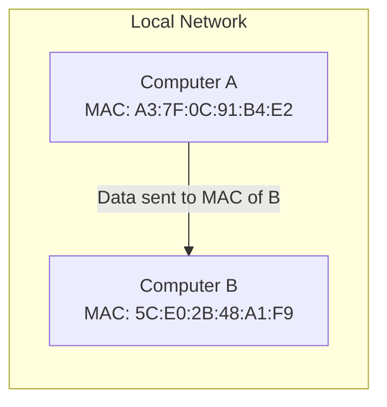
```mermaid
flowchart LR
    subgraph LAN [Local Network]
        A[Computer A<br/>MAC: A3:7F:0C:91:B4:E2]
        B[Computer B<br/>MAC: 5C:E0:2B:48:A1:F9]
    end

    A -- "Data sent to MAC of B" --> B
```

For this example, when Computer A wants to send data to Computer B, it uses Computer B's MAC address to ensure that the data is delivered to the correct device on the local network. The MAC address acts as a unique identifier for each device, allowing them to communicate effectively within the same network segment.

If we want to send data to a device outside of our local network, we would need to use an IP address instead of a MAC address. The IP address is used to route the data through the internet to reach the correct destination device. We will cover IP addresses in more detail in the next sections.

# Switches

A switch is a networking device that connects devices within a local area network (`LAN`) and uses MAC addresses to forward data to the correct destination. Unlike a hub, which broadcasts data to all devices on the network, a switch intelligently sends data only to the device with the matching MAC address. This improves network efficiency and reduces collisions.

If we want to send data from PC to Laptop 1, the switch will look at the destination MAC address in the data packet and forward it only to Laptop 1, rather than broadcasting it to all devices on the network. This selective forwarding helps to optimize network performance and reduce unnecessary traffic.

To send data to a device outside of the local network, the switch will forward the data to the router, which will then handle the routing of the data to its destination on the internet. The router uses IP addresses to determine the best path for the data to reach its destination.

# IP Address

An IP (Internet Protocol) address is a unique identifier assigned to each device connected to a network that uses the Internet Protocol for communication. It serves two main purposes: identifying the host or network interface and providing the location of the host in the network. IP addresses can be either IPv4 or IPv6.

IPs can change over time, especially if they are assigned dynamically by a DHCP server. This means that a device may have a different IP address each time it connects to the network. However, MAC addresses remain constant for each device, as they are tied to the hardware.

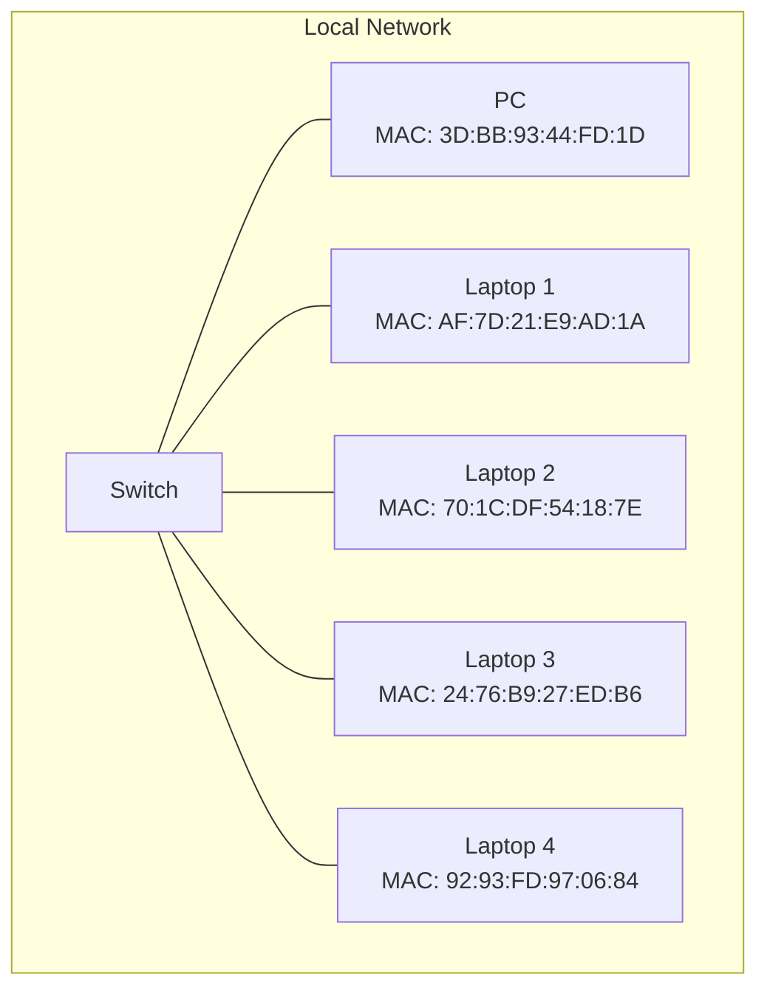
```mermaid
flowchart TD
    subgraph LAN [Local Network]
        SW[Switch]

        PC[PC<br/>MAC: 3D:BB:93:44:FD:1D]
        L1[Laptop 1<br/>MAC: AF:7D:21:E9:AD:1A]
        L2[Laptop 2<br/>MAC: 70:1C:DF:54:18:7E]
        L3[Laptop 3<br/>MAC: 24:76:B9:27:ED:B6]
        L4[Laptop 4<br/>MAC: 92:93:FD:97:06:84]

        SW --- PC
        SW --- L1
        SW --- L2
        SW --- L3
        SW --- L4
    end
```

# Static IP Address

A static IP address is a fixed IP address that is manually assigned to a device and does not change over time. This type of IP address is often used for devices that need to be consistently reachable, such as servers, printers, or networked cameras. Static IP addresses are configured by a network administrator and are typically reserved for specific devices to ensure they always have the same address on the network.

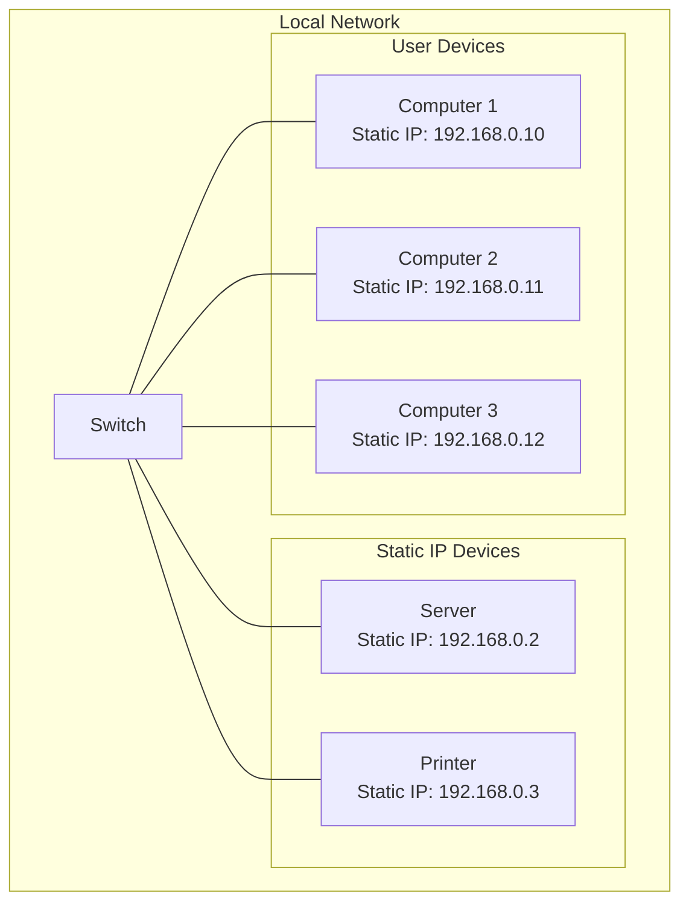
```mermaid
flowchart TD
    subgraph LAN [Local Network]
        SW[Switch]

        subgraph StaticDevices [Static IP Devices]
            Server[Server<br/>Static IP: 192.168.0.2]
            Printer[Printer<br/>Static IP: 192.168.0.3]
        end

        subgraph Users [User Devices]
            PC1[Computer 1<br/>Static IP: 192.168.0.10]
            PC2[Computer 2<br/>Static IP: 192.168.0.11]
            PC3[Computer 3<br/>Static IP: 192.168.0.12]
        end

        SW --- Server
        SW --- Printer
        SW --- PC1
        SW --- PC2
        SW --- PC3
    end
```

The advantage of using static IP addresses is that they provide a consistent address for devices that need to be easily located on the network. However, managing static IP addresses can become cumbersome in larger networks, as it requires manual configuration and tracking of assigned addresses.

# DHCP (Dynamic Host Configuration Protocol)

DHCP is a network management protocol used to automatically assign IP addresses and other network configuration parameters to devices on a network. This allows devices to communicate with each other and access network resources without the need for manual configuration.

When a device connects to a network, it sends a request to the DHCP server, which then assigns an available IP address from a predefined range (known as a pool) and provides other necessary information, such as the subnet mask, default gateway, and DNS servers. The assigned IP address is typically leased for a specific period of time, after which it may be renewed or reassigned.

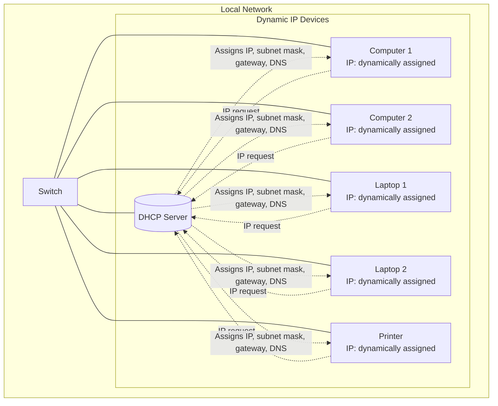
```mermaid
flowchart TD
    subgraph LAN [Local Network]
        SW[Switch]

        subgraph DynamicDevices [Dynamic IP Devices]
            DHCP[(DHCP Server)]
        end

        subgraph DynamicDevices [Dynamic IP Devices]
            PC1[Computer 1<br/>IP: dynamically assigned]
            PC2[Computer 2<br/>IP: dynamically assigned]
            Laptop1[Laptop 1<br/>IP: dynamically assigned]
            Laptop2[Laptop 2<br/>IP: dynamically assigned]
            Printer[Printer<br/>IP: dynamically assigned]
        end

        SW --- DHCP
        SW --- PC1
        SW --- PC2
        SW --- Laptop1
        SW --- Laptop2
        SW --- Printer

        %% Request and response flow
        PC1 -. IP request .-> DHCP
        PC2 -. IP request .-> DHCP
        Laptop1 -. IP request .-> DHCP
        Laptop2 -. IP request .-> DHCP
        Printer -. IP request .-> DHCP

        DHCP -. Assigns IP, subnet mask, gateway, DNS .-> PC1
        DHCP -. Assigns IP, subnet mask, gateway, DNS .-> PC2
        DHCP -. Assigns IP, subnet mask, gateway, DNS .-> Laptop1
        DHCP -. Assigns IP, subnet mask, gateway, DNS .-> Laptop2
        DHCP -. Assigns IP, subnet mask, gateway, DNS .-> Printer
    end
```

# Subnet

A subnet, or subnetwork, is a logical subdivision of an IP network. It allows network administrators to divide a larger network into smaller, more manageable segments. Each subnet has its own unique range of IP addresses and can be used to improve network performance, security, and organization.

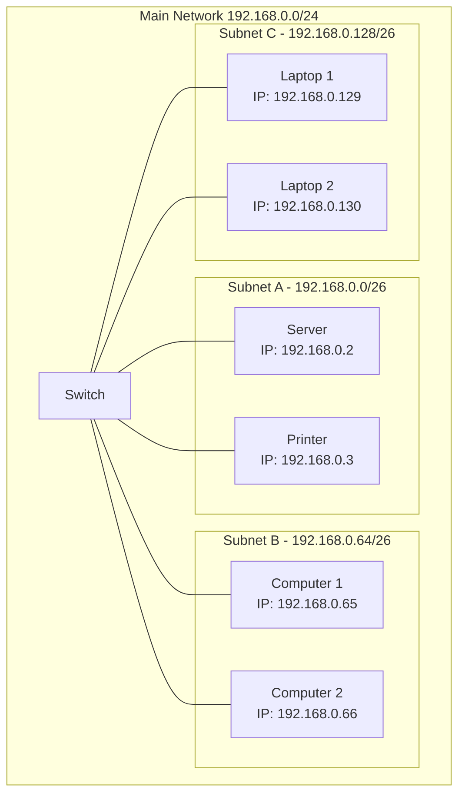
```mermaid
flowchart TB
    subgraph Network [Main Network 192.168.0.0/24]
        SW[Switch]

        subgraph SubnetA [Subnet A - 192.168.0.0/26]
            Server[Server<br/>IP: 192.168.0.2]
            Printer[Printer<br/>IP: 192.168.0.3]
        end

        subgraph SubnetB [Subnet B - 192.168.0.64/26]
            PC1[Computer 1<br/>IP: 192.168.0.65]
            PC2[Computer 2<br/>IP: 192.168.0.66]
        end

        subgraph SubnetC [Subnet C - 192.168.0.128/26]
            Laptop1[Laptop 1<br/>IP: 192.168.0.129]
            Laptop2[Laptop 2<br/>IP: 192.168.0.130]
        end

        SW --- Server
        SW --- Printer
        SW --- PC1
        SW --- PC2
        SW --- Laptop1
        SW --- Laptop2
    end
```

It tell your network administrator how to divide the network into smaller segments, which can help improve performance and security. Each subnet can have its own set of rules and policies, allowing for better control over network traffic and access to resources.

Also, subnets can help reduce network congestion by limiting the number of devices that can communicate directly with each other. By segmenting the network, administrators can isolate traffic and prevent broadcast storms, which can occur when too many devices are trying to communicate at once.

# Router

Routers are the "exit door" of a network. They are responsible for forwarding data packets between different networks, such as a local area network (`LAN`) and the internet. Routers use IP addresses to determine the best path for data to travel from the source device to the destination device.

When a device on a local network wants to communicate with a device on another network (for example, accessing a website on the internet), the router receives the data packet, examines the destination IP address, and forwards it to the appropriate next hop based on its routing table. This process continues until the data reaches its final destination.

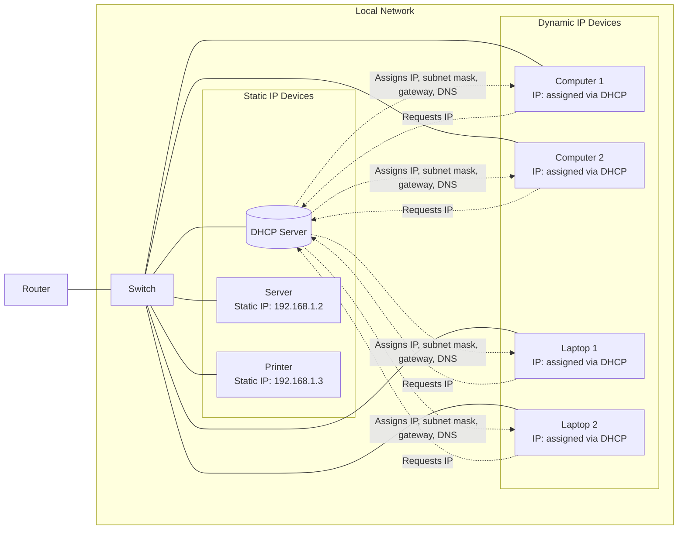
```mermaid
flowchart LR
    Router[Router]

    subgraph LAN [Local Network]
        SW[Switch]

        subgraph StaticDevices [Static IP Devices]
            DHCP[(DHCP Server)]
            Server[Server<br/>Static IP: 192.168.1.2]
            Printer[Printer<br/>Static IP: 192.168.1.3]
        end

        subgraph DynamicDevices [Dynamic IP Devices]
            PC1[Computer 1<br/>IP: assigned via DHCP]
            PC2[Computer 2<br/>IP: assigned via DHCP]
            Laptop1[Laptop 1<br/>IP: assigned via DHCP]
            Laptop2[Laptop 2<br/>IP: assigned via DHCP]
        end

        SW --- DHCP
        SW --- Server
        SW --- Printer
        SW --- PC1
        SW --- PC2
        SW --- Laptop1
        SW --- Laptop2
    end

    Router --- SW

    %% Simplified DHCP flow
    PC1 -. Requests IP .-> DHCP
    PC2 -. Requests IP .-> DHCP
    Laptop1 -. Requests IP .-> DHCP
    Laptop2 -. Requests IP .-> DHCP

    DHCP -. Assigns IP, subnet mask, gateway, DNS .-> PC1
    DHCP -. Assigns IP, subnet mask, gateway, DNS .-> PC2
    DHCP -. Assigns IP, subnet mask, gateway, DNS .-> Laptop1
    DHCP -. Assigns IP, subnet mask, gateway, DNS .-> Laptop2
```

A network can have multiple routers, each connecting different networks or subnets. Routers can also provide additional features such as firewall protection, network address translation (`NAT`), and virtual private network (`VPN`) support.

# Default Gateway

The default gateway is the device that routes traffic from a local network to other networks or the internet. It is typically a router that connects the local network to external networks. Devices on the local network use the default gateway to send data to destinations outside their own subnet.

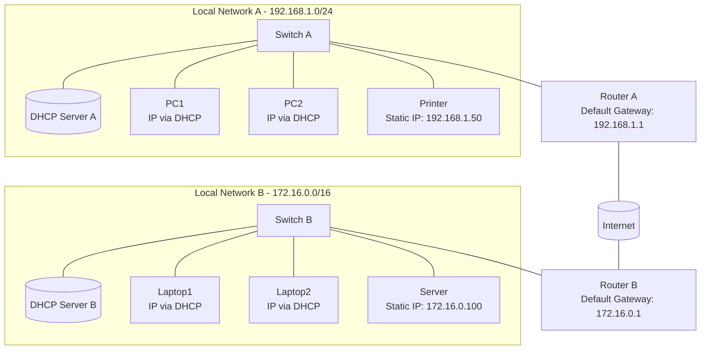
```mermaid
flowchart TD
    subgraph LAN1 [Local Network A - 192.168.1.0/24]
        SW1[Switch A]
        DHCP1[(DHCP Server A)]
        PC1[PC1<br/>IP via DHCP]
        PC2[PC2<br/>IP via DHCP]
        Printer1[Printer<br/>Static IP: 192.168.1.50]

        SW1 --- DHCP1
        SW1 --- PC1
        SW1 --- PC2
        SW1 --- Printer1
    end

    subgraph LAN2 [Local Network B - 172.16.0.0/16]
        SW2[Switch B]
        DHCP2[(DHCP Server B)]
        Laptop1[Laptop1<br/>IP via DHCP]
        Laptop2[Laptop2<br/>IP via DHCP]
        Server2[Server<br/>Static IP: 172.16.0.100]

        SW2 --- DHCP2
        SW2 --- Laptop1
        SW2 --- Laptop2
        SW2 --- Server2
    end

    RouterA[Router A<br/>Default Gateway: 192.168.1.1]
    RouterB[Router B<br/>Default Gateway: 172.16.0.1]
    Internet[(Internet)]

    SW1 --- RouterA
    SW2 --- RouterB

    RouterA --- Internet --- RouterB
```

# Routes & Static Routing

A route is a defined path that data packets take to reach their destination across networks. Routers use routing tables to determine the best path for forwarding packets based on the destination IP address. Routes can be static (manually configured) or dynamic (learned through routing protocols).

When a router receives a data packet, it examines the destination IP address and consults its routing table to find the most efficient path to forward the packet. If the destination is within the same local network, the router will forward it directly. If the destination is on a different network, the router will forward it to the next hop towards that network.

Static routing involves manually configuring routes on a router. This is useful for small networks or specific scenarios where the network administrator wants full control over the path that data takes. Static routes do not change unless manually updated, providing predictable and stable routing behavior.

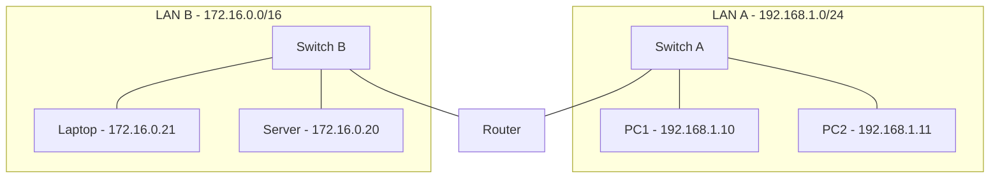
```mermaid
flowchart TB
    subgraph LAN1 [LAN A - 192.168.1.0/24]
        PC1[PC1 - 192.168.1.10]
        PC2[PC2 - 192.168.1.11]
        SW1[Switch A]
        SW1 --- PC1
        SW1 --- PC2
    end

    subgraph LAN2 [LAN B - 172.16.0.0/16]
        Laptop[Laptop - 172.16.0.21]
        Server[Server - 172.16.0.20]
        SW2[Switch B]
        SW2 --- Laptop
        SW2 --- Server
    end

    Router[Router]

    SW1 --- Router
    SW2 --- Router
```

# OSPF (Open Shortest Path First)

OSPF is a dynamic routing protocol used to determine the best path for data packets to travel across networks. It is based on the link-state routing algorithm, which allows routers to share information about the state of their links and build a complete map of the network topology. OSPF uses this information to calculate the shortest path to each destination network.

When a router running OSPF receives information about the state of its links and the links of other routers, it updates its routing table accordingly. This allows OSPF to adapt to changes in the network, such as link failures or new routers being added, ensuring that data packets are always routed along the most efficient path.

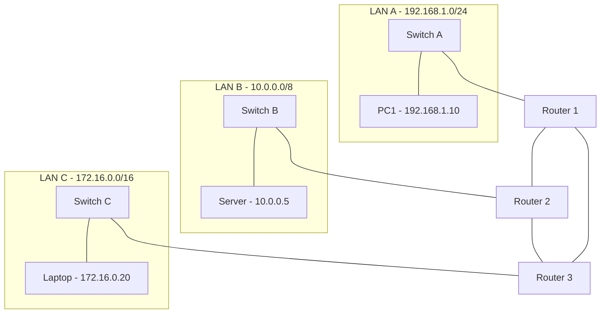
```mermaid
flowchart TB
    subgraph LAN1 [LAN A - 192.168.1.0/24]
        PC1[PC1 - 192.168.1.10]
        SW1[Switch A]
        SW1 --- PC1
    end

    subgraph LAN2 [LAN B - 10.0.0.0/8]
        Server[Server - 10.0.0.5]
        SW2[Switch B]
        SW2 --- Server
    end

    subgraph LAN3 [LAN C - 172.16.0.0/16]
        Laptop[Laptop - 172.16.0.20]
        SW3[Switch C]
        SW3 --- Laptop
    end

    R1[Router 1]
    R2[Router 2]
    R3[Router 3]

    SW1 --- R1
    SW2 --- R2
    SW3 --- R3

    %% Conexões entre roteadores (OSPF adjacências)
    R1 --- R2
    R2 --- R3
    R1 --- R3
```

This diagram illustrates a network with three different LANs, each connected to its respective router. The routers form OSPF adjacencies and exchange information about the state of their links. Each router builds a complete map of the network topology and calculates the shortest path to each destination. If a link fails (e.g., between R2 and R3), OSPF automatically recalculates the best route, ensuring that packets still reach their destination.

# BGP (Border Gateway Protocol)

BGP is a dynamic routing protocol used to exchange routing information between different autonomous systems (AS) on the internet. It is classified as a path vector protocol and is designed to handle the complex routing requirements of large-scale networks. BGP allows routers to share information about available routes and the policies associated with those routes, enabling efficient and reliable data transmission across the internet.

When a router running BGP receives routing information from its peers, it evaluates the available paths based on various attributes, such as AS path length, next-hop IP address, and local preferences. The router then selects the best path for each destination network and updates its routing table accordingly. BGP also supports route filtering and policy-based routing, allowing network administrators to control the flow of traffic based on specific criteria.

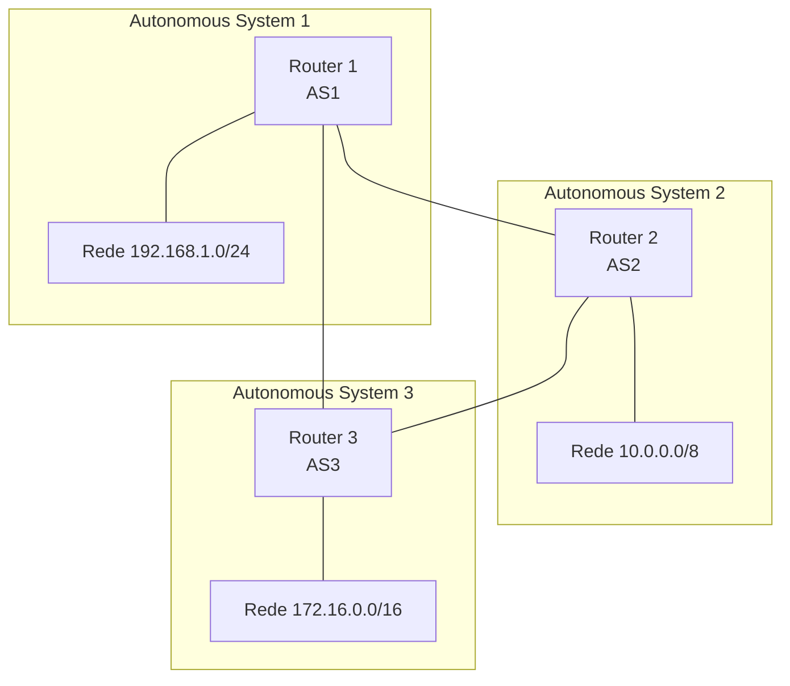
```mermaid
flowchart TB
    subgraph AS1 [Autonomous System 1]
        R1[Router 1<br/>AS1]
        Net1[Rede 192.168.1.0/24]
        R1 --- Net1
    end

    subgraph AS2 [Autonomous System 2]
        R2[Router 2<br/>AS2]
        Net2[Rede 10.0.0.0/8]
        R2 --- Net2
    end

    subgraph AS3 [Autonomous System 3]
        R3[Router 3<br/>AS3]
        Net3[Rede 172.16.0.0/16]
        R3 --- Net3
    end

    %% BGP Peering Connections
    R1 --- R2
    R2 --- R3
    R1 --- R3
```

BGP is basically the protocol that makes the internet work. It allows different networks (autonomous systems) to communicate and exchange routing information, ensuring that data can be transmitted efficiently across the global internet infrastructure. BGP is essential for maintaining the stability and reliability of the internet, as it enables routers to adapt to changes in network topology and find alternative paths when necessary.

# Ping

Ping is a network utility used to test the reachability of a host on an IP network and to measure the round-trip time for messages sent from the originating host to a destination computer. It works by sending Internet Control Message Protocol (`ICMP`) Echo Request packets to the target host and waiting for an Echo Reply.

When you use the ping command, it provides information about the response time and packet loss, which can help diagnose network connectivity issues. A successful ping indicates that the target host is reachable and responding, while a failed ping may suggest network problems, such as a downed host or firewall blocking ICMP traffic.

Example of a ping command and results:

```bash
ping 192.168.1.1
```
```bash
Ping 192.168.1.1 with 32 bytes of data:
Reply from 192.168.1.1: bytes=32 time<1ms TTL=64
Reply from 192.168.1.1: bytes=32 time<1ms TTL=64
Reply from 192.168.1.1: bytes=32 time<1ms TTL=64
Reply from 192.168.1.1: bytes=32 time<1ms TTL=64

Ping statistics for 192.168.1.1:
    Packets: Sent = 4, Received = 4, Lost = 0 (0% loss),
Approximate round trip times in milli-seconds:
    Minimum = 0ms, Maximum = 0ms, Average = 0ms
```

# TCP

TCP (Transmission Control Protocol) is a core protocol of the Internet Protocol Suite that provides reliable, ordered, and error-checked delivery of data between applications running on hosts in a network. TCP is connection-oriented, meaning that it establishes a connection between the sender and receiver before data can be sent. This ensures that data is delivered accurately and in the correct order.

TCP is widely used for applications that require reliable communication, such as web browsing, email, and file transfer. It operates on top of the Internet Protocol (IP) and is part of the TCP/IP protocol suite.

TCP uses a three-way handshake process to establish a connection between the sender and receiver, and it employs mechanisms such as flow control, error detection, and retransmission of lost packets to ensure data integrity.

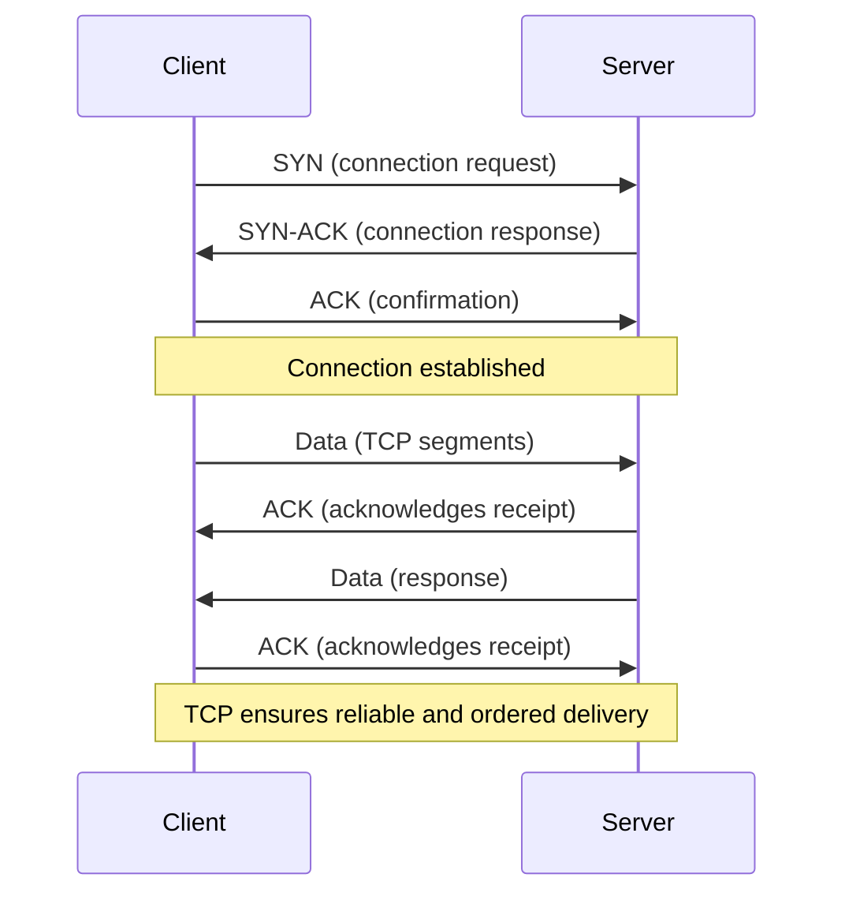
```mermaid
sequenceDiagram
    participant Client as Client
    participant Server as Server

    Client->>Server: SYN (connection request)
    Server->>Client: SYN-ACK (connection response)
    Client->>Server: ACK (confirmation)

    Note over Client,Server: Connection established

    Client->>Server: Data (TCP segments)
    Server->>Client: ACK (acknowledges receipt)
    Server->>Client: Data (response)
    Client->>Server: ACK (acknowledges receipt)

    Note over Client,Server: TCP ensures reliable and ordered delivery
```

If a data packet is lost or corrupted during transmission, TCP will retransmit the packet to ensure that the data is received correctly. This reliability makes TCP suitable for applications where data integrity is critical.

TCP is slow compared to UDP (User Datagram Protocol) because of its overhead for establishing connections, error checking, and ensuring reliable delivery. However, this trade-off is necessary for applications that require accurate and complete data transmission.

# UDP

UDP (User Datagram Protocol) is a core protocol of the Internet Protocol Suite that provides a connectionless, lightweight, and low-latency communication method for applications. Unlike TCP, UDP does not establish a connection before sending data and does not guarantee reliable delivery, ordering, or error checking. This makes UDP faster and more efficient for certain types of applications.

UDP is commonly used for applications that require real-time communication, such as online gaming, video streaming, and voice over IP (VoIP). These applications can tolerate some data loss and prioritize speed over reliability.

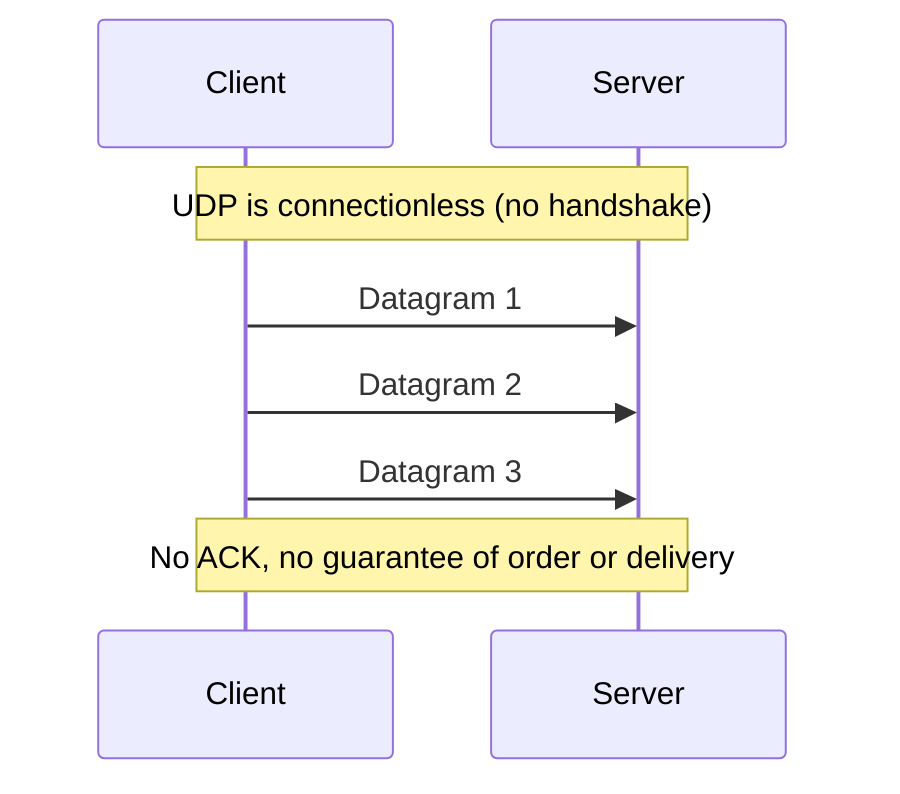
```mermaid
sequenceDiagram
    participant Client as Client
    participant Server as Server

    Note over Client,Server: UDP is connectionless (no handshake)

    Client->>Server: Datagram 1
    Client->>Server: Datagram 2
    Client->>Server: Datagram 3

    Note over Client,Server: No ACK, no guarantee of order or delivery
```


#### Clear difference

- **TCP**: shows the **three-way handshake** and acknowledgments (ACK) for each transmission.  
- **UDP**: shows only the sending of datagrams, without handshake and without ACK.  

# Ports

Ports are numerical identifiers in networking used to distinguish different services or applications running on a single device. They allow multiple networked applications to coexist on the same host without interfering with each other. Ports are divided into three main categories:

- **Well-known ports**: Ranging from 0 to 1023, these ports are assigned to common services and protocols (e.g., HTTP uses port 80, HTTPS uses port 443, FTP uses port 21).

- **Registered ports**: Ranging from 1024 to 49151, these ports are assigned to specific applications or services by the Internet Assigned Numbers Authority (IANA). They are used for less common services and applications.

- **Dynamic or private ports**: Ranging from 49152 to 65535, these ports are not assigned to any specific service and can be used by applications for temporary communication. They are often used for client-side connections.

Port numbers are essential for directing network traffic to the correct application or service on a device. When a client wants to communicate with a server, it specifies the destination port number along with the server's IP address. The server listens on specific ports for incoming connections and responds accordingly.

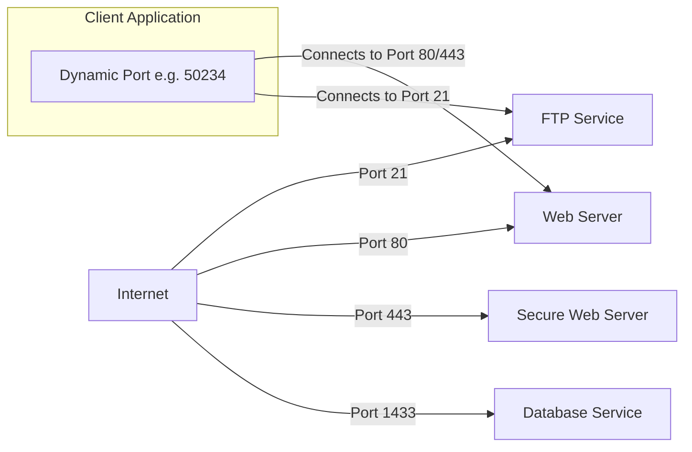
```mermaid
flowchart LR
    Internet[Internet] --> |Port 21| FTP[FTP Service]
    Internet --> |Port 80| HTTP[Web Server]
    Internet --> |Port 443| HTTPS[Secure Web Server]
    Internet --> |Port 1433| DB[Database Service]

    subgraph Client[Client Application]
        CPort[Dynamic Port e.g. 50234]
    end

    CPort --> |Connects to Port 80/443| HTTP
    CPort --> |Connects to Port 21| FTP
```

<!-- Explanation of the Diagram
Internet: Represents incoming traffic.

Ports (21, 80, 443, 1433): Doors into the computer.

Services (FTP, Web Server, Secure Web Server, Database): Applications listening behind those ports.

Client Dynamic Port (50234): Shows how a client uses a temporary high-number port to connect to the server’s well-known ports.

This diagram makes it clear that the IP address is the house, and ports are the doors leading to specific services. -->

In this diagram, the client application uses a dynamic port (e.g., 50234) to initiate connections to various services on the server. The server listens on well-known ports (e.g., 21 for FTP, 80 for HTTP, 443 for HTTPS) and responds to incoming requests accordingly. This allows multiple services to run simultaneously on the same server without conflict.

# Firewall

A firewall is a network security device or software that monitors and controls incoming and outgoing network traffic based on predetermined security rules. It acts as a barrier between a trusted internal network and untrusted external networks, such as the internet, to prevent unauthorized access and protect the network from threats.

It is important to note that firewalls can be implemented in both hardware and software forms. Hardware firewalls are typically standalone devices that are placed between the internal network and the internet, while software firewalls are installed on individual devices to provide protection at the host level.

It is also worth mentioning that firewalls can be configured to allow or block specific types of traffic based on various criteria, such as IP addresses, port numbers, protocols, and application-level data. This allows network administrators to enforce security policies and control access to resources within the network.

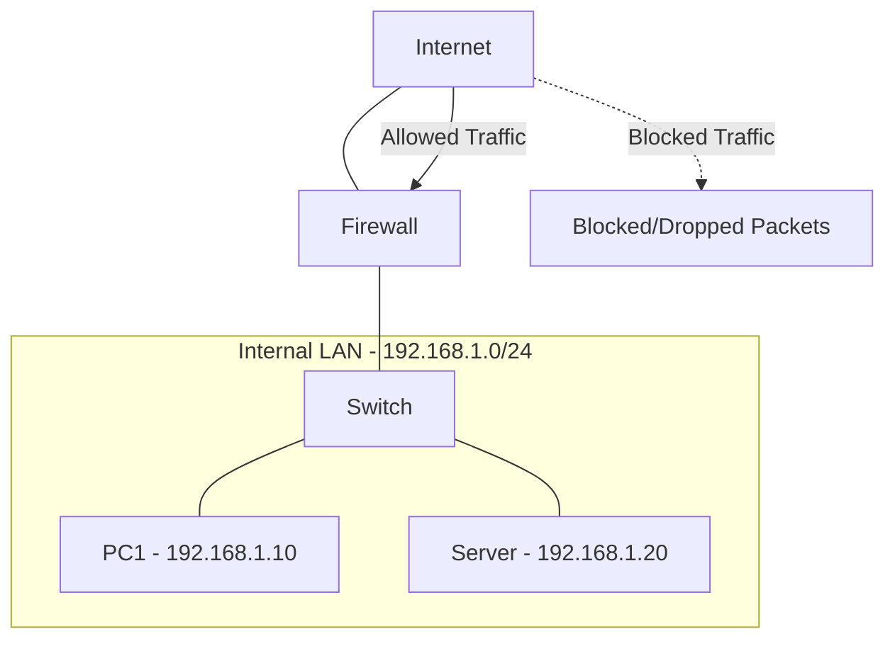
```mermaid
flowchart TB
    subgraph LAN [Internal LAN - 192.168.1.0/24]
        PC1[PC1 - 192.168.1.10]
        Server[Server - 192.168.1.20]
        SW1[Switch]
        SW1 --- PC1
        SW1 --- Server
    end

    Firewall[Firewall]
    Internet[Internet]

    Internet --- Firewall
    Firewall --- SW1

    %% Show allowed vs blocked traffic
    Internet --> |Allowed Traffic| Firewall
    Internet -.-> |Blocked Traffic| Dropped[Blocked/Dropped Packets]
```

# TLS (Transport Layer Security)

TLS (Transport Layer Security) is a cryptographic protocol designed to provide secure communication over a computer network. It is widely used to secure web traffic, email, instant messaging, and other forms of data exchange. TLS ensures the confidentiality, integrity, and authenticity of the data being transmitted between clients and servers.

A key feature of TLS is its ability to encrypt data, making it unreadable to unauthorized parties. This is achieved through the use of symmetric and asymmetric encryption algorithms, which work together to establish a secure connection between the client and server.

- **Symmetric encryption**: In symmetric encryption, the same key is used for both encryption and decryption of data. This method is fast and efficient, making it suitable for encrypting large amounts of data. However, the challenge lies in securely sharing the key between the communicating parties.

- **Asymmetric encryption**: Asymmetric encryption, also known as public-key cryptography, uses a pair of keys: a public key and a private key. The public key is used to encrypt data, while the private key is used to decrypt it. This method allows for secure key exchange and authentication, as the private key is kept secret by the owner.

The TLS handshake process involves several steps to establish a secure connection between the client and server. During the handshake, the client and server negotiate the encryption algorithms and keys to be used for the session. The server presents its digital certificate, which contains its public key and is signed by a trusted certificate authority (CA). The client verifies the certificate's authenticity and establishes a shared secret key for symmetric encryption.

Some of the key features of TLS include:

- **Encryption**: TLS encrypts the data being transmitted, ensuring that it cannot be intercepted or read by unauthorized parties.

- **Authentication**: TLS provides authentication by verifying the identity of the server (and optionally the client) using digital certificates. This helps prevent man-in-the-middle attacks.

- **Data Integrity**: TLS ensures the integrity of the data being transmitted by using message authentication codes (MACs) to detect any tampering or alteration of the data during transit.

# SSL (Secure Sockets Layer)

SSL (Secure Sockets Layer) is a cryptographic protocol that was originally developed to provide secure communication over the internet. It was designed to ensure the confidentiality, integrity, and authenticity of data transmitted between clients and servers. SSL has since been succeeded by TLS (Transport Layer Security), which is an updated and more secure version of the protocol.

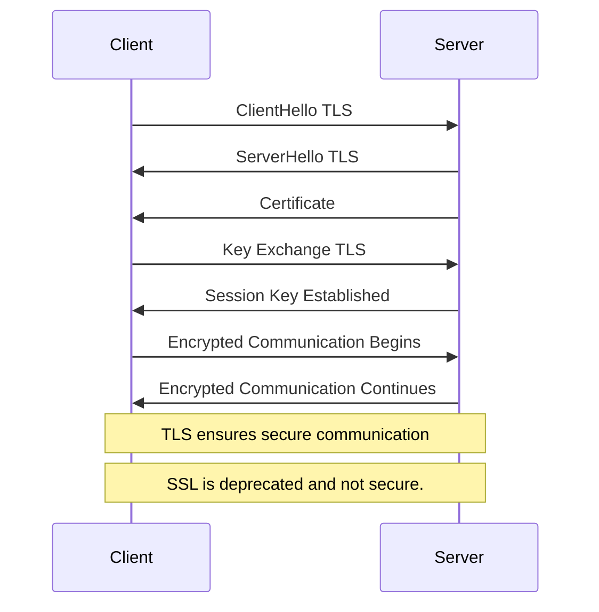
```mermaid
sequenceDiagram
    participant Client as Client
    participant Server as Server

    Client->>Server: ClientHello TLS
    Server->>Client: ServerHello TLS
    Server->>Client: Certificate
    Client->>Server: Key Exchange TLS
    Server->>Client: Session Key Established
    Client->>Server: Encrypted Communication Begins
    Server->>Client: Encrypted Communication Continues

    Note over Client,Server: TLS ensures secure communication
    Note over Client,Server: SSL is deprecated and not secure.
```

# VPN (Virtual Private Network)

A VPN (Virtual Private Network) is a technology that creates a secure and encrypted connection over a less secure network, such as the internet. It allows users to send and receive data as if their devices were directly connected to a private network, providing privacy and security for online activities.

A VPN works by establishing a virtual "tunnel" between the user's device and the VPN server. All data transmitted through this tunnel is encrypted, making it difficult for unauthorized parties to intercept or access the information. This is particularly useful when using public Wi-Fi networks, as it helps protect sensitive data from potential threats.

Although VPNs provide enhanced security and privacy, they can also introduce some performance overhead due to the encryption and decryption processes. This may result in slightly slower internet speeds compared to a direct connection.

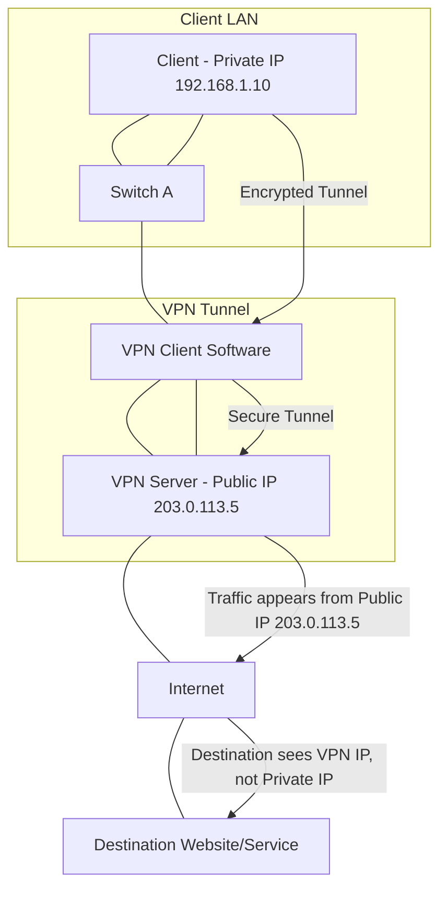
```mermaid
flowchart TB
    subgraph ClientLAN [Client LAN]
        ClientPC[Client - Private IP 192.168.1.10]
        SW1[Switch A]
        SW1 --- ClientPC
    end

    subgraph VPN [VPN Tunnel]
        VPNClient[VPN Client Software]
        VPNSrv[VPN Server - Public IP 203.0.113.5]
        VPNClient --- VPNSrv
    end

    Internet[Internet]
    Destination[Destination Website/Service]

    ClientPC --- SW1
    SW1 --- VPNClient
    VPNClient --- VPNSrv
    VPNSrv --- Internet
    Internet --- Destination

    %% Notes
    ClientPC --> |Encrypted Tunnel| VPNClient
    VPNClient --> |Secure Tunnel| VPNSrv
    VPNSrv --> |Traffic appears from Public IP 203.0.113.5| Internet
    Internet --> |Destination sees VPN IP, not Private IP| Destination

```

Each line in the diagram represents a step in the VPN connection process, illustrating how data travels from the client's device through the VPN tunnel to the destination website or service. The VPN client encrypts the data before sending it to the VPN server, which then forwards it to the internet. The destination sees the traffic as coming from the VPN server's public IP address, rather than the client's private IP address, enhancing privacy and security.

# DNS (Domain Name System)

DNS (Domain Name System) is a hierarchical and decentralized naming system used to translate human-readable domain names (like www.example.com) into IP addresses (like 192.0.2.1) that computers use to identify each other on the network. This process is essential for the functionality of the internet, as it allows users to access websites and services using easy-to-remember names instead of numerical IP addresses.

DNS works by using a distributed network of servers that store and manage the mappings between domain names and IP addresses. When a user enters a domain name into their web browser, the browser sends a query to a DNS resolver (like Google Public DNS or Cloudflare DNS), which then contacts the appropriate DNS servers to retrieve the corresponding IP address. Once the IP address is obtained, the browser can establish a connection to the web server hosting the requested website.

# HTTP (Hypertext Transfer Protocol)

HTTP (Hypertext Transfer Protocol) is an application-layer protocol used for transmitting hypermedia documents, such as HTML, over the internet. It is the foundation of data communication on the World Wide Web and enables web browsers and servers to communicate with each other.

HTTP defines how messages are formatted and transmitted, as well as how web servers and browsers should respond to various commands.

In HTTP, a client (usually a web browser) sends a request to a server, which then processes the request and returns a response. The response typically includes the requested resource (such as a web page or image) along with metadata, such as status codes and headers.

# HTTPS (Hypertext Transfer Protocol Secure)

HTTPS (Hypertext Transfer Protocol Secure) is an extension of HTTP that adds a layer of security by using TLS (Transport Layer Security) or SSL (Secure Sockets Layer) to encrypt the data transmitted between the client and server. This ensures that sensitive information, such as login credentials, payment details, and personal data, is protected from eavesdropping and tampering during transmission.

When a user accesses a website using HTTPS, the web browser establishes a secure connection with the server through a process known as the TLS handshake. During this handshake, the client and server negotiate encryption algorithms and exchange cryptographic keys to create a secure session. Once the secure connection is established, all data exchanged between the client and server is encrypted, making it difficult for unauthorized parties to intercept or read the information.

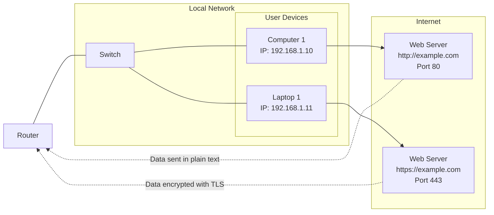
```mermaid
flowchart LR
    Router[Router]

    subgraph LAN [Local Network]
        SW[Switch]

        subgraph Clients [User Devices]
            PC1[Computer 1<br/>IP: 192.168.1.10]
            Laptop1[Laptop 1<br/>IP: 192.168.1.11]
        end

        SW --- PC1
        SW --- Laptop1
    end

    Router --- SW

    subgraph Internet [Internet]
        WebServerHTTP[Web Server<br/>http://example.com<br/>Port 80]
        WebServerHTTPS[Web Server<br/>https://example.com<br/>Port 443]
    end

    %% Connections
    PC1 --> WebServerHTTP
    Laptop1 --> WebServerHTTPS

    %% Notes
    WebServerHTTP -.-> |Data sent in plain text| Router
    WebServerHTTPS -.-> |Data encrypted with TLS| Router
```

# Load Balancer

A load balancer is a network device or software application that distributes incoming network traffic across multiple servers to ensure optimal resource utilization, minimize response time, and prevent server overload. Load balancers are commonly used in web applications, cloud services, and data centers to improve performance, reliability, and scalability.

When a client sends a request to a service, the load balancer receives the request and determines which server in the pool should handle it based on various algorithms, such as round-robin, least connections, or IP hash. The load balancer then forwards the request to the selected server, which processes it and returns the response to the client.

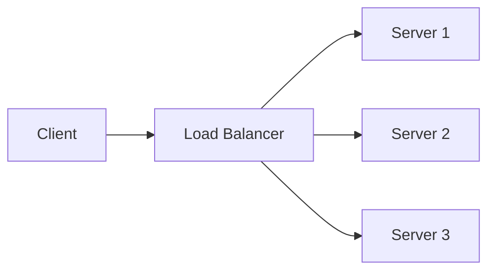
```mermaid
flowchart LR
    Client[Client]

    LB[Load Balancer]

    Server1[Server 1]
    Server2[Server 2]
    Server3[Server 3]

    Client --> LB
    LB --> Server1
    LB --> Server2
    LB --> Server3

```
