# Kubernetes Networking

## Kubernetes = Linux

Kubernetes é uma plataforma de orquestração de contêineres que gerencia a implantação, escalonamento e operação de aplicativos conteinerizados. No seu núcleo, o Kubernetes depende dos princípios de rede do Linux para fornecer conectividade entre contêineres, pods e serviços.

Como o Kubernetes é construído sobre o Linux, ele aproveita a pilha de rede subjacente do Linux para permitir a comunicação entre diferentes componentes. Isso significa que entender os conceitos de rede do Linux é crucial para compreender como a rede do Kubernetes funciona.

## Kubernetes Networking Model (Modelo de Rede do Kubernetes)

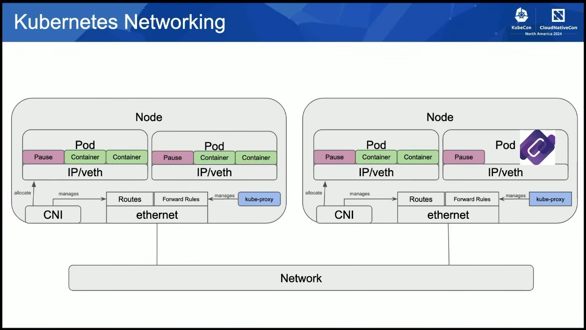

## Kubernetes Networking Components (Componentes de Rede do Kubernetes)

```
**Node** = Uma máquina física ou virtual que executa o Kubernetes e hospeda os pods.
    - **rootns**: O namespace de rede raiz do nó, onde os processos do sistema e os serviços de rede do nó são executados. Ele é responsável por gerenciar a pilha de rede do nó, incluindo interfaces de rede, roteamento e regras de firewall. Por padrão, é aqui que todas as interfaces de rede do nó são criadas.
        - *veth*: A interface de rede principal do nó, usada para comunicação com outros nós e redes externas.
        - *cbr0*: A interface de rede do Kubernetes, usada para comunicação entre os pods e serviços dentro do cluster.
        - *eth*: As interfaces de rede do nó, usadas para comunicação com outros nós e redes externas.
    - **Pod** = A menor unidade de implantação no Kubernetes, que pode conter um ou mais contêineres.
        - *Pause Container*: que é um contêiner especial usado para manter o namespace de rede do pod. Ele é responsável por criar e manter a pilha de rede do pod, permitindo que os contêineres dentro do pod se comuniquem entre si e com outros pods. O *Pause Container* é essencial para o funcionamento do Kubernetes, pois ele garante que os contêineres dentro do pod compartilhem o mesmo namespace de rede, permitindo que eles se comuniquem usando localhost e portas compartilhadas. Ele também é responsável por manter a pilha de rede do pod ativa, mesmo quando os contêineres estão em execução ou parados, como se fosse um "guardião" da rede do pod que fica sempre ativo para garantir a conectividade entre os contêineres.
        - *containers*: Os contêineres dentro do pod compartilham o mesmo namespace de rede, o que significa que eles podem se comunicar usando localhost e portas compartilhadas. Cada contêiner pode ter suas próprias portas expostas, mas eles compartilham o mesmo endereço IP do pod.
            - **Linux Network Stack**: O Kubernetes utiliza a pilha de rede do Linux para gerenciar a comunicação entre os pods e serviços:
                - *eth0*: A interface de rede principal do contêiner, usada para comunicação com outros contêineres e serviços dentro do pod.
                - *routing*: A tabela de roteamento do contêiner determina como os pacotes são encaminhados para outros contêineres e serviços.
                - *iptables*: Para gerenciar o tráfego de rede e garantir a comunicação entre os contêineres e serviços.
                - *conntrack*: Para rastrear conexões de rede e garantir que as comunicações sejam mantidas corretamente.
```

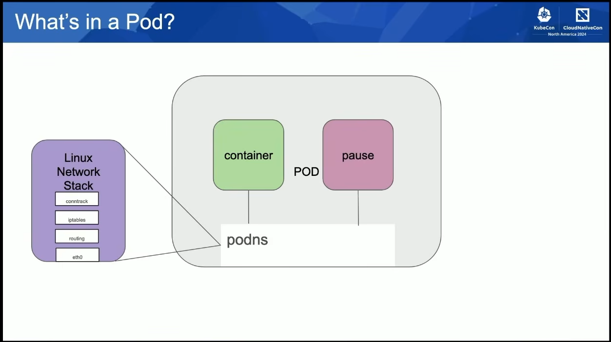

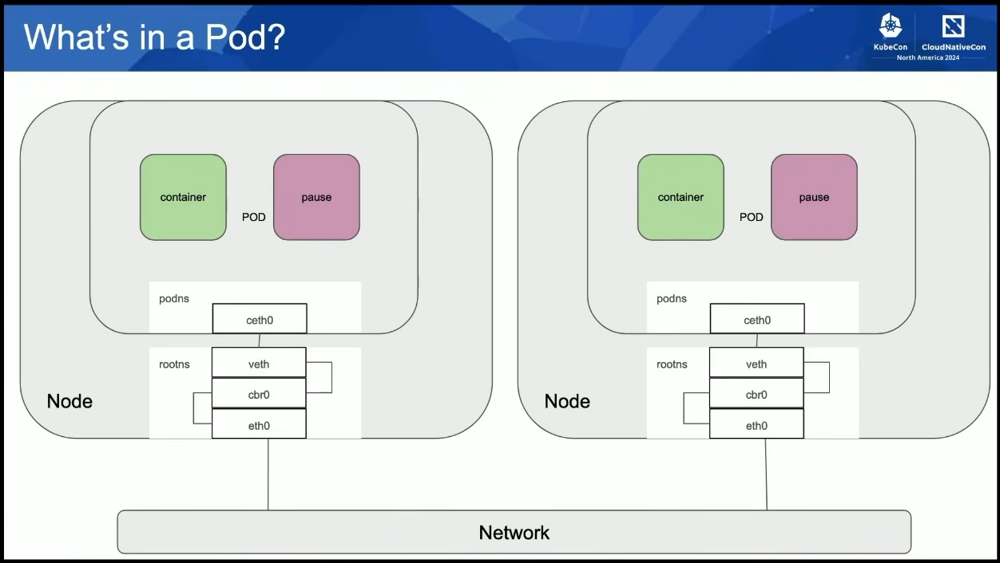

## Kubernetes Networking Rules

1. *CONTAINER-TO-CONTAINER = ALTO ACOPLAMENTO*: Contêineres no mesmo Pod podem se comunicar entre si usando localhost e portas compartilhadas, o que permite um acoplamento estreito entre contêineres que precisam trabalhar em conjunto. Isso é resolvido pelos Pods e pela comunicação via localhost. No entanto, isso também significa que os contêineres dentro do mesmo Pod estão fortemente acoplados, o que pode dificultar a manutenção e a escalabilidade. Se um contêiner falhar ou precisar ser atualizado, todo o Pod pode ser afetado, o que pode levar a interrupções no serviço.

2. *POD-TO-POD*: Todos os Pods podem se comunicar entre si, independentemente do nó em que estão hospedados. Isso é possível graças à rede de sobreposição (overlay network) que o Kubernetes implementa, permitindo que os Pods se comuniquem usando seus endereços IP exclusivos. Cada Pod recebe um endereço IP exclusivo, e o Kubernetes gerencia a comunicação entre os Pods usando uma rede de sobreposição, que pode ser implementada usando diferentes soluções de rede, como Flannel, Calico ou Weave.

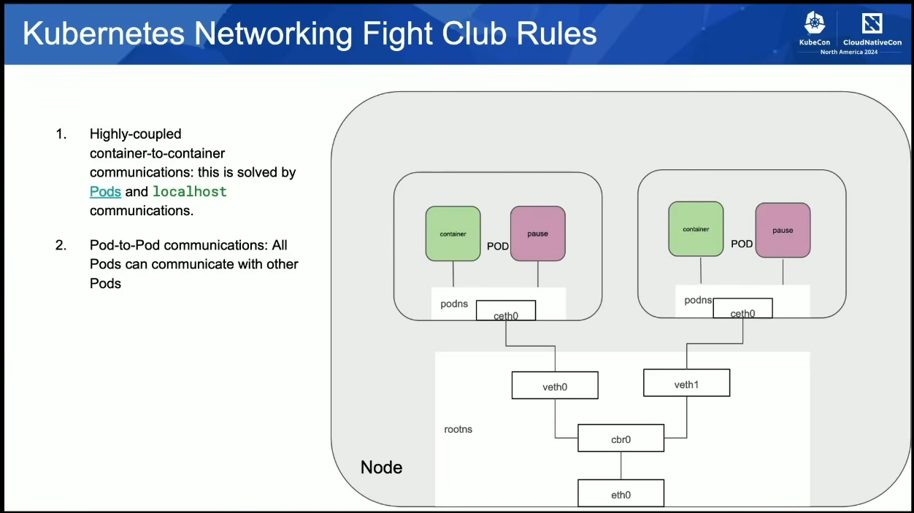

3. *POD-TO-SERVICE*: Os serviços do Kubernetes fornecem um ponto de acesso estável para os Pods, permitindo que eles se comuniquem com outros Pods e serviços dentro do cluster. Os serviços podem ser expostos usando um endereço IP virtual ou um nome DNS, facilitando a comunicação entre os componentes do cluster. Os serviços do Kubernetes podem ser configurados para balancear a carga entre os Pods, garantindo que as solicitações sejam distribuídas de maneira eficiente.

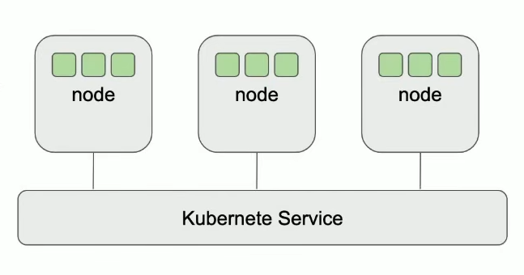

4. *EXTERNAL-TO-SERVICE*: Os serviços do Kubernetes podem ser expostos para o mundo externo usando diferentes métodos, como LoadBalancer, NodePort ou Ingress. Isso permite que os usuários acessem os serviços do Kubernetes a partir de fora do cluster, facilitando a integração com outros sistemas e a exposição de aplicativos para os usuários finais.

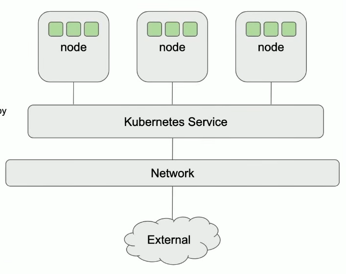

*NOTA: Tudo que foi dito acima pode fazer parte de um Cluster. O Cluster é o ambiente onde os `nodes`, `pods`, `services` e outros componentes do Kubernetes operam. Ele é composto por um conjunto de nodes que executam os pods e serviços, e é gerenciado pelo plano de controle do Kubernetes. O Cluster é a unidade básica de implantação no Kubernetes, e é onde os aplicativos conteinerizados são executados e gerenciados. O Cluster pode ser implementado em diferentes ambientes, como nuvens públicas, privadas ou híbridas, e pode ser dimensionado para atender às necessidades de carga de trabalho dos aplicativos.*

## Pod CIDR (Classless Inter-Domain Routing - Roteamento sem Classe)

O *Pod CIDR* é um intervalo de endereços IP que o Kubernetes usa para atribuir endereços IP aos nodes. Cada node recebe um bloco de endereços IP do *Pod CIDR*, e os pods que são executados nesse node recebem endereços IP desse bloco. O *Pod CIDR* é configurado no momento da criação do cluster e é usado para garantir que cada node tenha um *conjunto exclusivo de endereços IP* para os pods que ele hospeda. Isso é importante para evitar conflitos de endereços IP e garantir a comunicação eficiente entre os pods dentro do cluster.

"Um node usando o outro como roteador" significa que um node do Kubernetes pode encaminhar o tráfego de rede para outro node, permitindo a comunicação entre os pods que estão hospedados em diferentes nodes. Isso é possível graças à configuração de roteamento do Kubernetes, que permite que os nodes se comuniquem entre si e encaminhem o tráfego de rede para os pods corretos, independentemente de onde eles estejam hospedados no cluster. 

## KUBECTL

O comando `kubectl` é a ferramenta de linha de comando do Kubernetes que permite aos usuários interagir com o cluster e gerenciar os recursos do Kubernetes. Ele é usado para criar, atualizar, excluir e visualizar os recursos do Kubernetes, como pods, serviços, deployments e outros objetos. O `kubectl` se comunica com o plano de controle do Kubernetes para executar as operações solicitadas pelos usuários e fornecer feedback sobre o estado dos recursos no cluster.

Alguns exemplos de comandos `kubectl` incluem:

``kubectl get pods``: Lista todos os pods no cluster.

``kubectl describe pod <pod-name>``: Exibe detalhes sobre um pod específico.
    
``kubectl create -f <file.yaml>``: Cria um recurso do Kubernetes a partir de um arquivo YAML.
    
``kubectl get services``: Lista todos os serviços no cluster.
    
``kubectl describe service <service-name>``: Exibe detalhes sobre um serviço específico.
    
``kubectl get nodes``: Lista todos os nodes no cluster.
    
``kubectl describe node <node-name>``: Exibe detalhes sobre um node específico.
    
``kubectl get namespaces``: Lista todos os namespaces no cluster.
    
``kubectl describe namespace <namespace-name>``: Exibe detalhes sobre um namespace específico.
    
`kubectl delete pod <pod-name>`: Exclui um pod específico do cluster.
    
`kubectl logs <pod-name>`: Exibe os logs de um pod específico.
    
`kubectl exec -it <pod-name> -- /bin/bash`: Acessa o terminal de um pod específico para executar comandos dentro do contêiner.
    
`kubectl apply -f <file.yaml>`: Aplica as alterações definidas em um arquivo YAML a um recurso existente no cluster.
    
`kubectl scale deployment <deployment-name> --replicas=<number>`: Escala um deployment para o número especificado de réplicas.
    
`kubectl port-forward <pod-name> <local-port>:<remote-port>`: Encaminha uma porta local para uma porta remota em um pod específico, permitindo o acesso a serviços dentro do cluster a partir do ambiente local.

Esses são apenas alguns exemplos dos muitos comandos disponíveis no `kubectl`. Ele é uma ferramenta poderosa e essencial para gerenciar e interagir com o cluster Kubernetes, permitindo que os usuários realizem uma ampla variedade de operações para manter seus aplicativos conteinerizados funcionando de maneira eficiente.

## CNI (Container Network Interface - Interface de Rede de Contêiner)

O CNI é um padrão de interface de rede para contêineres que define como os plugins de rede devem ser implementados para fornecer conectividade de rede aos contêineres em um ambiente de orquestração, como o Kubernetes. O CNI permite que diferentes soluções de rede sejam usadas para fornecer conectividade aos contêineres, desde que sigam as especificações do CNI. O CNI é projetado para ser simples e flexível, permitindo que os plugins de rede sejam facilmente integrados ao Kubernetes e a outras plataformas de orquestração de contêineres. Ele define um conjunto de operações que os plugins de rede devem implementar, como criar e excluir interfaces de rede para os contêineres, configurar endereços IP e rotas, e gerenciar a comunicação entre os contêineres.

O Kubernetes suporta vários plugins de rede CNI, como Flannel, Calico, Weave e outros, permitindo que os usuários escolham a solução de rede que melhor atenda às suas necessidades.

## CNI Config file (Arquivo de Configuração do CNI)

O arquivo de configuração do CNI é um arquivo *JSON* que define as configurações de rede para os plugins de rede CNI. Ele especifica as opções de configuração para os plugins de rede, como o tipo de plugin, as opções de IPAM (IP Address Management - Gerenciamento de Endereços IP), e outras configurações relacionadas à rede. Ele é geralmente localizado em um diretório específico no sistema, como `/etc/cni/net.d/`, e pode ser editado para ajustar as configurações de rede conforme necessário.

Exemplo de um arquivo de configuração do CNI:

```json
{
  "cniVersion": "0.3.1",
  "name": "my-cni-network",
  "plugins": [
    {
      "type": "flannel",
      "delegate": {
        "type": "host-local",
        "ipam": {
          "ranges": [
            [
              { "subnet": "10.244.0.0/16" }
            ]
          ],
          "routes": [
            { "dst": "0.0.0.0/0" }
          ]
        },
        "mtu": 1500
      }
    }
  ]
}

```

Neste exemplo, o arquivo de configuração do CNI define uma rede chamada `my-cni-network` que usa o plugin de rede Flannel. Ele especifica as opções de IPAM para o plugin, incluindo o tipo de IPAM (`host-local`), o diretório de dados para armazenar as informações de rede, as rotas a serem configuradas e os intervalos de endereços IP a serem usados para os pods. O campo `mtu` define a unidade máxima de transmissão para a rede, que é importante para garantir a eficiência da comunicação entre os pods.

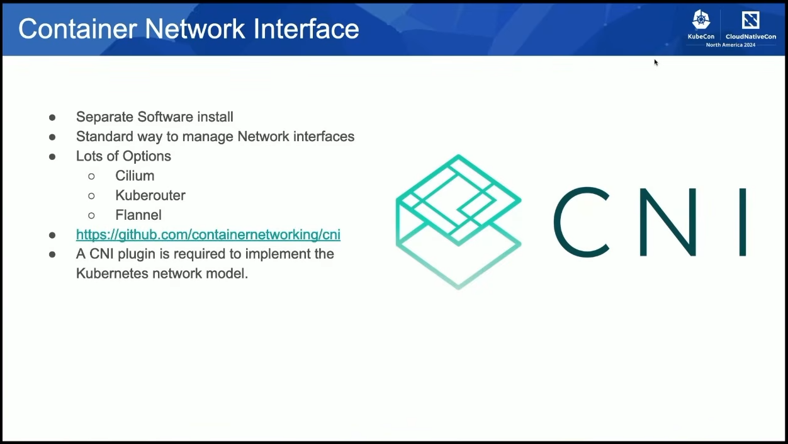

*NOTA: Kubernetes é um conjunto de ferramentas e tecnologias que permitem a orquestração e gerenciamento de aplicativos conteinerizados. Ele é amplamente utilizado para implantar, escalar e operar aplicativos em ambientes de nuvem, proporcionando uma plataforma robusta e flexível para o desenvolvimento e operação de aplicativos modernos.*

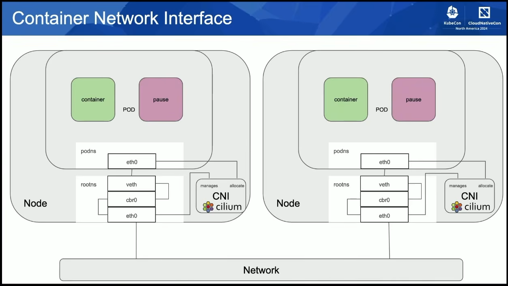

Na imagem acima, podemos ver a arquitetura do *container network interface (CNI)* do Kubernetes. O CNI é responsável por orquestrar as interfaces de rede para os contêineres em um cluster e alocar os endereços IP para os pods. Ele é composto por vários componentes, incluindo o *plugin de rede*, o *plugin de IPAM (IP Address Management - Gerenciamento de Endereços IP)* e o *daemon do CNI*.
O *plugin de rede* é responsável por criar e configurar as interfaces de rede para os contêineres.
O *plugin de IPAM* é responsável por alocar os endereços IP para os pods.
O *daemon do CNI* é responsável por monitorar os eventos de rede e garantir que as interfaces de rede sejam criadas e configuradas corretamente para os contêineres.

Juntos, esses componentes permitem que os contêineres se comuniquem entre si e com outros serviços dentro do cluster Kubernetes.

## Services

- **Cluster IP**: O tipo de serviço padrão no Kubernetes, que expõe um serviço dentro do cluster usando um endereço IP virtual. Ele é acessível apenas dentro do cluster e é usado para comunicação entre os pods e serviços dentro do cluster.

- **NodePort**: Um tipo de serviço que expõe um serviço em uma porta específica em cada nó do cluster. Ele é acessível a partir de fora do cluster usando o endereço IP do nó e a porta especificada.

- **ExternalName**: Um tipo de serviço que mapeia um serviço para um nome DNS externo. Ele é usado para acessar serviços externos ao cluster usando um nome DNS.

- **LoadBalancer**: Um tipo de serviço que expõe um serviço usando um balanceador de carga externo. Ele é usado para acessar serviços a partir de fora do cluster usando um endereço IP externo fornecido pelo balanceador de carga.

- **Headless Service**: Um tipo de serviço que não atribui um endereço IP virtual, permitindo que os pods sejam acessados diretamente usando seus endereços IP. Ele é usado para casos em que os pods precisam ser acessados diretamente, como em bancos de dados ou serviços de estado.

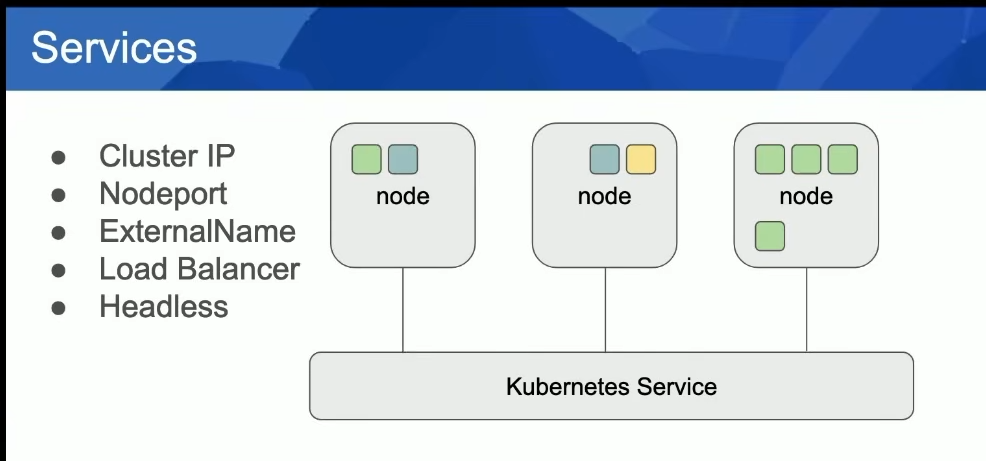

## Services CIDR (Classless Inter-Domain Routing - Roteamento sem Classe)

O *Service CIDR* é um intervalo de endereços IP que o Kubernetes usa para atribuir endereços IP aos serviços. Cada serviço recebe um endereço IP exclusivo do *Service CIDR*, e os pods que se comunicam com o serviço usam esse endereço IP para acessar o serviço. O *Service CIDR* é configurado no momento da criação do cluster e é usado para garantir que cada serviço tenha um *conjunto exclusivo de endereços IP* para os pods que se comunicam com ele. Isso é importante para evitar conflitos de endereços IP e garantir a comunicação eficiente entre os pods e os serviços dentro do cluster.

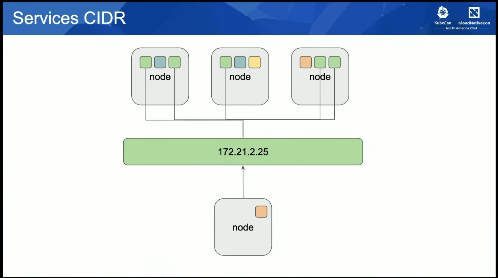

Abaixo um exemplo do `iptables` rules para um serviço do Kubernetes:

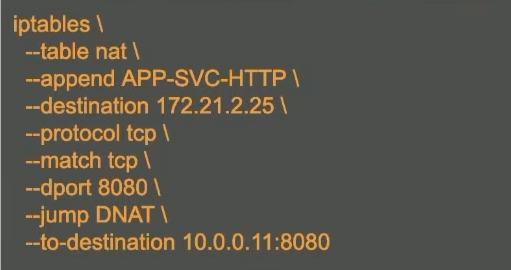

# Services NodePort

O *NodePort* é um tipo de serviço do Kubernetes que expõe um serviço em uma porta específica em cada nó do cluster. Ele é acessível a partir de fora do cluster usando o endereço IP do nó e a porta especificada. O *NodePort* é útil para acessar serviços do Kubernetes a partir de fora do cluster, como para testes ou para expor serviços para usuários finais. No entanto, ele pode não ser a melhor opção para produção, pois pode ser menos seguro e menos escalável do que outros tipos de serviços, como o *LoadBalancer*.

O *NodePort* é configurado usando o campo `type: NodePort` no manifesto do serviço, e a porta específica é definida usando o campo `nodePort`.

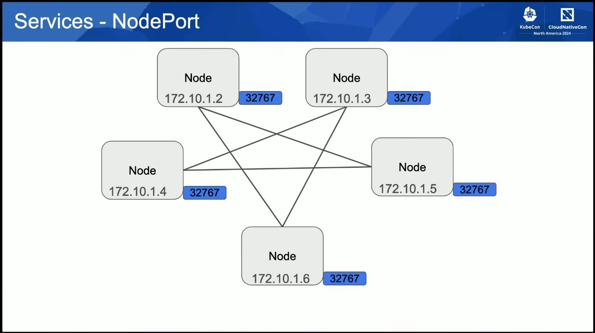

O Kubernetes atribui automaticamente uma porta dentro do intervalo de portas definido para o *NodePort* (geralmente entre 30000 e 32767) quando um serviço é criado com o tipo *NodePort*. No entanto, os usuários também podem especificar uma porta específica dentro desse intervalo usando o campo `nodePort` no manifesto do serviço. Se a porta especificada já estiver em uso por outro serviço, o Kubernetes retornará um erro e solicitará que uma porta diferente seja escolhida.

É importante garantir que as portas usadas para *NodePort* sejam exclusivas para evitar conflitos e garantir a comunicação eficiente entre os serviços e os clientes externos.

## Kube Proxy

O *kube-proxy* é um componente do Kubernetes que é responsável por manter as regras de rede para os serviços do Kubernetes. Ele é executado em cada nó do cluster e é responsável por encaminhar o tráfego de rede para os pods corretos com base nas regras de rede definidas para os serviços. O *kube-proxy* suporta diferentes modos de operação, incluindo o modo *iptables*, que usa regras de firewall para encaminhar o tráfego, e o modo *IPVS*, que usa uma abordagem baseada em balanceamento de carga para encaminhar o tráfego. O *kube-proxy* é essencial para garantir a comunicação eficiente entre os serviços e os pods dentro do cluster Kubernetes.

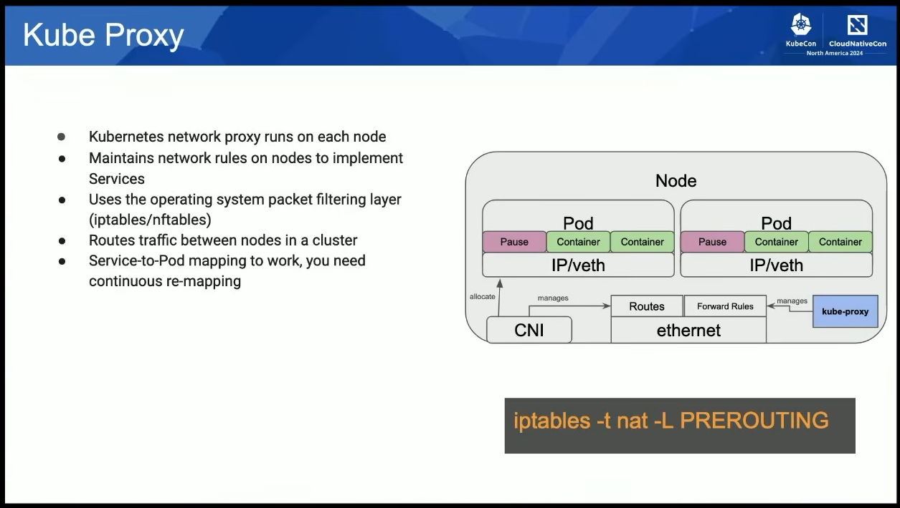

# E se escolhermos "nomes" ao invés de "IPs"?

O Kubernetes suporta a comunicação entre os pods usando nomes de serviço em vez de endereços IP. Quando um pod tenta se comunicar com um serviço usando seu nome, o sistema de DNS do Kubernetes consulta o registro DNS para esse serviço e retorna o endereço IP correspondente, permitindo que a comunicação ocorra sem a necessidade de usar endereços IP diretamente.

### DNS

O sistema de DNS interno do Kubernetes permite que os pods se comuniquem usando nomes de serviço em vez de endereços IP. Cada serviço no Kubernetes recebe um nome DNS único, e o sistema de DNS do Kubernetes resolve esses nomes para os endereços IP correspondentes dos serviços. Isso facilita a comunicação entre os pods e torna a configuração de rede mais flexível e gerenciável.

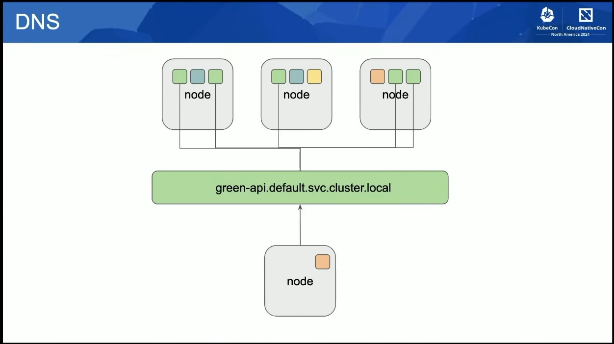

## No final, todos esses componentes ficariam assim:

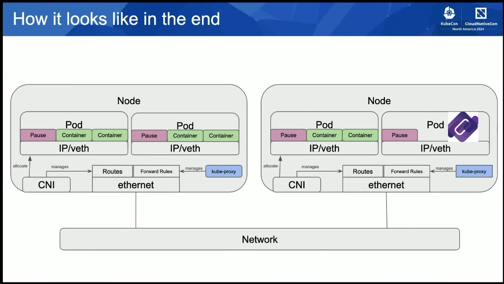

# Considerações

## Network Policy

Pode ser usada para *controlar o tráfego* de rede entre os pods e serviços dentro do cluster. Ela permite que os administradores definam *regras de rede e firewall* para restringir ou permitir o tráfego entre os pods com base em critérios como rótulos, namespaces e portas. As políticas de rede são implementadas usando o recurso `NetworkPolicy` do Kubernetes, e podem ser usadas para melhorar a segurança e a segmentação da rede dentro do cluster.

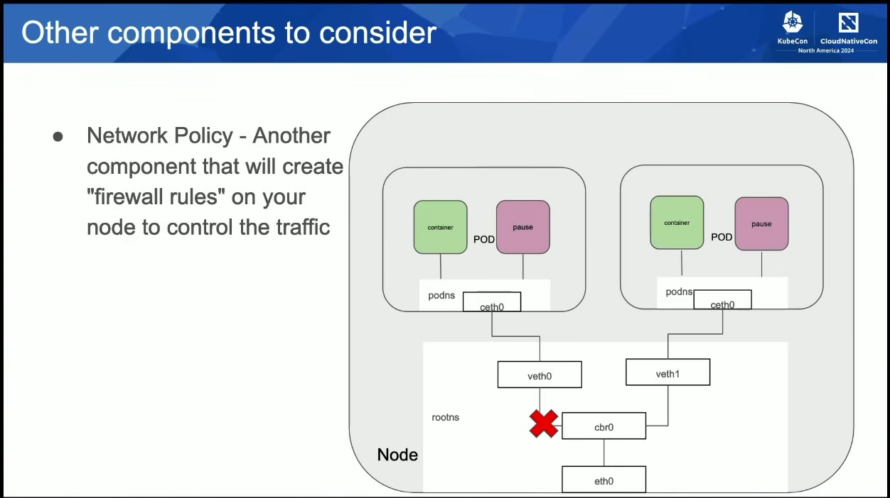

## Ingress Controller and Gateway API controller

O *Ingress Controller* é um componente do Kubernetes que gerencia o tráfego de entrada para os serviços do Kubernetes. Ele é responsável por rotear o tráfego de entrada para os serviços corretos com base nas regras de roteamento definidas em um recurso `Ingress`.

O *Gateway API controller* é uma implementação mais recente que fornece uma maneira mais flexível e extensível de gerenciar o tráfego de entrada, permitindo a definição de regras de roteamento mais complexas e a integração com diferentes soluções de balanceamento de carga e proxies. Ambos os controladores são usados para expor serviços do Kubernetes para o mundo externo e gerenciar o tráfego de entrada de maneira eficiente e segura.

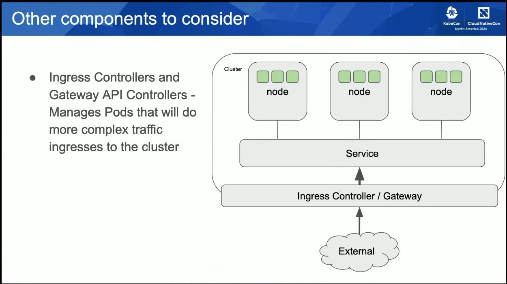