# O que é "Dynatrace"?

Basicamente, a Dynatrace é uma plataforma de monitoramento e análise de desempenho de aplicativos e infraestrutura. Ela oferece uma visão abrangente do desempenho de sistemas, permitindo que as equipes de TI identifiquem e resolvam problemas rapidamente, otimizem o desempenho e melhorem a experiência do usuário.

A Dynatrace utiliza inteligência artificial para fornecer insights acionáveis e automação, ajudando as organizações a manterem seus sistemas funcionando de maneira eficiente e confiável.

```yaml
beneficios:
  - Visão completa do desempenho
  - Detecção automática de problemas
  - Análise de causa raiz
  - Monitoramento em tempo real
  - Suporte para ambientes complexos
```
---
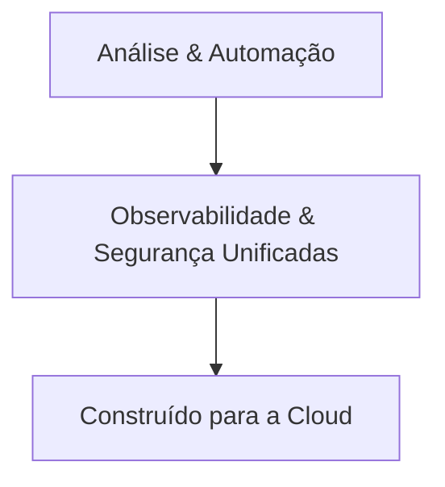

---

# DAVIS AI

Davis é o mecanismo de inteligência artificial da Dynatrace, projetado para analisar grandes volumes de dados de monitoramento e fornecer insights acionáveis. Ele ajuda as equipes de TI a identificar rapidamente a causa raiz de problemas de desempenho, prever falhas e otimizar o desempenho dos sistemas. Davis utiliza aprendizado de máquina para detectar anomalias, correlacionar eventos e fornecer recomendações para resolver problemas, melhorando a eficiência operacional e a experiência do usuário.

---

# TODA OBSERVABILIDADE EM UMA ÚNICA PLATAFORMA

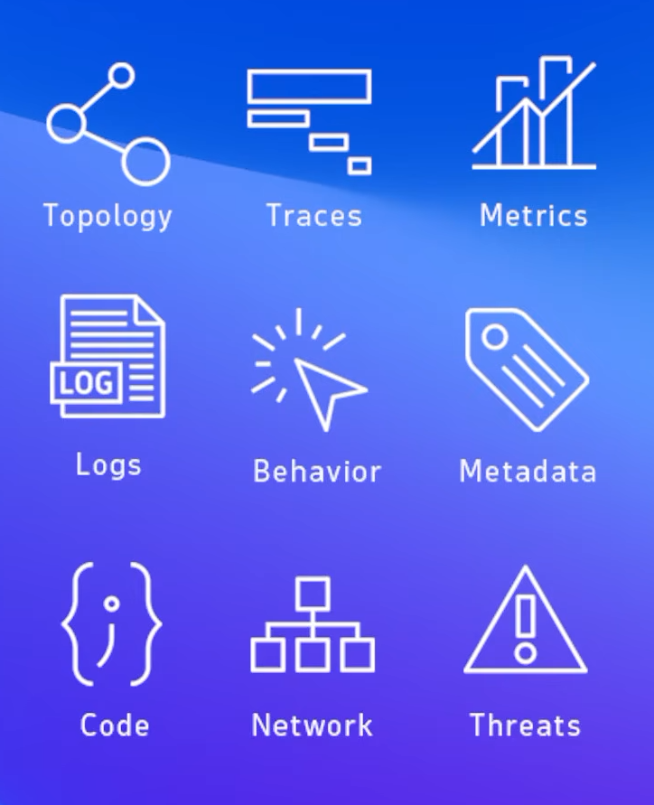

- **Topology**: A Dynatrace oferece uma visão completa da topologia do sistema, permitindo que as equipes de TI entendam como os diferentes componentes interagem e identifiquem rapidamente quaisquer problemas.

- **Traces**: A plataforma fornece rastreamento detalhado de transações, permitindo que as equipes de TI acompanhem o fluxo de solicitações e identifiquem gargalos de desempenho.

- **Metrics**: A Dynatrace coleta e analisa métricas de desempenho em tempo real, permitindo que as equipes de TI monitorem a saúde do sistema e identifiquem tendências de desempenho.

- **Logs**: A plataforma oferece coleta e análise de logs, permitindo que as equipes de TI identifiquem rapidamente problemas e resolvam incidentes.

- **Behavior**: A Dynatrace utiliza análise comportamental para identificar padrões de uso e comportamento do sistema, ajudando as equipes de TI a entender melhor como os usuários interagem com os aplicativos e a otimizar a experiência do usuário.

- **Metadata**: A plataforma coleta e analisa metadados de aplicativos e infraestrutura, permitindo que as equipes de TI entendam melhor o contexto dos problemas e identifiquem rapidamente a causa raiz.

- **Code**: A Dynatrace oferece análise de código, permitindo que as equipes de TI identifiquem problemas de desempenho relacionados ao código e otimizem a eficiência do aplicativo.

- **Network**: A plataforma fornece monitoramento de rede, permitindo que as equipes de TI identifiquem problemas de conectividade e desempenho relacionados à rede.

- **Threats**: A Dynatrace oferece monitoramento de ameaças, permitindo que as equipes de TI identifiquem rapidamente vulnerabilidades e riscos de segurança.

---

# ONE AGENT

O OneAgent é um componente central da Dynatrace que simplifica a coleta de dados de monitoramento. Ele é instalado em servidores, contêineres ou máquinas virtuais e coleta automaticamente métricas, logs, rastreamentos e informações de topologia. O OneAgent é projetado para ser leve e eficiente, minimizando o impacto no desempenho do sistema monitorado.

---

# ONEPIPELINE

O OnePipeline é uma funcionalidade da Dynatrace que permite a integração contínua e entrega contínua (CI/CD) com a plataforma. Ele facilita a automação do monitoramento e análise de desempenho durante o ciclo de vida do desenvolvimento de software, garantindo que as equipes de TI possam identificar e resolver problemas rapidamente, mesmo em ambientes de desenvolvimento ágeis e dinâmicos.

Você pode usar o OnePipeline para filtrar, transportar, mascarar, enriquecer, normalizar, transformar e mapear dados.

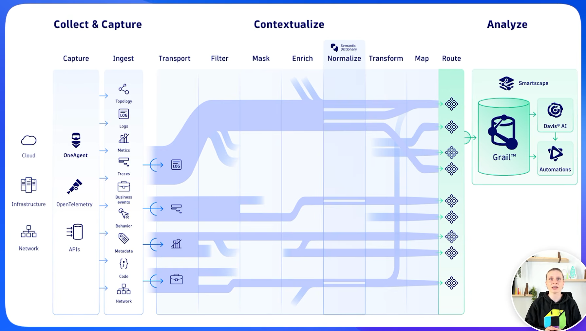

---

# GRAIL

O GRAIL é uma tecnologia de armazenamento de dados da Dynatrace que permite a análise de grandes volumes de dados de monitoramento em tempo real. Ele é projetado para lidar com a complexidade e a escala dos ambientes modernos, permitindo que as equipes de TI acessem rapidamente informações detalhadas sobre o desempenho do sistema e identifiquem problemas antes que eles afetem os usuários finais.

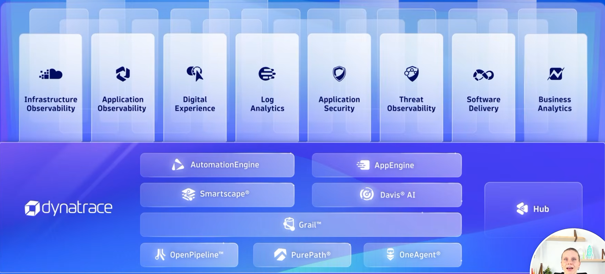

---

# Como o DYNATRACE pode ajudar?

- **Finance**: monitorar e otimizar o desempenho de sistemas financeiros, garantindo transações rápidas e seguras.

- **Healthcare**: monitorar e otimizar o desempenho de sistemas de saúde, garantindo a disponibilidade e a confiabilidade dos serviços críticos.

- **Retail**: monitorar e otimizar o desempenho de sistemas de varejo, garantindo uma experiência de compra fluida e eficiente para os clientes.

- **Technology**: monitorar e otimizar o desempenho de sistemas tecnológicos, garantindo a disponibilidade e a confiabilidade dos serviços oferecidos.

- **Telecommunications**: monitorar e otimizar o desempenho de sistemas de telecomunicações, garantindo a disponibilidade e a confiabilidade dos serviços de comunicação.

- **Manufactoring**: monitorar e otimizar o desempenho de sistemas de manufatura, garantindo a eficiência e a qualidade dos processos de produção.

- **Government**: monitorar e otimizar o desempenho de sistemas governamentais, garantindo a disponibilidade e a confiabilidade dos serviços públicos oferecidos aos cidadãos.

---

# LAUNCHER

- O Launcher é a interface central do Dynatrace, onde os usuários podem acessar todas as funcionalidades da plataforma, incluindo monitoramento, análise de desempenho, automação e muito mais. Ele é projetado para ser intuitivo e fácil de usar, permitindo que as equipes de TI acessem rapidamente as informações e ferramentas de que precisam para manter seus sistemas funcionando de maneira eficiente e confiável.

---
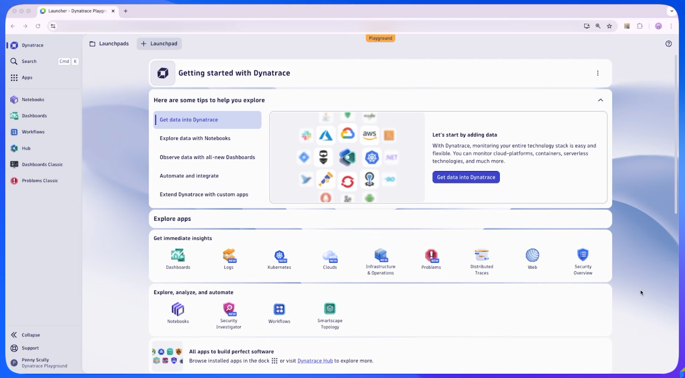
---
(Página inicial do Dynatrace, onde os usuários podem acessar todas as funcionalidades da plataforma)

---

---
Tudo dentro do Dynatrace é um "app", ou seja, cada funcionalidade é apresentada como um aplicativo dentro da plataforma, permitindo que os usuários acessem facilmente as ferramentas e recursos de monitoramento e análise de desempenho.

---

### **ctrl + k**: para acessar a barra de pesquisa e navegar rapidamente entre as diferentes funcionalidades e aplicativos dentro do Dynatrace.

---

# DISCOVERY & COVERAGE

A funcionalidade de Discovery & Coverage do Dynatrace permite que as equipes de TI descubram automaticamente todos os componentes e serviços em seus ambientes, garantindo uma cobertura completa do monitoramento. Isso inclui a identificação de aplicativos, servidores, contêineres, bancos de dados e outros recursos, permitindo que as equipes de TI tenham uma visão abrangente do desempenho do sistema e possam identificar rapidamente quaisquer problemas ou gargalos.

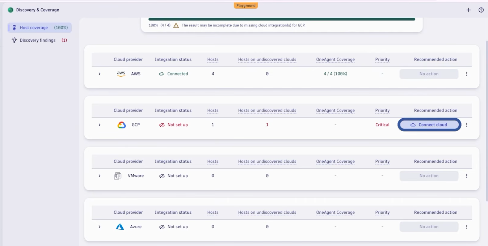

(exemplo da página "discovery & coverage" do Dynatrace, mostrando a topologia de um sistema e os componentes monitorados)

---

# OPERAÇÕES UNIFICADAS
### (Infra, DevOps, FinOps, IT Operations)

A funcionalidade de Operações Unificadas do Dynatrace integra diferentes áreas de operações, como Infraestrutura, DevOps, FinOps e IT Operations, em uma única plataforma. Isso permite que as equipes de TI colaborem de maneira mais eficaz, compartilhem informações e resolvam problemas de forma mais rápida e eficiente. Com as Operações Unificadas, as equipes podem monitorar e otimizar o desempenho do sistema em todas as camadas, desde a infraestrutura até os aplicativos, garantindo uma experiência de usuário final otimizada e confiável.

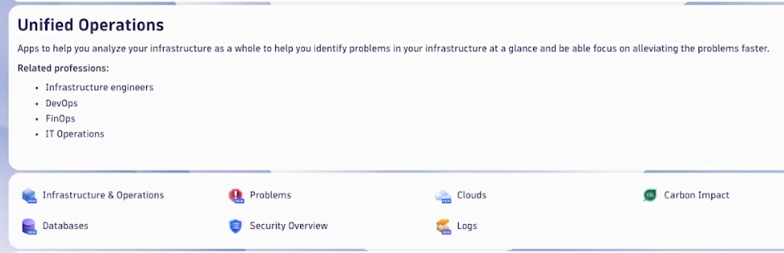

(Exemplo da página de Operações Unificadas do Dynatrace, mostrando a integração de diferentes áreas de operações e a visão abrangente do desempenho do sistema)

---

### INFRASTRUCTURE & OPERATIONS
- Monitoramento de infraestrutura e operações, permitindo que as equipes de TI identifiquem e resolvam problemas de desempenho relacionados à infraestrutura, como servidores, redes e armazenamento.

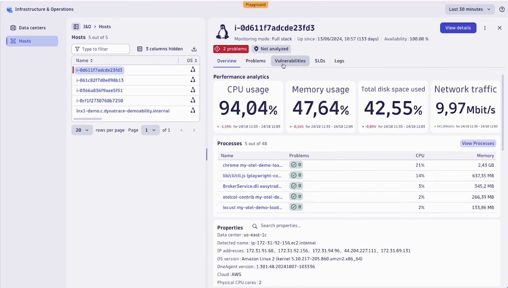

---

### PROBLEMS

- Identificação e resolução de problemas de desempenho em tempo real, permitindo que as equipes de TI detectem e corrijam rapidamente quaisquer problemas que possam afetar a experiência do usuário final.

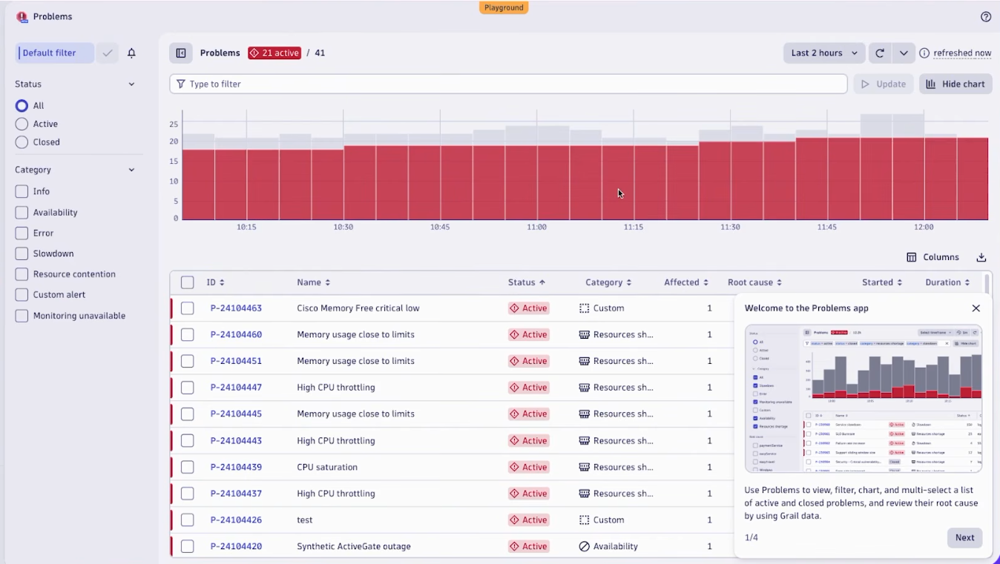

---

# CLOUD OPERATIONS

- Monitoramento e otimização de operações em ambientes de nuvem, permitindo que as equipes de TI gerenciem e otimizem o desempenho de seus sistemas em plataformas de nuvem como AWS, Azure e Google Cloud.

---

# KUBERNETES

- Monitoramento e otimização de clusters Kubernetes, permitindo que as equipes de TI gerenciem e otimizem o desempenho de seus aplicativos em ambientes de contêineres.

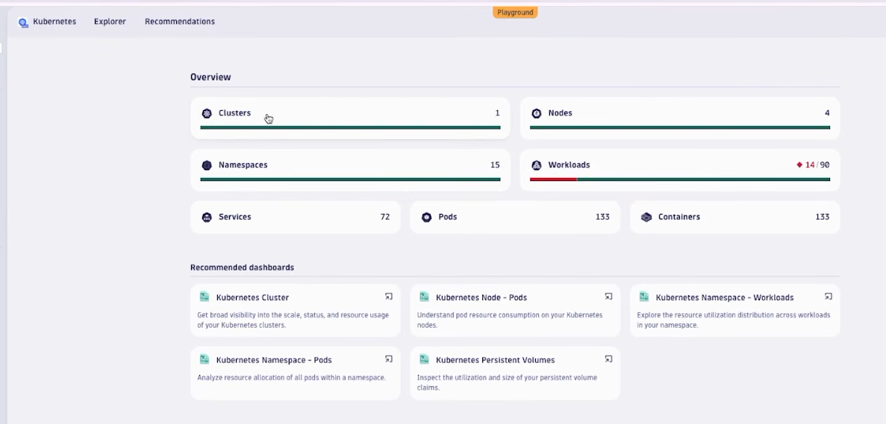

- Caso alguma parte do cluster Kubernetes apresente problemas, o Dynatrace pode identificar rapidamente a causa raiz, como um contêiner com alto consumo de recursos ou uma falha de rede, e fornecer recomendações para resolver o problema.

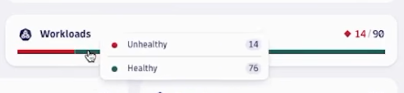

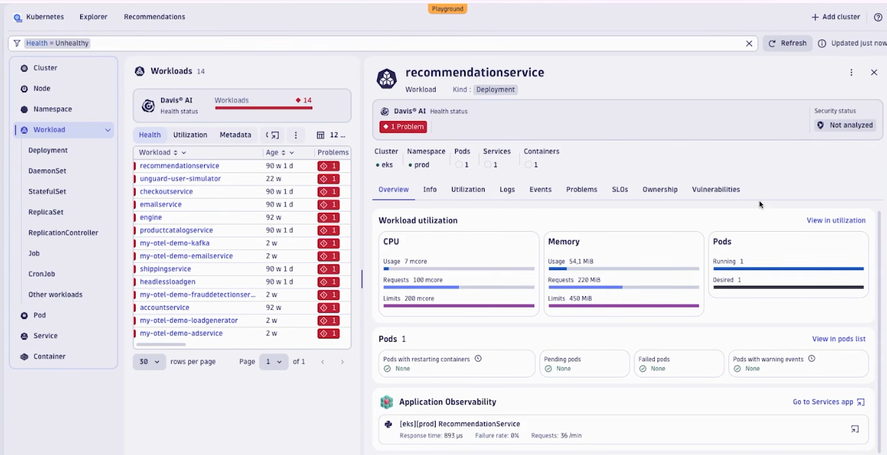

#### Dashboard app

- O dynatrace oferece um aplicativo de dashboard que permite às equipes de TI visualizar e monitorar o desempenho de seus sistemas em tempo real, com gráficos, métricas e alertas personalizados para atender às necessidades específicas de cada equipe.

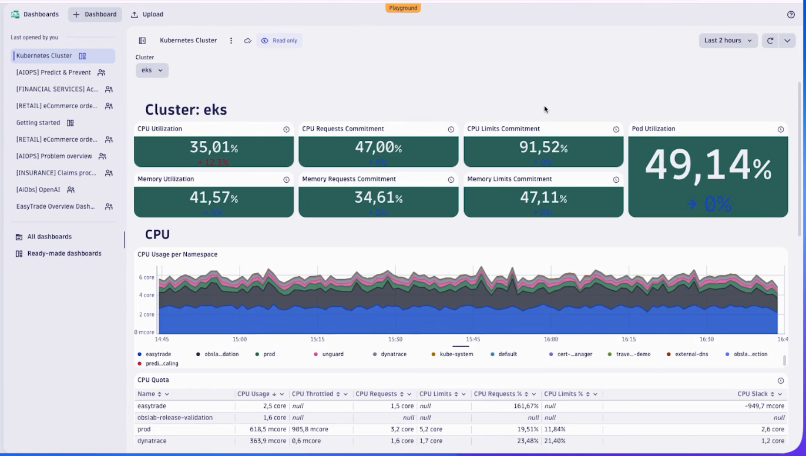

Exemplo de um dashboard personalizado no Dynatrace, mostrando métricas de desempenho, alertas e informações detalhadas sobre o estado do sistema monitorado.

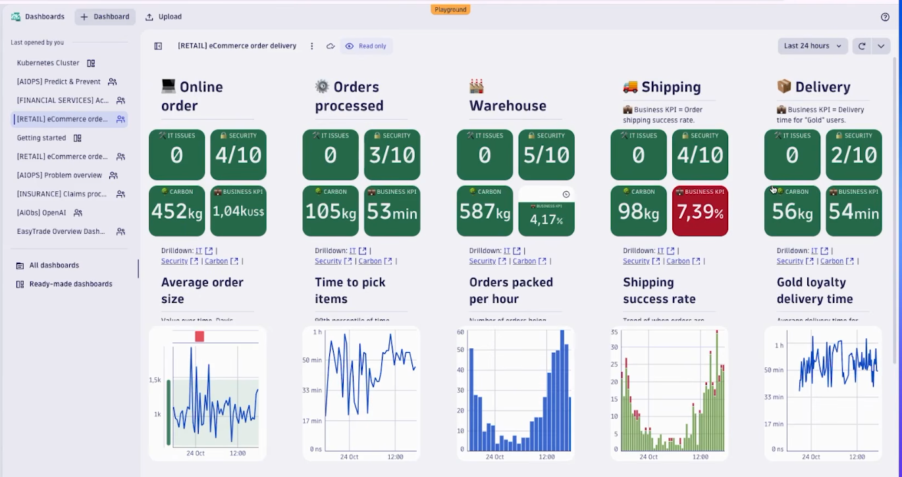

---

# LOGS

- Monitoramento e análise de logs, permitindo que as equipes de TI identifiquem rapidamente problemas e resolvam incidentes relacionados a logs de aplicativos, servidores e outros componentes do sistema.

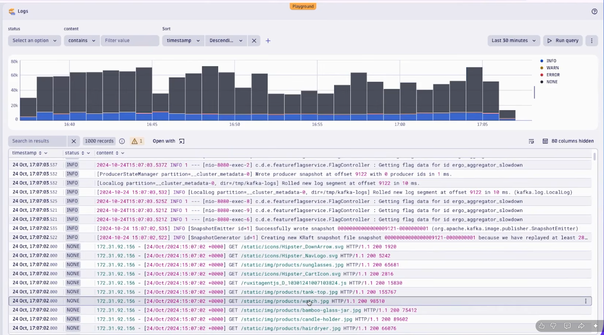

---

# DISTRIBUTED TRACING

- Monitoramento e rastreamento distribuído, permitindo que as equipes de TI acompanhem o fluxo de solicitações e transações em sistemas distribuídos, identificando gargalos e problemas de desempenho em diferentes serviços e componentes.

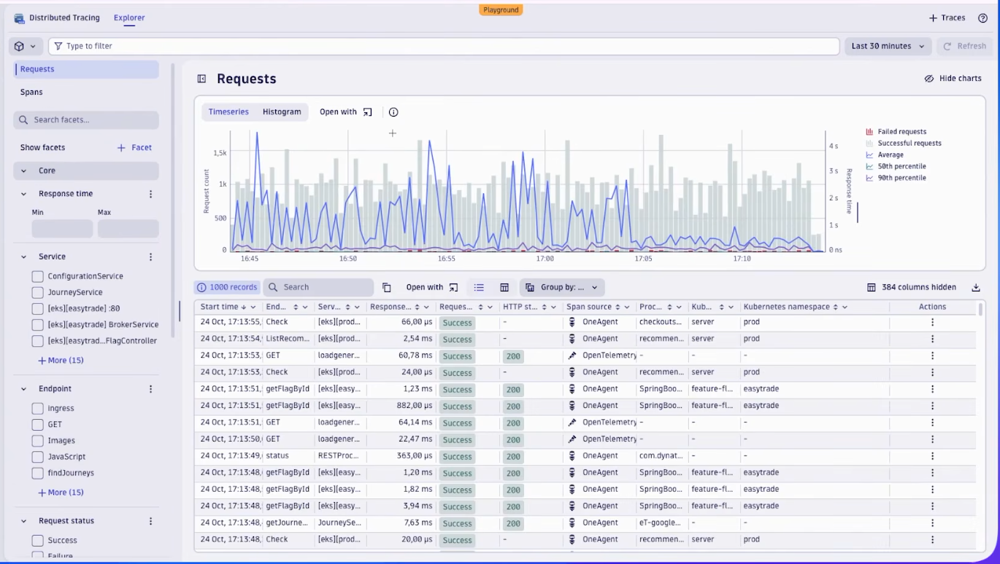

---