```mermaid
flowchart TB
    A["**KUBERNETES**\nPlataforma de orquestração\nGerencia implantação e escala\nInfraestrutura eficiente\nAutomação de tarefas"] --> B["**CLUSTERS**\nConjunto de Nodes\nGerenciado pelo controle\nRecursos para aplicações\nInfraestrutura subjacente\nGerencia estado e carga"]
    B --> C["**NAMESPACE**\nEspaço lógico no cluster\nSepara e organiza recursos\nGestão de permissões"]
    C --> D["**NODES**\nMáquinas do cluster\nExecutam Pods e kubelet\nRecursos de computação\nPodem ser físicos ou virtuais\nKubelet garante execução"]
    D --> E["**PODS**\nUnidade de implantação\nCompartilham rede e storage\nUm ou mais contêineres\nCriados e recriados conforme\nGarantem disponibilidade"]
    E --> F["**CONTÊINERES**\nAmbiente isolado\nCriados via imagens Docker\nExecução consistente\nCompartilham CPU e memória\nIsolados uns dos outros"]
    F --> G["**IMAGEM_DOCKER**\nPacote leve executável\nInclui código e dependências\nCriada a partir do Dockerfile\nImagem imutável e portátil\nConsistência em ambientes"]
    G --> H["**DOCKERFILE**\nArquivo de instruções\nDefine libs e comandos\nEspecifica ambiente correto\nTexto com instruções da imagem\nPortabilidade e escalabilidade"]
    H --> I["**APLICAÇÃO**\nResultado final\nCódigo vira produto funcional\nExecutável em produção"]
```

# PALAVRAS IMPORTANTES

curioso por natureza, autodidata, sempre busco aprender profundamente sobre os assuntos que me interessam
facilidade em aprender novas tecnologias
facilidade em trabalhar sob pressão
experiência em atendimento a nível de cliente -> facilidade em usar analogias e exemplos do dia a dia para explicar conceitos técnicos complexos para pessoas não técnicas -> agrega na livelo em ambientes de war room
transição de carreira estudando há mais de 1 ano procurando a minha primeira oportunidade em uma empresa grande 
Recentemente participei de alguns projetos com prazo determinado
Projeto REBOOKIO - criação do backend completo de uma plataforma de agendamento de serviços.
Observabilidade com Monitoramento, Tracing, Alertas, Dashboard, Logs e Métricas. Utilização de AWS (EC2, S3, RDS), Docker e Kubernetes para orquestração de contêineres.
Implementação de CI/CD para automação do processo de desenvolvimento e implantação.
container = ambiente isolado para execução da aplicação, criado a partir de uma imagem Docker

Sabe a empresa Livelo? É uma empresa de tecnologia focada em soluções de fidelidade e benefícios para clientes corporativos, oferecendo uma plataforma digital que conecta consumidores a uma ampla rede de parceiros comerciais, proporcionando experiências personalizadas e recompensas exclusivas. A Livelo é conhecida pela inovação em oferecer serviços de alta qualidade para seus clientes, utilizando tecnologias avançadas para criar soluções eficientes e escaláveis.

---

# TERMOS IMPORTANTES

- *AWS* = Amazon Web Services
<!-- uma plataforma de serviços em nuvem oferecida pela Amazon, que fornece uma ampla gama de serviços, incluindo computação, armazenamento, bancos de dados, redes, análise, inteligência artificial, segurança e muito mais. Esses serviços permitem que empresas de todos os tamanhos construam e escalem aplicações de forma rápida e eficiente. -->
- *EKS* = Elastic Kubernetes Service
<!-- um serviço gerenciado da AWS que facilita a execução do Kubernetes na nuvem da Amazon, permitindo que as empresas implantem, gerenciem e escalem aplicações em contêineres de forma eficiente e segura. -->
- *POD* = Unidade básica de implantação no Kubernetes
<!-- a menor unidade de implantação no Kubernetes, representando um único instância de uma aplicação em execução. Ele pode conter um ou mais contêineres que compartilham recursos como armazenamento e rede. -->
- *DOCKER* = Plataforma de contêineres para empacotar, distribuir e executar aplicações
<!-- uma plataforma que permite criar, distribuir e executar aplicações em contêineres, proporcionando um ambiente isolado e consistente para desenvolvimento, teste e produção. -->
- *KUBERNETES* = Plataforma de orquestração de contêineres
<!-- uma plataforma de código aberto para automação de implantação, dimensionamento e operação de aplicações em contêineres. Ele permite gerenciar clusters de contêineres de forma eficiente, garantindo alta disponibilidade, escalabilidade e resiliência das aplicações. -->
- *CONTAINER* = Ambiente isolado para execução da aplicação
<!-- uma unidade leve e portátil que encapsula uma aplicação e suas dependências, garantindo que ela seja executada de forma consistente em diferentes ambientes. -->
- *IMAGEM_DOCKER* = Pacote leve, standalone e executável
<!-- Uma imagem Docker é um pacote leve, independente e executável que contém tudo o que é necessário para executar uma aplicação, incluindo o código, bibliotecas, dependências e configurações. -->
- *CI/CD* = Continuous Integration / Continuous Deployment
<!-- um conjunto de práticas de desenvolvimento de software que visa automatizar e melhorar o processo de integração e entrega contínua de código, garantindo que as alterações sejam testadas, integradas e implantadas de forma rápida e eficiente. -->
- *DEPLOY* = Processo de implantação de uma aplicação em um ambiente de produção
<!-- é o processo de colocar uma aplicação em um ambiente de produção, tornando-a disponível para os usuários finais. -->
- *KUBEAPI* = API do Kubernetes para interagir com o cluster e gerenciar recursos.
<!-- é a interface de programação de aplicativos (API) do Kubernetes, que permite aos usuários interagir com o cluster e gerenciar recursos, como Pods, Deployments, Services, etc. -->
- *KUBELET* = agente do Kubernetes que garante que os contêineres estejam rodando conforme o especificado.
<!-- é o "agente" que roda em cada Node do Kubernetes e é responsável por garantir que os contêineres estejam rodando conforme o especificado nos manifestos do Kubernetes. Ele monitora o estado dos contêineres e se comunica com o plano de controle para garantir que os recursos sejam alocados de forma eficiente e que a aplicação esteja sempre disponível. -->
- *KUBECONFIG* = arquivo de configuração para acessar o cluster Kubernetes.
<!-- é um arquivo de configuração que contém as informações necessárias para acessar e autenticar-se em um cluster Kubernetes. Ele inclui detalhes como o endereço do servidor API, credenciais de autenticação e informações sobre os contextos de cluster. O kubectl usa esse arquivo para se conectar ao cluster e executar comandos. -->
- *REST* = Representational State Transfer, estilo de arquitetura para desenvolvimento de APIs que utiliza os métodos HTTP para manipular recursos.
<!-- é um estilo de arquitetura para desenvolvimento de APIs que utiliza os métodos HTTP (GET, POST, PUT, DELETE) para manipular recursos, permitindo a comunicação entre sistemas de forma simples e escalável. -->
- *OBSERVABILIDADE* = Monitoramento, tracing, alertas, dashboard, logs e métricas para entender o desempenho e comportamento da aplicação
<!-- é a capacidade de entender o que está acontecendo dentro de um sistema, mesmo quando ele está em produção, permitindo que as equipes tomem decisões informadas e melhorem continuamente a aplicação. -->
- *MENSAGERIA* = Sistema de comunicação assíncrona entre diferentes componentes de uma aplicação.
<!-- é um sistema que permite a comunicação assíncrona entre diferentes componentes de uma aplicação, facilitando a troca de informações e a coordenação de tarefas de forma eficiente e escalável. -->
---

# OBSERVABILIDADE

- `Monitoramento`:
  - Coleta de métricas e logs para entender o desempenho e comportamento da aplicação.
  - Permite identificar problemas, gargalos e áreas de melhoria na aplicação.
  - Ajuda a equipe a tomar decisões informadas sobre otimizações e ajustes na aplicação.

- `Tracing`:
  - Rastreio de solicitações para identificar gargalos e problemas de desempenho.
  - Permite entender o fluxo de uma solicitação através dos diferentes componentes da aplicação, facilitando a identificação de pontos de falha e otimização.
  - Ajuda a equipe a melhorar a eficiência e a experiência do usuário, identificando e resolvendo problemas de desempenho de forma proativa.

- `Alertas`:
  - Configuração de alertas para notificar a equipe sobre problemas críticos.
  - Permite uma resposta rápida a incidentes, minimizando o impacto na experiência do usuário e garantindo a estabilidade da aplicação.
  - Ajuda a equipe a manter a confiabilidade e a disponibilidade da aplicação, garantindo que os problemas sejam identificados e resolvidos de forma eficiente.

- `Dashboard`:
  - Visualização de métricas e logs para facilitar a análise e tomada de decisões.
  - Permite uma visão geral do desempenho e comportamento da aplicação, facilitando a identificação de tendências e padrões.
  - Ajuda a equipe a monitorar a saúde da aplicação e a tomar decisões informadas sobre otimizações e ajustes, garantindo a eficiência e a satisfação do usuário.

- `Logs`:
  - Registros detalhados das atividades da aplicação para diagnóstico e análise de problemas.
  - Permite entender o comportamento da aplicação e identificar a causa raiz de problemas, facilitando a resolução de incidentes e a melhoria contínua da aplicação.
  - Ajuda a equipe a manter a confiabilidade e a estabilidade da aplicação, garantindo que os problemas sejam identificados e resolvidos de forma eficiente.

- `Métricas`:
  - Dados quantitativos sobre o desempenho e comportamento da aplicação, como tempo de resposta, taxa de erro, uso de recursos, etc.
  - Permite identificar tendências e padrões no desempenho da aplicação, facilitando a tomada de decisões informadas sobre otimizações e ajustes.
  - Ajuda a equipe a monitorar a saúde da aplicação e a garantir a eficiência e a satisfação do usuário.

---

# CI/CD (Continuous Integration / Continuous Deployment)

- `Pipeline de CI/CD`:
  - Conjunto de etapas automatizadas que abrangem desde a integração do código até a implantação em produção.
  - Inclui etapas como construção da aplicação, execução de testes, análise de qualidade do código e implantação.
  - Facilita a automação do processo de desenvolvimento e implantação, garantindo que as alterações sejam entregues de forma rápida, eficiente e com alta qualidade.

- `Continuous Integration (CI)`:
  - Processo de integração contínua de código, onde os desenvolvedores enviam suas alterações para um repositório compartilhado.
  - O código é automaticamente testado e validado para garantir que as alterações não quebrem a aplicação.
  - Facilita a colaboração entre os membros da equipe e garante a qualidade do código.

- `Continuous Deployment (CD)`:
  - Processo de implantação contínua, onde as alterações aprovadas são automaticamente implantadas em um ambiente de produção.
  - Permite uma entrega rápida e eficiente de novas funcionalidades e correções de bugs para os usuários finais.
  - Reduz o tempo de lançamento de novas versões e melhora a experiência do usuário, garantindo que as melhorias sejam disponibilizadas de forma rápida e eficiente.

---

```
[FLUXO DE DESENVOLVIMENTO E IMPLANTAÇÃO]
```



---

# COISAS PARA ESTUDAR:

 - `microserviço` = arquitetura de software onde a aplicação é dividida em pequenos serviços independentes, cada um responsável por uma funcionalidade específica, facilitando a escalabilidade e manutenção da aplicação.
- `monolito` = arquitetura de software onde a aplicação é construída como um único bloco, onde todas as funcionalidades estão interconectadas, o que pode dificultar a escalabilidade e manutenção da aplicação.
- `serverless` = modelo de computação em nuvem onde o provedor de serviços gerencia a infraestrutura e a execução do código, permitindo que os desenvolvedores se concentrem apenas na lógica da aplicação, sem se preocupar com a gestão de servidores.
- `containerização` = processo de empacotar uma aplicação e suas dependências em um contêiner, garantindo que a aplicação possa ser executada de forma consistente em qualquer ambiente, facilitando a portabilidade e escalabilidade da aplicação.
- `orquestração de contêineres` = processo de gerenciar e coordenar a implantação, escalabilidade e operação de aplicações em contêineres, garantindo que os recursos sejam alocados de forma eficiente e que a aplicação esteja sempre disponível.
- `infraestrutura como código (IaC)` = prática de gerenciar e provisionar a infraestrutura de TI por meio de código, permitindo a automação e a consistência na configuração e implantação de recursos de infraestrutura.
- `DevOps` = conjunto de práticas que visa integrar as equipes de desenvolvimento e operações, promovendo a colaboração, automação e entrega contínua de software, com o objetivo de melhorar a eficiência e a qualidade do processo de desenvolvimento e implantação de aplicações.

**Quando um alerta dispara, o analista precisa descobrir:**
*O que aconteceu?*
*Qual sistema foi afetado?*
*O impacto é grande ou pequeno?*
*Quem precisa ser acionado?*

`Você recebe um alerta dizendo que a aplicação está lenta. O que faz?`
"verificaria as métricas da aplicação para entender o que está acontecendo. Olharia para o uso de CPU, memória e tempos de respostas para identificar se há algo sendo sobrecarregado. Depois eu verificaria os logs da aplicação para ver se há algum erro ou comportamento anormal que possa estar causando a lentidão. Dependendo do que eu encontrar, poderia ser necessário reiniciar a aplicação, fazer rollback de algum deployment recente ou investigar mais a fundo para identificar a causa raiz do problema."

`Um pod no Kubernetes caiu. Como investigaria?`
"verificaria os logs do pod para identificar qualquer erro ou comportamento anormal. Em seguida, analisaria os eventos do Kubernetes para entender o que pode ter causado a queda, como problemas de recursos ou falhas de configuração. Dependendo do que eu encontrar, poderia reiniciar o pod, ajustar os recursos ou investigar mais a fundo para identificar a causa raiz do problema."

`Um usuário relata erro 500. Como começaria a análise?`
"erro 500 = erro interno do servidor. Se o erro for simples, como um erro de sintaxe ou um problema de configuração, eu tentaria corrigir o erro e verificar se a aplicação volta a funcionar normalmente. Se o erro for mais complexo, como um problema de desempenho ou uma falha de segurança, eu investigaria mais a fundo para identificar a causa raiz do problema e encontrar uma solução adequada. Caso fosse um deploy feito por outro setor, eu entraria em contato com a equipe responsável para entender o que foi alterado e como isso pode ter impactado a aplicação."

---

# Perguntas Técnicas (Infra / Cloud / Observabilidade)

## Kubernetes / Cloud

`- O que é um POD, deployment e namespace no Kubernetes?`
No Kubernetes, um Pod é a menor unidade executável, onde normalmente fica rodando um ou mais containers da aplicação. Um Deployment é o recurso responsável por gerenciar esses Pods, garantindo que a quantidade desejada esteja sempre disponível e permitindo atualizações controladas.
Já o Namespace é uma forma de organizar e isolar recursos dentro do cluster, separando ambientes ou equipes para facilitar a administração.

`Como você identifica e resolve um problema de OOMKill?`
OOMKill (Out of Memory Kill) = quando o sistema operacional mata um processo porque ele está consumindo mais memória do que o disponível.
Para identificar um problema de OOMKill, eu verificaria os logs do sistema e do Kubernetes para encontrar mensagens relacionadas a OOMKill. Em seguida, analisaria o consumo de memória da aplicação para entender se ela está utilizando mais memória do que o esperado. Para resolver o problema, poderia ser necessário ajustar os limites de memória da aplicação, otimizar o código para reduzir o consumo de memória ou aumentar os recursos disponíveis para a aplicação.

`Qual a diferença entre requests e limits de CPU/memória?`
Requests são os recursos garantidos para a aplicação funcionar, enquanto limits são o teto máximo que ela pode utilizar. Isso ajuda o Kubernetes a distribuir os workloads de forma adequada e evita que um serviço consuma recursos além do esperado.

`Como você escalaria uma aplicação que está com alto consumo?`
Eu começaria olhando as métricas e os logs para entender o que está acontecendo. Se o consumo alto estiver impactando a aplicação, uma possibilidade seria aumentar a quantidade de réplicas ou os recursos disponíveis para ela. Mas antes eu tentaria entender a causa, porque o aumento de consumo também pode ser resultado de algum problema na aplicação ou de um aumento temporário de carga.

`Como funciona o autoscaling (HPA/VPA)?`
Autoscaling serve para ajustar automaticamente os recursos da aplicação conforme a demanda.
O HPA aumenta ou diminui a quantidade de Pods quando métricas como CPU ou memória atingem determinados limites.
O VPA ajusta os recursos de cada Pod, aumentando ou reduzindo CPU e memória conforme a necessidade.

---

# DYNATRACE

- O Dynatrace é uma ferramenta que utiliza um software (plugin) que você conecta no micro serviço (contêiner).
- Ele coleta métricas, logs e traces da aplicação, permitindo que você tenha uma visão completa do desempenho e comportamento da aplicação.
- O Dynatrace é capaz de identificar problemas de desempenho, gargalos e áreas de melhoria na aplicação
- `query` -> é a linguagem de consulta usada para extrair informações específicas dos dados coletados pelo Dynatrace, permitindo que os usuários criem visualizações personalizadas e análises detalhadas do desempenho da aplicação.
- `dashboard` -> é uma interface visual que exibe métricas, logs e traces coletados pelo Dynatrace, permitindo que os usuários monitorem o desempenho e comportamento da aplicação de forma intuitiva e eficiente.
- `alertas` -> são notificações configuradas no Dynatrace para informar a equipe sobre problemas críticos ou anomalias no desempenho da aplicação, permitindo uma resposta rápida e eficiente para resolver os incidentes e garantir a estabilidade da aplicação.
- `tracing` -> é um recurso do Dynatrace que permite rastrear o fluxo de uma solicitação através dos diferentes componentes da aplicação, identificando gargalos e problemas de desempenho, facilitando a otimização e melhoria contínua da aplicação.
- `service now` -> é uma plataforma de gerenciamento de serviços que pode ser integrada ao Dynatrace para automatizar o processo de criação e gerenciamento de incidentes, permitindo uma resposta rápida e eficiente a problemas críticos identificados pelo monitoramento do Dynatrace.

---

# Monitoramento (Dynatrace, observabilidade)

## O que é SLA, SLO e SLI?

`SLA` -> *Agreement* Service Level (*Acordo* de Nível de Serviço)
    - É um contrato que define as expectativas de serviço entre o cliente e o fornecedor.
    - Ele estabelece os níveis de serviço que o fornecedor se compromete a fornecer, incluindo as penalidades em caso de não cumprimento.
    - O SLA é um acordo formal que pode incluir vários SLOs e SLIs para garantir que o serviço atenda às expectativas do cliente.
    - É o primeiro passo para garantir que o serviço atenda às necessidades do cliente e para estabelecer um entendimento claro entre as partes envolvidas.

`SLO` -> *Objective* Service Level (*Objetivo* de Nível de Serviço)
    - É uma meta específica que o serviço deve atingir para cumprir o SLA.
    - O SLO é uma parte do SLA e define os níveis de desempenho que o serviço deve alcançar para atender às expectativas do cliente.
    - Ele é usado para medir o desempenho do serviço e garantir que ele esteja alinhado com as necessidades do cliente.
    - O SLO é uma métrica específica que pode ser monitorada e avaliada para garantir que o serviço esteja atendendo às expectativas estabelecidas no SLA.

`SLI` -> *Indicator* Service Level (*Indicador* de Nível de Serviço)
    - É uma métrica específica usada para medir o desempenho de um serviço em relação ao SLO.
    - O SLI é uma métrica quantitativa que pode ser monitorada para avaliar se o serviço está atendendo aos objetivos estabelecidos no SLO.
    - Ele é usado para fornecer dados concretos sobre o desempenho do serviço e para identificar áreas de melhoria.
    - O SLI é uma ferramenta essencial para garantir que o serviço esteja alinhado com as expectativas do cliente e para tomar decisões informadas sobre melhorias no serviço.

`Como você define um alerta eficiente?`
"Um alerta eficiente deve ser claro, específico e acionável. Ele deve fornecer informações suficientes para que a equipe possa entender o problema e tomar medidas corretivas rapidamente. Além disso, é importante evitar alertas falsos ou irrelevantes, que podem levar à fadiga de alertas e diminuir a eficácia do monitoramento. Para definir um alerta eficiente, é necessário estabelecer critérios claros para quando o alerta deve ser acionado, como limites de desempenho ou erros específicos, e garantir que as notificações sejam direcionadas para as pessoas certas na equipe."

`Como evitar alert fatigue?`
"Para evitar a fadiga de alertas, é importante configurar os alertas de forma inteligente, garantindo que eles sejam acionados apenas para problemas críticos e relevantes. Isso pode ser feito definindo limites adequados para as métricas monitoradas, evitando alertas para flutuações normais ou eventos temporários. Além disso, é importante revisar regularmente os alertas configurados para garantir que eles ainda sejam relevantes e eficazes, e ajustar ou desativar aqueles que não estão mais contribuindo para a identificação de problemas reais. A comunicação clara e a priorização dos alertas também são essenciais para garantir que a equipe possa responder de forma eficiente aos incidentes críticos sem se sentir sobrecarregada por alertas irrelevantes."

`Qual a diferença entre métricas, logs e traces?`
"Métricas são dados quantitativos que medem o desempenho e comportamento da aplicação, como tempo de resposta, taxa de erro, uso de recursos, etc. Logs são registros detalhados das atividades da aplicação, que podem incluir mensagens de erro, informações de depuração e outros eventos relevantes para o diagnóstico e análise de problemas. Traces são rastreamentos de solicitações que permitem entender o fluxo de uma solicitação através dos diferentes componentes da aplicação, identificando gargalos e problemas de desempenho. Enquanto as métricas fornecem uma visão geral do desempenho da aplicação, os logs e traces oferecem informações mais detalhadas para identificar a causa raiz de problemas específicos."

`Como você prioriza alertas críticos vs informativos?`
"Para priorizar alertas críticos versus informativos, eu consideraria o impacto potencial do problema na experiência do usuário e no negócio. Alertas críticos são aqueles que indicam problemas que podem causar interrupções significativas ou perda de dados, e devem ser tratados com alta prioridade para garantir a estabilidade da aplicação. Por outro lado, alertas informativos são aqueles que fornecem insights sobre o desempenho ou comportamento da aplicação, mas não indicam um problema imediato. Esses alertas podem ser monitorados e analisados para identificar tendências ou áreas de melhoria, mas não exigem uma resposta imediata. A priorização dos alertas deve ser baseada em uma avaliação cuidadosa do impacto potencial e da urgência de cada alerta, garantindo que a equipe possa responder de forma eficiente aos incidentes críticos enquanto monitora os alertas informativos para melhorias contínuas."

Incident Management

`Como você atua em uma war room?`
"Minha abordagem seria focada na colaboração e na comunicação eficiente entre os membros da equipe. Eu me certificaria de que todos tenham acesso às informações relevantes sobre o incidente, como logs, métricas e dados de monitoramento, para que possamos entender a situação de forma clara. Além disso, eu incentivaria a troca de ideias e sugestões para encontrar a melhor solução possível, garantindo que as ações sejam coordenadas e que todos estejam alinhados em relação aos próximos passos. A war room é um ambiente onde a rapidez e a eficiência são essenciais, então eu me esforçaria para manter o foco na resolução do incidente enquanto mantenho uma comunicação aberta e transparente com a equipe."

`Como você identifica a causa raiz de um incidente?`
"Eu começaria coletando e analisando todas as informações disponíveis, como logs, métricas e dados de monitoramento relacionados ao incidente. Em seguida, eu tentaria reproduzir o problema em um ambiente de teste para entender melhor o comportamento da aplicação e identificar possíveis pontos de falha. Além disso, eu colaboraria com outros membros da equipe para obter diferentes perspectivas e insights sobre o incidente. A partir dessas análises, eu buscaria identificar padrões ou correlações que possam indicar a causa raiz do problema, permitindo que possamos implementar uma solução eficaz e evitar recorrências no futuro."

`Qual foi o incidente mais crítico que você já tratou?`
"Um incidente crítico que eu tratei foi quando um serviço essencial da aplicação ficou indisponível devido a um problema de configuração. A equipe de monitoramento detectou o problema rapidamente, e nós nos reunimos na war room para analisar os logs e métricas relacionados ao incidente. Após uma investigação detalhada, identificamos que a causa raiz era uma configuração incorreta em um componente específico da infraestrutura. Trabalhamos juntos para corrigir a configuração e restaurar o serviço o mais rápido possível, minimizando o impacto para os usuários finais. Esse incidente destacou a importância de uma comunicação eficiente e da colaboração entre as equipes para resolver problemas críticos de forma eficaz."

`Como você reduziria MTTR de um ambiente?`
"Para reduzir o *MTTR (Mean Time to Recovery)* de um ambiente, eu implementaria uma abordagem proativa de monitoramento e alerta, garantindo que os problemas sejam detectados rapidamente. Além disso, eu investiria em automação para acelerar a resposta a incidentes, como scripts de correção automática ou playbooks para guiar a equipe durante a resolução de problemas. Também é importante ter uma comunicação clara e eficiente entre as equipes envolvidas, para garantir que todos estejam alinhados e possam colaborar efetivamente na resolução do incidente. Por fim, eu promoveria uma cultura de melhoria contínua, realizando análises pós-incidente para identificar oportunidades de otimização e evitar recorrências no futuro."

`O que é um post-mortem e qual sua importância?`
"Um post-mortem é uma análise detalhada de um incidente ou falha que ocorreu em um ambiente de produção. Ele tem como objetivo identificar a causa raiz do problema, entender o impacto que teve nos usuários e no negócio, e documentar as lições aprendidas para evitar que o mesmo tipo de incidente ocorra novamente no futuro. O post-mortem é importante porque permite que a equipe aprenda com os erros e melhore continuamente os processos e a infraestrutura, aumentando a resiliência e a confiabilidade do ambiente."

🔹 Perguntas Situacionais (muito usadas)

`Descreva uma situação onde você teve que agir sob pressão.`
"Um incidente crítico em produção que afetou vários usuários. A equipe de monitoramento detectou o problema rapidamente, e eu fui chamado para ajudar a resolver a situação. Sob pressão, mantive a calma e me concentrei em coletar informações relevantes, como logs e métricas, para entender a causa do problema. Trabalhei em colaboração com outros membros da equipe para identificar a raiz do problema e implementar uma solução temporária para restaurar o serviço o mais rápido possível. Após resolver o incidente, realizamos um post-mortem para analisar o que aconteceu e identificar melhorias para evitar que o mesmo tipo de incidente ocorra novamente no futuro."

`Conte sobre um incidente em que você não tinha todas as informações.`
"Em um incidente específico, recebi um alerta sobre um aumento significativo no tempo de resposta da aplicação, mas inicialmente não tinha acesso a todas as informações necessárias para entender a causa do problema. Para lidar com essa situação, comecei a coletar dados de monitoramento e logs para obter uma visão mais clara do que estava acontecendo. Colaborei com outros membros da equipe para compartilhar informações e insights, o que me ajudou a identificar padrões e possíveis causas do aumento no tempo de resposta. Com base nessas análises, conseguimos implementar uma solução temporária para mitigar o impacto nos usuários enquanto continuávamos investigando a causa raiz do problema."

`Como você lidou com um problema causado por outra equipe?`
"Em uma situação específica, um problema causado por outra equipe afetou o desempenho da aplicação. Para lidar com isso, mantive uma comunicação aberta e colaborativa com a equipe responsável, compartilhando informações detalhadas sobre o impacto e trabalhando juntos para encontrar uma solução rápida. Além disso, documentamos o incidente e as ações tomadas para evitar que problemas semelhantes ocorram no futuro, promovendo uma cultura de aprendizado e melhoria contínua."

`Já discordou de alguma decisão técnica? O que fez?`
"Sim, já discordei de uma decisão técnica em um projeto anterior. Em vez de simplesmente aceitar a decisão, eu busquei entender os motivos por trás dela e apresentei minha perspectiva de forma construtiva. Compartilhei dados e análises para apoiar minha posição e sugeri alternativas que poderiam ser mais eficazes. No final, conseguimos chegar a um consenso que levou em consideração as preocupações de todos os envolvidos, resultando em uma solução que atendeu às necessidades do projeto e melhorou o desempenho da aplicação."

`Como você garante uma comunicação eficiente durante incidentes?`
"Para garantir uma comunicação eficiente durante incidentes, eu estabeleço canais de comunicação claros e acessíveis para todos os membros da equipe, como uma sala de chat dedicada ou uma plataforma de colaboração. Além disso, eu incentivo a transparência e a troca de informações em tempo real, garantindo que todos estejam atualizados sobre o status do incidente e as ações que estão sendo tomadas. Também é importante designar um líder de comunicação para coordenar as mensagens e garantir que as informações sejam transmitidas de forma clara e concisa, evitando confusões e garantindo que a equipe possa responder de forma rápida e eficaz ao incidente."

👉 Essas são muito importantes

🔹 Perguntas sobre processos e governança

`Como você documenta procedimentos operacionais?`
"Eu utilizo uma abordagem estruturada para documentar os procedimentos, criando guias passo a passo que incluem detalhes sobre as ações a serem tomadas, os responsáveis por cada etapa e os critérios de sucesso. Além disso, eu mantenho a documentação atualizada regularmente para refletir quaisquer mudanças nos processos ou na infraestrutura, garantindo que a equipe tenha acesso a informações precisas e relevantes para executar suas tarefas de forma eficiente."

`Como define prioridades em múltiplos incidentes?`
"Para definir prioridades em múltiplos incidentes, eu avalio o impacto potencial de cada incidente na experiência do usuário e no negócio. Incidentes que podem causar interrupções significativas ou perda de dados recebem prioridade máxima, enquanto incidentes com impacto menor são tratados de acordo com sua urgência e importância relativa. Essa abordagem garante que a equipe possa responder de forma eficiente aos incidentes mais críticos, minimizando o impacto geral no serviço."

O que você considera um bom fluxo de atendimento de incidentes?

Como garantir rastreabilidade das ações executadas?

🔹 Perguntas sobre melhoria contínua

O que você já automatizou no seu dia a dia?

Como você melhora a qualidade de alertas?

Que métricas você acompanha para avaliar desempenho operacional?

Como você evita recorrência de incidentes?

🔹 Perguntas comportamentais

Fale sobre você.

Quais são seus pontos fortes e fracos?

Por que você quer trabalhar aqui?

Onde você se vê em 2-3 anos?

Como você lida com feedback?

🔹 Perguntas mais avançadas (diferencial)

Como você implementaria observabilidade em um ambiente do zero?

Como você estruturaria um Command Center eficiente?

Como reduzir ruído de monitoramento mantendo alta visibilidade?

Qual sua abordagem para capacity planning?

Como você mediria o impacto real de um incidente no negócio?

🔹 Perguntas que você pode fazer (IMPORTANTE)
Ter perguntas boas aumenta muito sua percepção:

Como é a maturidade de observabilidade da empresa?

Como o time mede sucesso operacional?

Existe cultura de post-mortem sem culpabilização?

Como funciona a integração entre SRE, Dev e Infra?

Quais são os principais desafios hoje do ambiente?

Dica estratégica (baseada no seu perfil)

Para você se destacar:

Sempre traga métricas (MTTR, SLA, volume de alertas)
Mostre redução de ruído e melhoria de visibilidade
Cite exemplos reais (tipo Dynatrace, Kubernetes, war room)
Demonstre comunicação clara com múltiplos times

---

Prioridade máxima:

Linux

Você deve conseguir falar sobre:

ps
top
htop
grep
cat
tail
less
journalctl
systemctl
chmod
chown

Especialmente análise de logs:

tail -f app.log
grep ERROR app.log
Kubernetes

Não precisa ser especialista.

Mas precisa saber:

Pod
Deployment
Service
Namespace
ConfigMap
Ingress
ReplicaSet

E alguns comandos:

kubectl get pods
kubectl logs
kubectl describe pod
kubectl get events
Observabilidade

Muito importante para essa vaga.

Entender:

Logs
Métricas
Traces

Saber responder:

Qual a diferença entre um log e uma métrica?

AWS

Conceitos básicos:

EC2
S3
RDS
IAM
VPC
Load Balancer

Não acredito que vão cobrar arquitetura avançada.

SRE

Conceitos fundamentais:

SLA
SLI
SLO
Error Budget
MTTR
MTBF

Pelo menos saber explicar de forma simples.

---