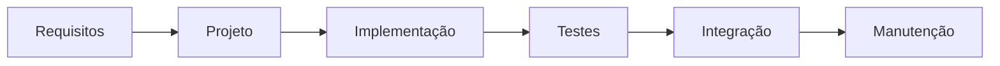

# Waterfall Model - Software Development Life Cycle (SDLC)

The Waterfall Model is a linear and sequential approach to software development. It is one of the earliest methodologies used in the Software Development Life Cycle (SDLC). In this model, each phase must be completed before the next phase begins, and there is no overlap between the phases.

1. **Requirements**: In this phase, all possible requirements of the system to be developed are gathered and documented. This phase is crucial as it sets the foundation for the entire project.

2. **Project**: In the design phase, the system and software design is prepared from the requirements gathered in the previous phase. This helps in specifying hardware and system requirements and also helps in defining the overall system architecture.

3. **Implementation**: With inputs from the system design, the system is first developed in small programs called units, which are integrated in the next phase. Each unit is developed and tested for its functionality, which is referred to as Unit Testing.

4. **Testing**: After the software is developed, it is tested against the requirements to ensure that the product is actually solving the needs addressed and gathered during the requirements phase. During this phase, unit testing, integration testing, system testing, and acceptance testing are done.

5. **Integration**: In this phase, the individual software modules are combined and tested as a group. This phase ensures that the integrated system functions correctly and meets the specified requirements.

6. **Maintenance**: Once the system is deployed and customers start using it, real issues come up and need to be solved from time to time. This process where care is taken for the developed product is known as maintenance.

# When this model is applicable?

- The requirements are very well documented, clear, and fixed.
- The product definition is stable, with no changes expected throughout the process.
- Technology is well understood and is not dynamic.
- There's no ambiguity in requirements; everything is precisely defined.
- Ample resources with the necessary knowledge are available to support the product.
- The project is small and can be completed in a short time frame.
- The client is not actively involved in the development process and does not require frequent feedback.

# Advantages of the Waterfall Model

- Simple and easy to understand and use.
- Easy to manage due to its linear nature.
- Each phase has specific deliverables.

# Disadvantages of the Waterfall Model

- Usable software is not produced until late during the life cycle.
- High amounts of risk and uncertainty.
- Not a good model for complex and object-oriented projects.
- Poor model for long and ongoing projects.
- Not suitable for projects where requirements are at a moderate to high risk of changing.
- Difficult to measure progress within stages.
- Changes in requirements during the life cycle can have a disastrous effect on the project.
- Integration is done at the very end, which doesn't allow for early detection of certain types of issues.
- Not suitable for projects where requirements are not well understood or are expected to change frequently.

As you can see, the Waterfall Model has few advantages and many disadvantages.

# Some variants of the Waterfall Model

- RUP (Rational Unified Process)
- V-Model (Verification and Validation Model)
- Sashimi (Waterfall with overlapping phases)
- Incremental Waterfall Model (determination of potential risks at early stage)
- Spiral Model (combines iterative development with the Waterfall Model)