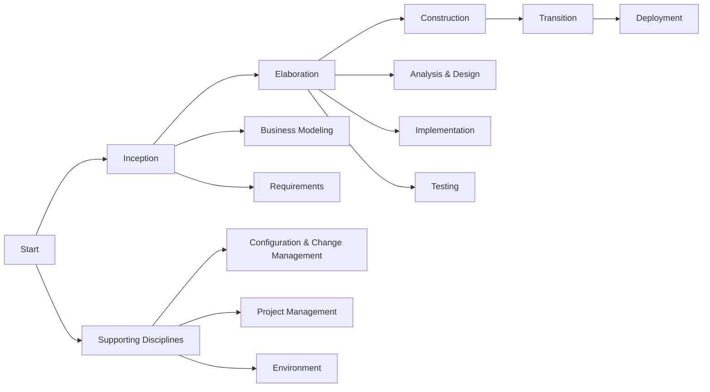

# RUP - Rational Unified Process

The Rational Unified Process (RUP) is a software development process framework that provides a disciplined approach to assigning tasks and responsibilities within a development organization. Its goal is to ensure the production of high-quality software that meets the needs of its end users within a predictable schedule and budget.

# Interative incremental development

Interactive development  means that the software is developed in small, manageable segments or iterations. Each iteration results in a working version of the software that can be evaluated and improved upon in subsequent iterations. At the end of each iteration, we have a working product that can be tested and reviewed, allowing for early detection of issues and continuous improvement.

Components can be adjusted and refined based on feedback from stakeholders, ensuring that the final product aligns with user requirements and expectations. This iterative approach also allows for flexibility in responding to changing requirements, as new features or modifications can be incorporated into future iterations.

# Architecture-centric approach

RUP emphasizes the importance of a well-defined architecture as the foundation for the software system. The architecture serves as a blueprint that guides the development process, ensuring that the system is scalable, maintainable, and meets performance requirements. By focusing on architecture early in the development lifecycle, RUP helps to identify potential risks and design flaws before they become costly issues.

The architecture-centric approach also promotes consistency and standardization across the system, as developers adhere to established architectural principles and patterns. This leads to a more cohesive and robust software product that can evolve over time without significant rework.

# Component-based development

RUP promotes the use of component-based development, where the software system is built from reusable components or modules. This approach encourages modularity, allowing developers to create self-contained units of functionality that can be easily integrated into the overall system. Component-based development enhances maintainability, as individual components can be updated or replaced without affecting the entire system.

The use of reusable components also accelerates development, as developers can leverage existing solutions rather than building everything from scratch. This leads to increased productivity and reduced time-to-market for software products.

---

# The Rational Unified Process Lifecycle

There are four phases in the RUP lifecycle, each with its own objectives and deliverables:

1. **Inception Phase**: The primary goal of this phase is to establish the project's scope, objectives, and feasibility. Key activities include defining the business case, identifying stakeholders, and creating an initial project plan. Deliverables may include a vision document, risk assessment, and initial use cases. Also, the inception phase helps to secure funding and resources for the project, ensuring that the project is viable and aligned with organizational goals.

2. **Elaboration Phase**: The focus of this phase is on refining the project's requirements and architecture. Key activities include detailed requirements analysis, architectural design, and risk mitigation planning. Deliverables may include a refined project plan, updated use cases, and a prototype or proof-of-concept. The elaboration phase helps to ensure that the project is technically feasible and that the architecture can support the desired functionality.

3. **Construction/Implementation Phase**: This phase involves the actual development and implementation of the software system. Key activities include coding, unit testing, integration testing, and documentation. Deliverables may include completed software components, test results, and user manuals. The construction phase focuses on building a working product that meets the specified requirements and is ready for deployment. This phase is used to be the longest phase of the RUP lifecycle, as it involves the bulk of the development work. It is important to maintain a focus on quality and adhere to best practices during this phase to ensure that the final product is robust and reliable.

4. **Transition Phase**: The final phase of the RUP lifecycle is focused on deploying the software system to end users and ensuring that it meets their needs. Key activities include user training, system deployment, and post-deployment support. Deliverables may include a deployed software system, user feedback, and maintenance plans. The transition phase helps to ensure that the software is successfully adopted by users and that any issues or concerns are addressed promptly. It also provides an opportunity for continuous improvement based on user feedback and lessons learned from the deployment process.

---

# RUP Process Dimensions

Across the RUP lifecycle, there are several process dimensions that guide the development process and ensure that all aspects of the project are addressed. These dimensions include:

1. **Business Modeling**: This dimension focuses on understanding the business context and objectives of the project. It involves analyzing business processes, identifying stakeholders, and defining business requirements. Business modeling helps to ensure that the software system aligns with organizational goals and delivers value to end users.

2. **Requirements**: This dimension involves eliciting, analyzing, and documenting the functional and non-functional requirements of the software system. It includes creating use cases, user stories, and requirements specifications. The requirements dimension helps to ensure that the software meets user needs and expectations.

3. **Analysis and Design**: This dimension focuses on creating a detailed design of the software system based on the requirements. It involves defining the system architecture, designing components and interfaces, and creating design models. The analysis and design dimension helps to ensure that the software is well-structured, maintainable, and scalable.

4. **Implementation**: This dimension involves the actual coding and development of the software system. It includes writing code, performing unit tests, and integrating components. The implementation dimension helps to ensure that the software is built according to the design specifications and meets quality standards.

5. **Testing**: This dimension focuses on verifying and validating the software system to ensure that it meets the specified requirements. It includes creating test plans, executing test cases, and reporting defects. The testing dimension helps to ensure that the software is reliable, functional, and free of critical issues.

6. **Deployment**: This dimension involves the process of delivering the software system to end users and ensuring that it is properly installed, configured, and operational. It includes activities such as user training, system deployment, and post-deployment support. The deployment dimension helps to ensure that the software is successfully adopted by users and that any issues or concerns are addressed promptly.

## Supporting Disciplines

1. **Configuration and Change Management**: This discipline focuses on managing changes to the software system and its associated artifacts. It includes version control, change tracking, and configuration management processes. Configuration and change management helps to ensure that changes are properly documented, controlled, and communicated to stakeholders.

2. **Project Management**: This discipline involves planning, organizing, and controlling the project to ensure that it is completed on time, within budget, and meets quality standards. It includes activities such as project planning, resource allocation, risk management, and progress monitoring. Project management helps to ensure that the project is well-coordinated and that stakeholders are informed of progress and issues.

3. **Environment**: This discipline focuses on providing the necessary tools, infrastructure, and support for the development team. It includes activities such as setting up development environments, providing access to tools and resources, and ensuring that the team has the necessary skills and knowledge. The environment discipline helps to ensure that the development team can work efficiently and effectively.

# Conclusion

The Rational Unified Process (RUP) provides a structured and disciplined approach to software development, emphasizing iterative and incremental development, architecture-centric design, and component-based development. By following the RUP lifecycle and addressing the various process dimensions, development teams can produce high-quality software that meets user needs while managing risks and ensuring project success. The supporting disciplines further enhance the development process by providing essential tools, processes, and management practices that contribute to the overall effectiveness of the RUP framework.

This comprehensive approach allows organizations to adapt to changing requirements, improve collaboration among stakeholders, and deliver software products that are robust, maintainable, and aligned with business objectives.