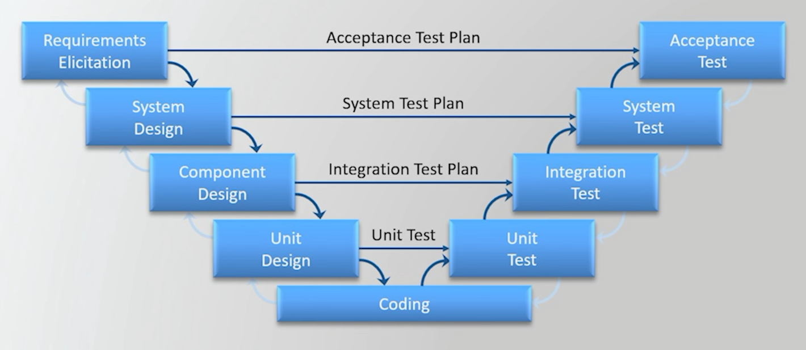

# V-Model

The V-Model, also known as the Verification and Validation Model, is an extension of the Waterfall Model. It emphasizes the importance of validation and verification in the software development process. The V-Model is called so because of its V-shaped structure, which represents the relationship between each phase of development and its corresponding testing phase.

- **Requirements Elicitation**: This phase involves gathering and documenting the requirements from stakeholders. It is crucial to understand what the users need and expect from the system. In this phase, requirements are defined in detail, and any ambiguities are clarified. It is a discovery phase where the focus is on understanding the problem domain and the needs of the users. The only real requirement in this phase is to ensure that the requirements are clear, complete, and testable.

    - **Acceptance Testing**: This phase involves testing the system against the requirements gathered in the previous phase. It ensures that the system meets the user's needs and expectations. Acceptance testing is typically performed by the end-users or stakeholders to validate that the system behaves as expected in real-world scenarios.

- **System Design**: In this phase, the system architecture and design are created based on the requirements gathered. It involves defining the overall structure of the system, including its components, modules, and their interactions. The design should be detailed enough to guide the implementation phase and ensure that all requirements are addressed.

    - **System Testing**: This phase involves testing the entire system as a whole to ensure that it meets the specified requirements. System testing verifies that all components work together correctly and that the system behaves as expected in various scenarios. It includes functional testing, performance testing, security testing, and other types of testing to validate the system's overall functionality.

- **Component Design**: This phase focuses on designing the individual components or modules of the system. It involves breaking down the system into smaller, manageable parts and defining their functionality, interfaces, and interactions. The component design should ensure that each module can be developed and tested independently while still contributing to the overall system.

    - **Integration Testing**: This phase involves testing the interactions between different components or modules of the system. It ensures that the integrated components work together as expected and that data flows correctly between them. Integration testing can be performed incrementally, where components are tested in pairs or groups, or as a whole, where the entire system is tested after all components are integrated.

- **Unit Design**: This phase involves designing the individual units or classes of the system. It focuses on defining the internal structure and behavior of each unit, including its methods, attributes, and relationships with other units. The unit design should ensure that each unit can be implemented and tested independently while still contributing to the overall system.

    - **Unit Testing**: This phase involves testing individual units or classes of the system to ensure that they function correctly in isolation. Unit testing verifies that each unit behaves as expected according to its design specifications. It is typically performed by developers using automated testing frameworks to validate the correctness of the code.

- **Coding**: This phase involves the actual implementation of the system based on the designs created in the previous phases. Developers write code to create the components, modules, and units of the system, following best practices and coding standards. The coding phase is where the system starts to take shape and become a functional product.

---

---

