# Data Structures

- **Arrays**: A collection of elements identified by index or key.
- **Linked Lists**: A linear collection of elements, where each element points to the next.
- **HashMaps**: A collection of key-value pairs with efficient lookups.
- **Stacks & Queues**: Abstract data types for managing collections of elements.
- **Trees**: Hierarchical data structures with a root and child nodes.
- **Graphs**: Collections of nodes connected by edges.

---
---

# Search Algorithms

## Linear Search

A simple search algorithm that checks each element in a list sequentially until the target value is found or the list ends. It has a time complexity of O(n).

LS Usage: Searching for an element in an unsorted list, finding a specific value in a small dataset, and when the dataset is not sorted.

```python
def linear_search(arr, target):
    for i in range(len(arr)):
        if arr[i] == target:
            return i  # Return the index if found
    return -1  # Return -1 if not found
```

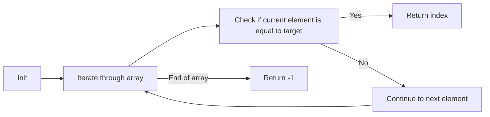

---
---

## Binary Search

A search algorithm that finds the position of a target value within a sorted array. It works by repeatedly dividing the search interval in half.

BS Usage: Searching in a sorted array, finding elements in a database, and solving problems that can be divided into smaller subproblems.

Time Complexity: `O(log n)`, where `n` is the number of elements in the array. This is because with each iteration, the search space is halved.

For example, we have to find the number `348` in a sorted array of numbers. If the array have 1.000.000 elements, we can find the number in at most 20 iterations (log2(1.000.000) = 20).

So let's find our number `348` in the following array containing 100 random numbers:

```python
arr =
    [847, 392, 15, 678, 921, 304, 56, 732, 489, 210,
    873, 641, 98, 502, 777, 325, 19, 864, 433, 120,
    951, 287, 63, 715, 842, 276, 509, 333, 41, 690,
    812, 147, 934, 228, 574, 360, 83, 629, 755, 248,
    901, 312, 72, 688, 459, 137, 823, 294, 605, 178,
    999, 241, 87, 536, 413, 269, 781, 356, 142, 627,
    954, 382, 66, 745, 820, 215, 497, 301, 109, 672,
    888, 254, 47, 598, 439, 183, 729, 365, 134, 610,
    972, 283, 92, 541, 417, 236, 763, 348, 126, 654,
    915, 278, 59, 703, 482, 199, 846, 321, 113, 570]
```

If we try to find the number `348` using **Linear Search**, we would have to check each element one by one until we find it. In the worst case, this would take `O(n)` time complexity, where `n` is the number of elements in the array. Now, imagine if the list had 1.000.000 elements.

Let's apply **Binary Search** to find the number `348`. First, we need to sort the array, because Binary Search only works on sorted arrays. We can use a simple sorting algorithm like Bubble Sort to sort the array:

```python
# bubble sort algorithm
def bubble_sort(arr):
    n = len(arr) 
    for i in range(n):
        for j in range(0, n-i-1):
            if arr[j] > arr[j+1]:
                arr[j], arr[j+1] = arr[j+1], arr[j]
    return arr
```
- traverse through all array elements by repeatedly swapping the adjacent elements if they are in the wrong order, using two nested loops (i for the number of elements in the array and j for the number of comparisons needed for each pass) and then return the sorted array.

Now, the sorted array looks like this:

```python
arr =
    [15, 19, 41, 47, 56, 59, 63, 66, 72, 83,
    87, 92, 98, 109, 113, 120, 126, 134, 137, 142,
    147, 178, 183, 199, 210, 215, 228, 236, 241, 248,
    254, 269, 276, 278, 283, 287, 294, 301, 304, 312,
    321, 325, 333, 348, 356, 360, 365, 382, 392, 413,
    417, 439, 459, 482, 489, 497, 502, 509, 536, 541,
    570, 574, 598, 605, 610, 627, 629, 641, 654, 672,
    678, 688, 690, 703, 715, 729, 732, 745, 755, 763,
    777, 781, 812, 820, 823, 842, 846, 847, 864, 873,
    888, 901, 915, 921, 934, 951, 954, 972, 999]
```

Now we can implement the Binary Search algorithm to find the number `348` in the sorted array:

```python
def binary_search(arr, target):
    left, right = 0, len(arr) - 1
    while left <= right:
        mid = left + (right - left) // 2
        if arr[mid] == target:
            return target  # Return the target if found
        elif arr[mid] < target:
            left = mid + 1  # Search in the right half
        else:
            right = mid - 1  # Search in the left half
    return "Target not found"
```
- The function takes a sorted array and a target value as input. It initializes two pointers, `left` and `right`, to the start and end of the array, respectively. Then enters a loop that continues until the `left` pointer is less than or equal to the `right` pointer. Inside the loop, it calculates the middle index and compares the middle element with the target.

If the middle element is equal to the target, it returns the index. If the middle element is less than the target, it moves the `left` pointer to the right half of the array. If the middle element is greater than the target, it moves the `right` pointer to the left half of the array. If the target is not found, it returns `"Target not found"`.

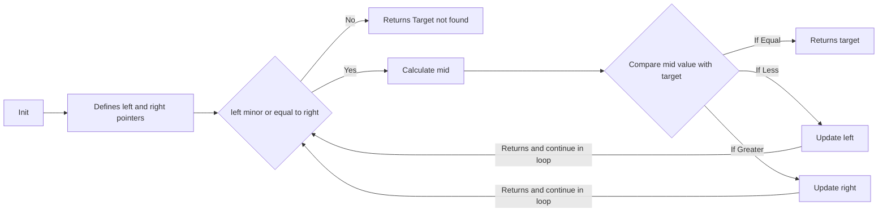

---
---

## Depth-First Search (DFS)

The idea of DFS is to explore as far as possible along each branch before backtracking. It uses a stack data structure, either explicitly or through recursion.

For this, we create a "visited" set to keep track of the nodes that have already been explored. This prevents the algorithm from revisiting nodes and getting stuck in infinite loops.

When a branch is fully explored, the algorithm backtracks to the previous node and explores the next branch. This process continues until all nodes have been visited.

DFS usage: Searching for a specific node, finding connected components, topological sorting, and solving puzzles or mazes.

Time Complexity: `O(V + E)`, where `V` is the number of vertices and `E` is the number of edges in the graph.

```python
def dfs(graph, start, visited=None):
    if visited is None:
        visited = set()
    visited.add(start)
    for neighbor in graph[start]:
        if neighbor not in visited:
            dfs(graph, neighbor, visited)
    return visited
```

**Data Structure**:
graph is a dictionary (adjacency list), where each key is a node and the value is the list of neighbors.
visited is a set, ensuring that there are no repeated visited nodes.

**Recursion**:
The stack of recursive calls functions as the explicit stack of DFS.
Each time it encounters an unvisited neighbor, it calls dfs again.

**Implicit Backtracking**:
When a branch ends (no more unvisited neighbors), the function returns and continues exploring the other neighbors of the previous level.

Let's visualize the DFS algorithm using a simple graph:

- Algorithm starts at node 1, visits node 2, then node 3, and continues down the leftmost path until it reaches a leaf node. It then backtracks to explore other branches.

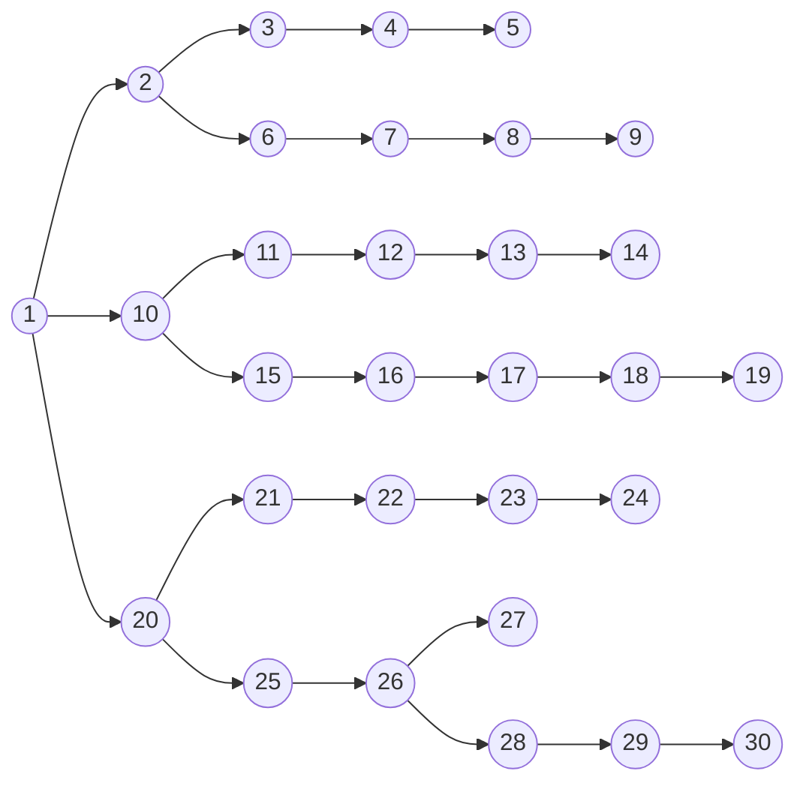

---

## Breadth-First Search (BFS)

The idea of BFS is to explore all the neighbors of a node before moving on to the next level. It uses a queue data structure to keep track of the nodes to be explored.

For example, if we have a graph and we want to find the shortest path from node A to node B, BFS will explore all the neighbors of A first, then all the neighbors of those neighbors, and so on, until it finds B.

We have to keep track of the nodes that have already been visited to avoid revisiting them and getting stuck in infinite loops. This is done using a "visited" set. Also, we have to keep track of the nodes that are close to the actual node, so we can explore them in the next iteration. This is done using a queue.

BFS usage: Finding the shortest path in an unweighted graph, level-order traversal of a tree, and solving puzzles or mazes.

Time Complexity: `O(V + E)`, where `V` is the number of vertices and `E` is the number of edges in the graph.

```python
def bfs(graph, start):
    visited = set()  # Set to keep track of visited nodes
    queue = [start]  # Initialize the queue with the starting node

    while queue:
        current_node = queue.pop(0)  # Dequeue a node from the front of the queue
        if current_node not in visited:
            visited.add(current_node)  # Mark the node as visited
            queue.extend(neighbor for neighbor in graph[current_node] if neighbor not in visited)  # Enqueue unvisited neighbors

    return visited
```

In BFS, the numeration is done level by level: first the direct children of the initial node (2, 10, 20), then the children of those nodes (3, 6, 11, 15, 21, 25), and so on.

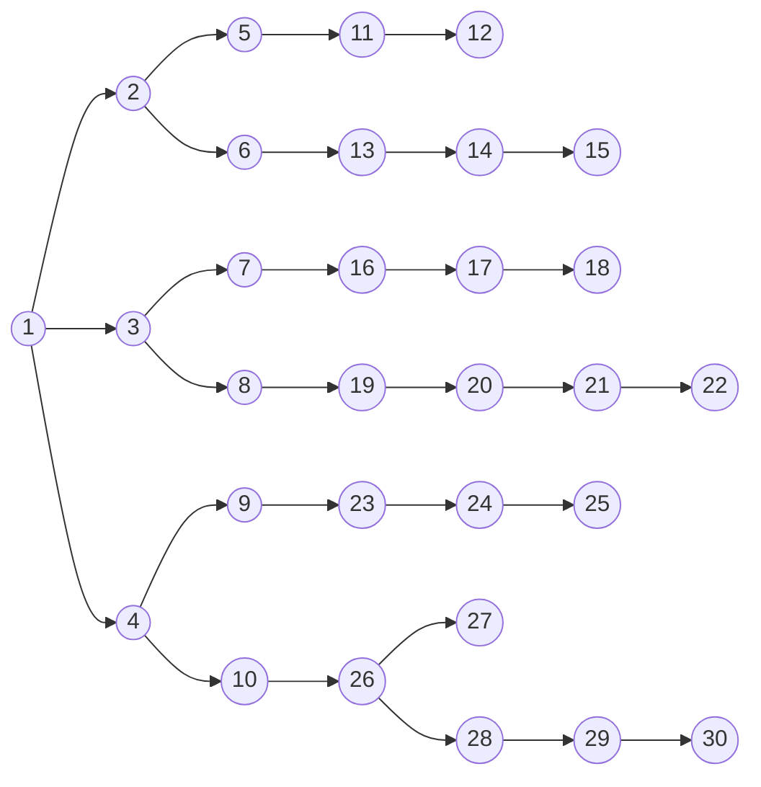

---

# Sorting Algorithms

Sorting algorithms are methods for rearranging a list of elements into a specific order, typically ascending or descending. For example, we can sort a list of numbers in ascending order using the Bubble Sort algorithm.

They are especially useful for searching algorithms, as some of them require sorted data to function correctly. For example, Binary Search requires the input array to be sorted, while Linear Search does not have this requirement. Sorting algorithms can also be used to improve the efficiency of other algorithms, such as finding the median or mode of a dataset.

## Insertion Sort

Insertion Sort is a simple sorting algorithm that builds the final sorted array one item at a time. It is much less efficient on large lists than more advanced algorithms such as quicksort, heapsort, or merge sort. However, it has the advantage of being simple to implement and efficient for small data sets or nearly sorted data.

Time Complexity: O(n^2) in the average and worst case, and O(n) in the best case (when the array is already sorted).

Example of Insertion Sort in Python:

```python
def insertion_sort(arr):
    for i in range(1, len(arr)):
        key = arr[i]
        j = i - 1
        while j >= 0 and key < arr[j]:
            arr[j + 1] = arr[j]
            j -= 1
        arr[j + 1] = key
    return arr
```

Initial state of the array:

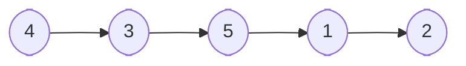

First iteration: insert the 3 before the 4

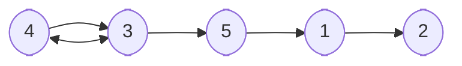
After
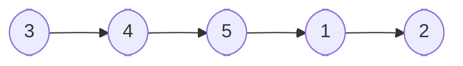
Second iteration: insert the 5 after the 4 (Already in the right place)

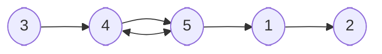
Third iteration:
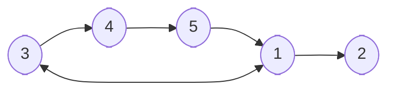
After:
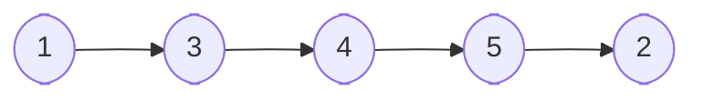
Fourth iteration:
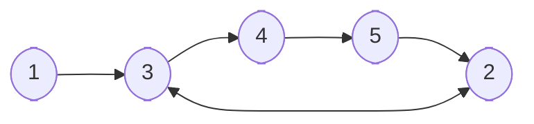
After:
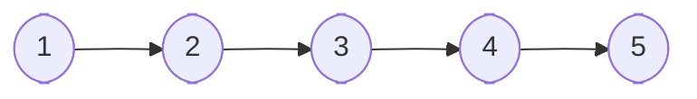

The algorithm knows the right place for the numbers by comparing the current number with the previous numbers in the sorted part of the array. It keeps moving the current number to the left until it finds a number that is smaller than or equal to it, and then it inserts the current number in that position. This process is repeated for each number in the array until the entire array is sorted.

---

## Merge Sort

Merge Sort is a `divide-and-conquer` algorithm that divides the input array into two halves, recursively sorts them, and then merges the sorted halves back together. It is more efficient than simple sorting algorithms like Insertion Sort or Bubble Sort, especially for large datasets.

Basicly, the algorithm works as follows:
1. If the array has one or zero elements, it is already sorted.
2. Otherwise, divide the array into two halves.
3. Recursively sort each half.
4. Merge the two sorted halves back together.

Merge Sort splits the array into halves until it reaches arrays of size one, which are inherently sorted. Then, it merges these small sorted arrays back together in a way that results in a larger sorted array.

Time Complexity: O(n log n) in all cases (best, average, and worst), where `n` is the number of elements in the array. This is because the array is divided into halves (log n divisions) and each level of division requires linear time to merge the arrays back together.

```python
def merge_sort(arr):
    if len(arr) <= 1:
        return arr

    mid = len(arr) // 2
    left_half = merge_sort(arr[:mid])
    right_half = merge_sort(arr[mid:])

    return merge(left_half, right_half)

def merge(left, right):
    merged = []
    i, j = 0, 0
    while i < len(left) and j < len(right):
        if left[i] < right[j]:
            merged.append(left[i])
            i += 1
        else:
            merged.append(right[j])
            j += 1
    merged.extend(left[i:])
    merged.extend(right[j:])
    return merged
```

Inital State of the array

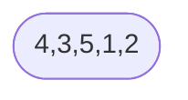

Dividing into two halves

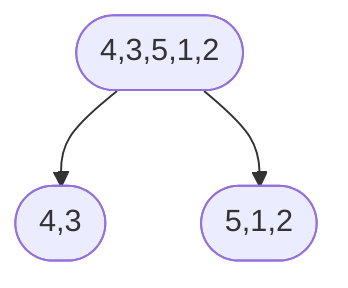

Recursive division

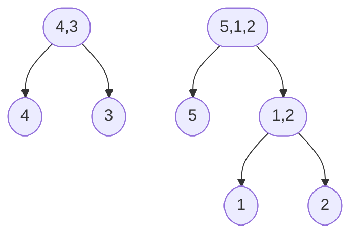

Merging the smaller halves
Before merging

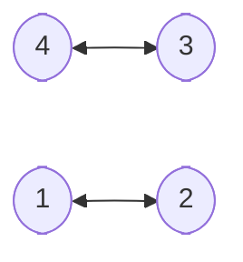

After merging

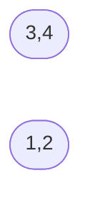
Merging with the remaining element

Before merging

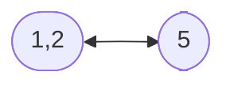

After merging

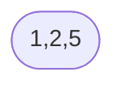

Final merge
Before merging

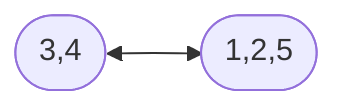

Final result

```mermaid
graph LR
    M([1,2,3,4,5])
```

The algorithm works by recursively dividing the array into smaller sub-arrays until it reaches arrays of size one, which are inherently sorted. Then, it merges these small sorted arrays back together in a way that results in a larger sorted array. The merging process involves comparing the elements of the two sub-arrays and placing them in the correct order in the merged array.

---

## Quick Sort

Quick Sort is another recursive `divide-and-conquer` algorithm that works by selecting a "pivot" element from the array and partitioning the other elements into two sub-arrays according to whether they are less than or greater than the pivot. The sub-arrays are then sorted recursively.

Pivot is an element from the array that is used to partition the other elements into two sub-arrays. The choice of pivot can affect the performance of the algorithm. Common strategies for choosing a pivot include selecting the first element, the last element, the middle element, or a random element.

If the pivot is chosen wisely, Quick Sort can be very efficient. However, if the pivot is chosen poorly (e.g., always choosing the first or last element in a sorted array), it can degrade to O(n^2) time complexity.

Time complexity: O(n log n) on average, but O(n^2) in the worst case (e.g., when the smallest or largest element is always chosen as the pivot).

```python
def quick_sort(arr):
    if len(arr) <= 1:
        return arr

    pivot = arr[len(arr) // 2]
    left = [x for x in arr if x < pivot]
    middle = [x for x in arr if x == pivot]
    right = [x for x in arr if x > pivot]
    
    return quick_sort(left) + middle + quick_sort(right)
```

Initial State of the array

```mermaid
graph LR
    A([4,3,5,1,2])
```

Pivot selection (choosing the middle element, which is 5)

```mermaid
graph TD
    A([4,3,5,1,2]) --> B([4,3])
    A --> C([5])
    A --> D([1,2])
```

Now we have three sub-arrays: [4,3], [5], and [1,2]. We will recursively apply Quick Sort to the left and right sub-arrays.

```mermaid
graph TD
    B([4,3]) --> E([4])
    B --> F([3])
    D([1,2]) --> G([1])
    D --> H([2])
```

Now we have four sub-arrays: [4], [3], [1], and [2]. Since these sub-arrays have one element each, they are already sorted. We can now merge them back together.

```mermaid
graph LR
    E([4]) --> I([3,4])
    G([1]) --> J([1,2])
```

Finally, we merge the sorted sub-arrays [3,4], [5], and [1,2] back together to get the final sorted array.

```mermaid
graph TD
    J([3,4]) --> K([1,2,3,4,5])
    C([5]) --> K([1,2,3,4,5])
    J2([1,2]) --> K([1,2,3,4,5])
```
Once all the sub-arrays are merged, we have the final sorted array:

```mermaid
graph LR
    K([1,2,3,4,5])
```

The algorithm works by recursively partitioning the array into smaller sub-arrays based on the pivot element. The elements less than the pivot are placed in the left sub-array, and the elements greater than the pivot are placed in the right sub-array. This process continues until all sub-arrays have one or zero elements, at which point they are inherently sorted. Finally, the sorted sub-arrays are merged back together to form the final sorted array.

---

## Greedy

Greedy algorithms are a class of algorithms that make locally optimal choices at each step with the hope of finding a global optimum. They are often used for optimization problems where the goal is to find the best solution among many possible solutions.

For example, consider the problem of making change for a given amount of money using the fewest number of coins. A greedy algorithm would always choose the largest denomination coin that is less than or equal to the remaining amount, and repeat this process until the amount is reduced to zero.

Not efficient for all problems, as it may not always lead to the optimal solution. However, for certain problems, greedy algorithms can provide efficient and effective solutions.

Time Complexity: O(n log n) for problems that require sorting, and O(n) for problems that can be solved in a single pass.

```python
def greedy_change(coins, amount):
    coins.sort(reverse=True)
    change = []
    for coin in coins:
        while amount >= coin:
            amount -= coin
            change.append(coin)
    return change
```

Each edge in the graph has a weight associated with it, which represents the cost of traversing that edge. The algorithm starts at the initial node and explores all possible paths to the destination node, keeping track of the total cost of each path. It always chooses the path with the lowest total cost at each step, and continues this process until it reaches the destination node.

```mermaid
graph LR
    Start((Start)) -->|7| A((A))
    Start -->|8| B((B))
    Start -->|6| X((X))

    A -->|9| C((C))
    C -->|10| End1((End = $26))

    B -->|-5| D((D))
    D -->|12| End2((End = $15))

    X -->|4| Y((Y))
    Y -->|20| End3((End = $30))

    A -->|2| Z((Z))
    Z -->|25| End4((End = $34))
```

So, the algorithm will choose the path Start -> B -> D -> End2, which has a total cost of $15, as it is the lowest cost path to the destination node.

---

# Logarithmic Time Complexity

To visualize the different time complexities, we can create a graph that shows how the input size `n` affects the time taken by different algorithms. The graph below illustrates in order of increasing time complexity: O(1), O(log n), O(n), O(n log n), O(n^2), O(2^n), and O(n!). The further to the right, the more time it takes to complete as the input size increases.

```mermaid
graph TD
    Start((Input Size n))
    Start --> Const[O of 1]
    Start --> Log[O of log n]
    Start --> Lin[O of n]
    Start --> NlogN[O of n log n]
    Start --> Quad[O of n^2]
    Start --> Exp[O of 2^n]
    Start --> Fact[O of n!]
```