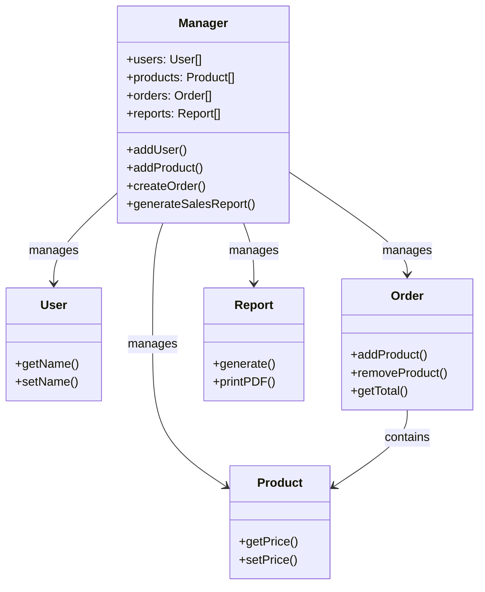

# Python OOP - Object Oriented Programming

Vamos começar com uma analogia para entender o conceito de programação orientada a objetos:

Imagine que você é dono de um restaurante. Você atende os clientes, limpa as mesas, cozinha, serve a comida e cuida de tudo. Isso funciona bem quando você é o único dono e o único funcionário. Mas, à medida que o restaurante cresce, você precisa contratar mais pessoas para ajudá-lo. Você contrata um cozinheiro, um garçom e um gerente. Cada um tem suas próprias responsabilidades e funções. O cozinheiro cozinha a comida, o garçom serve os clientes e o gerente supervisiona tudo.

No entanto, todos ainda trabalham juntos para garantir que o restaurante funcione sem problemas. Cada pessoa tem seu próprio conjunto de habilidades e responsabilidades, mas todos estão trabalhando em direção a um objetivo comum: fornecer uma ótima experiência para os clientes.

Isso é semelhante à programação orientada a objetos (OOP). Em OOP, você cria "objetos" que representam entidades do mundo real, como clientes, funcionários e mesas. Cada objeto tem suas próprias propriedades (atributos) e comportamentos (métodos). Por exemplo, um objeto "Cozinheiro" pode ter propriedades como "nome" e "especialidade", e métodos como "cozinhar()" e "limpar()".



---

Vamos pegar o "garçom" como exemplo para entender melhor.
Para entender o conceito, nós fazemos duas perguntas simples:
- O que o garçom tem? (atributos)
- O que o garçom faz? (métodos)

Ele tem (Atributos):

```python
is_holding_plate = True
tables_responsible = [4, 5, 6]
```

Ele faz (Métodos):

```python
def take_order(table, order):
    # código para pegar o pedido da mesa
    pass

def take_payment(table, amount):
    # código para processar o pagamento da mesa
    pass
```

Essas duas perguntas são a base da programação orientada a objetos. O que o garçom tem são os *atributos*, e o que ele faz são os *métodos*. Em OOP, você cria classes que representam entidades do mundo real, e essas classes têm atributos e métodos que definem seu comportamento.

Atributos são apenas variáveis que armazenam informações sobre o objeto. Por exemplo, o garçom tem atributos como "is_holding_plate" e "tables_responsible".

Métodos são funções que definem o comportamento do objeto. Por exemplo, o garçom tem métodos como "take_order" e "take_payment".

"take_order" não é algo que todo funcionário faz, mas sim algo que o garçom faz. Ele é um comportamento específico do garçom. Da mesma forma, "take_payment" é outro comportamento específico do garçom.

Mas é aqui que o OOP brilha. Nós não precisamos ter somente um garçom. Podemos ter vários garçons, cada um com seus próprios atributos e métodos. Por exemplo, podemos ter o Garçom1, Garçom2 e Garçom3, cada um com suas próprias mesas responsáveis e seu tipo de atendimento. Cada garçom é um objeto separado, mas todos compartilham a mesma **classe** "Garçom", que define seus atributos e métodos.

---

# Classes

Uma classe é um "blueprint" ou "molde" para criar objetos. Ela define os atributos e métodos que os objetos criados a partir dela terão. Por exemplo, podemos criar uma classe "Garçom" que define os atributos e métodos que todos os garçons terão.

Vamos começar do zero e criar essa classe "Waiter" em Python. A classe é como um molde que define o que um garçom tem e o que ele faz.

Em python, começamos definindo o "blueprint":

```python
class Waiter:
    pass
```

Até o momento, a classe Waiter não faz nada ainda, é apenas um molde.

Agora vamos criar um **objeto** a partir dessa classe:

```python
class Waiter:
    pass

raj = Waiter() 
samir = Waiter()
```

Mesmo molde, diferentes objetos. `raj` e `samir` são dois objetos diferentes, mas ambos são criados a partir da mesma classe Waiter.

Agora vamos adicionar um atributo à classe Waiter. Vamos adicionar um atributo chamado "tables", que será uma lista de mesas que o garçom é responsável:

```python
class Waiter:
    tables = []

raj = Waiter()
samir = Waiter()
```

Até agora, nenhum dos garçons tem as mesas atribuídas a eles. A lista "tables" está vazia para ambos os garçons.

Vamos atribuir mesas a cada garçom:

```python
class Waiter:
    tables = [] 

raj = Waiter()
samir = Waiter()

raj.tables = [1, 2, 3]
samir.tables = [4, 5, 6]
```

No momento em que escrevemos "raj.tables = [1, 2, 3]", estamos atribuindo mesas a raj. Agora raj é responsável pelas mesas 1, 2 e 3. Da mesma forma, samir é responsável pelas mesas 4, 5 e 6.

Se quisermos ver quais mesas cada garçom é responsável, podemos usar "print()" para exibir os valores das mesas atribuídas a cada garçom:

```python
print(raj.tables)  # Output: [1, 2, 3]
print(samir.tables)  # Output: [4, 5, 6]
```

Agora você pode estar se perguntando: "Preciso sempre atribuir cada mesa a cada garçom manualmente?" A resposta é não. Para isso , podemos usar o método `__init__()` para inicializar os atributos de cada objeto quando ele é criado. O método `__init__()` é chamado automaticamente quando um objeto é criado a partir de uma classe.

```python
class Waiter:
    def __init__(self):
        self.tables = []

raj = Waiter()
samir = Waiter()
```

Aqui é onde a magia acontece. O método `__init__()` é chamado automaticamente quando um objeto é criado a partir da classe Waiter. Dentro do método `__init__()`, estamos inicializando o atributo "tables" como uma lista vazia para cada garçom.

`self` é uma referência ao objeto atual. Quando usamos `self.tables`, estamos nos referindo à lista de mesas do objeto atual (raj ou samir). Isso nos permite acessar e modificar os atributos de cada objeto individualmente.

Cada objeto criado a partir da classe Waiter terá seu próprio atributo "tables", que é independente dos outros objetos. Isso significa que raj e samir terão suas próprias listas de mesas, e podemos atribuir mesas a cada garçom sem afetar o outro.

```python
class Waiter:
    def __init__(self):
        self.tables = []

raj = Waiter()
samir = Waiter()

raj.tables.append(4)
samir.tables.append(1)
```

Sem setup manual, sem repetição de código. Cada garçom tem sua própria lista de mesas, e podemos adicionar mesas a cada garçom usando o método `append()`.

Agora, vamos ensinar alguma coisa para o garçom. Até agora ele só tem mesas atribuídas a ele, mas não sabe fazer nada.

Vamos adicionar um método chamado "`take_order()`" à classe Waiter, que permitirá ao garçom pegar pedidos das mesas atribuídas a ele.

```python
class Waiter:
    def __init__(self):
        self.tables = []

    def take_order(self):
        print("Order taken")

raj = Waiter()
samir = Waiter()

raj.take_order()  # Output: Order taken
samir.take_order()  # Output: Order taken
```

Quando uma função (`def`) vive dentro de uma classe, ela é chamada de "método". Um método é uma função que pertence a um objeto. Ele define o comportamento do objeto e pode acessar e modificar os atributos do objeto. Ela parece uma função normal, a única diferença é o "`self`" no início da lista de parâmetros. O "self" é uma referência ao objeto atual, e é usado para acessar os atributos e métodos do objeto.

Quando escrevemos "raj.take_order()", estamos chamando o método "`take_order()`" do objeto raj. Isso faz com que o garçom (objeto raj) pegue um pedido. Da mesma forma, quando escrevemos "samir.take_order()", estamos chamando o método "`take_order()`" do objeto samir, fazendo com que o garçom (objeto samir) pegue um pedido. Ou seja: Mesmo método, diferentes objetos; isso é o que um "método" faz.

Agora vamos fazer um método para realmente fazer algo:

```python
class Waiter:
    def __init__(self):
        self.tables = []

    def take_order(self):
        print("Order taken")

    def add_table(self, table_number):
        self.tables.append(table_number)
```

O método "add_table()" permite que o garçom adicione mesas à sua lista de mesas responsáveis. Ele recebe um parâmetro chamado "table_number", que é o número da mesa a ser adicionada.

Se quisermos adicionar mesas a cada garçom, podemos fazer isso chamando o método "add_table()" para cada objeto:

```python
raj.add_table(4)
raj.add_table(5)
samir.add_table(1)
samir.add_table(2)
```

Se visualizarmos o que cada garçom tem, veremos que raj tem as mesas 4 e 5 atribuídas e samir tem as mesas 1 e 2:

```python
print(raj.tables)  # Output: [4, 5]
print(samir.tables)  # Output: [1, 2]
```

Mesma classe, diferentes objetos, diferentes atributos. Isso é o "self" em ação.

---

Vamos voltar ao restaurante por um momento. Nosso restaurante está crescendo, e agora temos vários funcionários, cada um com suas próprias responsabilidades.

Independente das suas funções, todos eles têm algo em comum: eles são todos "funcionários" (classes). Eles têm atributos e métodos que definem seu comportamento. Por exemplo, todos os funcionários têm um nome, um turno e uma função.

Vamos criar uma classe "Staff" que representa um único funcionário genérico. Ele terá atributos como "name" (nome) e "shift" (turno), e um método chamado "start_work()" que define quando ele começa a trabalhar.

```python
class Staff:
    def __init__(self, name, shift):
        self.name = name
        self.shift = shift

    def start_work(self):
        print(f"{self.name} started working on {self.shift} shift.")
```

Isso não é um garçom nem um cozinheiro, é um funcionário genérico. Ele tem um nome e um turno, e ele pode começar a trabalhar em algum turno.

Agora, vamos criar duas classes: "Waiter" e "Chef" que `herdam` da classe "Staff".
Isso significa que essas classes terão todos os atributos e métodos da classe "Staff", além de seus próprios atributos e métodos específicos.

```python
class Staff:
    def __init__(self, name, shift):
        self.name = name
        self.shift = shift

    def start_work(self):
        print(f"{self.name} started working on {self.shift} shift.")


class Waiter(Staff):
    def take_order(self):
        print(f"{self.name} took an order.")

class Chef(Staff):
    def cook_food(self):
        print(f"{self.name} is cooking food.")
```

Agora vamos criar os objetos:

```python
raj = Waiter("Raj", "morning")
samir = Chef("Samir", "night")
```

Repare que aqui escrevemos manualmente "Raj", "morning" e "Samir", "night" como parâmetros para os objetos. Isso é porque a classe Staff tem o método `__init__()` que recebe dois parâmetros: "name" e "shift". Isso é chamado de "construtor" (constructor). Ele é chamado automaticamente quando um objeto é criado a partir de uma classe. Ele inicializa os atributos do objeto com os valores fornecidos como parâmetros.

Todos os objetos criados a partir de uma classe, recebe acesso a todos os atributos e métodos da classe pai. Por isso não é necessário reescrever códigos, e sim reaproveitar o que já foi escrito. Isso é chamado de "herança" (Inheritance).

Vamos rodar o mesmo método "start_work()" para ambos os objetos, já que eles herdaram esse método da classe Staff:

```python
raj.start_work()  # Output: Raj started working on morning shift.
samir.start_work()  # Output: Samir started working on night shift.
```

Agora, de fato os funcionários precisam começar a trabalhar, mas cada um tem suas próprias responsabilidades. O garçom pega pedidos, enquanto o cozinheiro cozinha a comida. Vamos chamar os métodos específicos de cada objeto:

```python
raj.take_order()  # Output: Raj took an order.
samir.cook_food()  # Output: Samir is cooking food.
```

Eles compartilham dados e comportamentos, mas cada um tem suas próprias responsabilidades. Isso é o que a herança (Inheritance) nos permite fazer: criar classes que compartilham atributos e métodos, mas ainda assim têm suas próprias responsabilidades.

---

Agora você como dono, não quer dizer a cada funcionário o que ele deve fazer. Você quer que eles saibam o que fazer por conta própria. Você pode apenas dizer "Comecem a trabalhar!" e cada um sabe o que fazer. Isso é chamado de **`polimorfismo`** (Polymorphism).

Adicionamos um método (`def`) chamado "`work()`" na classe Staff e chamamos esse método para cada objeto.

```python
class Staff:
    def __init__(self, name, shift):
        self.name = name
        self.shift = shift

    def start_work(self):
        print(f"{self.name} started working on {self.shift} shift.")

    def work(self):
        print(f"{self.name} is working.")


class Waiter(Staff):
    def take_order(self):
        print(f"{self.name} took an order.")

    def work(self):
        print(f"{self.name} is taking orders.")

class Chef(Staff):
    def cook_food(self):
        print(f"{self.name} is cooking food.")

    def work(self):
        print(f"{self.name} is cooking food.")


raj = Waiter("Raj", "morning")
samir = Chef("Samir", "night")
```
Agora podemos chamar o método "work()" para cada objeto, e cada um sabe o que fazer por conta própria.
```python
raj.work()
samir.work()
```

---

Com tudo isso, imaginemos que o restaurante está crescendo ainda mais, precisamos ter certeza que as pessoas que trabalham lá tem experiência e são qualificadas para trabalhar. Para isso, podemos criar uma `classe abstrata`.

Para isso, em python podemos usar a lib `abc` (Abstract Base Classes).
```python
from abc import ABC, abstractmethod
```
Uma classe abstrata é uma classe que não pode ser instanciada, isto é, você não pode criar objetos a partir dela, ela serve como um "placeholder" para outras classes. Ela não explica como trabalhar, apenas define o que deve existir.

Por exemplo, podemos modificar a classe `Staff` para ser uma classe abstrata. A partir daqui, a classe Staff não pode mais ser instanciada, ou seja, você não pode criar objetos a partir dela, ela só existe para ser herdada por outras classes. 

Vamos adicionar a exigência de experiência para a classe Staff, assim, todos as classes que herdam da classe Staff devem ter experiência, caso contrário, não poderão ser instanciadas.

```python
from abc import ABC, abstractmethod

class Staff(ABC):
    def start_work(self):
        print(f"{self.name} started working on {self.shift} shift.")
    
    @abstractmethod
    def experience(self):
        pass
```

Agora, todos as classes que herdam da classe Staff devem implementar o método "experience()". Se não implementarem, elas não poderão ser instanciadas. Isso garante que todos os funcionários tenham experiência e sejam qualificados para trabalhar no restaurante.

Vamos adicionar "experiência" para o garçom:

```python
class Waiter(Staff):
    def take_order(self):
        print(f"{self.name} took an order.")

    def work(self):
        print(f"{self.name} is taking orders.")

    def experience(self):
        print(f"{self.name} 5 years serving customers.")

raj = Waiter()
```

Pronto, agora o garçom tem experiência e está qualificado para trabalhar no restaurante. Nosso código consegue fazer com que "Raj" comece a trabalhar, porque possui experiência, que agora é exigida pela classe abstrata Staff.

```python
raj.start_work()
```

E também pode pegar um pedido:

```python
raj.take_order()
```

Ele pode utilizar dos métodos herdados da classe Staff, como "start_work()", e também pode utilizar métodos específicos da classe Waiter, como "take_order()".

#### "Uma abstração é a regra que define o que deve existir. Ela define a interface, fala o que é preciso ter para fazer parte do sistema, é o contrato. Todas as classes que herdam da classe abstrata devem implementar os métodos abstratos exigidos por ela, caso contrário, não poderão ser instanciadas. Isso garante que todos os funcionários tenham experiência e sejam qualificados para trabalhar no restaurante."

---

Agora imagine um cenário: Raj é o garçom, ele acabou de anotar um pedido. Ele precisa passar esse pedido para o cozinheiro, Samir. Mas Raj não sabe cozinhar, e Samir não sabe pegar pedidos. Então, como eles podem se comunicar? A resposta é: através de uma `interface`.

Vamos definir rapidamente o chefe e o garçom:

```python
class Chef:
    def cook_food(self, dish):
        print(f"{self.name} is cooking {dish}.")

class Waiter:
    def __init__(self, name, chef):
        self.name = name
        self.chef = chef
    
    def take_order(self, dish):
        print(f"{self.name} took an order for {dish}.")
        self.chef.cook_food(dish)

samir = Chef()
raj = Waiter("Raj", samir)

raj.take_order("Pasta")
```

Repare que o garçom (Raj) não sabe cozinhar, mas ele sabe que o cozinheiro (Samir) sabe. Então, quando Raj pega um pedido, ele passa o pedido para Samir (como parâmetro), que cozinha a comida. Isso é uma `Composição` ou uma `Agregação`: Raj e Samir têm uma maneira de se comunicar, mesmo que eles não saibam como o outro faz seu trabalho.

Com OOP podemos criar sistemas complexos, com vários objetos interagindo entre si, cada um com suas próprias responsabilidades e comportamentos. Isso nos permite criar sistemas mais organizados, reutilizáveis e fáceis de manter.

Outra forma de comunicação entre objetos é através de uma `interface`. Uma interface é um contrato que define um conjunto de métodos que uma classe deve implementar. Ela não define como os métodos são implementados, apenas que eles devem existir. Isso permite que diferentes classes possam se comunicar entre si, mesmo que elas não saibam como o outro faz seu trabalho, assim como no exemplo do garçom e do cozinheiro.

```python
class OrderInterface(ABC):
    @abstractmethod
    def take_order(self, dish):
        pass

    @abstractmethod
    def cook_food(self, dish):
        pass
    
class Chef(OrderInterface):
    def cook_food(self, dish):
        print(f"{self.name} is cooking {dish}.")

class Waiter(OrderInterface):
    def __init__(self, name, chef):
        self.name = name
        self.chef = chef

    def take_order(self, dish):
        print(f"{self.name} took an order for {dish}.")
        self.chef.cook_food(dish)
    
samir = Chef()
raj = Waiter("Raj", samir)

raj.take_order("Pasta")
```

Aqui , a classe `OrderInterface` define os métodos que devem existir para que uma classe possa se comunicar com outra. A classe `Chef` implementa o método `cook_food()`, enquanto a classe `Waiter` implementa o método `take_order()`. Isso permite que Raj e Samir se comuniquem entre si, mesmo que eles não saibam como o outro faz seu trabalho.

---

## Os 4 pilares da programação orientada a objetos

- **Abstração**: É a regra que define o que deve existir. Ela define a interface, fala o que é preciso ter para fazer parte do sistema, é o contrato. Todas as classes que herdam da classe abstrata devem implementar os métodos abstratos exigidos por ela, caso contrário, não poderão ser instanciadas. Isso garante que todos os funcionários tenham experiência e sejam qualificados para trabalhar no restaurante.

- **Encapsulamento**: É a forma de proteger os dados e comportamentos de um objeto, escondendo-os do mundo exterior. Isso permite que os objetos sejam manipulados apenas através de seus métodos públicos, garantindo que eles sejam usados corretamente e evitando que sejam alterados de forma indevida, como por exemplo, um garçom não pode cozinhar, e um cozinheiro não pode pegar pedidos.

- **Herança**: É a capacidade de uma classe herdar atributos e métodos de outra classe. Isso permite que as classes compartilhem dados e comportamentos, evitando a repetição de código e facilitando a manutenção do sistema, como por exemplo, a classe "Waiter" e a classe "Chef" herdam da classe "Staff", que define os atributos e métodos comuns a todos os funcionários.

- **Polimorfismo**: É a capacidade de um objeto se comportar de diferentes formas, dependendo do contexto em que é usado. Isso permite que diferentes classes possam ser tratadas de forma uniforme, mesmo que elas tenham comportamentos diferentes, como por exemplo, o método "work()" é chamado para o garçom e para o cozinheiro, mas cada um sabe o que fazer por conta própria.