# ESCALABILIDADE VERTICAL (SCALE UP)

A escalabilidade vertical, ou "scale up", é o processo de aumentar a capacidade de um único servidor ou máquina para lidar com uma carga de trabalho maior. Isso pode ser feito adicionando mais recursos, como CPU, memória RAM, armazenamento ou largura de banda, ao servidor existente.

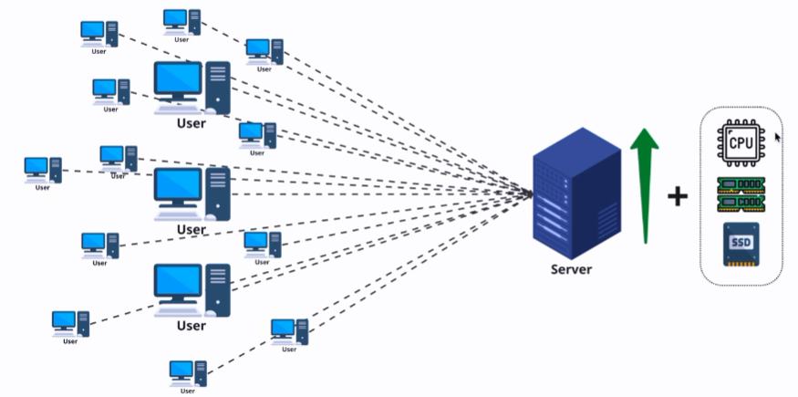

A escalabilidade vertical deve ser pensada antes de tudo como uma solução de curto prazo, pois há um limite físico para o quanto um servidor pode ser melhorado. Além disso, a escalabilidade vertical pode levar a um ponto de falha único, onde se o servidor falhar, todo o sistema pode ficar indisponível. Ou seja, embora seja uma solução mais simples e rápida de implementar, a escalabilidade vertical pode não ser a melhor opção para sistemas que exigem alta disponibilidade e resiliência, pois ficam com os recursos limitados a um único servidor.

---

## SPOF (Single Point of Failure)

Um ponto de falha único (SPOF) é um componente ou parte de um sistema que, se falhar, causará a falha de todo o sistema. Em um ambiente de escalabilidade vertical, o servidor é um ponto de falha único, pois se ele falhar, todo o sistema ficará indisponível.

---

Não faz sentido tentar escalar nada Horizontalmente sem antes ter escalado verticalmente. O ideal é sempre começar com a escalabilidade vertical, garantindo que o servidor tenha recursos suficientes para lidar com a carga de trabalho atual. Depois disso, se a demanda continuar a crescer, pode-se considerar a escalabilidade horizontal, que envolve adicionar mais servidores para distribuir a carga de trabalho.

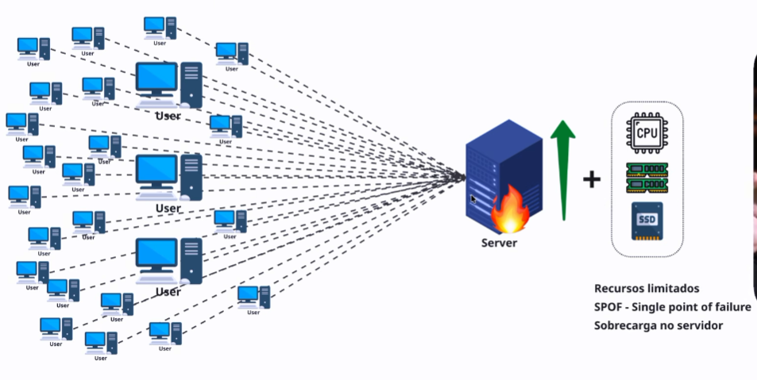

---

# ESCALABILIDADE HORIZONTAL (SCALE OUT)

A escalabilidade horizontal, ou "scale out", é o processo de adicionar mais servidores ou máquinas para lidar com uma carga de trabalho maior. Em vez de aumentar a capacidade de um único servidor, a escalabilidade horizontal distribui a carga de trabalho entre vários servidores, permitindo que o sistema lide com um volume maior de tráfego e dados.

A escalabilidade horizontal é uma solução mais robusta e resiliente, pois não depende de um único servidor para funcionar. Se um servidor falhar, os outros servidores podem continuar a operar, garantindo alta disponibilidade do sistema. Além disso, a escalabilidade horizontal permite que o sistema cresça de forma mais flexível, adicionando ou removendo servidores conforme necessário para atender à demanda.

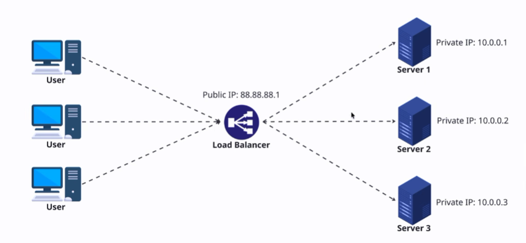

No entanto, a escalabilidade horizontal pode ser mais complexa de implementar e gerenciar, pois envolve a coordenação entre vários servidores e a distribuição da carga de trabalho. É necessário configurar um balanceador de carga (load balancer) para distribuir as solicitações entre os servidores de forma eficiente, garantindo que nenhum servidor fique sobrecarregado enquanto outros estão ociosos.

## Public IP vs Private IP

Em um ambiente de escalabilidade horizontal, é comum usar IPs privados para os servidores internos, enquanto o balanceador de carga pode ter um IP público para receber as solicitações dos clientes. Os servidores internos se comunicam entre si usando os IPs privados, enquanto o balanceador de carga distribui as solicitações para os servidores usando os IPs privados.

---

# Tipos de balanceadores de carga (Load Balancers)

Existem diferentes tipos de balanceadores de carga, cada um com suas próprias características e casos de uso. Alguns dos tipos mais comuns incluem:

- `HARDWARE`: Balanceadores de carga físicos, que são dispositivos dedicados projetados para distribuir o tráfego de rede entre vários servidores. Eles oferecem alto desempenho e confiabilidade, mas podem ser caros e difíceis de escalar.


---

- `SOFTWARE`: Balanceadores de carga baseados em software, que são aplicativos que podem ser executados em servidores comuns. Eles são mais flexíveis e fáceis de escalar, sendo superiores em termos de custo-benefício, mas podem ter desempenho inferior em comparação com os balanceadores de carga de hardware.

Abaixo estão alguns exemplos de balanceadores de carga de software populares:


- *NGINX*: Um servidor web e balanceador de carga de código aberto, conhecido por seu alto desempenho e capacidade de lidar com grandes volumes de tráfego. O NGINX pode ser configurado para distribuir solicitações entre vários servidores, garantindo alta disponibilidade e escalabilidade.

- *HAProxy*: Um balanceador de carga de código aberto, projetado para alta disponibilidade e desempenho. O HAProxy é amplamente utilizado em ambientes de produção e pode ser configurado para distribuir solicitações entre vários servidores, garantindo que nenhum servidor fique sobrecarregado.

- *Traefik*: Um balanceador de carga moderno e dinâmico, projetado para ambientes de microserviços e contêineres. O Traefik pode ser configurado para detectar automaticamente novos serviços e distribuir solicitações entre eles, facilitando a escalabilidade horizontal em ambientes de nuvem.

---

- `CLOUD`: Balanceadores de carga baseados em nuvem, que são fornecidos por provedores de serviços em nuvem, como AWS, Azure e Google Cloud. Eles oferecem escalabilidade automática, alta disponibilidade e integração com outros serviços em nuvem, tornando-os ideais para aplicativos modernos e distribuídos.

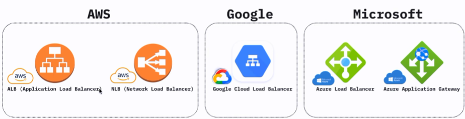

- *AWS ALB (Application Load Balancer)*: Um balanceador de carga gerenciado pela Amazon Web Services, projetado para distribuir tráfego de aplicativos entre várias instâncias EC2. O AWS ALB oferece recursos avançados, como roteamento baseado em conteúdo e suporte a protocolos modernos, como HTTP/2 e WebSocket.

- *AWS NLB (Network Load Balancer)*: Um balanceador de carga gerenciado pela Amazon Web Services, projetado para lidar com grandes volumes de tráfego de rede em nível de transporte. O AWS NLB oferece baixa latência e alta taxa de transferência, sendo ideal para aplicativos que exigem desempenho extremo.

- *GOOGLE CLOUD LB*: Um balanceador de carga gerenciado pelo Google Cloud, projetado para distribuir tráfego entre várias instâncias de VM. O Google Cloud LB oferece recursos avançados, como balanceamento de carga global e suporte a protocolos modernos, como HTTP/2 e QUIC.

- *AZURE LB*: Um balanceador de carga gerenciado pela Microsoft Azure, projetado para distribuir tráfego entre várias instâncias de VM. O Azure LB oferece recursos avançados, como balanceamento de carga interno e externo, suporte a protocolos modernos e integração com outros serviços do Azure.

- *AZURE APP GATEWAY*: Um balanceador de carga gerenciado pela Microsoft Azure, projetado para distribuir tráfego de aplicativos entre várias instâncias de VM. O Azure App Gateway oferece recursos avançados, como roteamento baseado em URL, suporte a protocolos modernos e integração com outros serviços do Azure.

---

## CAMADAS DE OPERAÇÃO - MODELO OSI (para contexto)

O modelo `OSI` *(Open Systems Interconnection)* é um modelo conceitual que descreve como os dados são transmitidos em uma rede de computadores. Ele é dividido em sete camadas, cada uma com funções específicas e protocolos associados. As camadas do modelo OSI são:

1. **Camada Física**: A camada física é responsável pela transmissão de bits brutos através de um meio físico, como cabos ou ondas de rádio. Ela define as características elétricas, mecânicas e funcionais do meio de transmissão.

2. **Camada de Enlace de Dados**: A camada de enlace de dados é responsável por estabelecer, manter e encerrar conexões entre dispositivos na mesma rede. Ela também é responsável por detectar e corrigir erros de transmissão.

3. **Camada de Rede**: A camada de rede é responsável por roteamento e endereçamento de pacotes de dados entre redes diferentes. Ela determina o caminho que os dados devem seguir para chegar ao destino.

4. **Camada de Transporte**: A camada de transporte é responsável por fornecer comunicação confiável entre os dispositivos finais. Ela garante que os dados sejam entregues corretamente e na ordem correta, e pode fornecer controle de fluxo e detecção de erros.

5. **Camada de Sessão**: A camada de sessão é responsável por estabelecer, gerenciar e encerrar sessões de comunicação entre aplicativos. Ela coordena a comunicação entre os aplicativos e pode fornecer serviços como autenticação e controle de diálogo.

6. **Camada de Apresentação**: A camada de apresentação é responsável por traduzir os dados entre o formato usado pelo aplicativo e o formato usado pela rede. Ela pode fornecer serviços como criptografia, compressão e conversão de dados.

7. **Camada de Aplicação**: A camada de aplicação é a camada mais próxima do usuário e é responsável por fornecer serviços de rede para aplicativos. Ela inclui protocolos como HTTP, FTP, SMTP e DNS, que permitem que os aplicativos se comuniquem com outros dispositivos na rede.

---

### Por que existem varios "load balancers" para cada provedor de nuvem?

Cada provedor de nuvem oferece diferentes tipos de balanceadores de carga para atender a diferentes camadas; As camadas são numeradas de acordo com o modelo OSI (Open Systems Interconnection), que é um modelo conceitual que descreve como os dados são transmitidos em uma rede de computadores. Cada camada do modelo OSI tem funções específicas e protocolos associados, e os balanceadores de carga podem operar em diferentes camadas para atender a diferentes necessidades de balanceamento de carga. Por exemplo:

- *Camada 4 (Transporte)*: Balanceadores de carga que operam na camada de transporte do modelo OSI, como o AWS NLB, são projetados para lidar com tráfego de rede em nível de transporte, como TCP e UDP. Eles são ideais para aplicativos que exigem desempenho extremo e baixa latência.

- *Camada 7 (Aplicação)*: Balanceadores de carga que operam na camada de aplicação do modelo OSI, como o AWS ALB, são projetados para lidar com tráfego de aplicativos em nível de aplicação, como HTTP e HTTPS. Eles oferecem recursos avançados, como roteamento baseado em conteúdo e suporte a protocolos modernos, como HTTP/2 e WebSocket.

Então, a escolha do balanceador de carga depende das necessidades específicas do aplicativo e do tipo de tráfego que ele gera.

---

## BALANCEADOR DE CAMADA 4 (L4)

O balanceador de carga de camada 4 (L4) é um tipo de balanceador de carga que opera na camada de transporte do modelo OSI. Ele é responsável por distribuir o tráfego de rede com base em informações de transporte, como endereços IP e portas.

Esse balanceador é "cego" em relação ao conteúdo das solicitações, ou seja, ele não analisa o conteúdo dos pacotes de dados para tomar decisões de balanceamento. Em vez disso, ele se baseia apenas nas informações de transporte para distribuir o tráfego entre os servidores.

Casos de uso:

- WebSocket massivo: O balanceador de carga de camada 4 é ideal para aplicativos que exigem comunicação rápida e eficiente, mas não precisam de recursos avançados de balanceamento de carga em nível de aplicação.

- Jogos online: O balanceador de carga de camada 4 é ideal para jogos online que exigem comunicação rápida e eficiente entre os jogadores, mas não precisam de recursos avançados de balanceamento de carga em nível de aplicação.

- Comunicação em tempo real: O balanceador de carga de camada 4 é ideal para aplicativos que exigem comunicação em tempo real, como aplicativos de mensagens instantâneas e videoconferência, mas não precisam de recursos avançados de balanceamento de carga em nível de aplicação.

- TCP massivo: O balanceador de carga de camada 4 é ideal para aplicativos que exigem comunicação rápida e eficiente, mas não precisam de recursos avançados de balanceamento de carga em nível de aplicação.

- UDP massivo: O balanceador de carga de camada 4 é ideal para aplicativos que exigem comunicação rápida e eficiente, mas não precisam de recursos avançados de balanceamento de carga em nível de aplicação.

Baseado no protocolo UDP, o balanceador de carga de camada 4 é ideal para aplicativos que exigem comunicação rápida e eficiente, mas não precisam de recursos avançados de balanceamento de carga em nível de aplicação. Ele é uma escolha sólida para aplicativos que exigem alta performance e baixa latência, por que opera diretamente na camada de transporte, conectando via IP e porta, sem a necessidade de analisar o conteúdo das solicitações.

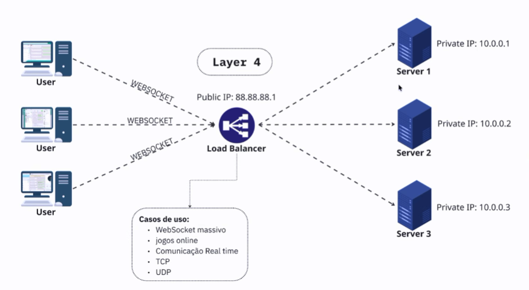

---

## BALANCEADOR DE CAMADA 7 (L7)

O balanceador de carga de camada 7 (L7) é um tipo de balanceador de carga que opera na camada de aplicação do modelo OSI. Ele é responsável por distribuir o tráfego de rede com base em informações de aplicação, como URLs, cabeçalhos HTTP e cookies.

Esse balanceador é "consciente" do conteúdo das solicitações, ou seja, ele analisa o conteúdo dos pacotes de dados para tomar decisões de balanceamento. Ele pode usar informações como o caminho da URL, os cabeçalhos HTTP e os cookies para determinar qual servidor deve receber a solicitação.

Casos de uso:

- APIs e REST: O balanceador de carga de camada 7 é ideal para aplicativos que expõem APIs e serviços REST, pois pode usar informações de aplicação para distribuir o tráfego de forma eficiente.

- Aplicações web: O balanceador de carga de camada 7 é ideal para aplicativos web que exigem recursos avançados de balanceamento de carga em nível de aplicação, como roteamento baseado em conteúdo e suporte a protocolos modernos, como HTTP/2 e WebSocket.

- Microserviços: O balanceador de carga de camada 7 é ideal para aplicativos baseados em microserviços, pois pode usar informações de aplicação para distribuir o tráfego entre os diferentes serviços de forma eficiente.

- E-commerce: O balanceador de carga de camada 7 é ideal para aplicativos de comércio eletrônico que exigem recursos avançados de balanceamento de carga em nível de aplicação, como roteamento baseado em conteúdo e suporte a protocolos modernos, como HTTP/2 e WebSocket.

- SaaS: O balanceador de carga de camada 7 é ideal para aplicativos de software como serviço (SaaS) que exigem recursos avançados de balanceamento de carga em nível de aplicação, como roteamento baseado em conteúdo e suporte a protocolos modernos, como HTTP/2 e WebSocket.

- App mobile: O balanceador de carga de camada 7 é ideal para aplicativos móveis que exigem recursos avançados de balanceamento de carga em nível de aplicação, como roteamento baseado em conteúdo e suporte a protocolos modernos, como HTTP/2 e WebSocket.

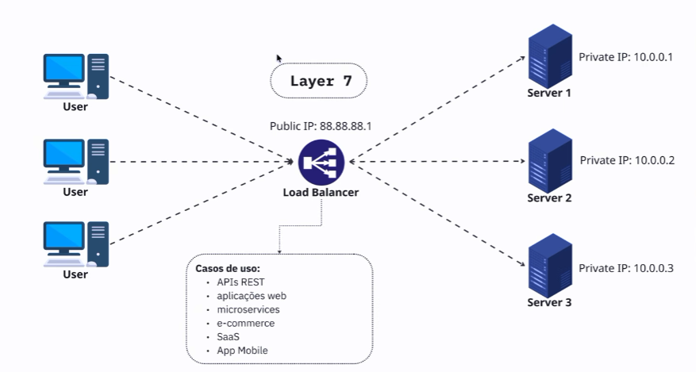

---

# ALGORITMOS

## ALGORITMO: ROUND ROBIN

O algoritmo de balanceamento de carga Round Robin distribui as solicitações de forma sequencial entre os servidores disponíveis. Ele atribui cada nova solicitação ao próximo servidor na lista, garantindo uma distribuição uniforme do tráfego.

Exemplo de código em Python para implementar o algoritmo Round Robin:

```python
class RoundRobin:
    def __init__(self, servers):
        self.servers = servers
        self.index = 0

    def get_next_server(self):
        server = self.servers[self.index]
        self.index = (self.index + 1) % len(self.servers)
        return server

# Exemplo de uso
servers = ["SERVIDOR1", "SERVIDOR2", "SERVIDOR3"]
rr = RoundRobin(servers)

for _ in range(10):
    print(rr.get_next_server())
```

A lógica do algoritmo Round Robin explicada:

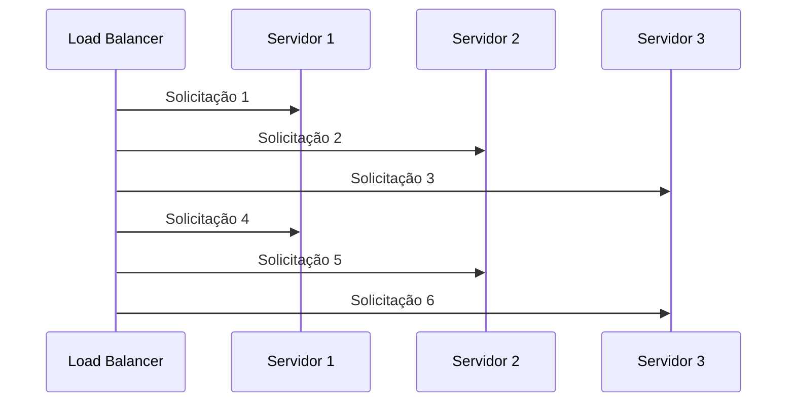

Na prática, o algoritmo Round Robin envia um número igual de solicitações para cada servidor, alternando entre eles de forma cíclica.

---

## ALGORITMO: WEIGHTED ROUND ROBIN

O algoritmo de balanceamento de carga Weighted Round Robin é uma variação do Round Robin que atribui pesos aos servidores com base em sua capacidade ou desempenho. Os servidores com pesos mais altos recebem mais solicitações do que os servidores com pesos mais baixos.

Exemplo de código em Python para implementar o algoritmo Weighted Round Robin:

```python
class WeightedRoundRobin:
    def __init__(self, servers, weights):
        self.servers = servers
        self.weights = weights
        self.index = 0
        self.current_weight = 0

    def get_next_server(self):
        while True:
            server = self.servers[self.index]
            weight = self.weights[self.index]

            if self.current_weight < weight:
                self.current_weight += 1
                return server

            self.index = (self.index + 1) % len(self.servers)
            if self.index == 0:
                self.current_weight = 0

# Exemplo de uso
servers = ["SERVIDOR1", "SERVIDOR2", "SERVIDOR3"]
weights = [5, 3, 2]

wrr = WeightedRoundRobin(servers, weights)

for _ in range(10):
    print(wrr.get_next_server())

```

A lógica do algoritmo Weighted Round Robin explicada:

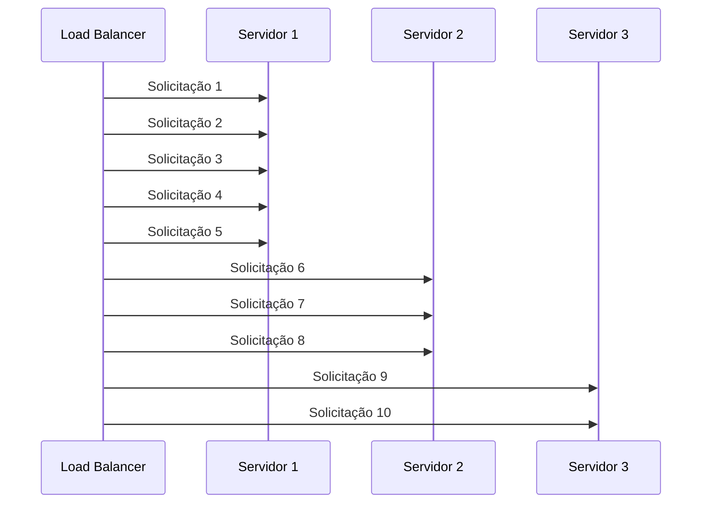

Na prática, o algoritmo Weighted Round Robin distribui as solicitações de acordo com os pesos atribuídos aos servidores, garantindo que os servidores mais potentes recebam mais tráfego do que os servidores menos potentes.

---

## ALGORITMO: LEAST CONNECTIONS

O algoritmo de balanceamento de carga Least Connections distribui as solicitações para o servidor com o menor número de conexões ativas no momento. Isso garante que os servidores menos ocupados recebam mais tráfego, equilibrando a carga de forma eficiente.

Exemplo de código em Python para implementar o algoritmo Least Connections:

```python
class LeastConnections:
    def __init__(self, servers):
        self.servers = servers
        self.connections = {server: 0 for server in servers}

    def get_next_server(self):
        server = min(self.connections, key=self.connections.get)
        self.connections[server] += 1
        return server

    def release_connection(self, server):
        if self.connections[server] > 0:
            self.connections[server] -= 1

# Exemplo de uso
servers = ["SERVIDOR1", "SERVIDOR2", "SERVIDOR3"]
lc = LeastConnections(servers)

for _ in range(10):
    server = lc.get_next_server()
    print(server)
    lc.release_connection(server)
```

A lógica do algoritmo Least Connections explicada:

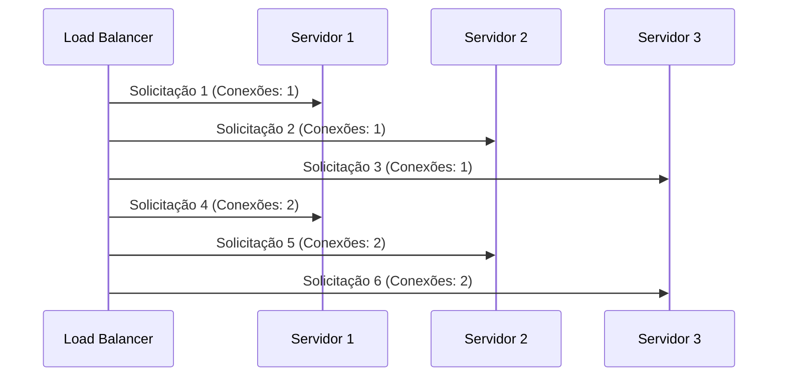

Na prática, o algoritmo Least Connections distribui as solicitações para os servidores com menos conexões ativas, garantindo que os servidores menos ocupados recebam mais tráfego e equilibrando a carga de forma eficiente.

---

## ALGORITMO: LEAST RESPONSE TIME

O algoritmo de balanceamento de carga Least Response Time distribui as solicitações para o servidor com o menor tempo de resposta médio, ou seja, o servidor que está com a melhor performance no momento. Isso garante que os servidores mais rápidos recebam mais tráfego, melhorando a performance geral do sistema.

Exemplo de código em Python para implementar o algoritmo Least Response Time:

```python
import time
class LeastResponseTime:
    def __init__(self, servers):
        self.servers = servers
        self.response_times = {server: 0 for server in servers}
        self.request_counts = {server: 0 for server in servers}

    def get_next_server(self):
        server = min(self.response_times, key=self.response_times.get)
        return server

    def record_response_time(self, server, response_time):
        self.request_counts[server] += 1
        total_time = self.response_times[server] * (self.request_counts[server] - 1) + response_time
        self.response_times[server] = total_time / self.request_counts[server]

# Exemplo de uso
servers = ["SERVIDOR1", "SERVIDOR2", "SERVIDOR3"]
lrt = LeastResponseTime(servers)

for _ in range(10):
    server = lrt.get_next_server()
    print(server)
    lrt.record_response_time(server, 0.1)
```

A lógica do algoritmo Least Response Time explicada:

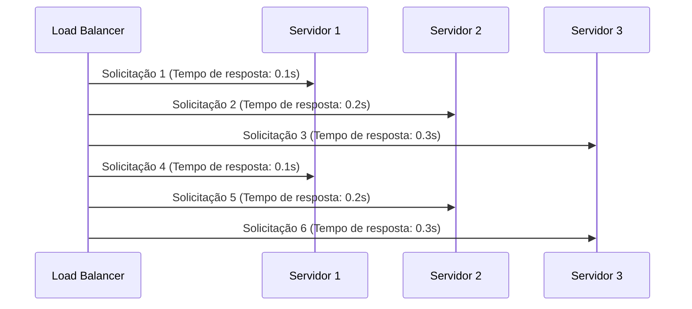

Na prática, o algoritmo Least Response Time distribui as solicitações para os servidores com menor tempo de resposta médio, garantindo que os servidores mais rápidos recebam mais tráfego e melhorando a performance geral do sistema.

---

## ALGORITMO: STICKY ROUND ROBIN

O algoritmo de balanceamento de carga Sticky Round Robin é uma variação do Round Robin que mantém a afinidade entre os clientes e os servidores. Isso significa que, uma vez que um cliente é atribuído a um servidor específico, todas as solicitações subsequentes desse cliente serão direcionadas para o mesmo servidor, garantindo consistência e evitando problemas de sessão.

Exemplo de código em Python para implementar o algoritmo Sticky Round Robin:

```python
class StickyRoundRobin:
    def __init__(self, servers):
        self.servers = servers
        self.index = 0
        self.client_server_map = {}

    def get_next_server(self, client_id):
        if client_id in self.client_server_map:
            return self.client_server_map[client_id]
        else:
            server = self.servers[self.index]
            self.client_server_map[client_id] = server
            self.index = (self.index + 1) % len(self.servers)
            return server

# Exemplo de uso
servers = ["SERVIDOR1", "SERVIDOR2", "SERVIDOR3"]
srr = StickyRoundRobin(servers)

clients = ["CLIENTE1", "CLIENTE2", "CLIENTE3", "CLIENTE4"]

for client in clients:
    server = srr.get_next_server(client)
    print(f"{client} -> {server}")
```

A lógica do algoritmo Sticky Round Robin explicada:

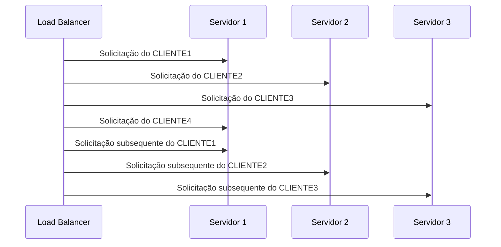

Na prática, o algoritmo Sticky Round Robin mantém a afinidade entre os clientes e os servidores, garantindo que as solicitações subsequentes de um cliente sejam direcionadas para o mesmo servidor, evitando problemas de sessão e garantindo consistência.
Caso um cliente seja redirecionado para outro servidor, ele pode perder o estado da sessão, o que pode levar a problemas de consistência e experiência do usuário. Para previnir isso , o algoritmo Sticky Round Robin garante que as solicitações subsequentes de um cliente sejam direcionadas para o mesmo servidor, mantendo a afinidade entre os clientes e os servidores.
O código python que reflete esse comportamento é esse trecho:

```python
    def get_next_server(self, client_id):
        if client_id in self.client_server_map:
            return self.client_server_map[client_id]
        else:
            server = self.servers[self.index]
            self.client_server_map[client_id] = server
            self.index = (self.index + 1) % len(self.servers)
            return server
```

O if & else garante que se o cliente já tiver sido mapeado para um servidor, ele continuará a ser direcionado para o mesmo servidor. Caso contrário, ele será atribuído ao próximo servidor na lista, garantindo uma distribuição uniforme do tráfego entre os servidores disponíveis.