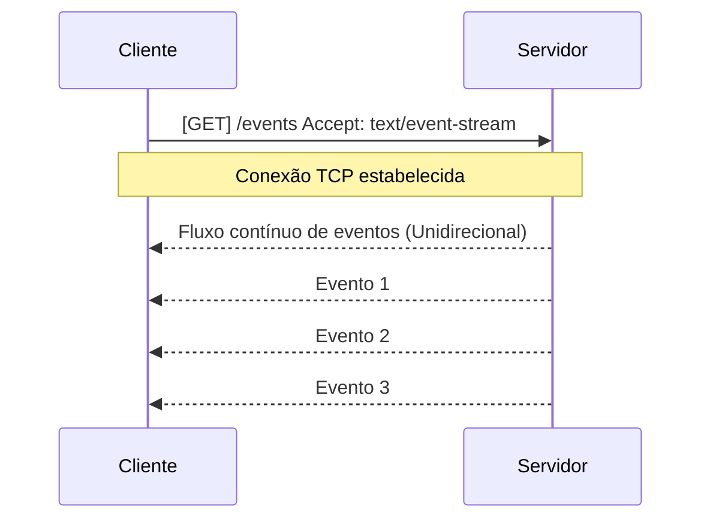
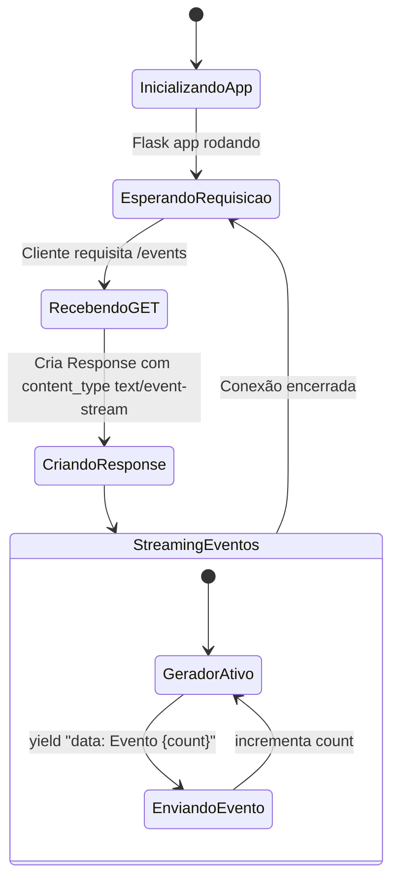
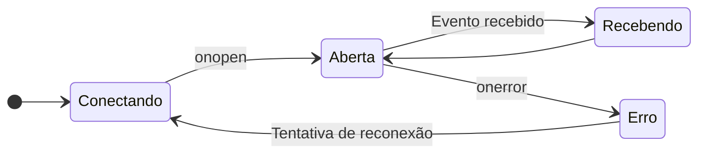
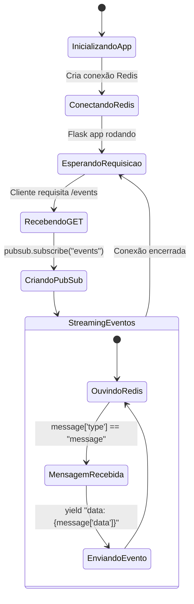
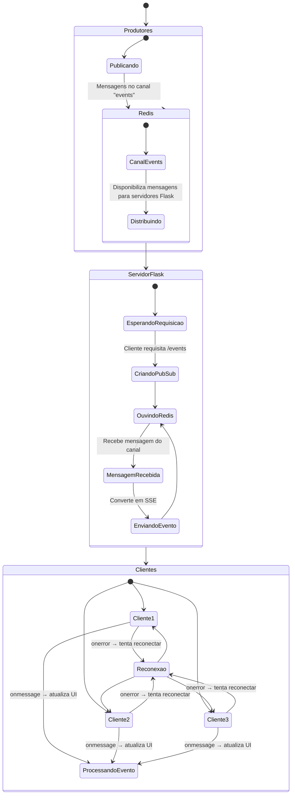

# SSE (Server Sent Events)

Como funciona?

SSE (Server-Sent Events) é uma tecnologia que permite que um servidor envie atualizações automáticas para o navegador do cliente através de uma conexão HTTP persistente. Diferente do WebSocket, que permite comunicação bidirecional, o SSE é unidirecional: do servidor para o cliente.

A conexão é feita via `HTTP` sobre `TCP`, ou seja, o cliente faz uma requisição HTTP para o servidor e mantém essa conexão aberta. O servidor então envia eventos para o cliente sempre que houver novas informações disponíveis.



A conexão é mantida aberta por meio de uma espécie de "Tunelamento" HTTP, onde o servidor envia dados continuamente para o cliente. O cliente, por sua vez, pode processar esses eventos à medida que eles chegam. Essa conexão é unidirecional, ou seja, o cliente não envia dados de volta para o servidor através dessa conexão.

O frontend precisa ser notificado de que o servidor está enviando eventos. Para isso, o cliente deve especificar o cabeçalho `Accept: text/event-stream` na requisição HTTP. O servidor, por sua vez, deve enviar os eventos no formato correto, que é um fluxo contínuo de texto com campos específicos.

- `Vantagens`:
  - Simplicidade: SSE é mais fácil de implementar do que WebSockets para casos de uso unidirecionais.
  - Compatibilidade: Funciona bem com navegadores modernos e é suportado por HTTP/1.1.
  - Reconexão automática: O navegador pode tentar reconectar automaticamente se a conexão for perdida.
  - Baixa sobrecarga: SSE utiliza menos recursos do que WebSockets para casos de uso simples.

- `Desvantagens`:
  - Unidirecional: SSE só permite comunicação do servidor para o cliente.
  - Limite de conexões: Navegadores podem limitar o número de conexões SSE simultâneas.
  - Suporte limitado a HTTP/2: SSE não é totalmente compatível com HTTP/2 em todos os navegadores.
  - Apenas texto: SSE é limitado a enviar dados em formato de texto, o que pode não ser ideal para todos os casos de uso.

Vamos exemplificar como seria essa conexão utilizando python com Flask para o backend e HTML para o frontend.

```python
# backend.py
from flask import Flask, Response

app = Flask(__name__)

def event_stream():
    count = 0
    while True:
        yield f"data: Evento {count}\n\n"
        count += 1

@app.route('/events')
def sse():
    return Response(event_stream(), content_type='text/event-stream')
```



```html
<!-- frontend.html -->
<!DOCTYPE html>
<html>
<head>
    <title>SSE Example</title>
</head>
<body>
    <h1>Server-Sent Events Example</h1>
    <div id="events"></div>

    <script>
        const eventSource = new EventSource('/events');

        eventSource.onmessage = function(event) {
            const eventsDiv = document.getElementById('events');
            const newEvent = document.createElement('p');
            newEvent.textContent = event.data;
            eventsDiv.appendChild(newEvent);
        };

        eventSource.onerror = function(error) {
            console.error('Error occurred:', error);
        };

        eventSource.onopen = function() {
            console.log('Connection to server opened.');
        };
    </script>
</body>
</html>
```




Exemplo de como seria a requisição HTTP feita pelo cliente para o servidor:

```http
GET /events HTTP/1.1
Host: localhost:5000
Accept: text/event-stream
```

Explicando o fluxo de eventos:
1. O cliente faz uma requisição HTTP para o endpoint `/events` do servidor, especificando que aceita eventos do tipo `text/event-stream`.
2. O servidor responde com um fluxo contínuo de eventos, enviando dados no formato correto.
3. O cliente recebe os eventos e pode processá-los conforme necessário, exibindo informações em tempo real para o usuário.
4. Se a conexão for perdida, o navegador tentará reconectar automaticamente, garantindo que o cliente continue recebendo atualizações do servidor.
5. O servidor pode enviar eventos a qualquer momento, permitindo que o cliente receba informações em tempo real sem a necessidade de fazer novas requisições.

Explicando cada linha do código:
- No backend, a função `event_stream` gera eventos continuamente, incrementando um contador a cada evento enviado.
- O endpoint `/events` retorna uma resposta do tipo `text/event-stream`, que é o formato esperado pelo cliente para receber eventos.
- No frontend, a classe `EventSource` é utilizada para criar uma conexão com o servidor e ouvir os eventos enviados. O método `onmessage` é chamado sempre que um novo evento é recebido, permitindo que o cliente processe os dados em tempo real.
- O método `onerror` é chamado caso ocorra algum erro na conexão, enquanto o método `onopen` é chamado quando a conexão é estabelecida com sucesso.
- O fluxo de eventos é contínuo, e o cliente pode processar os dados à medida que eles chegam, garantindo uma experiência em tempo real para o usuário.

---

### Adicionando o REDIS para gerenciar a fila de eventos

Para melhorar a escalabilidade e gerenciar a fila de eventos, podemos integrar o Redis ao nosso backend. O Redis é um banco de dados em memória que pode ser usado como um sistema de mensagens para armazenar e distribuir eventos.

```python
# backend_with_redis.py
import redis
from flask import Flask, Response

app = Flask(__name__)
r = redis.Redis()

def event_stream():
    pubsub = r.pubsub()
    pubsub.subscribe('events')
    for message in pubsub.listen():
        if message['type'] == 'message':
            yield f"data: {message['data'].decode()}\n\n"

@app.route('/events')
def sse():
    return Response(event_stream(), content_type='text/event-stream')
```



Ao adicionar o redis para gerenciar a fila de eventos, o backend agora pode lidar com múltiplos produtores de eventos que publicam mensagens no canal 'events'. O servidor Flask consome essas mensagens e as envia para os clientes conectados via SSE, permitindo uma maior escalabilidade e eficiência na distribuição de eventos em tempo real.

No frontend, o código permanece o mesmo, pois a lógica de recebimento de eventos não muda. O que muda é a forma como os eventos são gerados e enviados pelo backend, agora utilizando o Redis para gerenciar a fila de eventos.

Explicando cada linha do código com Redis:
- No backend, criamos uma conexão com o Redis usando `redis.Redis()`.
- A função `event_stream` agora utiliza o `pubsub` do Redis para se inscrever no canal de eventos chamado 'events'.
- O servidor escuta continuamente os eventos publicados no canal e envia os dados para o cliente assim que eles são recebidos.
- O endpoint `/events` continua retornando uma resposta do tipo `text/event-stream`, permitindo que o cliente receba os eventos em tempo real.
- O Redis atua como um intermediário, permitindo que múltiplos produtores de eventos publiquem mensagens no canal 'events', enquanto o servidor Flask consome essas mensagens e as envia para os clientes conectados via SSE. Isso melhora a escalabilidade do sistema, permitindo que ele lide com um maior volume de eventos e clientes simultâneos.

Explicando todo o fluxo de eventos com Redis:
1. Múltiplos produtores de eventos publicam mensagens no canal 'events' do Redis.
2. O servidor Flask, que está escutando o canal 'events' através do `pubsub`, recebe essas mensagens em tempo real.
3. Assim que uma mensagem é recebida, o servidor envia o evento para todos os clientes conectados via SSE.
4. O cliente processa os eventos recebidos e atualiza a interface do usuário em tempo real.
5. Se a conexão for perdida, o navegador tentará reconectar automaticamente, garantindo que o cliente continue recebendo atualizações do servidor.
6. O Redis permite que o sistema escale horizontalmente, pois múltiplos servidores Flask podem se conectar ao mesmo canal de eventos, garantindo que todos os clientes recebam as atualizações em tempo real, independentemente de qual servidor esteja lidando com a conexão SSE.

