# Systems Thinking and Modeling for a Complex World

First of all, it is important to understand that systems thinking is a holistic approach to analysis that focuses on the way that a system's constituent parts interrelate and how systems work over time and within the context of larger systems. It is a framework for seeing interrelationships rather than things, for seeing patterns of change rather than static snapshots.

Systems thinking is a way of understanding reality that emphasizes the relationships among a system's parts, rather than the parts themselves. It is a way of thinking about the world that recognizes that everything is interconnected and that changes in one part of a system can have ripple effects throughout the entire system.

## Open Loop Thinking

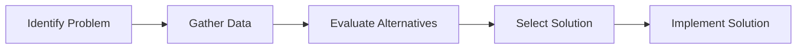

In this conceptualization, the process is linear and sequential. It assumes that once a solution is implemented, the problem is solved, and there is no feedback loop to reassess the situation. This approach can be effective for simple problems but may fall short in complex systems where feedback and adaptation are crucial.

In a large system, such as an organization or an ecosystem, the interactions between components can lead to unexpected outcomes. Open loop thinking does not account for these dynamics, which can result in solutions that are ineffective or even counterproductive.

For this we can use the following example:

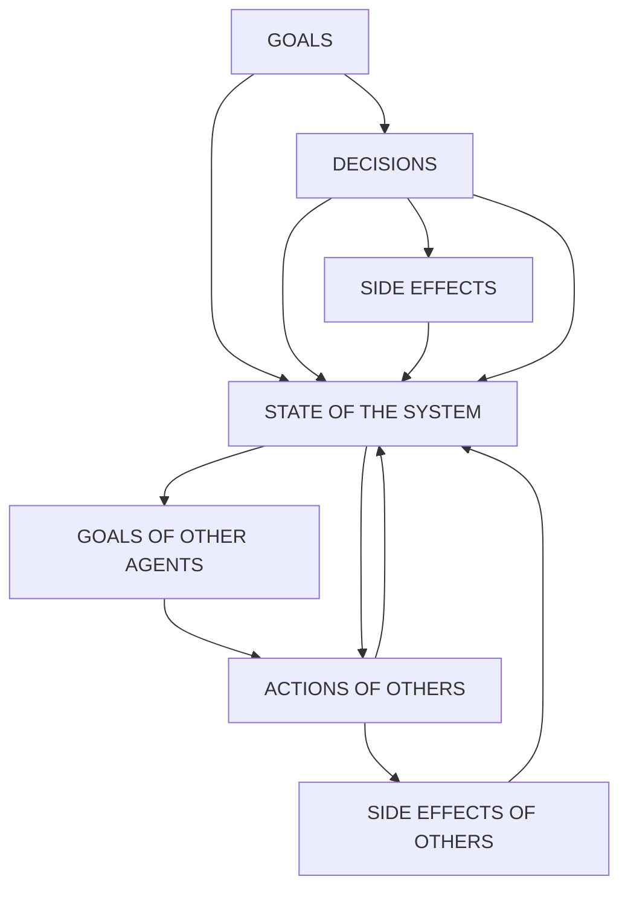

## System Thinking Foundations

What is a system?

- A system is a set of interrelated components that work together to achieve a common goal. Systems can be natural or human-made, and they can range from simple to complex. Understanding the structure and behavior of systems is essential for effective problem-solving and decision-making.

Structure Generates Behavior

- Dynamics emerge from the interactions of the components within a system. The structure of a system determines its behavior, and changes in the structure can lead to changes in behavior. By analyzing the structure of a system, we can gain insights into its behavior and identify leverage points for intervention.

Mental Models Matter

- It's not enough to change the phisical structure, information and incentives, we also need to change the mental models that guide our thinking and decision-making. Mental models are the deeply ingrained assumptions and beliefs that shape our understanding of the world. By challenging and updating our mental models, we can improve our ability to understand and influence complex systems.

The Fundamental Attribution Error

- This is a cognitive bias that leads people to overemphasize personal characteristics and ignore situational factors in judging others' behavior. In the context of systems thinking, this error can lead to misattributing the causes of problems to individuals rather than recognizing the influence of the system as a whole. By being aware of this bias, we can better analyze and address systemic issues.

Breaking Away from the Fundamental Attribution Error

- To break away from the fundamental attribution error, we need to adopt a systems perspective that considers the broader context in which behavior occurs. This involves looking at the interactions between components of the system, identifying feedback loops, and recognizing the influence of external factors. By doing so, we can develop more effective solutions that address the root causes of problems rather than just treating symptoms.

Barriers to Learning in Dynamic Complexity

- In dynamic complexity, the relationships between cause and effect are not always clear, and the effects of actions may be delayed or indirect. This can create barriers to learning, as it may take time to see the results of interventions, and feedback may be ambiguous or misleading. To overcome these barriers, it is important to use systems thinking tools and techniques that help visualize and analyze complex systems, such as causal loop diagrams, stock and flow diagrams, and simulation models.

# Some Tools of System Dynamics

System Thinking and Modeling is Iterative

- Spiral approach, and multiple tools available to help us understand the system and its behavior. The process of system thinking and modeling is iterative, meaning that we continuously refine our understanding of the system as we gather more information and test our assumptions.

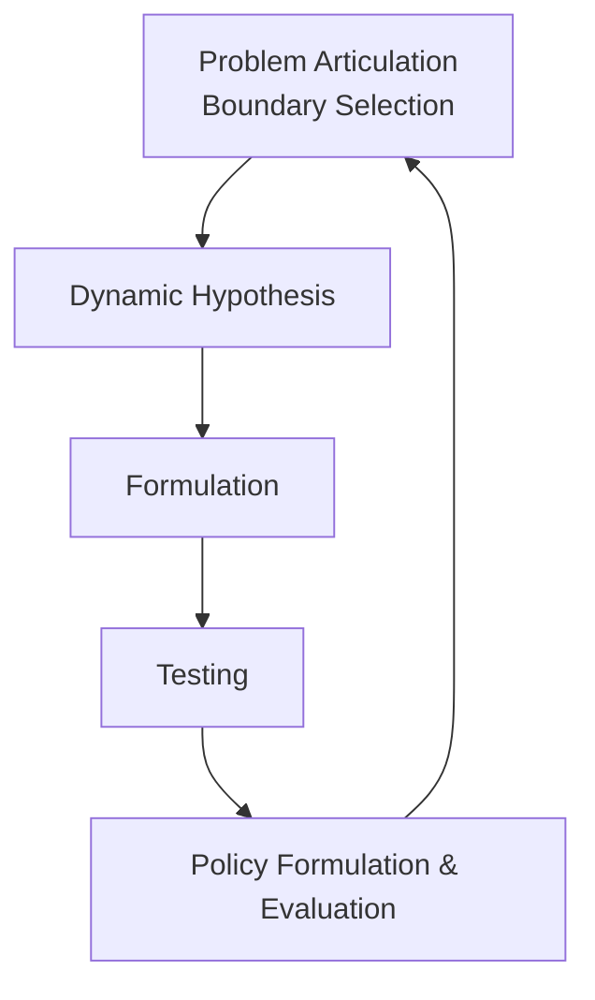

- Reference Models
- Casual Loop Diagrams
- Stock and Flows
- Equation Formulation
- Dimensional Analysis
- Simulation and Testing
- Sensitivity Analysis
- Policy Formulation and Evaluation

System Dynamics is NOT just compartment models

- System Dynamics practioners use many modeling and simulation toolsets to understand the behavior of complex systems. While compartment models are one approach, they are not the only tool available. Other techniques include agent-based modeling, network analysis, and discrete event simulation, among others. Each of these approaches has its strengths and weaknesses, and the choice of method depends on the specific characteristics of the system being studied.

Casual Links

- Causal links represent the relationships between variables in a system. They indicate how changes in one variable can lead to changes in another. Understanding these links is crucial for identifying feedback loops and predicting the behavior of the system over time.

- An example of a causal link is the relationship between supply and demand in a market. An increase in demand can lead to an increase in supply, which in turn can affect prices and consumer behavior. By mapping out these causal links, we can better understand the dynamics of the system and identify potential leverage points for intervention.

Balancing and Reinforcing Loops

- Balancing loops are feedback loops that work to stabilize a system. They counteract changes and help maintain equilibrium. For example, in a thermostat-controlled heating system, if the temperature rises above the set point, the heating is turned off, and if it falls below the set point, the heating is turned on.

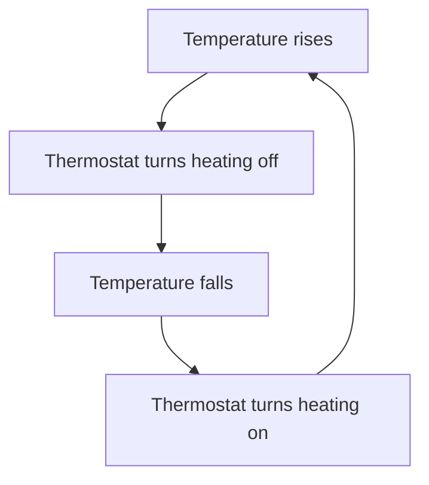

- Reinforcing loops, on the other hand, amplify changes and can lead to exponential growth or decline. For example, in a population growth model, an increase in population can lead to more births, which further increases the population. Understanding these loops is essential for predicting system behavior and designing effective interventions.

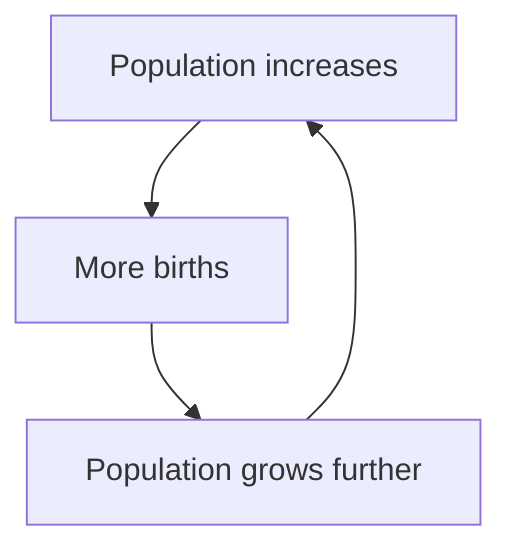

## Stocks and Flows

- Stocks represent the accumulation of resources or information in a system, while flows represent the rates at which these stocks change over time. For example, in a water reservoir system, the stock is the amount of water in the reservoir, and the flow is the rate at which water enters or leaves the reservoir.

- Understanding stocks and flows is crucial for analyzing system behavior, as they help identify bottlenecks, delays, and potential points of intervention. By modeling stocks and flows, we can simulate different scenarios and evaluate the impact of various policies or strategies on the system's performance.

Let's see an example of a stock and flow diagram for a simple population model:

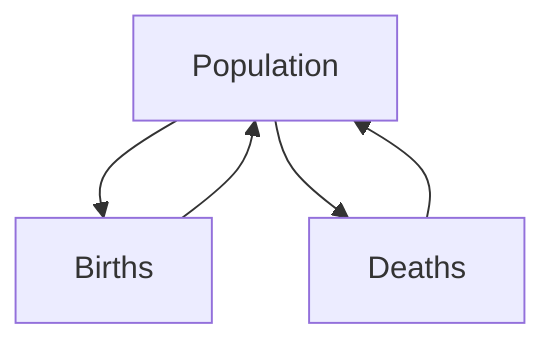

In this diagram, the population stock is influenced by the flow of births and deaths. By adjusting the birth and death rates, we can simulate different population growth scenarios and assess the long-term sustainability of the system.

Another example is a stock and flow diagram for a bathtub system:

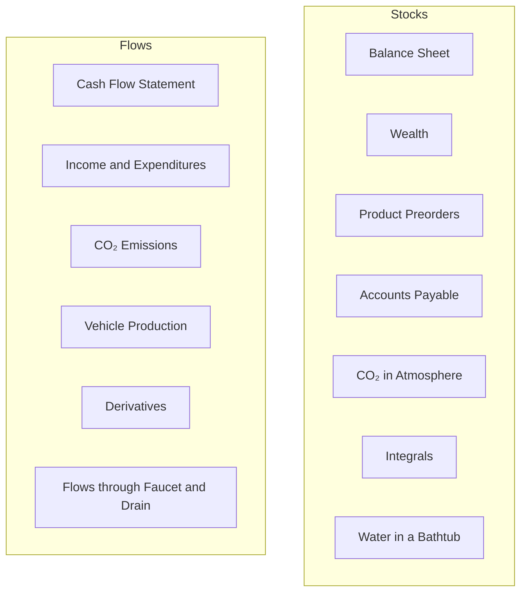

# System Dynamics Modeling

The process of system dynamics modeling involves several key steps, including problem articulation, boundary selection, dynamic hypothesis formulation, model formulation, testing, and policy evaluation. Each step is iterative and may require revisiting previous steps as new insights are gained.

- **Problem Articulation and Boundary Selection**: Clearly define the problem to be addressed and determine the boundaries of the system to be modeled. This involves identifying the key variables, stakeholders, and external factors that influence the system.

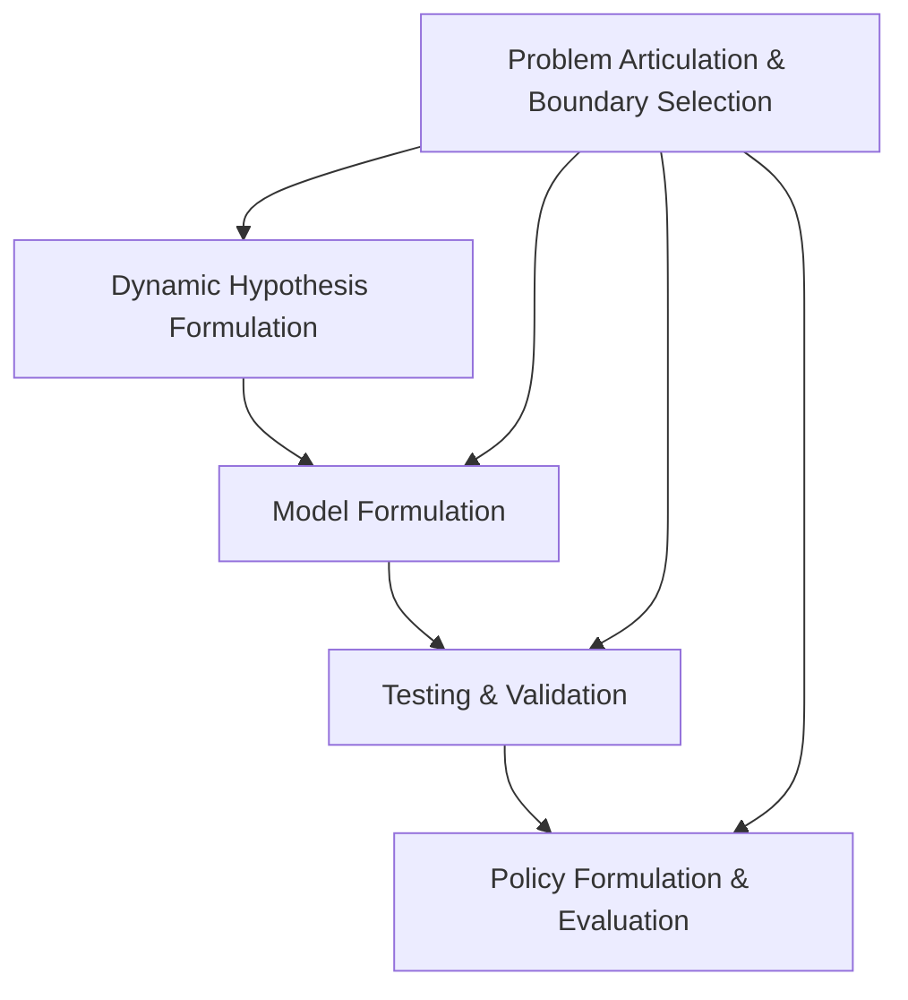

- **Dynamic Hypothesis Formulation**: Develop a conceptual model that explains the underlying structure and behavior of the system. This involves identifying feedback loops, causal relationships, and potential leverage points for intervention.

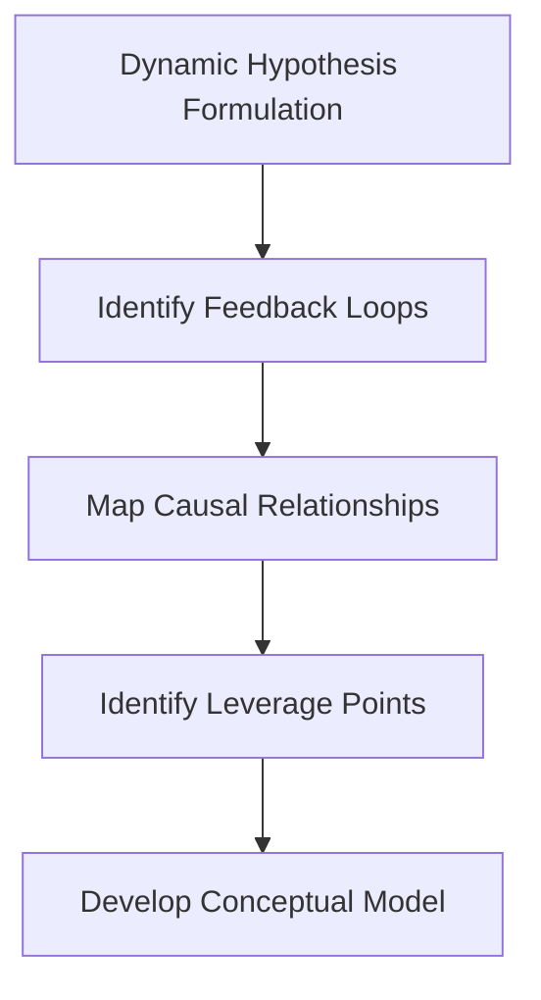

- **Model Formulation**: Translate the conceptual model into a formal mathematical or computational model. This may involve defining equations, parameters, and initial conditions that represent the system's dynamics.

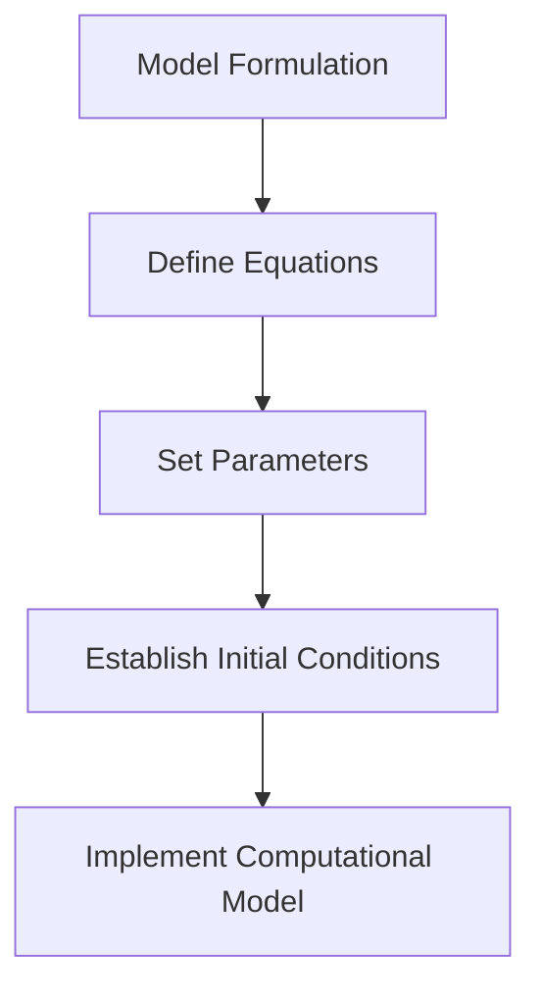

- **Testing and Validation**: Evaluate the model's accuracy and reliability by comparing its predictions with real-world data. This may involve sensitivity analysis, scenario testing, and calibration of model parameters.

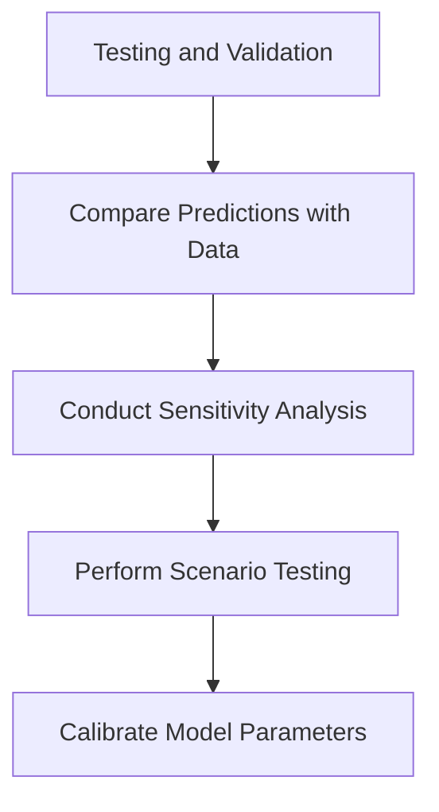

- **Policy Formulation and Evaluation**: Use the validated model to explore different policy options and assess their potential impact on the system. This involves simulating various scenarios, analyzing trade-offs, and identifying strategies that promote desired outcomes while minimizing unintended consequences.

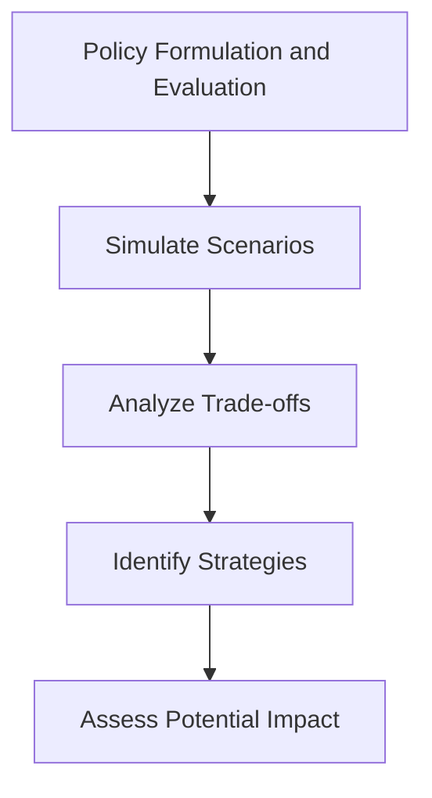