# System Design

## Computer Architecture

At the core, computers can understand only binary data, which is represented as a series of 0s and 1s. This binary data is processed by the computer's central processing unit (`CPU`), which performs calculations and executes instructions. The CPU consists of several components, including the arithmetic logic unit (`ALU`), control unit, and registers.

`CPU` = Central Processing Unit -> Is responsible for executing instructions from programs, performing calculations, and managing data flow within the computer. It interacts with memory and input/output devices to carry out tasks.

`ALU` = Arithmetic Logic Unit -> Performs arithmetic operations (addition, subtraction, multiplication, division) and logical operations (AND, OR, NOT) on binary data.

## Disk Storage

Disk storage refers to the use of magnetic or solid-state devices to store data persistently. Hard disk drives (`HDDs`) use spinning disks coated with magnetic material to read and write data, while solid-state drives (`SSDs`) use flash memory to store data electronically. Disk storage is essential for long-term data retention and is used in various applications, from personal computers to enterprise servers.

`HDD` = Hard Disk Drive -> Uses spinning disks coated with magnetic material to read and write data. It offers large storage capacity at a lower cost but with slower access times compared to `SSDs`.

`SSD` = Solid-State Drive -> Uses flash memory to store data electronically. It provides faster access times and better durability compared to `HDDs`, but typically comes at a higher cost per gigabyte.

`RAM` = Random Access Memory -> A type of volatile memory that temporarily stores data and instructions that the CPU needs while performing tasks. RAM allows for quick read and write access, enabling faster processing speeds.

## Cache Memory

Cache memory is a small, high-speed memory located close to the CPU that stores frequently accessed data and instructions. It helps reduce the time it takes for the CPU to access data from main memory (`RAM`). Cache memory is typically divided into multiple levels (L1, L2, L3), with L1 being the fastest and smallest, and L3 being larger but slower.

`L1 Cache` = Level 1 Cache -> The fastest and smallest cache, located directly on the CPU chip. It stores frequently accessed data and instructions to speed up processing.

`L2 Cache` = Level 2 Cache -> A larger cache located on the CPU or on a separate chip. It provides additional storage for frequently accessed data and instructions, improving performance compared to accessing main memory.

`L3 Cache` = Level 3 Cache -> The largest cache, typically shared among multiple CPU cores. It provides additional storage for frequently accessed data and instructions, further improving performance compared to accessing main memory.

## Compiler

A compiler is a software tool that translates high-level programming languages (like C++, Java, or Python) into machine code that the CPU can execute. The compilation process involves several stages, including lexical analysis, syntax analysis, semantic analysis, optimization, and code generation. Compilers play a crucial role in software development by enabling developers to write code in human-readable languages while ensuring efficient execution on hardware.

## Motherboard

The motherboard is the main printed circuit board (`PCB`) in a computer that connects and allows communication between various components, including the CPU, memory, storage devices, and peripheral devices. It provides power to these components and facilitates data transfer through buses and connectors. The motherboard also houses essential chips, such as the chipset, which manages data flow between the CPU, memory, and other peripherals.

Here's an example of a simple system design diagram that illustrates the relationship between the CPU, memory, storage, and other components:

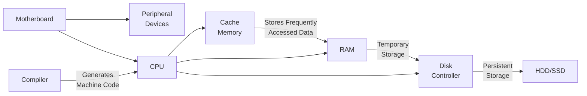

---

# High-level Architecture of a Production App

## CI/CD

Continuous Integration (CI) and Continuous Deployment (CD) are practices in software development that aim to automate and streamline the process of integrating code changes, testing, and deploying applications. CI involves automatically building and testing code changes frequently, while CD focuses on automating the deployment of applications to various environments, ensuring faster and more reliable releases.

Generally connected with version control systems like Git, Jenkins, CI/CD pipelines help teams maintain code quality, reduce integration issues, and accelerate the delivery of new features and bug fixes. Popular CI/CD tools include Jenkins, Travis CI, CircleCI, and GitHub Actions.

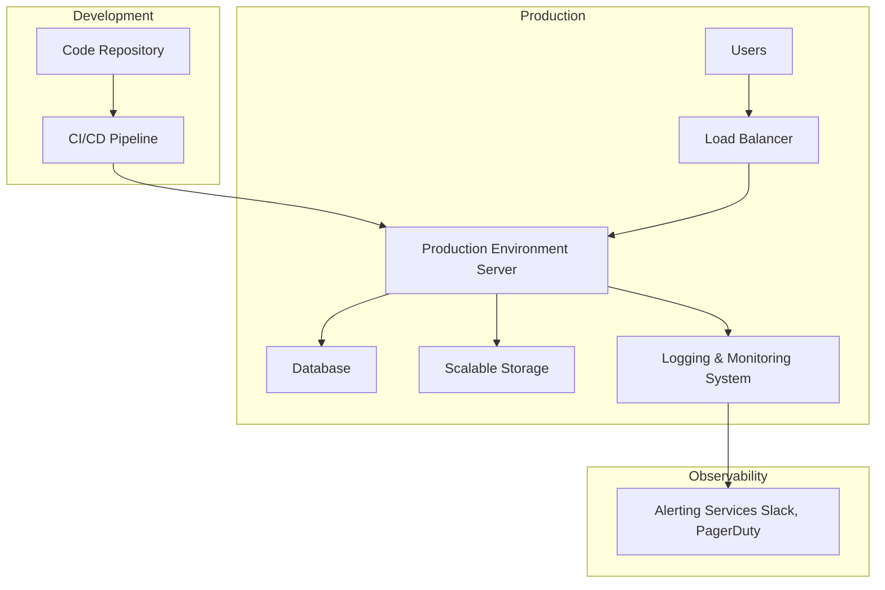

## Debugging and Monitoring

Debugging and monitoring are essential practices in software development and operations to ensure the reliability, performance, and stability of applications. Debugging involves identifying and fixing issues or bugs in the code, while monitoring focuses on observing the application's behavior in real-time to detect anomalies, performance bottlenecks, and potential failures.

Golden Rule: Never debug in production. Always use a staging environment to test and debug your application before deploying it to production. This helps prevent potential issues from affecting end-users and ensures a smoother deployment process.

<!-- DEVELOPMENT -> CI/CD -> PRODUCTION
CI/CD -> STAGING ENVIROMENT -->

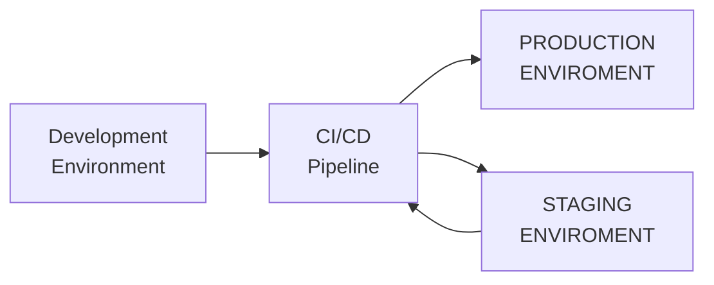

## Whaat makes a good system design?

`Scalability` = The ability of a system to handle increased load or demand by adding resources, such as servers or storage, without compromising performance.

`Maintainability` = The ease with which a system can be modified, updated, or repaired. A maintainable system has clear documentation, modular architecture, and follows coding best practices.

`Efficiency` = The ability of a system to perform tasks using minimal resources, such as CPU, memory, and storage, while maintaining acceptable performance levels.

`Reliability` = The ability of a system to consistently perform its intended functions without failures or errors. A reliable system has redundancy, fault tolerance, and robust error handling mechanisms.

## Moving data | Storing data | Transforming data

The way data is managed in a system is crucial for its performance and scalability. Data can be moved, stored, and transformed in various ways depending on the requirements of the application.

- Move data is about transferring data from one location to another, such as from a client to a server or between different services within a system. This can be done using APIs, message queues, or data streaming platforms.

- Store data involves persisting data in a storage medium, such as databases, file systems, or cloud storage. The choice of storage solution depends on factors like data volume, access patterns, and consistency requirements.

- Transform data refers to the process of converting data from one format or structure to another, often for analysis, reporting, or integration with other systems. This can involve data cleaning, aggregation, normalization, or enrichment.

## CAP Theorem (Brewer's Theorem)

The CAP theorem, also known as Brewer's theorem, states that in a distributed data store, it is impossible to simultaneously achieve all three of the following properties:

1. **Consistency**: Every read receives the most recent write or an error. This means that all nodes in the system see the same data at the same time.

2. **Availability**: Every request receives a response, without guarantee that it contains the most recent write. This means that the system is operational and responsive, even if some nodes are down.

3. **Partition Tolerance**: The system continues to operate despite an arbitrary number of messages being dropped or delayed by the network between nodes. This means that the system can handle network failures and still function correctly.

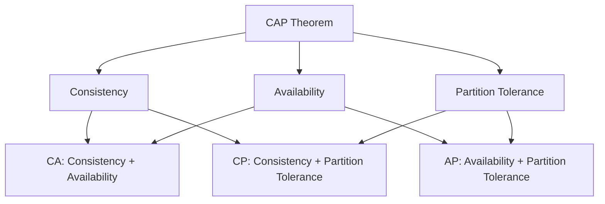

## SLA / SLO / SLI

`SLA (Service Level Agreement)` = A formal agreement between a service provider and a customer that defines the expected level of service, including performance, availability, and other metrics.

`SLO (Service Level Objective)` = A specific, measurable goal within an SLA that defines the target level of service for a particular metric, such as uptime or response time.

`SLI (Service Level Indicator)` = A quantitative measure used to assess the performance of a service against its SLOs. SLIs provide data that can be used to determine whether the service is meeting its objectives and fulfilling the SLA.

These concepts are closely related and help organizations define, measure, and manage the quality of their services. They are essential for ensuring that service providers meet customer expectations and maintain a high level of service reliability and performance.

To measure these aspects, we use the following concepts:

- **Reliability**: The ability of a system to consistently perform its intended functions without failures or errors. Reliability can be measured using metrics such as Mean Time Between Failures (MTBF) and Mean Time To Repair (MTTR).

- **Fault Tolerance**: The ability of a system to continue operating correctly in the presence of hardware or software faults. Fault tolerance can be achieved through techniques such as redundancy, error detection and correction, and failover mechanisms.

- **Redundancy**: The duplication of critical components or functions of a system to increase reliability and fault tolerance. Redundancy can be implemented at various levels, including hardware (e.g., multiple servers), software (e.g., backup processes), and data (e.g., data replication).

We also have to measure the speed of the system, which can be done using the following concepts:

- **Latency**: The time it takes for a system to respond to a request or perform an operation. Latency can be measured in milliseconds (ms) and is often a critical factor in user experience.

- **Throughput**: The amount of work a system can perform in a given period of time, often measured in requests per second (RPS) or transactions per second (TPS). High throughput indicates that a system can handle a large volume of requests efficiently.

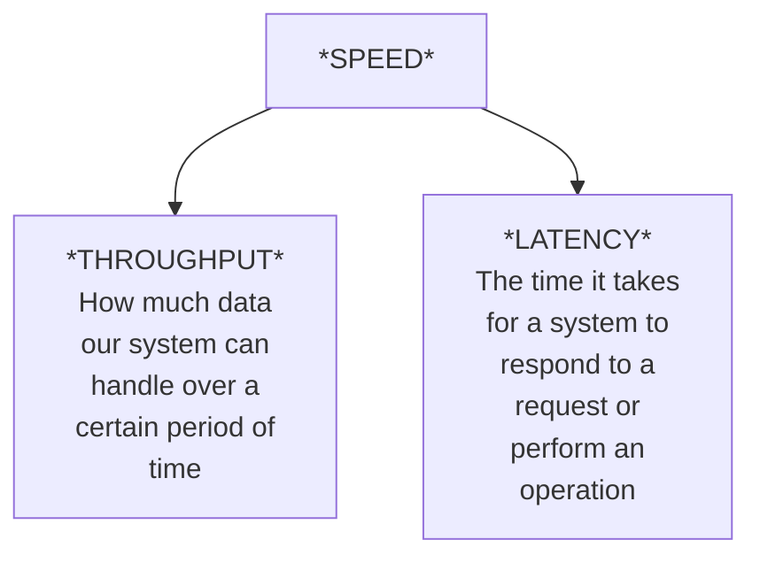

An optimize to one of these metrics may come at the cost of the other. For example, optimizing for low latency may reduce throughput, and vice versa. Therefore, it is essential to balance these metrics based on the specific requirements of the system and its users.

That's why we have to make sure that we have a good system design, which is scalable, maintainable, efficient, and reliable.

## Networking

`IP Address` = A unique identifier assigned to each device connected to a network that uses the Internet Protocol for communication. IP addresses can be either IPv4 (e.g., 192.168.0.1) or IPv6 (e.g., 2001:0db8:85a3:0000:0000:8a2e:0370:7334).

`IP Header` = A part of the IP packet that contains essential information for routing and delivering the packet, such as source and destination IP addresses, version, header length, total length, time-to-live (TTL), protocol, and checksum.

`APPlication Layer` = The top layer of the OSI model that provides services and protocols for applications to communicate over a network. Examples include HTTP, FTP, SMTP, and DNS.

`Transport Layer` = The layer of the OSI model responsible for end-to-end communication between devices, ensuring reliable data transfer and error detection. Common transport layer protocols include TCP (Transmission Control Protocol) and UDP (User Datagram Protocol).

`TCP` = Transmission Control Protocol -> A connection-oriented transport layer protocol that provides reliable, ordered, and error-checked delivery of data between applications running on devices in a network. TCP guarantees that data is delivered in the correct order and retransmits lost packets, making it suitable for applications that require reliability, such as web browsing and email.

`UDP` = User Datagram Protocol -> A connectionless transport layer protocol that provides a faster, but less reliable, method of data transmission. UDP does not guarantee the order or delivery of packets, making it suitable for applications that require low latency, such as video streaming and online gaming.

`DNS` = Domain Name System -> A hierarchical and decentralized naming system that translates human-readable domain names (e.g., www.example.com) into IP addresses (e.g., 192.168.0.1).

`ICANN` = Internet Corporation for Assigned Names and Numbers -> A nonprofit organization responsible for coordinating the global domain name system (DNS) and IP address allocation, ensuring the stable and secure operation of the internet.

### Application Layer Protocols

`HTTP` = Hypertext Transfer Protocol -> An application layer protocol used for transmitting hypertext (web pages) over the internet. HTTP defines how messages are formatted and transmitted, and how web servers and browsers should respond to various commands.


### Status Codes

`2xx Sucess Codes`
- 200 OK: The request was successful, and the server returned the requested resource.
- 201 Created: The request was successful, and the server created a new resource as a result.
- 202 Accepted: The request has been accepted for processing, but the processing is not yet complete.

`3xx Redirection Codes`
- 301 Moved Permanently: The requested resource has been permanently moved to a new URL, and future requests should use the new URL.
- 302 Found: The requested resource has been temporarily moved to a different URL, and future requests should continue to use the original URL.
- 304 Not Modified: The requested resource has not been modified since the last request, and the client can use the cached version of the resource.

`4xx Client Error Codes`
- 400 Bad Request: The server could not understand the request due to invalid syntax.
- 401 Unauthorized: The client must authenticate itself to access the requested resource.
- 403 Forbidden: The client does not have permission to access the requested resource.
- 404 Not Found: The requested resource could not be found on the server.

`5xx Server Error Codes`
- 500 Internal Server Error: The server encountered an unexpected condition that prevented it from fulfilling the request.
- 502 Bad Gateway: The server received an invalid response from an upstream server while acting as a gateway or proxy.
- 503 Service Unavailable: The server is currently unable to handle the request due to temporary overload or maintenance.

### HTTP Methods

- `GET` = Retrieve data from the server.
- `POST` = Send data to the server to create a new resource.
- `PUT` = Update an existing resource on the server.
- `DELETE` = Remove a resource from the server.

### WebSockets

WebSockets is a communication protocol that provides full-duplex communication channels over a single TCP connection. It enables real-time, bidirectional communication between clients (such as web browsers) and servers, allowing for low-latency data exchange. WebSockets are commonly used in applications that require instant updates, such as chat applications, online gaming, and live data feeds.

- `SMTP` = Simple Mail Transfer Protocol -> An application layer protocol used for sending and receiving email messages between email clients and servers. SMTP is responsible for the transmission of email messages, while other protocols like IMAP and POP3 are used for retrieving and managing email on the client side.

- `IMAP` = Internet Message Access Protocol -> An application layer protocol used by email clients to retrieve and manage email messages stored on a mail server. IMAP allows users to access their email from multiple devices while keeping the messages synchronized across all devices.

- `POP3` = Post Office Protocol version 3 -> An application layer protocol used by email clients to retrieve email messages from a mail server. Unlike IMAP, POP3 typically downloads the messages to the client's device and removes them from the server, making it less suitable for accessing email from multiple devices.

### File Transfer Protocols

- `FTP` = File Transfer Protocol -> A standard network protocol used for transferring files between a client and a server over a TCP-based network, such as the Internet.

- `SSH` = Secure Shell -> A cryptographic network protocol used for secure communication between a client and a server, providing encrypted data transfer and secure remote access to systems.

- `SFTP` = Secure File Transfer Protocol -> A secure version of FTP that uses SSH to encrypt data transfer, ensuring the confidentiality and integrity of files being transferred between a client and a server.

### Real-Time Communication Protocols

- `WebRTC` = Web Real-Time Communication -> An open-source project that enables real-time communication (audio, video, and data sharing) directly between web browsers and mobile applications without the need for plugins or additional software. WebRTC uses peer-to-peer connections and supports secure data transfer through encryption.

- `MQTT` = Message Queuing Telemetry Transport -> A lightweight messaging protocol designed for low-bandwidth, high-latency, or unreliable networks. MQTT is commonly used in Internet of Things (IoT) applications to facilitate communication between devices and servers.

- `AMQP` = Advanced Message Queuing Protocol -> An open standard application layer protocol for message-oriented middleware that enables reliable communication between distributed systems. AMQP supports message queuing, routing, and delivery guarantees, making it suitable for enterprise messaging applications.

### RPC (Remote Procedure Call)

- `gRPC` = Google Remote Procedure Call -> A high-performance, open-source framework that uses HTTP/2 for transport, Protocol Buffers as the interface description language, and provides features such as authentication, load balancing, and more. gRPC is commonly used for connecting services in microservices architectures.

- `Thrift` = Apache Thrift -> A software framework for scalable cross-language services development that combines a software stack with a code generation engine to build services that work efficiently and seamlessly between multiple programming languages. Thrift supports various transport and protocol options, making it suitable for building distributed systems.

---

# API Design

The design of an API (Application Programming Interface) is crucial for enabling communication between different software components, services, or applications. A well-designed API should be intuitive, consistent, and easy to use, while also providing the necessary functionality and performance.

### Inputs / Outputs

- `Input` -> The data or parameters that an API receives from a client or another system. Inputs can be in various formats, such as JSON, XML, or form data, depending on the API design and the communication protocol used.

- `Output` -> The data or response that an API returns to the client or another system after processing the input. Outputs can also be in various formats, such as JSON, XML, or plain text, and should provide meaningful information about the result of the API call.

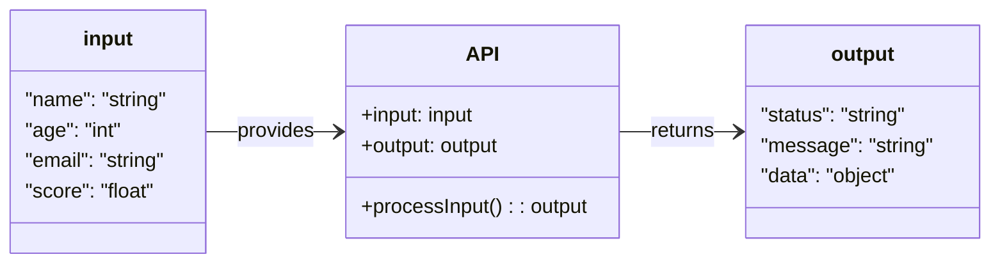

### CRUD Operations

- `Create` -> The operation of adding a new resource or record to a system or database. In RESTful APIs, this is typically done using the HTTP POST method.

- `Read` -> The operation of retrieving or fetching data from a system or database. In RESTful APIs, this is typically done using the HTTP GET method.

- `Update` -> The operation of modifying an existing resource or record in a system or database. In RESTful APIs, this is typically done using the HTTP PUT or PATCH methods.

- `Delete` -> The operation of removing a resource or record from a system or database. In RESTful APIs, this is typically done using the HTTP DELETE method.

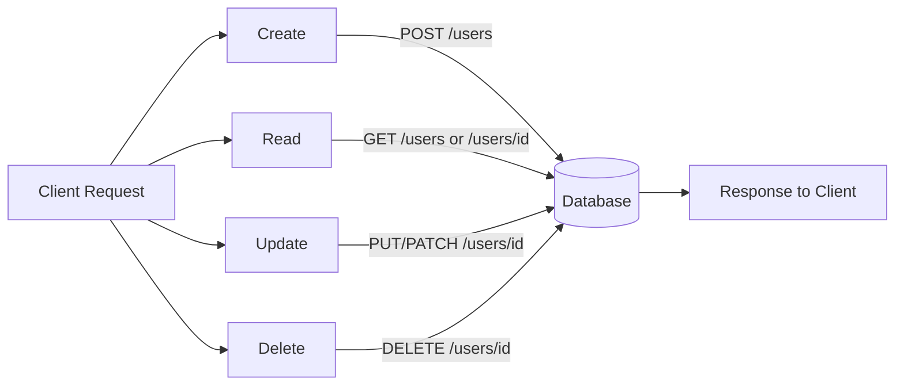

### API Paradigms

- `REST` = *Representational State Transfer* = An architectural style for designing networked applications that relies on stateless communication, standard HTTP methods, and resource-based URLs. RESTful APIs are widely used for web services and provide a simple and scalable way to interact with resources over the internet. Uses `JSON` or `XML` for data representation and supports CRUD operations through HTTP methods.
    - **Advantages**: Simplicity, scalability, statelessness, and wide adoption.
    - **Disadvantages**: Limited support for complex operations, potential over-fetching or under-fetching of data, and reliance on HTTP methods.

- `GraphQL` = A query language for APIs that allows clients to request only the data they need, enabling more efficient data retrieval and reducing over-fetching or under-fetching of data.
    - **Advantages**: Flexibility, efficiency, strong typing, and a single endpoint for all queries.
    - **Disadvantages**: Complexity, learning curve, potential performance issues with complex queries, and reliance on a single endpoint.

- `gRPC` = A high-performance, open-source framework that uses HTTP/2 for transport, Protocol Buffers as the interface description language, and provides features such as authentication, load balancing, and more. gRPC is commonly used for connecting services in microservices architectures.
    - **Advantages**: High performance, support for multiple programming languages, streaming capabilities, and strong typing.
    - **Disadvantages**: Complexity, learning curve, reliance on Protocol Buffers, and limited browser support.

## Idempotent Services

Idempotent services are those that can be called multiple times with the same input and produce the same result without causing unintended side effects. In other words, making the same request multiple times will not change the state of the system beyond the initial application of that request. Idempotency is an important property for APIs and services, as it ensures reliability and predictability in distributed systems.

---

# Backward Compatibility and Versioning

Backward compatibility and versioning are crucial aspects of API design, ensuring that changes to the API do not break existing clients. Backward compatibility means that new versions of the API continue to support older clients without requiring them to make changes. Versioning allows developers to introduce new features, improvements, or changes to the API while maintaining support for existing clients.

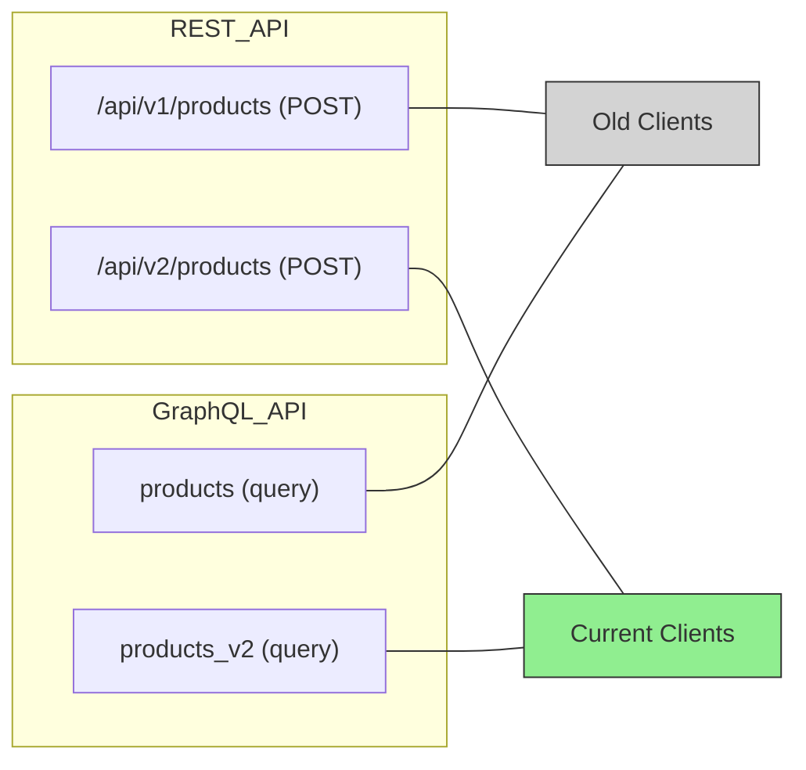

### Rate Limiting

Rate limiting is a technique used to control the amount of incoming requests to a service or API within a specific time period. It helps prevent abuse, ensures fair usage, and protects the system from being overwhelmed by excessive requests. Rate limiting can be implemented using various strategies, such as token buckets, leaky buckets, or fixed windows.

### CORS

CORS (Cross-Origin Resource Sharing) is a security feature implemented by web browsers to restrict web pages from making requests to a different domain than the one that served the web page. It helps prevent malicious websites from accessing sensitive data on other domains. CORS can be configured on the server to allow or deny requests from specific origins, methods, and headers.

For example, if a web page served from `https://example.com` tries to make an AJAX request to `https://api.example.org`, the browser will block the request unless the server at `api.example.org` explicitly allows it through CORS headers.

### Browser Caching

Browser caching is a technique used to store copies of web resources, such as HTML, CSS, JavaScript, and images, on the client's browser. This helps reduce the load on the server, decrease latency, and improve the overall user experience. Caching can be controlled using HTTP headers, such as `Cache-Control`, `Expires`, and `ETag`.

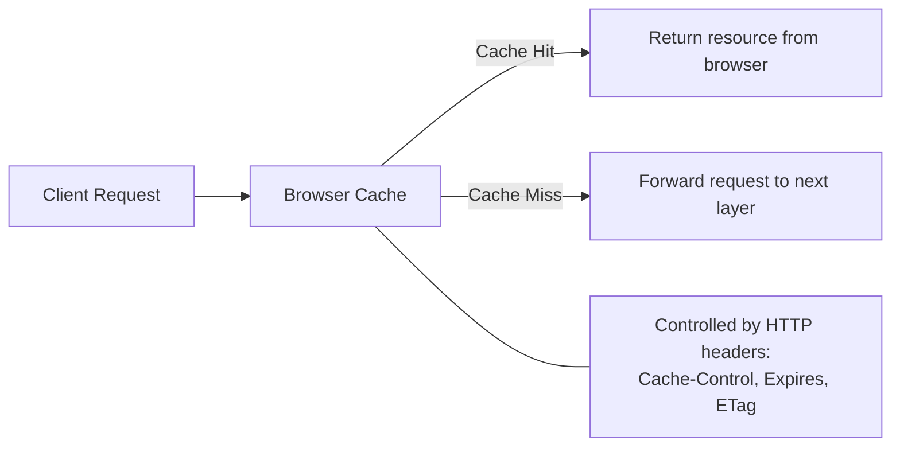

### Cache Ratio

*CACHE RATIO = CACHE HITS / (CACHE HITS + CACHE MISSES)*

Cache ratio is a metric used to measure the effectiveness of caching in a system. It is calculated as the ratio of cache hits to the total number of cache accesses. A higher cache ratio indicates that the cache is being utilized effectively, reducing the load on the server and improving response times.

- `Cache Hit` = A cache hit occurs when a requested resource is found in the cache, allowing the system to serve the resource quickly without needing to fetch it from the original source.

- `Cache Miss` = A cache miss occurs when a requested resource is not found in the cache, requiring the system to fetch the resource from the original source, which can result in increased latency and load on the server.

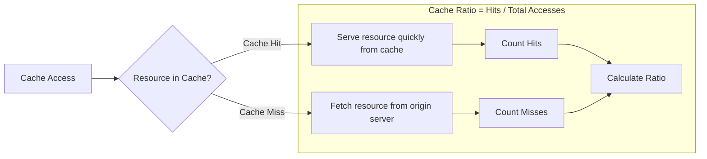

### Server Caching

Server caching is a technique used to store copies of frequently accessed data on the server side, reducing the need to fetch the same data repeatedly from the database or other backend services. This helps improve response times, reduce server load, and enhance overall system performance. Server caching can be implemented using in-memory caches, distributed caches, or content delivery networks (`CDNs`).

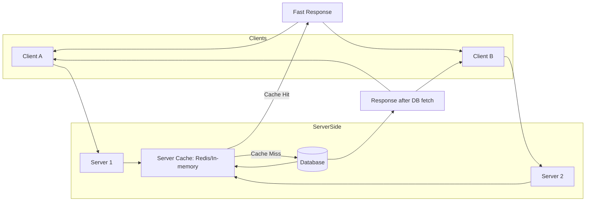

### Write-Around Caching

Write-around caching is a caching strategy where write operations bypass the cache and go directly to the underlying data store. This approach is used to prevent the cache from being filled with data that may not be frequently accessed, which can lead to cache pollution. Write-around caching is suitable for scenarios where write operations are infrequent or when the data being written is unlikely to be read soon after.

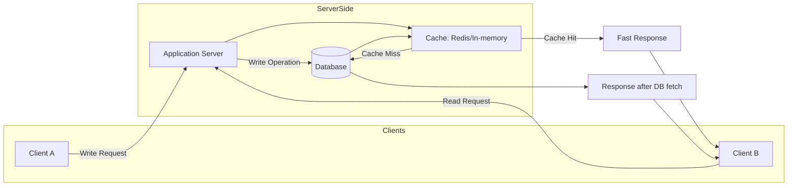

### Write-Through Caching

Write-through caching is a caching strategy where write operations are performed on both the cache and the underlying data store simultaneously. This ensures that the cache always contains the most up-to-date data, reducing the risk of cache misses and improving read performance. Write-through caching is suitable for scenarios where data consistency is critical, and read operations are frequent.

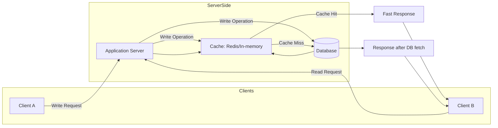

### Write-Back Caching

Write-back caching is a caching strategy where write operations are initially performed only on the cache, and the data is written back to the underlying data store at a later time. This approach can improve write performance by reducing the number of write operations to the data store, but it introduces the risk of data loss in case of cache failure. Write-back caching is suitable for scenarios where write performance is critical, and occasional data loss can be tolerated.

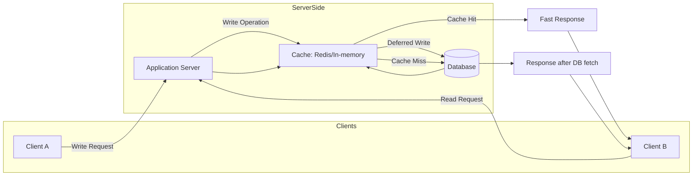

### Eviction Policies

Eviction policies are strategies used to manage the contents of a cache when it becomes full. These policies determine which items should be removed from the cache to make room for new data. Common eviction policies include:
- `Least Recently Used (LRU)` = Removes the least recently accessed items from the cache first, based on the assumption that items accessed recently are more likely to be accessed again.
- `Least Frequently Used (LFU)` = Removes the least frequently accessed items from the cache first, based on the assumption that items accessed less often are less likely to be needed in the future.
- `First In, First Out (FIFO)` = Removes the oldest items from the cache first, based on the order in which they were added to the cache.

### Database Caching

Database caching is a technique used to store frequently accessed data from a database in a cache, reducing the need to query the database repeatedly. This helps improve query performance, reduce database load, and enhance overall system responsiveness. Database caching can be implemented using in-memory caches, distributed caches, or specialized database caching solutions.

### CDN (Content Delivery Network)

A Content Delivery Network (CDN) is a distributed network of servers that deliver web content, such as images, videos, and other static assets, to users based on their geographic location. CDNs help reduce latency, improve load times, and enhance the overall user experience by caching content closer to the end-users. Popular CDN providers include Cloudflare, Akamai, and Amazon CloudFront.

- `Pull-based CDN` = A pull-based CDN retrieves content from the origin server only when a user requests it for the first time. The content is then cached on the CDN servers for subsequent requests, reducing the load on the origin server and improving response times for users. Useful for content that is not frequently updated or when the origin server has sufficient capacity to handle initial requests.

- `Push-based CDN` = A push-based CDN requires the content to be proactively uploaded or pushed to the CDN servers by the content owner or origin server. This approach ensures that the content is available on the CDN servers before any user requests it, which can be beneficial for time-sensitive or frequently updated content. Useful for scenarios where content needs to be preloaded or when the origin server has limited capacity to handle requests.

*When to use CDN and when to Hit the origin server?*

- Use `CDN` when:
  - The content is static and does not change frequently.
  - The user base is geographically distributed, and you want to reduce latency by serving content from servers closer to the users.
  - You want to offload traffic from the origin server to improve performance and scalability.
  - Benefits: 
    - Reduced latency and faster load times for users.
    - Improved scalability and reduced load on the origin server.
    - Enhanced security through DDoS protection and SSL/TLS support.

- Hit the `origin server` when:
  - The content is dynamic and changes frequently.
  - The user base is concentrated in a specific geographic location.
  - You need to ensure the most up-to-date content is served.
  - Benefits:
    - Ensures that users receive the latest content without caching delays.
    - Allows for more control over content delivery and personalization.
    - Reduces the complexity of managing a CDN for dynamic content.

---

# Proxy Servers

A proxy server acts as an intermediary between clients and servers, forwarding client requests to the appropriate server and returning the server's response to the client. Proxy servers can be used for various purposes, including improving performance, enhancing security, and enabling access control.

### Types of Proxy Servers

1. **Forward Proxy**: A forward proxy sits between the client and the server, forwarding client requests to the server. It is commonly used to control and monitor outbound traffic from a network, provide anonymity, and cache content to improve performance.

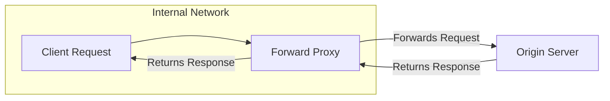

2. **Reverse Proxy**: A reverse proxy sits between the server and the client, forwarding client requests to the appropriate server. It is commonly used for load balancing, caching, SSL termination, and protecting backend servers from direct exposure to the internet.
- Use cases: 
  - Load balancing: Distributing incoming requests across multiple backend servers to ensure optimal resource utilization and prevent any single server from becoming a bottleneck.
  - CDNs: Serving cached content from edge servers to reduce latency and improve performance for users located far from the origin server.
  - Firewall (WAFs): Acting as an additional layer of security by filtering incoming requests and blocking malicious traffic before it reaches the backend servers.
  - SSL Offloading: Terminating SSL/TLS connections at the reverse proxy to reduce the computational load on backend servers and improve overall performance.

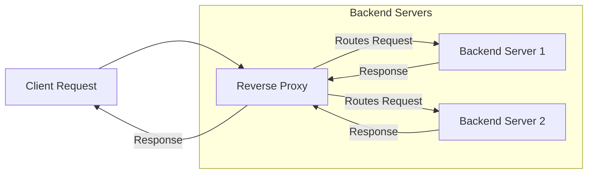

3. **Open Proxy**: An open proxy is a proxy server that is accessible by any client on the internet. It can be used for anonymity and bypassing restrictions, but it may also pose security risks if not properly managed.

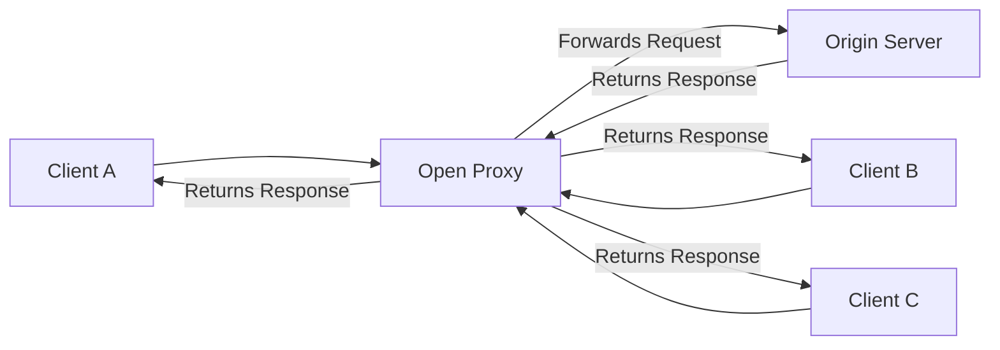

4. **Transparent Proxy**: A transparent proxy intercepts client requests without requiring any configuration on the client side. It can be used for content filtering, caching, and monitoring, but it may also raise privacy concerns.

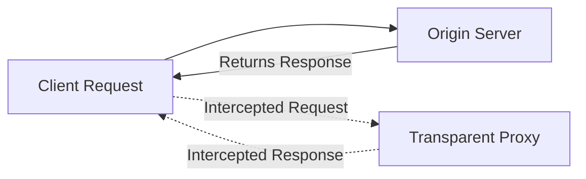

5. **Anonymous Proxy**: An anonymous proxy hides the client's IP address from the server, providing a level of anonymity for the client. It can be used for privacy protection and bypassing geo-restrictions.

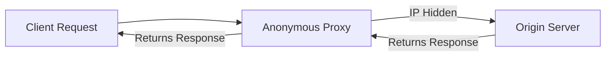

6. **Distorting Proxy**: A distorting proxy modifies the client's IP address or other identifying information before forwarding the request to the server. It can be used for anonymity and privacy protection, but it may also lead to issues with content delivery and access control.

```mermaid
graph LR
Client[Client Request] --> DistortingProxy[Distorting Proxy]
DistortingProxy -->|IP Modified| Server[Origin Server]
Server -->|Returns Response| DistortingProxy
DistortingProxy -->|Returns Response| Client
```

7. **High Anonymity Proxy (Elite Proxy)**: A high anonymity proxy, also known as an elite proxy, provides the highest level of anonymity by not revealing that it is a proxy server and not passing any identifying information about the client to the server. It can be used for maximum privacy protection and bypassing restrictions.

```mermaid
graph LR
Client[Client Request] --> HighAnonymityProxy["High Anonymity Proxy (Camouflaged)"]
HighAnonymityProxy -->|Appears as Direct Client| Server[Origin Server]
Server -->|Returns Response| HighAnonymityProxy
HighAnonymityProxy -->|Returns Response| Client
```

8. **Caching Proxy**: A caching proxy stores copies of frequently accessed resources, such as web pages or images, to reduce the load on the origin server and improve response times for clients. When a client requests a resource, the caching proxy checks if it has a cached copy and serves it if available; otherwise, it fetches the resource from the origin server.

```mermaid
graph LR
Client[Client Request] --> CachingProxy[Caching Proxy]
CachingProxy -->|Check Cache| Cache[(Cache Storage)]
Cache -->|Cache Hit| CachingProxy
Cache -->|Cache Miss| Server[Origin Server]
Server -->|Returns Response| CachingProxy
CachingProxy -->|Returns Response| Client
```

---

# Load Balancing

Load balancing is a technique used to distribute incoming network traffic across multiple servers or resources to ensure optimal resource utilization, minimize response time, and prevent any single server from becoming a bottleneck. Load balancers can be implemented at various layers of the network stack, including the application layer (Layer 7) and the transport layer (Layer 4).

### Common Strategies and Algorithms Used in Load Balancing

1. **Round Robin**: Distributes incoming requests sequentially across a group of servers. Each server receives an equal number of requests in a cyclic order.

```mermaid
graph LR
    subgraph Clients
        C1[Client Request 1]
        C2[Client Request 2]
        C3[Client Request 3]
    end

    C1 --> LB[Load Balancer]
    C2 --> LB
    C3 --> LB

    LB -.Round Robin.-> S1[Server 1]
    LB -.Round Robin.-> S2[Server 2]
    LB -.Round Robin.-> S3[Server 3]
    LB -.Round Robin.-> S4[Server 4]
```

Round Robin Algorithm example:

```python
class RoundRobinLoadBalancer:
    def __init__(self, servers):
        self.servers = servers
        self.index = 0

    def get_server(self):
        # Selects the next server in order
        server = self.servers[self.index]
        # Updates the index for the next cycle
        self.index = (self.index + 1) % len(self.servers)
        return server


# Example usage
servers = ["Server1", "Server2", "Server3", "Server4"]
load_balancer = RoundRobinLoadBalancer(servers)

# Simulating 10 client requests
for i in range(10):
    server = load_balancer.get_server()
    print(f"Request {i+1} -> {server}")

# Output:
# Request 1 -> Server1
# Request 2 -> Server2
# Request 3 -> Server3
# Request 4 -> Server4
# Request 5 -> Server1
# Request 6 -> Server2
# Request 7 -> Server3
# Request 8 -> Server4
# Request 9 -> Server1
# Request 10 -> Server2
```

---

2. **Least Connections**: Directs incoming requests to the server with the fewest active connections, ensuring that servers with lower loads receive more traffic.

```mermaid
graph LR
    subgraph Clients
        C1[Client Request 1]
        C2[Client Request 2]
        C3[Client Request 3]
    end

    C1 --> LB[Load Balancer]
    C2 --> LB
    C3 --> LB

    LB -->|Least Connections| S1[Server 1 - 2 conns]
    LB -->|Least Connections| S2[Server 2 - 1 conn]
    LB -->|Least Connections| S3[Server 3 - 3 conns]
    LB -->|Least Connections| S4[Server 4 - 0 conns]
```

Least Connections Algorithm example:

```python
class LeastConnectionsLoadBalancer:
    def __init__(self, servers):
        # Each server starts with 0 connections
        self.servers = {server: 0 for server in servers}

    def get_server(self):
        # Selects the server with the fewest connections
        server = min(self.servers, key=self.servers.get)
        # Increments the connection count
        self.servers[server] += 1
        return server

    def release_connection(self, server):
        # Releases a connection (when the client finishes)
        if self.servers[server] > 0:
            self.servers[server] -= 1


# Example usage
servers = ["Server1", "Server2", "Server3", "Server4"]
load_balancer = LeastConnectionsLoadBalancer(servers)

# Simulating 10 requests
for i in range(10):
    server = load_balancer.get_server()
    print(f"Request {i+1} -> {server}")

# Simulating release of some connections
load_balancer.release_connection("Server1")
load_balancer.release_connection("Server4")

print("\nFinal state of servers:")
print(load_balancer.servers)

# Output:
# Request 1 -> Server1
# Request 2 -> Server2
# Request 3 -> Server3
# Request 4 -> Server4
# Request 5 -> Server4
# Request 6 -> Server2
# Request 7 -> Server1
# Request 8 -> Server3
# Request 9 -> Server4
# Request 10 -> Server2

# Final state of servers:
{'Server1': 2, 'Server2': 3, 'Server3': 2, 'Server4': 3}
```

---

3. **Last Response Time**: Routes requests to the server with the fastest response time, ensuring that clients receive quick responses and improving overall system performance.

```mermaid
graph LR
    subgraph Clients
        C1[Client Request 1]
        C2[Client Request 2]
        C3[Client Request 3]
    end

    C1 --> LB[Load Balancer]
    C2 --> LB
    C3 --> LB

    LB -->|Least Response Time| S1[Server 1 - Fast]
    LB -->|Least Response Time| S2[Server 2 - Slow]
    LB -->|Least Response Time| S3[Server 3 - Fast]
    LB -->|Least Response Time| S4[Server 4 - Slow]
```

Least Response Time Algorithm example:

```python
import random
import time

class LeastResponseTimeLoadBalancer:
    def __init__(self, servers):
        # Each server has a simulated response time
        self.servers = {server: random.uniform(0.1, 1.0) for server in servers}

    def get_server(self):
        # Selects the server with the lowest response time
        server = min(self.servers, key=self.servers.get)
        return server

    def simulate_response(self, server):
        # Simulates the server's response time
        response_time = self.servers[server]
        time.sleep(response_time)  # only for simulation
        return response_time

    def update_response_times(self):
        # Updates response times dynamically (simulation)
        for server in self.servers:
            self.servers[server] = random.uniform(0.1, 1.0)


# Example usage
servers = ["Server1", "Server2", "Server3", "Server4"]
load_balancer = LeastResponseTimeLoadBalancer(servers)

# Simulating 5 requests
for i in range(5):
    load_balancer.update_response_times()
    server = load_balancer.get_server()
    response_time = load_balancer.simulate_response(server)
    print(f"Request {i+1} -> {server} (response time: {response_time:.2f}s)")

# Output (Example, response times may vary due to random simulation):
# Request 1 -> Server3 (response time: 0.15s)
# Request 2 -> Server1 (response time: 0.20s)
# Request 3 -> Server4 (response time: 0.12s)
# Request 4 -> Server2 (response time: 0.18s)
# Request 5 -> Server3 (response time: 0.10s)
```

---

4. **IP Hashing**: Uses a hash function on the client's IP address to determine which server should handle the request. This ensures that requests from the same client are consistently routed to the same server, which can be useful for session persistence.

```mermaid
graph LR
    subgraph Clients
        C1[Client Request - IP 192.168.0.10]
        C2[Client Request - IP 192.168.0.11]
        C3[Client Request - IP 192.168.0.12]
    end

    C1 --> LB[Load Balancer - IP Hashing]
    C2 --> LB
    C3 --> LB

    LB -->|Hash IP % N| S1[Server 1]
    LB -->|Hash IP % N| S2[Server 2]
    LB -->|Hash IP % N| S3[Server 3]
    LB -->|Hash IP % N| S4[Server 4]
```

IP Hashing Algorithm example:

```python
import hashlib

class IPHashLoadBalancer:
    def __init__(self, servers):
        self.servers = servers

    def get_server(self, client_ip):
        # Creates a hash of the IP
        ip_hash = int(hashlib.md5(client_ip.encode()).hexdigest(), 16)
        # Selects the server based on the hash
        server_index = ip_hash % len(self.servers)
        return self.servers[server_index]


# Example usage
servers = ["Server1", "Server2", "Server3", "Server4"]
load_balancer = IPHashLoadBalancer(servers)

client_ips = ["192.168.0.10", "192.168.0.11", "192.168.0.12", "192.168.0.13"]

for i, ip in enumerate(client_ips, start=1):
    server = load_balancer.get_server(ip)
    print(f"Request {i} from {ip} -> {server}")

# Output (example, servers may vary depending on the hash):
# Request 1 from 192.168.0.10 -> Server3
# Request 2 from 192.168.0.11 -> Server1
# Request 3 from 192.168.0.12 -> Server4
# Request 4 from 192.168.0.13 -> Server2
```

---

5. **Weighted Algorithms**: Assigns different weights to servers based on their capacity or performance. Servers with higher weights receive a larger share of incoming requests, allowing for more efficient resource utilization.

```mermaid
graph LR
    subgraph Clients
        C1[Client Request 1]
        C2[Client Request 2]
        C3[Client Request 3]
        C4[Client Request 4]
        C5[Client Request 5]
    end

    C1 --> LB[Load Balancer - Weighted]
    C2 --> LB
    C3 --> LB
    C4 --> LB
    C5 --> LB

    LB -->|Weight 3| S1[Server 1]
    LB -->|Weight 2| S2[Server 2]
    LB -->|Weight 1| S3[Server 3]
    LB -->|Weight 4| S4[Server 4]
```

Example of Weighted Algorithm:

```python
import random

class WeightedLoadBalancer:
    def __init__(self, servers, weights):
        self.servers = servers
        self.weights = weights

    def get_server(self):
        # Selects server based on the weights
        server = random.choices(self.servers, weights=self.weights, k=1)[0]
        return server


# Example usage
servers = ["Server1", "Server2", "Server3", "Server4"]
weights = [3, 2, 1, 4]  # Server1 has weight 3, Server2 has weight 2, etc.

load_balancer = WeightedLoadBalancer(servers, weights)

# Simulating 10 requests 
for i in range(10):
    server = load_balancer.get_server()
    print(f"Request {i+1} -> {server}")

# Output:
# Request 1 -> Server4
# Request 2 -> Server1
# Request 3 -> Server4
# Request 4 -> Server2
# Request 5 -> Server1
# Request 6 -> Server4
# Request 7 -> Server3
# Request 8 -> Server1
# Request 9 -> Server2
# Request 10 -> Server4
```

---

6. **Geographic Load Balancing**: Routes requests to servers based on the geographic location of the client. This approach helps reduce latency and improve performance by directing users to the nearest server.

```mermaid
graph LR
    subgraph Clients
        C1[Client - São Paulo, BR]
        C2[Client - New York, US]
        C3[Client - Paris, FR]
        C4[Client - Tokyo, JP]
    end

    C1 --> LB[Load Balancer - Geographic]
    C2 --> LB
    C3 --> LB
    C4 --> LB

    LB -->|Region: South America| S1[Server - Brazil]
    LB -->|Region: North America| S2[Server - USA]
    LB -->|Region: Europe| S3[Server - France]
    LB -->|Region: Asia| S4[Server - Japan]
```

Example of Geographic Load Balancing:

```python
class GeographicLoadBalancer:
    def __init__(self, region_servers):
        # region_servers is a dictionary {region: server}
        self.region_servers = region_servers

    def get_server(self, client_region):
        # Selects server based on the client's region
        return self.region_servers.get(client_region, "Default Server")


# Example usage
region_servers = {
    "South America": "Server-Brazil",
    "North America": "Server-USA",
    "Europe": "Server-France",
    "Asia": "Server-Japan"
}

load_balancer = GeographicLoadBalancer(region_servers)

clients = [
    ("São Paulo", "South America"),
    ("New York", "North America"),
    ("Paris", "Europe"),
    ("Tokyo", "Asia"),
    ("Sydney", "Oceania")  # region not mapped
]

for i, (city, region) in enumerate(clients, start=1):
    server = load_balancer.get_server(region)
    print(f"Request {i} from {city} ({region}) -> {server}")

# Output:
# Request 1 from São Paulo (South America) -> Server-Brazil
# Request 2 from New York (North America) -> Server-USA
# Request 3 from Paris (Europe) -> Server-France
# Request 4 from Tokyo (Asia) -> Server-Japan
# Request 5 from Sydney (Oceania) -> Default Server
```

---

7. **Consistent Hashing**: A technique used to distribute requests across a dynamic set of servers while minimizing the number of requests that need to be remapped when servers are added or removed. It is particularly useful in distributed systems and caching scenarios.

```mermaid
graph LR
    subgraph Clients
        C1[Client Request - Key A]
        C2[Client Request - Key B]
        C3[Client Request - Key C]
        C4[Client Request - Key D]
    end

    C1 --> LB[Load Balancer - Consistent Hashing]
    C2 --> LB
    C3 --> LB
    C4 --> LB

    LB -->|Hash-Key → Ring| Ring[Hash Ring]
    Ring --> S1[Server 1]
    Ring --> S2[Server 2]
    Ring --> S3[Server 3]
    Ring --> S4[Server 4]
```

Example of Consistent Hashing Algorithm:

```python
import hashlib
import bisect

class ConsistentHashingLoadBalancer:
    def __init__(self, servers, replicas=3):
        self.replicas = replicas
        self.ring = {}
        self.sorted_keys = []
        for server in servers:
            for i in range(replicas):
                key = self._hash(f"{server}:{i}")
                self.ring[key] = server
                self.sorted_keys.append(key)
        self.sorted_keys.sort()

    def _hash(self, key):
        return int(hashlib.md5(key.encode()).hexdigest(), 16)

    def get_server(self, client_key):
        h = self._hash(client_key)
        idx = bisect.bisect(self.sorted_keys, h) % len(self.sorted_keys)
        return self.ring[self.sorted_keys[idx]]


# Example usage
servers = ["Server1", "Server2", "Server3", "Server4"]
load_balancer = ConsistentHashingLoadBalancer(servers)

client_keys = ["KeyA", "KeyB", "KeyC", "KeyD", "KeyE"]

for key in client_keys:
    server = load_balancer.get_server(key)
    print(f"Request from {key} -> {server}")

# Output (example, servers may vary due to hashing):
# Request from KeyA -> Server2
# Request from KeyB -> Server4
# Request from KeyC -> Server1
# Request from KeyD -> Server3
# Request from KeyE -> Server2
```

---

8. **Health Checks**: Load balancers often perform health checks on backend servers to ensure they are operational and capable of handling requests. If a server fails a health check, the load balancer will stop routing traffic to that server until it becomes healthy again.

```mermaid
graph LR
    subgraph LoadBalancer
        LB[Load Balancer]
    end

    subgraph BackendServers
        S1[Server 1]
        S2[Server 2]
        S3[Server 3]
    end

    LB -->|Health Check| S1
    LB -->|Health Check| S2
    LB -->|Health Check| S3

    S1 -->|Healthy| LB
    S2 -.Unhealthy.-> LB
    S3 -->|Healthy| LB

    LB -->|Routes Traffic| S1
    LB -.Does Not Route Traffic.-> S2
    LB -->|Routes Traffic| S3
```

Health Check Algorithm example:

```python
class HealthCheckLoadBalancer:
    def __init__(self, servers):
        self.servers = {server: True for server in servers}  # True means healthy

    def health_check(self, server):
        # Simulate a health check (in real scenarios, this would be an actual check)
        return self.servers[server]

    def get_healthy_servers(self):
        return [server for server, healthy in self.servers.items() if healthy]

    def route_request(self):
        healthy_servers = self.get_healthy_servers()
        if not healthy_servers:
            raise Exception("No healthy servers available")
        # For simplicity, just return the first healthy server
        return healthy_servers[0]

# Example usage
servers = ["Server1", "Server2", "Server3"]
load_balancer = HealthCheckLoadBalancer(servers)

# Simulating health checks
load_balancer.servers["Server1"] = True  # Healthy
load_balancer.servers["Server2"] = False  # Unhealthy
load_balancer.servers["Server3"] = True  # Healthy

# Routing requests
for i in range(5):
    try:
        server = load_balancer.route_request()
        print(f"Request {i+1} routed to {server}")
    except Exception as e:
        print(f"Request {i+1} failed: {e}")

# Output:
# Request 1 routed to Server1
# Request 2 routed to Server1
# Request 3 routed to Server1
# Request 4 routed to Server1
# Request 5 routed to Server1
```

---

## Hardware Load Balancers

Hardware load balancers are physical devices designed to distribute network traffic across multiple servers. They offer high performance, reliability, and advanced features for managing traffic in large-scale environments. Hardware load balancers are often used in enterprise settings where high availability and low latency are critical.

Example of hardware load balancer vendors include `F5 Networks`, `Citrix ADC` (formerly NetScaler), and `A10 Networks`.

---

## Software Load Balancers

Software load balancers are applications or services that run on standard hardware or virtual machines to distribute network traffic across multiple servers. They provide flexibility, scalability, and cost-effectiveness compared to hardware load balancers. Software load balancers can be deployed in cloud environments, on-premises, or in hybrid setups.

Examples of software load balancer solutions include `NGINX`, `HAProxy`, and `Traefik`.

---

## Cloud-Based Load Balancers

Cloud-based load balancers are managed services provided by cloud providers that distribute incoming traffic across multiple servers or instances in the cloud. They offer scalability, high availability, and integration with other cloud services, making them suitable for dynamic and elastic workloads.

Examples of cloud-based load balancer services include `AWS Elastic Load Balancing (ELB)`, `Google Cloud Load Balancing`, and `Azure Load Balancer`.

---

### What if Load Balancer Goes Down?

If a load balancer goes down, it can become a single point of failure, potentially disrupting access to the services it manages. This can lead to downtime, degraded performance, and loss of availability for users, it will affect the entire system's reliability.

To avoid this, we have several strategies to ensure high availability and fault tolerance for load balancers:

- **Redundancy**: Deploy multiple load balancers in an active-active or active-passive configuration. This ensures that if one load balancer fails, another can take over and continue routing traffic without interruption.

```mermaid
graph LR
    subgraph Clients
        C1[Client 1]
        C2[Client 2]
        C3[Client 3]
        C4[Client 4]
    end

    C1 --> SMain1[Main Server A]
    C2 --> SMain1
    C3 --> SMain2[Main Server B]
    C4 --> SMain2

    SMain1 -.Replicated Data.-> R1[Redundant Server 1]
    SMain1 -.Replicated Data.-> R2[Redundant Server 2]
    SMain2 -.Replicated Data.-> R2
    SMain2 -.Replicated Data.-> R3[Redundant Server 3]
```

In case of failure of a load balancer, the redundant servers can take over the traffic routing responsibilities, ensuring that clients can still access the services without significant disruption.

```mermaid
graph LR
    subgraph Clients
        C1[Client 1]
        C2[Client 2]
        C3[Client 3]
        C4[Client 4]
    end

    C1 --> SMain1[Main Server A]
    C2 --> SMain1[Main Server A]
    C3 --> SMain1[Main Server A]
    C4 --> SMain1[Main Server A]

    SMain1 -.Replicated Data.-> R1[Redundant Server 1]
    SMain1 -.Replicated Data.-> R2[Redundant Server 2]
    SMain2 -.Not Disponible.-> R2
    SMain2 -.Not Disponible.-> R3[Redundant Server 3]
```

---

- **Health Checks and Monitoring**: Implement health checks to monitor the status of load balancers and backend servers. If a load balancer fails, traffic can be rerouted to healthy load balancers or servers.

```mermaid
graph LR
    subgraph Clients
        C1[Client Request 1]
        C2[Client Request 2]
        C3[Client Request 3]
    end

    C1 --> LB1[Load Balancer A ✅ Healthy]
    C2 --> LB1
    C3 --> LB2[Load Balancer B ❌ Failed]

    LB1 --> S1[Server 1 ✅ Healthy]
    LB1 --> S2[Server 2 ✅ Healthy]
    LB2 --> S3[Server 3 ❌ Failed]
    LB2 --> S4[Server 4 ✅ Healthy]

    subgraph Monitoring
        HC1[Health Check LB1]
        HC2[Health Check LB2]
        HC3[Health Check Servers]
    end

    HC1 --> LB1
    HC2 --> LB2
    HC3 --> S1
    HC3 --> S2
    HC3 --> S3
    HC3 --> S4

    LB2 -.Traffic rerouted.-> LB1
```

- **Auto-scaling and Self-healing**: In cloud environments, use auto-scaling groups and self-healing mechanisms to automatically replace failed load balancers with new instances.

```mermaid
graph LR
    subgraph Clients
        C1[Client Request 1]
        C2[Client Request 2]
        C3[Client Request 3]
        C4[Client Request 4]
    end

    C1 --> LB1[Load Balancer A ✅ Healthy]
    C2 --> LB1
    C3 --> LB2[Load Balancer B ❌ Failed]
    C4 --> LB2

    subgraph AutoScalingGroup
        NewLB[New Load Balancer Instance]
    end

    LB1 --> S1[Server 1 ✅ Healthy]
    LB1 --> S2[Server 2 ✅ Healthy]
    LB2 --> S3[Server 3 ❌ Failed]
    LB2 --> S4[Server 4 ✅ Healthy]

    Monitoring[Health Checks & Monitoring] --> LB1
    Monitoring --> LB2
    Monitoring --> S1
    Monitoring --> S2
    Monitoring --> S3
    Monitoring --> S4

    LB2 -.Detected Failure.-> Monitoring
    Monitoring -.Trigger Self-healing.-> NewLB
    NewLB --> S1
    NewLB --> S2
    NewLB --> S4
```


- **DNS Failover**: Use DNS failover techniques to redirect traffic to backup load balancers or servers in case of a failure. This can be achieved using low TTL (Time-to-Live) values for DNS records and monitoring the health of load balancers.

```mermaid
graph LR
    subgraph Clients
        C1[Client Request 1]
        C2[Client Request 2]
        C3[Client Request 3]
    end

    C1 --> DNS[DNS Resolver]
    C2 --> DNS
    C3 --> DNS

    DNS --> LB1[Load Balancer A ✅ Healthy]
    DNS --> LB2[Load Balancer B ❌ Failed]

    LB1 --> S1[Server 1 ✅ Healthy]
    LB1 --> S2[Server 2 ✅ Healthy]
    LB2 --> S3[Server 3 ❌ Failed]
    LB2 --> S4[Server 4 ✅ Healthy]

    subgraph Monitoring
        HC1[Health Check LB1]
        HC2[Health Check LB2]
    end

    HC1 --> LB1
    HC2 --> LB2

    LB2 -.Failure Detected.-> DNS
    DNS -.Low TTL Redirect.-> LB1
```

---

# Database

Is a structured collection of data that can be easily accessed, managed, and updated.

### Types of Databases

- **Relational Databases (SQL)**: These databases use structured query language (SQL) for defining and manipulating data. They are based on a table-based structure, where data is organized into rows and columns. Examples include `MySQL`, `PostgreSQL`, `Oracle Database`, and `Microsoft SQL Server`.

```mermaid
classDiagram
direction LR
    class Users {
        +id: INT <<PK>>
        +name: VARCHAR
        +email: VARCHAR
    }

    class Orders {
        +id: INT <<PK>>
        +user_id: INT <<FK>>
        +order_date: DATE
        +amount: DECIMAL
    }

    class Products {
        +id: INT <<PK>>
        +name: VARCHAR
        +price: DECIMAL
    }

    class OrderItems {
        +id: INT <<PK>>
        +order_id: INT <<FK>>
        +product_id: INT <<FK>>
        +quantity: INT
    }

    Users "1" --> "many" Orders : user_id
    Orders "1" --> "many" OrderItems : order_id
    Products "1" --> "many" OrderItems : product_id
```

Relational databases are also ACID compliant, which means they guarantee Atomicity, Consistency, Isolation, and Durability of transactions. This makes them suitable for applications that require strong data integrity and consistency.

**ACID** means:

**Atomicity**: Ensures that all operations within a transaction are completed successfully. If any operation fails, the entire transaction is rolled back, and the database remains unchanged.

**Consistency**: Ensures that a transaction brings the database from one valid state to another valid state, maintaining the integrity of the data.

**Isolation**: Ensures that concurrent transactions do not interfere with each other. Each transaction is executed in isolation, and the intermediate state of a transaction is not visible to other transactions until it is committed.

**Durability**: Ensures that once a transaction is committed, it remains permanent in the database, even in the event of a system failure.

---

- **NoSQL Databases**: These databases are designed to handle unstructured or semi-structured data and provide flexible schema designs. They are often used for large-scale, distributed applications that require high performance and scalability. Examples include `MongoDB`, `Cassandra`, `Redis`, and `Couchbase`.

```mermaid
classDiagram
direction LR
    class Users {
        +_id: ObjectId <<PK>>
        +name: String
        +email: String
        +preferences: JSON
    }

    class Orders {
        +_id: ObjectId <<PK>>
        +user_id: ObjectId <<Ref>>
        +items: Array
        +status: String
    }

    class Products {
        +_id: ObjectId <<PK>>
        +name: String
        +price: Number
        +tags: Array
    }

    Users <.. Orders : "Embedded/Reference"
    Orders o-- Products : "Embedded Array"
```

In NoSQL databases, data can be stored in various formats, such as key-value pairs, documents, column families, or graphs. They are schema-less and often used in scenarios where the data structure is dynamic or when horizontal scalability is required.

NoSQL databases are faster because they run in memory and are optimized for specific use cases, such as caching, real-time analytics, or handling large volumes of unstructured data. However, they may sacrifice some ACID properties in favor of performance and scalability.

---

### Database Scalability

Database scalability refers to the ability of a database to handle an increasing amount of data or traffic without compromising performance. There are two main types of scalability:

1. **Vertical Scalability (Scale Up)**: Involves adding more resources (CPU, RAM, storage) to a single database server to handle increased load. This approach is limited by the maximum capacity of the hardware and can lead to downtime during upgrades.

2. **Horizontal Scalability (Scale Out)**: Involves adding more database servers to distribute the load and handle increased traffic. This approach allows for better fault tolerance and can be achieved through techniques such as sharding, replication, and clustering.

### Sharding Strategies

Sharding is a database architecture pattern that involves splitting a large database into smaller, more manageable pieces called shards. Each shard is a separate database that contains a subset of the data. Sharding can improve performance, scalability, and availability by distributing the load across multiple servers.

**Range-based Sharding**: In this strategy, data is divided into shards based on a specific range of values for a particular attribute (e.g., user ID, date). Each shard contains data that falls within a defined range.

```mermaid
graph LR
    Client[Client Requests] --> Router[Shard Router]

    subgraph Shard1["Shard 1"]
        A1[User IDs: 1-1000]
        A2[User IDs: 1001-2000]
    end

    subgraph Shard2["Shard 2"]
        B1[User IDs: 2001-3000]
        B2[User IDs: 3001-4000]
    end

    subgraph Shard3["Shard 3"]
        C1[User IDs: 4001-5000]
        C2[User IDs: 5001-6000]
    end

    Router --> A1
    Router --> A2
    Router --> B1
    Router --> B2
    Router --> C1
    Router --> C2
```

---

**Directory-based Sharding**: In this strategy, a central directory or lookup table is maintained to map data to specific shards. The directory contains information about which shard holds the data for a given key or attribute.

```mermaid
graph TD
    Client[Client Requests] --> Router[Shard Router]
    Router --> Directory

    subgraph Directory["Directory / Lookup Table"]
        D1[User ID 1-1000 → Shard 1]
        D2[User ID 1001-2000 → Shard 2]
    end

    subgraph Shard1["Shard 1"]
        A1[User IDs: 1-1000]
    end

    subgraph Shard2["Shard 2"]
        B1[User IDs: 1001-2000]
    end

    Directory --> A1
    Directory --> B1
```

---

**Geographic Sharding**: In this strategy, data is partitioned based on the geographic location of the users or data centers. Each shard is responsible for handling requests from a specific region, which can help reduce latency and improve performance for users in that region.

```mermaid
graph LR
    Client[Client Requests] --> Router[Geo Router]

    subgraph Shard1["Shard 1 - North America"]
        NA[Users in North America]
    end

    subgraph Shard2["Shard 2 - Europe"]
        EU[Users in Europe]
    end

    subgraph Shard3["Shard 3 - Asia"]
        AS[Users in Asia]
    end

    Router --> NA
    Router --> EU
    Router --> AS
```

---

**Replication-based Sharding**: In this strategy, data is replicated across multiple shards to ensure high availability and fault tolerance. Each shard contains a copy of the data, and requests can be routed to any of the replicas.

Types of replication include:
- **Master-Slave Replication**: One master node handles write operations, while multiple slave nodes handle read operations. Changes made to the master are propagated to the slaves.

```mermaid
graph LR
    Client[Client Requests] -->|Write| Master[Master Node]

    Master -->|Replication| Slave1[Slave Node 1]
    Master -->|Replication| Slave2[Slave Node 2]
    Master -->|Replication| Slave3[Slave Node 3]

    Client -->|Read| Slave1
    Client -->|Read| Slave2
    Client -->|Read| Slave3
```

**Master-to-Master Replication**: Multiple master nodes can handle both read and write operations. Changes made to one master are propagated to the other masters, allowing for better load distribution and fault tolerance.

```mermaid
graph LR
    Client[Client Requests] -->|Write| Master1[Master Node 1]
    Client -->|Write| Master2[Master Node 2]

    Master1 -->|Replication| Master2
    Master2 -->|Replication| Master1

    Client -->|Read| Master1
    Client -->|Read| Master2
```

---

### Database Performance

**Caching**: Implementing caching mechanisms can significantly improve database performance by storing frequently accessed data in memory, reducing the need for repeated database queries. Common caching strategies include:
- **In-Memory Caching**: Storing data in memory for fast access. Examples include `Redis` and `Memcached`.
- **Query Result Caching**: Caching the results of database queries to avoid executing the same query multiple times.
- **Object Caching**: Caching entire objects or entities to reduce database load and improve response times.
- **Content Delivery Networks (CDNs)**: CDNs can cache static content closer to users, reducing latency and improving performance for web applications.
- **Indexing**: Creating indexes on frequently queried columns can speed up data retrieval by allowing the database to quickly locate the desired records without scanning the entire table.
- **Query Optimization**: Analyzing and optimizing database queries can improve performance by reducing execution time and resource usage. Techniques include rewriting queries, using appropriate joins, and avoiding unnecessary subqueries.
- **Connection Pooling**: Reusing database connections through connection pooling can reduce the overhead of establishing new connections for each request, improving performance and resource utilization.
- **Partitioning**: Dividing large tables into smaller, more manageable partitions can improve query performance by allowing the database to scan only the relevant partitions instead of the entire table.
- **Load Balancing**: Distributing database queries across multiple servers can improve performance and availability. Load balancing can be achieved through techniques such as read replicas, sharding, and clustering.
- **Monitoring and Profiling**: Continuously monitoring database performance and profiling queries can help identify bottlenecks and areas for improvement. Tools like `New Relic`, `Datadog`, and `pg_stat_statements` can provide insights into query performance and resource usage.
- **Database Tuning**: Regularly tuning database parameters, such as memory allocation, cache sizes, and query execution plans, can help maintain optimal performance as data volume and traffic patterns change over time.
- **Database Upgrades**: Keeping the database software up to date with the latest versions and patches can improve performance, security, and stability. Newer versions often include performance enhancements and bug fixes that can benefit your application.

---

# CAP Theorem (Consistency, Availability, Partition Tolerance)

The CAP theorem, also known as Brewer's theorem, is a fundamental principle in distributed systems that states that it is impossible for a distributed data store to simultaneously provide all three of the following guarantees:

- **Consistency**: Every read receives the most recent write or an error. In other words, all nodes in the system see the same data at the same time.

- **Availability**: Every request receives a response, without guarantee that it contains the most recent write. The system remains operational and responsive, even if some nodes are down.

- **Partition Tolerance**: The system continues to operate despite an arbitrary number of messages being dropped or delayed between nodes. The system can handle network partitions and still function correctly.

```mermaid
graph LR
    Consistency[Consistency]
    Availability[Availability]
    Partition[Partition Tolerance]

    Consistency --- Availability
    Availability --- Partition
    Partition --- Consistency

    subgraph CAP["CAP Theorem"]
        Consistency
        Availability
        Partition
    end
```

In practice, distributed systems must make trade-offs between these three properties. According to the CAP theorem, a distributed system can only guarantee two of the three properties at any given time. This leads to three possible combinations:

1. **CP (Consistency and Partition Tolerance)**: The system prioritizes consistency and partition tolerance, but may sacrifice availability. In this case, the system ensures that all nodes see the same data, even if some nodes are unavailable due to network partitions. Examples of CP systems include `HBase` and `MongoDB` (when configured for strong consistency).

2. **CA (Consistency and Availability)**: The system prioritizes consistency and availability, but may sacrifice partition tolerance. In this case, the system ensures that all nodes see the same data and remain available, but may not be able to handle network partitions. However, in practice, CA systems are rare because network partitions are inevitable in distributed systems.

3. **AP (Availability and Partition Tolerance)**: The system prioritizes availability and partition tolerance, but may sacrifice consistency. In this case, the system remains operational and responsive even during network partitions, but different nodes may have different views of the data. Examples of AP systems include `Cassandra` and `DynamoDB`.