# Conceitos de backend

# 10. Requisição e resposta

- Todo backend começa com uma mensagem chegando ao servidor, que é a `requisição`. O servidor processa essa requisição e envia uma `resposta` de volta ao cliente.
- A requisição pode conter informações como parâmetros, cabeçalhos e corpo da mensagem. Uma requisição geralmente contém um método HTTP, como GET, POST, PUT ou DELETE, que indica a ação que o cliente deseja realizar.

## Componentes de uma requisição:

- `Rota`: 
  - A rota é o caminho que o servidor deve seguir para processar a requisição. Ela define qual recurso ou funcionalidade será acessada.
  - Por exemplo, uma rota pode ser */usuarios* para acessar informações sobre usuários.
- `Headers`:
  - Os cabeçalhos da requisição contêm informações adicionais, como tipo de conteúdo, autenticação e preferências do cliente.
  - O servidor também pode enviar cabeçalhos na resposta para fornecer informações sobre o resultado da operação.
- `Body`:
  - O corpo da requisição pode conter dados enviados pelo cliente, como informações de formulário ou JSON.
  - O corpo da resposta pode conter os dados solicitados pelo cliente, como uma lista de usuários ou detalhes de um produto.
- `Status code`:
  - O status code é um número que indica o resultado da operação. Por exemplo, 200 significa sucesso, 404 significa recurso não encontrado e 500 significa erro interno do servidor.
  - O status code é incluído na resposta do servidor para informar ao cliente sobre o resultado da requisição.

### Exemplo de uma requisição JSON:

```json
{
  "method": "POST",
  "url": "/usuarios",
  "headers": {
    "content-type": "application/json",
    "authorization": "AuthenticationToken"
  },
  "body": {
    "nome": "João",
    "email": "joao@example.com",
    "senha": "senha123"
  }
}
```

Essa requisição está enviando dados ("nome", "email" e "senha") para criar um novo usuário no endpoint `"/usuarios"` usando o método `"POST"`. O cabeçalho `"content-type"` indica que o corpo da requisição está no formato JSON, e o cabeçalho `"authorization"` fornece um token de autenticação.

## Componentes de uma resposta:

- `Status code`:
  - O status code da resposta indica o resultado da operação realizada pelo servidor. Por exemplo:
    - `200` OK: A requisição foi bem-sucedida.
    - `201` Created: Um novo recurso foi criado com sucesso.
    - `400` Bad Request: A requisição é inválida ou malformada.
    - `401` Unauthorized: O cliente não está autorizado a acessar o recurso.
    - `404` Not Found: O recurso solicitado não foi encontrado.
    - `500` Internal Server Error: Ocorreu um erro no servidor ao processar a requisição.
- `Headers`: 
  - Os cabeçalhos da resposta podem fornecer informações adicionais, como tipo de conteúdo, tamanho da resposta e cache.
  - Por exemplo, o cabeçalho `content-type` indica o formato dos dados retornados, como `application/json` para JSON ou `text/html` para HTML.
- `Body`:
  - O corpo da resposta contém os dados retornados pelo servidor, que podem ser no formato JSON, XML, HTML ou outros formatos.

Exemplo de uma resposta JSON:

```json
{
  "status": 201,
  "message": "Usuário criado com sucesso",
  "data": {
    "id": 1,
    "nome": "João",
    "email": "joao@example.com",
    "senha": "senha123"
  }
}
```

Essa resposta indica que a operação de criação do usuário foi bem-sucedida, retornando um status code `"201"` e uma mensagem de sucesso. O corpo da resposta contém os dados do novo usuário criado, incluindo seu `"id"`, `"nome"`, `"email"` e `"senha"`.

Exemplo de uma resposta de erro:

```json
{
  "status": 400,
  "message": "Requisição inválida: campo 'email' é obrigatório"
}
```

Essa resposta indica que a requisição foi inválida, retornando um status code `"400"` e uma mensagem de erro informando que o campo `"email"` é obrigatório.

### Exemplo do fluxo de requisição e resposta:

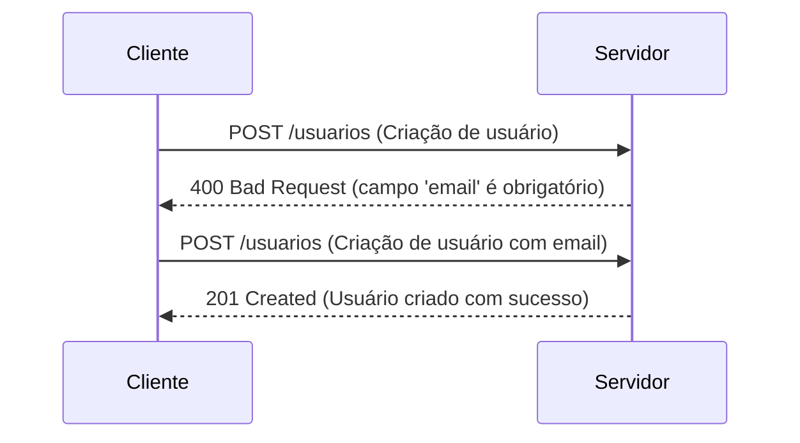

---

# 9. Contrato de API

- O contrato de API define as regras e especificações que governam a comunicação entre o cliente e o servidor, ou seja, quem pede e quem responde.
- Ele estabelece como as requisições devem ser feitas, quais parâmetros são esperados, quais respostas podem ser retornadas e quais códigos de status serão utilizados.
- Ele não precisa saber como o servidor processa a requisição ou qual é a lógica interna do backend, apenas deve conhecer os endpoints disponíveis, os métodos HTTP suportados e o formato dos dados esperados e retornados.
- Isso que faz com que o backend seja independente do frontend, permitindo que diferentes clientes (como aplicativos web, mobile ou outros serviços) possam interagir com a mesma API sem precisar conhecer os detalhes internos do servidor.

### Exemplo de um contrato de API limpo:

```json
{
    "user_id": 56,
    "created_at": "2026-06-01T12:00:00Z",
    "status": "paid"
}
```

No exemplo do contrato de API limpo, os campos são claros e autoexplicativos, indicando claramente o que cada um representa. O campo `user_id` indica o identificador do usuário, `created_at` indica a data e hora de criação, e `status` indica o status da operação (neste caso, "paid" para indicar que o pagamento foi realizado com sucesso).

### Exemplo de um contrato de API ruim:

```json
{
    "uid": 56,
    "date2": "2024-06-01T12:00:00Z",
    "ok": true,
    "error": "erro"
}
```

No exemplo do contrato de API ruim, os campos são vagos e não fornecem informações claras sobre o que representam. O campo `uid` não deixa claro que se trata do identificador do usuário, `date2` não indica claramente que é a data de criação, `ok` não informa o status da operação e `error` não fornece detalhes sobre o erro ocorrido.

Para que o backend seja eficiente e fácil de usar, é fundamental que o contrato (nomes dos campos, formato dos dados, etc.) seja claro, consistente e bem documentado. Isso facilita a comunicação entre o cliente e o servidor, reduz erros e torna a integração mais fluida.

### Exemplo de um contrato de API e a suas respostas:

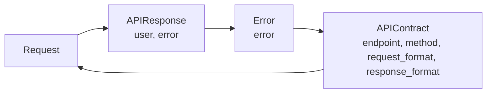

No exemplo, temos uma classe `Request` que representa os dados da requisição, uma classe `Error` que representa os erros que podem ocorrer, e uma classe `APIResponse` que pode conter tanto um objeto `Request` quanto um objeto `Error`, dependendo do resultado da operação. Isso ilustra como o contrato de API define claramente os dados esperados e as possíveis respostas, facilitando a comunicação entre o cliente e o servidor.

O backend nunca pode confiar no que está vindo, ele precisa validar tudo, e o contrato de API é a base para essa validação, garantindo que os dados recebidos estejam no formato esperado e que as operações sejam realizadas corretamente.

Exemplo de validação de contrato de API:

```python
class APIContract:

    def __init__(self, endpoint, method, request_format, response_format):
        self.endpoint = endpoint
        self.method = method
        self.request_format = request_format
        self.response_format = response_format

    def validate_request(self, request):
        # Lógica de validação do formato da requisição
        if not isinstance(request.user_id, int):
            raise ValueError("user_id deve ser um inteiro")
        if not isinstance(request.created_at, str):
            raise ValueError("created_at deve ser uma string")
        if not isinstance(request.status, str):
            raise ValueError("status deve ser uma string")

    def validate_response(self, response):
        # Lógica de validação do formato da resposta
        if not isinstance(response.user, dict):
            raise ValueError("user deve ser um dicionário")
        if not isinstance(response.error, dict):
            raise ValueError("error deve ser um dicionário")
```

---

# 8. Validação e regra de negócio

- A validação é o processo de verificar se os dados recebidos em uma requisição estão corretos e atendem aos critérios esperados antes de serem processados pelo backend. Isso garante que apenas dados válidos sejam aceitos, evitando erros e inconsistências no sistema.
- A regra de negócio é o conjunto de regras e lógica que define como o sistema deve se comportar em determinadas situações. Ela determina como os dados devem ser processados, quais ações devem ser tomadas e quais resultados devem ser retornados com base nas condições específicas do negócio.
- O backend nunca pode confiar nos dados recebidos do cliente, mesmo que eles venham de fontes confiáveis. É essencial validar todos os dados antes de processá-los para garantir a integridade e a segurança do sistema.
- O processo de validação e aplicação das regras de negócio deve ser realizado no backend, pois ele é responsável por garantir que as operações sejam executadas corretamente e que os dados estejam em conformidade com as expectativas do sistema.

Uma forma de separar as responsabilidades no backend é utilizando o padrão de arquitetura em camadas, onde cada camada tem uma função específica:

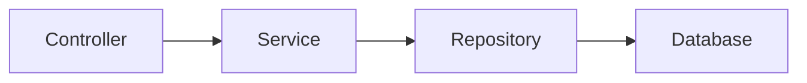

- `CONTROLLER`: Lida com as requisições HTTP, chamando os serviços apropriados e retornando as respostas.
- `SERVICE`: Contém a lógica de negócio, processando os dados recebidos e aplicando as regras necessárias antes de interagir com o banco de dados.
- `REPOSITORY`: Interage com o banco de dados, realizando operações de leitura e escrita, garantindo que os dados sejam armazenados e recuperados corretamente.
- `DATABASE`: Armazena os dados de forma persistente, permitindo que o sistema recupere informações quando necessário.

Essa separação de responsabilidades ajuda a manter o código organizado, facilita a manutenção e torna o sistema mais escalável.

---

# 7. Autenticação e autorização (Security)

- Autenticação e autorização são dois conceitos fundamentais (e distintos) para garantir a segurança de um sistema backend.
- **Autenticação** é o processo de verificar a identidade de um usuário ou sistema, garantindo que ele seja quem afirma ser. Isso geralmente envolve o uso de credenciais, como nome de usuário e senha, tokens ou certificados digitais.
- **Autorização** é o processo de determinar se um usuário autenticado tem permissão para acessar um recurso ou realizar uma ação específica. Isso envolve verificar as permissões e privilégios do usuário em relação aos recursos do sistema.

### Assinatura, Expiração, Escopo, e Revogação de Tokens

- **Assinatura**: Garante que o token não foi alterado. É usada para verificar a integridade e autenticidade do token.
- **Expiração**: Define um tempo de vida para o token, após o qual ele se torna inválido. Isso ajuda a limitar o impacto de tokens comprometidos.
- **Escopo**: Define os recursos e ações que o token permite acessar. Isso ajuda a implementar controle de acesso granular.
- **Revogação**: Permite invalidar tokens antes de sua expiração, garantindo que usuários ou sistemas não autorizados não possam continuar a acessar recursos.
<!-- abaixo: um mermaid que ilustra o fluxo de autenticação e autorização junto com as assinaturas, expiração e escopo e também o HTTP com exemplo de codigo mostrando a autorização -->

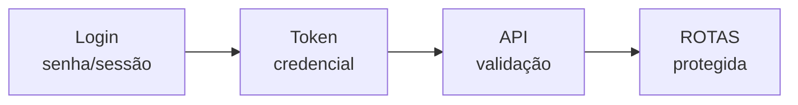
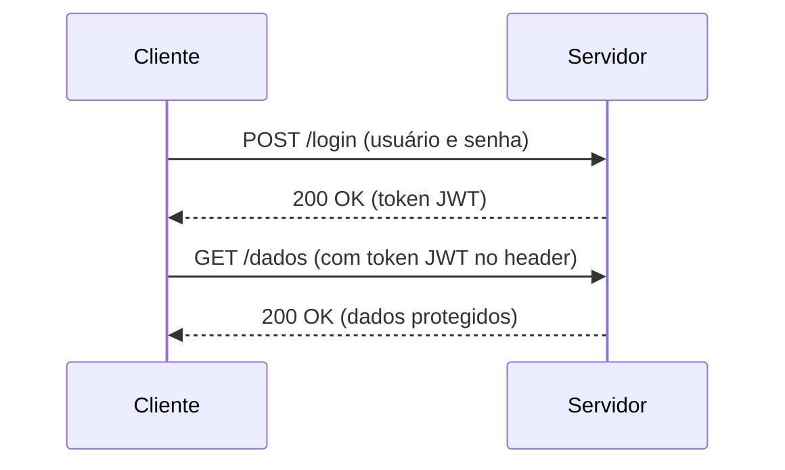

A `CREDENCIAL` (token) é gerada pelo servidor após a autenticação bem-sucedida do usuário e é usada para autorizar o acesso a recursos protegidos. O token pode ser um JWT (JSON Web Token) ou outro tipo de token seguro, que contém informações sobre o usuário e suas permissões.

---

# 6. Banco de dados & Modelagem

- O banco de dados é um componente essencial do backend, responsável por armazenar e gerenciar os dados do sistema de forma estruturada e eficiente. Ele permite que o backend persista informações, como usuários, pedidos, produtos e outros recursos, garantindo que esses dados possam ser recuperados e manipulados conforme necessário.
- A modelagem de banco de dados é o processo de criar uma representação lógica e física dos dados e suas relações, definindo como os dados serão organizados, armazenados e acessados. Uma boa modelagem de banco de dados é fundamental para garantir a integridade, consistência e desempenho do sistema.
- Guardar o dado é decidir como o mundo real vira estrutura no seu backend, e isso é feito através da modelagem de banco de dados. A modelagem de banco de dados envolve a criação de tabelas, colunas, chaves primárias e estrangeiras, índices e relacionamentos entre os dados.
- Se você normalizar demais o banco de dados, você terá que fazer muitas junções (joins) para conseguir pegar os dados que você precisa, e isso pode impactar a performance do sistema. Por outro lado, se você desnormalizar demais, você pode acabar com dados duplicados e inconsistentes, o que também pode causar problemas.
- Por isso , é importante encontrar um equilíbrio entre normalização e desnormalização, considerando as necessidades do sistema, o volume de dados e os padrões de acesso. A modelagem de banco de dados deve ser feita com cuidado, levando em conta os requisitos do negócio e as melhores práticas de design.

Para consultar os pedidos de um usuário, você precisará fazer uma junção entre as tabelas `Usuário`, `Pedido` e `Itens`. Se você desnormalizar a tabela de pedidos e incluir os itens diretamente nela, você poderá consultar os pedidos e seus itens em uma única consulta, mas isso pode levar a dados duplicados e inconsistentes se um item for alterado ou removido.

Banco é performance, uma query simples pode virar uma query complexa dependendo da modelagem do banco de dados. Por isso, é importante planejar a modelagem do banco de dados com cuidado, considerando as necessidades do sistema e os padrões de acesso aos dados.

Veja abaixo, dois exemplos de modelagem de banco de dados, um normalizado e outro desnormalizado:

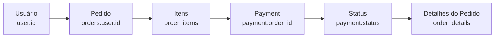

Veja como a modelagem normalizada exige mais junções para consultar os dados.


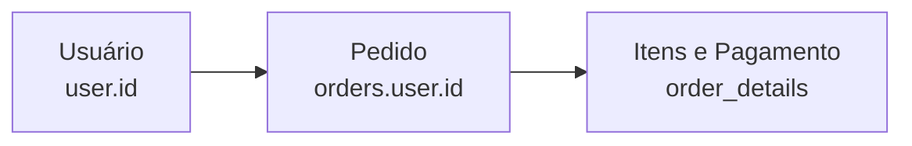

Já na modelagem desnormalizada, os itens e o pagamento estão incluídos diretamente na tabela de pedidos, permitindo consultas mais simples, mas com o risco de dados duplicados e inconsistentes.

Por isso, quando um sistema está 'lento' , é importante analisar a modelagem do banco de dados e as consultas realizadas para identificar possíveis gargalos de performance. Otimizar a modelagem e as consultas pode melhorar significativamente o desempenho do sistema.

---

# 5. Transações

Imaginem uma transferência: Tirar 100 R$ de uma conta é uma operação, e colocar 100 R$ em outra conta é outra operação.

Se a primeira operação for bem-sucedida, mas a segunda falhar, o dinheiro vai sumir do sistema. Para evitar isso, usamos transações.

As transações garantem que um conjunto de operações seja executado de forma atômica, ou seja, todas as operações devem ser concluídas com sucesso ou nenhuma delas deve ser aplicada. Se uma operação falhar, todas as alterações feitas até aquele ponto são revertidas, garantindo a consistência dos dados.

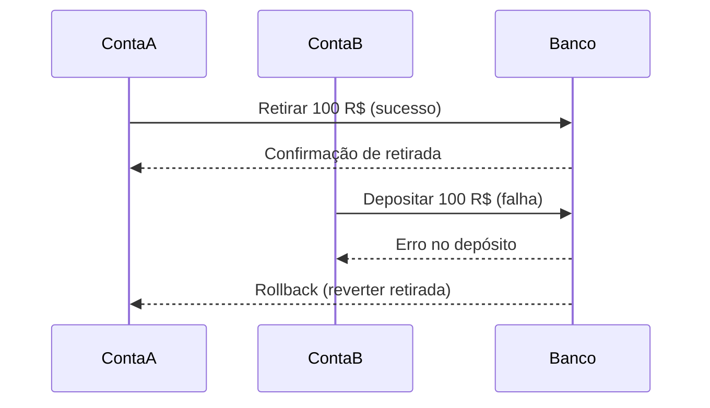

Ou as duas acontecem, ou nenhuma acontece. Isso garante que o sistema permaneça consistente e confiável, mesmo em caso de falhas ou erros durante a execução das operações.

### ACID (Atomicidade, Consistência, Isolamento e Durabilidade)

- **Atomicidade**: Garante que todas as operações dentro de uma transação sejam concluídas com sucesso ou nenhuma delas seja aplicada. Se uma operação falhar, todas as alterações feitas até aquele ponto são revertidas.

- **Consistência**: Garante que uma transação leve o banco de dados de um estado válido para outro estado válido, mantendo a integridade dos dados.

- **Isolamento**: Garante que as operações de uma transação sejam isoladas das operações de outras transações, evitando interferências e garantindo que os resultados sejam consistentes.

- **Durabilidade**: Garante que, uma vez que uma transação seja concluída com sucesso, suas alterações sejam permanentes e persistam mesmo em caso de falhas do sistema.

Imagine duas pessoas comprando o mesmo produto ao mesmo tempo. O isolamento garante que cada transação seja processada de forma independente, evitando que uma transação afete a outra e garantindo que os resultados sejam consistentes.

Exemplo de duas transações concorrentes tentando comprar o mesmo produto:

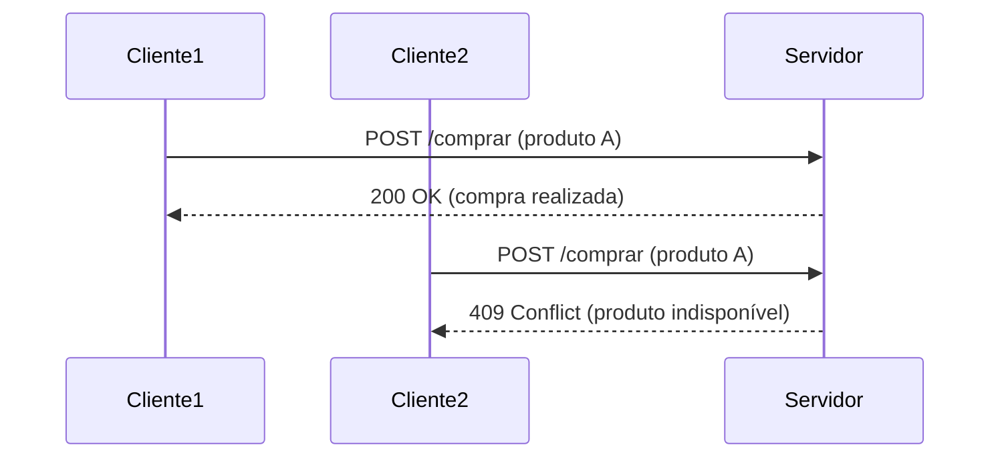

# 4. Cache

O cache é uma técnica utilizada para armazenar temporariamente dados frequentemente acessados, com o objetivo de melhorar o desempenho do sistema e reduzir a carga no banco de dados. Ele permite que o backend retorne respostas mais rapidamente, evitando consultas repetidas ao banco de dados para os mesmos dados.

O cache pode ser implementado em diferentes níveis, como no lado do cliente, no servidor ou em sistemas de cache dedicados, como Redis ou Memcached. Ele é especialmente útil em situações onde os dados não mudam com frequência e podem ser reutilizados para atender a múltiplas requisições.

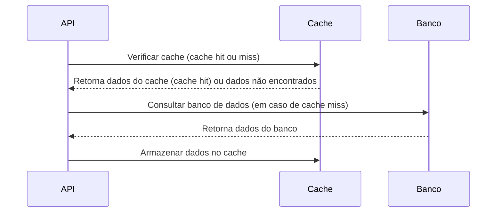

### Cache Hit / Cache Miss

- **Cache Hit**: Ocorre quando os dados solicitados pelo cliente já estão armazenados no cache, permitindo que o servidor retorne a resposta rapidamente sem precisar acessar o banco de dados. Isso melhora o desempenho e reduz a carga no banco de dados.

- **Cache Miss**: Ocorre quando os dados solicitados pelo cliente não estão presentes no cache, obrigando o servidor a acessar o banco de dados para recuperar as informações. Isso pode resultar em tempos de resposta mais longos e maior carga no banco de dados.

Existe um problema no "cache" que é o "cache miss", que acontece quando o dado não está no cache, e o backend precisa ir buscar no banco de dados. Isso pode causar lentidão na resposta ao cliente, especialmente se o banco de dados estiver sobrecarregado ou se a consulta for complexa.

Exemplo de cache miss:

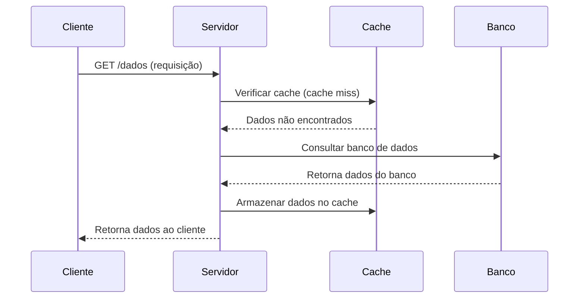

Exemplo de cache hit:

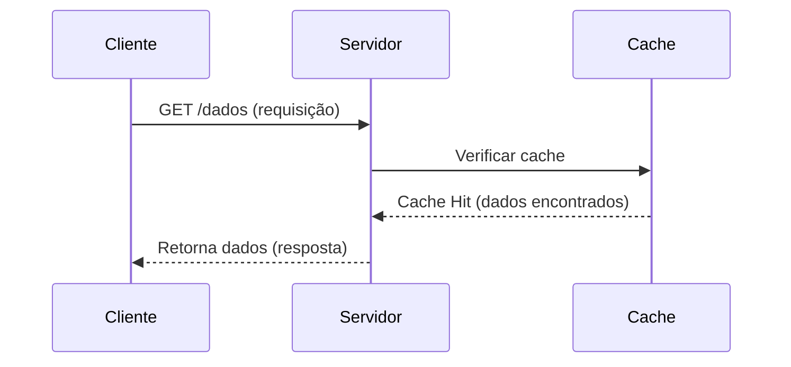

Dado velho também é bug. Por isso, é importante implementar estratégias de expiração e invalidação do cache para garantir que os dados armazenados no cache estejam atualizados e consistentes com o banco de dados. Por exemplo, quando um produto é atualizado no banco de dados, o cache correspondente deve ser invalidado para que a próxima requisição busque os dados atualizados.

Veja abaixo um exemplo de fluxo de requisição e resposta com cache, incluindo a invalidação do cache após uma atualização no banco de dados:

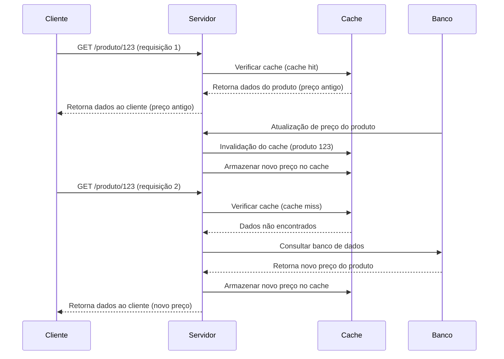

Dessa forma, o backend garante que os dados retornados ao cliente estejam sempre atualizados e consistentes, mesmo em situações de alterações frequentes nos dados armazenados no banco de dados. A implementação de estratégias de expiração e invalidação do cache é essencial para manter a integridade e a confiabilidade do sistema.

Um backend bem feito não usa cache só por que ele é rápido, ele usa cache para melhorar a performance do sistema, mas sempre garantindo que os dados estejam atualizados e consistentes com o banco de dados.

Exemplo de implementação de cache com expiração e invalidação:

```python
class Cache:
    def __init__(self):
        self.cache = {}
        self.expiration_time = 60  # Tempo de expiração em segundos

    def get(self, key):
        if key in self.cache:
            value, timestamp = self.cache[key]
            if time.time() - timestamp < self.expiration_time:
                return value  # Cache hit
            else:
                del self.cache[key]  # Cache miss (expirado)
        return None  # Cache miss

    def set(self, key, value):
        self.cache[key] = (value, time.time())

    def invalidate(self, key):
        if key in self.cache:
            del self.cache[key]  # Invalidação do cache
```

# 3. Filas e Workers

- Filas e workers são componentes essenciais em sistemas backend para lidar com tarefas assíncronas e processamento em segundo plano. Eles permitem que o backend execute operações demoradas ou complexas sem bloquear a resposta ao cliente, melhorando a performance e a escalabilidade do sistema.
-Filas são estruturas de dados que armazenam tarefas ou mensagens em uma ordem específica, geralmente seguindo o princípio FIFO (First In, First Out). Elas permitem que o backend organize e gerencie as tarefas a serem processadas, garantindo que elas sejam executadas na ordem correta.
- Workers são processos ou threads que consomem as tarefas da fila e as executam. Eles podem ser configurados para processar várias tarefas simultaneamente, aumentando a capacidade de processamento do sistema e permitindo que ele lide com um grande volume de requisições.

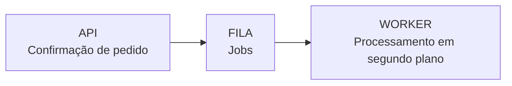

As filas separam o processamento de tarefas do fluxo principal do backend, permitindo que o sistema continue respondendo rapidamente às requisições dos clientes, enquanto os workers processam as tarefas em segundo plano.

<!-- exemplo de um fluxo sem fila -->

````mermaid
classDiagram
    class Sem fila {
        +Email
        +Nota
        +Estoque
        +Antifraude
    }
    Sem fila --> Email : Processamento síncrono
    Sem fila --> Nota : Processamento síncrono
    Sem fila --> Estoque : Processamento síncrono
    Sem fila --> Antifraude : Processamento síncrono
    Email --> Sem fila : Resposta ao cliente
    Nota --> Sem fila : Resposta ao cliente
    Estoque --> Sem fila : Resposta ao cliente
    Antifraude --> Sem fila : Resposta ao cliente
````

Exemplo de um fluxo com fila, onde o processamento das tarefas é feito de forma assíncrona, permitindo que o backend continue respondendo rapidamente às requisições dos clientes:

```mermaid
classDiagram
    class Com fila {
        +Email
        +Nota
        +Estoque
        +Antifraude
    }
    class Worker {
        +Processamento em segundo plano
    }
    Com fila --> Worker : Processamento assíncrono
    Worker --> Email : Processamento em segundo plano
    Worker --> Nota : Processamento em segundo plano
    Worker --> Estoque : Processamento em segundo plano
    Worker --> Antifraude : Processamento em segundo plano
    Worker --> Com fila : Resposta ao cliente
````

Vamos supor que a fila é composta por "jobs" que representam tarefas a serem executadas, como enviar um e-mail de confirmação, gerar uma nota fiscal, atualizar o estoque e realizar uma verificação antifraude. Cada job é processado por um worker em segundo plano, permitindo que o backend continue respondendo rapidamente às requisições dos clientes.

```mermaid
graph LR
    A[job1] --> B[job2]
    B --> C[job3]
    C --> D[job4]
    D --> E[job5]
```

Se por acaso um desses jobs falhar, o worker pode reprocessar o job ou movê-lo para uma fila de erros, garantindo que a tarefa seja concluída com sucesso e que o sistema continue funcionando corretamente.

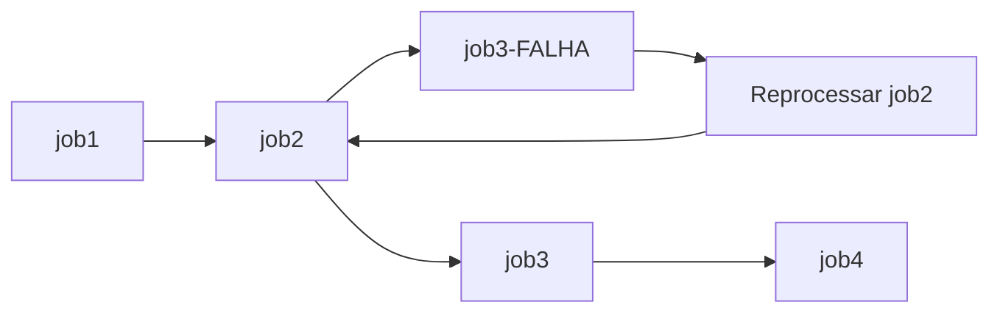

### Monitoramento de filas e workers

- É importante monitorar o desempenho das filas e workers para garantir que as tarefas sejam processadas de forma eficiente e que o sistema continue funcionando corretamente. Isso pode incluir métricas como tempo de processamento, taxa de sucesso, número de jobs pendentes e falhas.
- Ferramentas de monitoramento, como dashboards e alertas, podem ser utilizadas para acompanhar o desempenho das filas e workers, permitindo que a equipe de desenvolvimento identifique e resolva problemas rapidamente.
- O monitoramento também pode ajudar a identificar gargalos no processamento das tarefas, permitindo que ajustes sejam feitos na configuração das filas e workers para melhorar a performance do sistema.
- Eles são conectados ao backend, mas não fazem parte dele. Eles são responsáveis por processar tarefas em segundo plano, permitindo que o backend continue respondendo rapidamente às requisições dos clientes, sem ficar bloqueado por operações demoradas ou complexas.

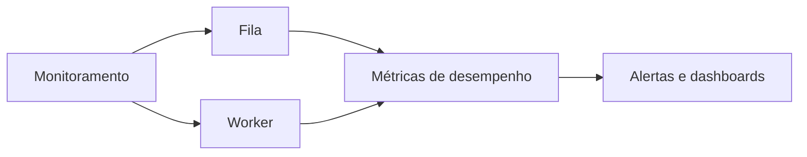

# 2. Escala e Disponibilidade

- Escala é a capacidade do sistema de lidar com um aumento no número de requisições ou usuários sem comprometer o desempenho.
- No começo, apenas um servidor é suficiente para atender às requisições, mas à medida que o número de usuários cresce, é necessário adicionar mais servidores para distribuir a carga e garantir que o sistema continue funcionando corretamente.

Recebe / Processa / Consulta / Responde

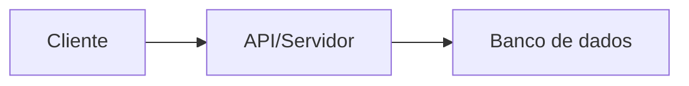

Se o produto atingir uma certa popularidade, o número de requisições pode aumentar significativamente, e um único servidor pode não ser capaz de lidar com toda a carga. Nesse caso, é necessário escalar o sistema horizontalmente, adicionando mais servidores para distribuir a carga e garantir que o sistema continue funcionando corretamente.

Existem duas formas principais de escalar um sistema backend: escala horizontal e escala vertical.

### Escala vertical

Consiste em aumentar a capacidade de um único servidor, adicionando mais recursos, como CPU, memória e armazenamento. Isso permite que o servidor lide com um maior número de requisições simultâneas, melhorando o desempenho. No entanto, a escala vertical tem limites físicos e pode ser mais cara do que a escala horizontal.

A escala vertical é útil quando o sistema precisa lidar com operações complexas ou intensivas em recursos, como processamento de imagens, cálculos matemáticos ou consultas complexas ao banco de dados, mas ela não resolve problemas de disponibilidade, pois se o servidor falhar, todo o sistema ficará indisponível.

````mermaid
graph LR
    A[Cliente] --> B[API/Servidor]
    B --> C[Banco de dados]
    B --> D[Mais CPU, memória e armazenamento]
    D --> B[API/Servidor]
    C --> B[API/Servidor]
    B --> A[Cliente]
````

### Escala horizontal

Consiste em adicionar mais servidores para distribuir a carga de trabalho. Isso permite que o sistema lide com um maior número de requisições simultâneas, melhorando a disponibilidade e o desempenho. A escala horizontal é geralmente preferida em sistemas distribuídos, pois permite maior flexibilidade e resiliência.

A escala horizontal só funciona bem se ela for "stateless", ou seja, se o backend não guardar estado entre as requisições. Isso significa que cada requisição deve ser independente e não depender de informações armazenadas em sessões ou variáveis de estado no servidor.

````mermaid
graph LR
    A[Cliente] --> B[Load Balancer]
    B --> C[API/Servidor 1]
    C --> B[Load Balancer]
    B --> D[API/Servidor 2]
    D --> B[Load Balancer]
    B --> E[API/Servidor 3]
    E --> B[Load Balancer]
    B --> A[Cliente]
````

O backend deve ser projetado para se adaptar a diferentes cargas de trabalho, garantindo que ele possa escalar horizontalmente e verticalmente conforme necessário. Isso envolve a implementação de práticas de desenvolvimento, como design modular, uso de filas e workers, cache eficiente e monitoramento contínuo do desempenho do sistema.

---

# 1. Observabilidade

- Observabilidade é a capacidade de entender o estado interno de um sistema a partir de suas saídas externas. Em um sistema backend, isso envolve monitorar e analisar métricas, logs e rastreamentos para identificar problemas, otimizar o desempenho e garantir a confiabilidade do sistema.
- A observabilidade permite que os desenvolvedores e operadores do sistema compreendam como ele está se comportando em tempo real, facilitando a identificação de gargalos, falhas e oportunidades de melhoria.
- Os componentes mais comuns da observabilidade incluem:
    - Métricas: Dados quantitativos sobre o desempenho do sistema, como tempo de resposta, taxa de erro e utilização de recursos.
    - Logs: Registros detalhados de eventos e atividades do sistema, que podem ser analisados para identificar problemas e entender o comportamento do sistema.
    - Rastreabilidade (tracing): A capacidade de acompanhar o fluxo de uma requisição ou operação através de diferentes componentes do sistema, permitindo identificar onde ocorrem atrasos ou falhas.
    - Alertas: Notificações automáticas sobre eventos críticos ou anomalias no sistema, permitindo uma resposta rápida a problemas potenciais.
    - Dashboards: Painéis visuais que apresentam métricas, logs e rastreamentos de forma consolidada, facilitando a análise e o monitoramento do sistema.
A observabilidade é essencial para garantir que o backend funcione de maneira eficiente, confiável e escalável, permitindo que a equipe de desenvolvimento tome decisões informadas sobre melhorias e ajustes no sistema.

Explicação:
- Cada métrica (Error rate, Latência p95, Throughput) aparece como um bloco com o botão **Deploy**.
- O nó **Alerta** recebe conexões das métricas, indicando que qualquer problema pode gerar alerta.
- O **Rollback** é acionado a partir do alerta, dependendo da gravidade do problema, permitindo reverter o deploy se necessário.

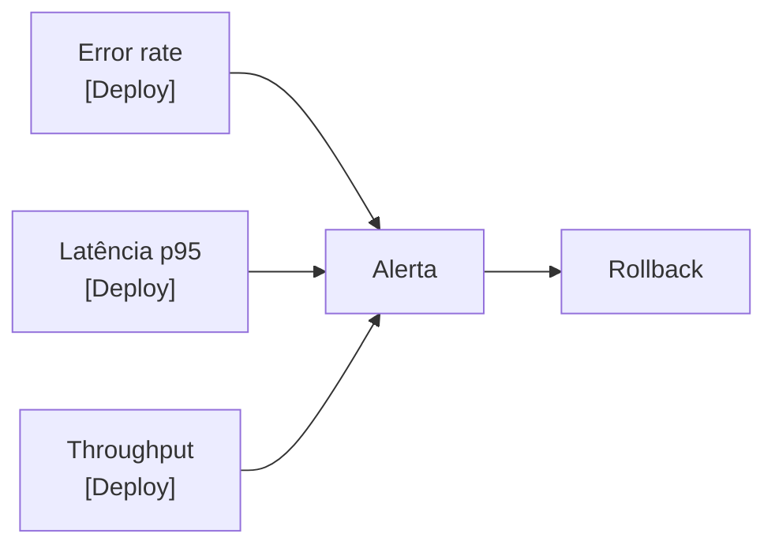