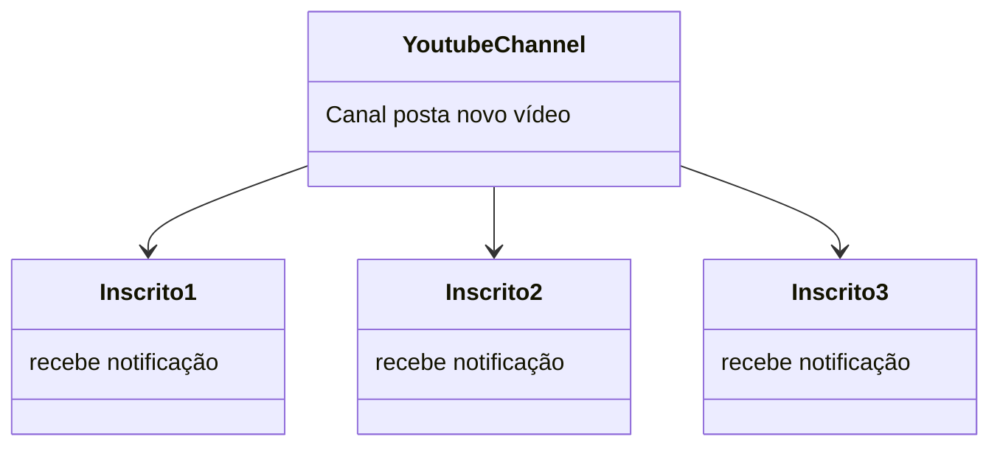
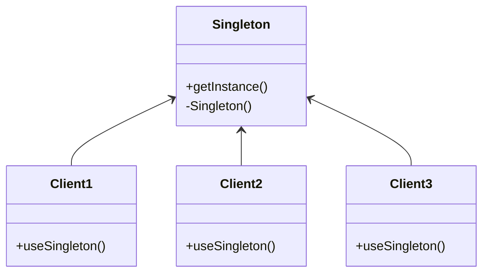
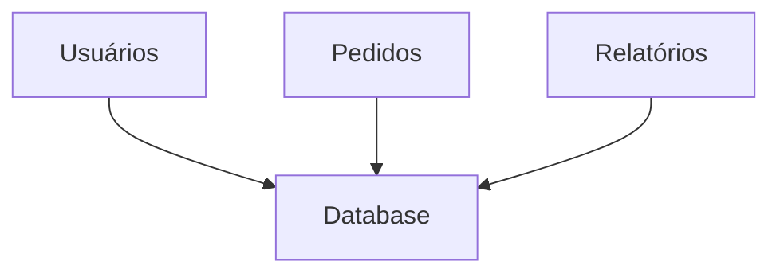
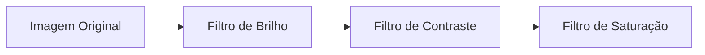
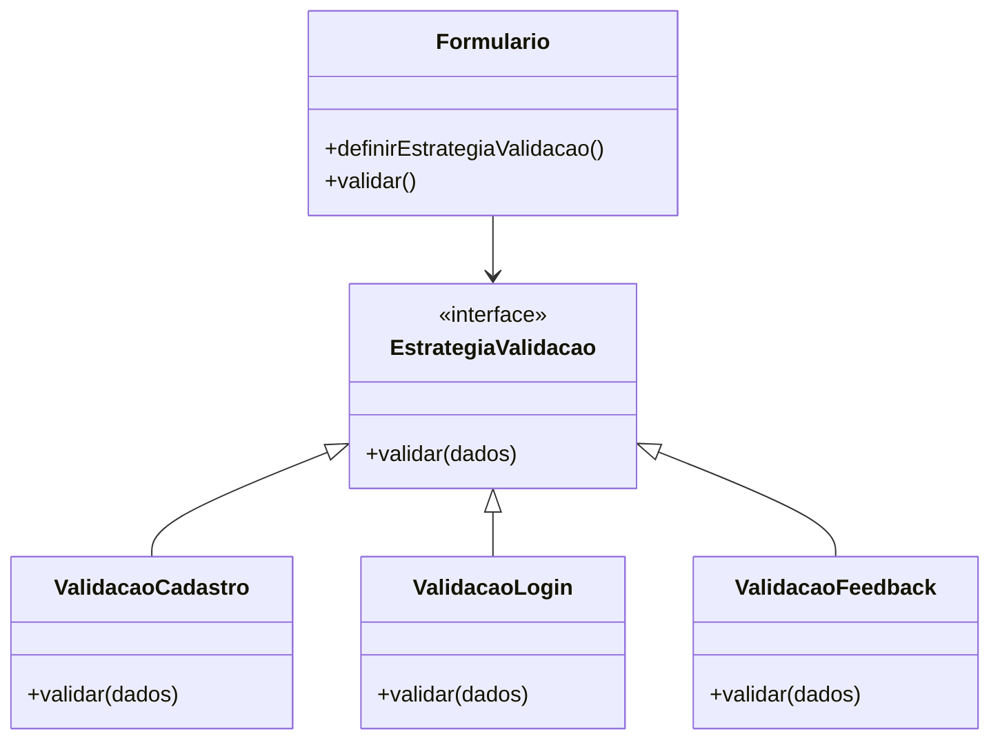
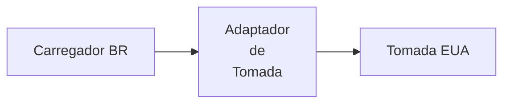

# DESIGN PATTERNS

Design Patterns são soluções reutilizáveis para problemas comuns que surgem durante o desenvolvimento de software. Eles fornecem um modelo ou guia para resolver problemas específicos de forma eficiente e consistente, promovendo boas práticas de design e facilitando a manutenção e evolução do código.

Ao total, existem 23 Design Patterns clássicos, divididos em três categorias principais:
- **Padrões Criacionais**: Focados na criação de objetos, abstraindo o processo de instanciamento e promovendo flexibilidade na escolha das classes a serem instanciadas.
- **Padrões Estruturais**: Focados na composição de classes e objetos, facilitando a criação de estruturas complexas e promovendo a reutilização de código.
- **Padrões Comportamentais**: Focados na comunicação e interação entre objetos, promovendo a flexibilidade e a extensibilidade do comportamento do sistema.

Porém, os mais comuns e amplamente utilizados são os seguintes:

# 1. OBSERVER

O padrão Observer é um padrão comportamental que define uma dependência um-para-muitos entre objetos, de forma que quando um objeto muda de estado, todos os seus dependentes são notificados e atualizados automaticamente.

Vamos pegar como exemplo o "youtube". Quando você se inscreve em um canal, você se torna um "Observer" desse canal. Sempre que o canal publica um novo vídeo, todos os inscritos (Observers) são notificados sobre a atualização.



Na prática, o "subject" mantém uma lista de "observers", e quando ocorre uma mudança de estado, ele percorre essa lista e chama o método de atualização de cada "observer", garantindo que todos estejam sincronizados com o estado atual do "subject".

### Exemplo em Python:

```python
# Exemplo de implementação do padrão Observer em Python

class YoutubeChannel:
    def __init__(self, nome):
        self.nome = nome
        self.inscritos = []

    def adicionar_inscrito(self, inscrito):
        self.inscritos.append(inscrito)

    def postar_video(self, titulo):
        print(f"{self.nome} postou um novo vídeo: {titulo}")
        for inscrito in self.inscritos:
            inscrito.receber_notificacao(titulo)


class Inscrito:
    def __init__(self, nome):
        self.nome = nome

    def receber_notificacao(self, titulo):
        print(f"{self.nome} recebeu notificação do vídeo: {titulo}")


# Exemplo de uso

canal = YoutubeChannel("Canal de Tecnologia")

inscrito1 = Inscrito("Inscrito1")
inscrito2 = Inscrito("Inscrito2")
inscrito3 = Inscrito("Inscrito3")

canal.adicionar_inscrito(inscrito1)
canal.adicionar_inscrito(inscrito2)
canal.adicionar_inscrito(inscrito3)

canal.postar_video("Python Observer Pattern")
```

O que acontece:
- O YoutubeChannel mantém uma lista de inscritos.
- Quando o canal posta um vídeo (postar_video), ele notifica todos os inscritos chamando o método receber_notificacao.
- Cada inscrito imprime que recebeu a notificação.

Mas quando usar esse padrão ao invés de simplesmente chamar um método diretamente? A resposta é: quando você quer que múltiplos objetos sejam notificados de mudanças em outro objeto, sem que o objeto notificador precise conhecer os detalhes de cada objeto notificado. Isso promove baixo acoplamento e alta coesão, tornando o sistema mais flexível e fácil de manter.

### Desacoplamento

O "subject" (YoutubeChannel) não precisa saber nada sobre os "observers" (Inscritos), exceto que eles implementam um método específico (receber_notificacao). Isso significa que você pode adicionar novos tipos de "observers" sem modificar o "subject", tornando o sistema mais extensível.

### Flexibilidade

O padrão Observer permite que você adicione ou remova "observers" dinamicamente em tempo de execução. Isso é útil em situações onde a lista de dependentes pode mudar ao longo do tempo, como em sistemas de eventos, interfaces gráficas, ou qualquer cenário onde múltiplos objetos precisam reagir a mudanças de estado.

### Conclusão

O padrão Observer é uma ferramenta poderosa para criar sistemas reativos e desacoplados. Ele é amplamente utilizado em frameworks de UI, sistemas de eventos, e qualquer aplicação onde a comunicação entre objetos precisa ser eficiente e flexível. Ao implementar o padrão Observer, você promove um design mais limpo, modular e fácil de manter, facilitando a evolução do software ao longo do tempo.

---

# 2. FACTORY

O padrão Factory é um padrão criacional que fornece uma interface para criar objetos em uma superclasse, mas permite que subclasses alterem o tipo de objetos que serão criados. Ele encapsula a lógica de criação de objetos, promovendo flexibilidade e desacoplamento entre a criação e o uso dos objetos.

```python
# Exemplo de implementação do padrão Factory (desacoplamento e flexibilidade)
class payment:
    def pay(self):
        pass
 
class CreditCardPayment(payment):
    def pay(self):
        print("Pagamento com cartão de crédito realizado.")

class PayPalPayment(payment):
    def pay(self):
        print("Pagamento com PayPal realizado.")

class BankTransferPayment(payment):
    def pay(self):
        print("Pagamento com transferência bancária realizado.")
```

Sem a "Factory", o código que utiliza essas classes poderia ser algo assim:

```python
# Exemplo de uso sem o padrão Factory (risco de acoplamento e complexidade)
def process_payment(payment_type):
    if payment_type == "credit_card":
        payment = CreditCardPayment()
    elif payment_type == "paypal":
        payment = PayPalPayment()
    elif payment_type == "bank_transfer":
        payment = BankTransferPayment()
    else:
        raise ValueError("Tipo de pagamento inválido.")
    
    payment.pay()
```

Sem factory, a lógica fica espalhada e acoplada, tornando difícil adicionar novos tipos de pagamento ou modificar a lógica existente, pois você teria que alterar o código em vários lugares. Com o padrão Factory, você pode encapsular a criação de objetos em uma única classe ou método, tornando o código mais limpo e fácil de manter.

---

# 3. SINGLETON

O padrão Singleton é um padrão criacional que garante que uma classe tenha apenas uma instância e fornece um ponto global de acesso a essa instância. Ele é útil quando você precisa de um único objeto para coordenar ações em todo o sistema, como gerenciar configurações, conexões de banco de dados ou recursos compartilhados.



### Exemplo em Python:

```python
# Exemplo de implementação do padrão Singleton em Python
class Singleton:
    _instance = None

    def __new__(cls):
        if cls._instance is None:
            print("Criando nova instância de Singleton")
            cls._instance = super(Singleton, cls).__new__(cls)
        return cls._instance

    def getInstance(self):
        return self._instance
```
### Exemplo de uso do Singleton com múltiplos clientes:
```Python
class Client1:
    def useSingleton(self):
        s = Singleton()
        print("Client1 usando Singleton:", id(s))

class Client2:
    def useSingleton(self):
        s = Singleton()
        print("Client2 usando Singleton:", id(s))

class Client3:
    def useSingleton(self):
        s = Singleton()
        print("Client3 usando Singleton:", id(s))
```
```Python
# Exemplo de uso
c1 = Client1()
c2 = Client2()
c3 = Client3()

c1.useSingleton()
c2.useSingleton()
c3.useSingleton()
```

O que acontece:
- A classe Singleton controla sua própria criação com __new__.
- A primeira vez que alguém instancia, cria o objeto. As próximas vezes, retorna sempre a mesma instância.
- Os Clients chamam useSingleton() e todos recebem o mesmo objeto (mesmo id).

Na primeira vez que um cliente chama useSingleton(), a instância é criada. Nas chamadas subsequentes, todos os clientes recebem a mesma instância, garantindo que haja apenas uma instância do Singleton em todo o sistema.



Muitos consideram o padrão Singleton como um antipadrão, pois ele pode introduzir problemas de acoplamento e dificultar testes unitários. No entanto, quando usado com cuidado, ele pode ser útil para gerenciar recursos compartilhados e garantir consistência em todo o sistema.

Por isso ele é recomendado apenas quando há uma necessidade real de garantir que apenas uma instância de uma classe exista, como em gerenciadores de configuração, conexões de banco de dados ou caches globais.

---

# 4. DECORATOR

O padrão Decorator é um padrão estrutural que permite adicionar funcionalidades a objetos de forma dinâmica, sem alterar a estrutura das classes existentes. Ele envolve a criação de uma classe "decoradora" que implementa a mesma interface da classe original e contém uma referência ao objeto original, permitindo que você adicione comportamentos adicionais antes ou depois de delegar chamadas para o objeto original.

Um exemplo análogo a esse padrão é o uso de filtros em aplicativos de edição de fotos. Você pode aplicar diferentes filtros (como brilho, contraste, saturação) a uma imagem sem modificar a classe original da imagem. Cada filtro atua como um "decorador" que adiciona funcionalidades à imagem original.



### Exemplo em Python:

```python
# Componente base
class Notificador:
    def enviar(self, mensagem):
        print("Notificação:", mensagem)


# Decorador base
class NotificadorDecorator:
    def __init__(self, notificador):
        self._notificador = notificador

    def enviar(self, mensagem):
        self._notificador.enviar(mensagem)


# Decorador concreto: envia também por e-mail
class EmailDecorator(NotificadorDecorator):
    def enviar(self, mensagem):
        super().enviar(mensagem)
        print("Enviando por e-mail:", mensagem)


# Decorador concreto: envia também por SMS
class SMSDecorator(NotificadorDecorator):
    def enviar(self, mensagem):
        super().enviar(mensagem)
        print("Enviando por SMS:", mensagem)


# Uso
notificador = Notificador()

# Adiciona funcionalidade de e-mail
notificador_email = EmailDecorator(notificador)

# Adiciona funcionalidade de SMS em cima do e-mail
notificador_completo = SMSDecorator(notificador_email)

# Envia mensagem
notificador_completo.enviar("Seu pedido foi confirmado!")
```

```Python
# saída esperada:
Notificação: Seu pedido foi confirmado!
Enviando por e-mail: Seu pedido foi confirmado!
Enviando por SMS: Seu pedido foi confirmado!
```

---

# 5. STRATEGY

O padrão Strategy é um padrão comportamental que permite definir uma família de algoritmos, encapsular cada um deles e torná-los intercambiáveis. Ele permite que o algoritmo varie independentemente dos clientes que o utilizam, promovendo flexibilidade e extensibilidade no código.

Vamos pegar como exemplo um GPS. Ele pode ter diferentes estratégias de cálculo de rota, como a rota mais rápida, a rota mais curta ou a rota que evita pedágios, assim como rotas para carros, bicicletas ou pedestres. Cada uma dessas estratégias pode ser implementada como uma classe separada, permitindo que o GPS escolha a estratégia apropriada com base nas preferências do usuário.

Ele define uma família de algoritmos, encapsula cada um e permite a troca entre eles em tempo de execução. Isso promove flexibilidade e extensibilidade no código, permitindo que novos algoritmos sejam adicionados sem modificar o código existente.

```Python
from abc import ABC, abstractmethod

# Estratégia base
class EstrategiaRota(ABC):
    @abstractmethod
    def calcular_rota(self, origem, destino):
        pass


# Estratégias concretas
class RotaMaisRapida(EstrategiaRota):
    def calcular_rota(self, origem, destino):
        return f"Calculando rota mais rápida de {origem} até {destino}."


class RotaMaisCurta(EstrategiaRota):
    def calcular_rota(self, origem, destino):
        return f"Calculando rota mais curta de {origem} até {destino}."


class RotaSemPedagios(EstrategiaRota):
    def calcular_rota(self, origem, destino):
        return f"Calculando rota sem pedágios de {origem} até {destino}."


class RotaParaBicicleta(EstrategiaRota):
    def calcular_rota(self, origem, destino):
        return f"Calculando rota para bicicleta de {origem} até {destino}."


class RotaParaPedestre(EstrategiaRota):
    def calcular_rota(self, origem, destino):
        return f"Calculando rota para pedestre de {origem} até {destino}."


# Contexto (GPS)
class GPS:
    def __init__(self, estrategia: EstrategiaRota):
        self.estrategia = estrategia

    def definir_estrategia(self, estrategia: EstrategiaRota):
        self.estrategia = estrategia

    def calcular_rota(self, origem, destino):
        return self.estrategia.calcular_rota(origem, destino)


# Exemplo de uso
gps = GPS(RotaMaisRapida())
print(gps.calcular_rota("São Paulo", "Rio de Janeiro"))

gps.definir_estrategia(RotaMaisCurta())
print(gps.calcular_rota("São Paulo", "Rio de Janeiro"))

gps.definir_estrategia(RotaSemPedagios())
print(gps.calcular_rota("São Paulo", "Rio de Janeiro"))

gps.definir_estrategia(RotaParaBicicleta())
print(gps.calcular_rota("São Paulo", "Rio de Janeiro"))

gps.definir_estrategia(RotaParaPedestre())
print(gps.calcular_rota("São Paulo", "Rio de Janeiro"))
```

```Python
# saída esperada:
Calculando rota mais rápida de São Paulo até Rio de Janeiro.
Calculando rota mais curta de São Paulo até Rio de Janeiro.
Calculando rota sem pedágios de São Paulo até Rio de Janeiro.
Calculando rota para bicicleta de São Paulo até Rio de Janeiro.
Calculando rota para pedestre de São Paulo até Rio de Janeiro.
```

Explicação:
- "EstrategiaRota" é a interface comum para todas as estratégias.
- Cada classe concreta (RotaMaisRapida, RotaMaisCurta, etc.) implementa um algoritmo diferente de cálculo de rota.
- O GPS é o contexto que usa uma estratégia e pode trocá-la em tempo de execução.
- Isso permite adicionar novas estratégias sem alterar o código existente.

Outro exemplo seria a "validação de formulários". Dependendo do tipo de formulário (cadastro, login, feedback), você pode ter diferentes estratégias de validação, cada uma encapsulada em sua própria classe. O contexto (o formulário) pode então escolher a estratégia apropriada com base no tipo de formulário que está sendo processado, promovendo flexibilidade e extensibilidade no código.



---

# 6. ADAPTER

O padrão Adapter é um padrão estrutural que permite que interfaces incompatíveis trabalhem juntas. Ele atua como um "adaptador" entre duas interfaces, convertendo a interface de uma classe em outra interface que o cliente espera. Isso permite que classes com interfaces diferentes colaborem sem a necessidade de modificar seu código.

Por exemplo, imagine que você vai para os EUA e precisa usar um carregador de celular. O padrão Adapter seria como um adaptador de tomada, que permite que você conecte seu carregador brasileiro em uma tomada americana, mesmo que as interfaces (tomadas) sejam diferentes.



Outro exemplo: Digamos que você tem uma biblioteca de gráficos que espera receber dados em formato JSON, mas você possui os dados em formato XML. O padrão Adapter permitiria criar uma classe adaptadora que converte os dados XML para JSON, permitindo que a biblioteca de gráficos funcione corretamente sem precisar modificar seu código.

```Python
import json
import xml.etree.ElementTree as ET

# Biblioteca de gráficos (espera JSON)
class BibliotecaGraficos:
    def plotar(self, dados_json):
        print("Plotando gráfico com dados JSON:")
        return(dados_json)


# Dados em XML
class FonteDadosXML:
    def get_dados(self):
        return """
        <dados>
            <ponto><x>1</x><y>2</y></ponto>
            <ponto><x>2</x><y>4</y></ponto>
            <ponto><x>3</x><y>6</y></ponto>
        </dados>
        """


# Adapter: converte XML para JSON
class XMLParaJSONAdapter:
    def __init__(self, fonte_xml: FonteDadosXML):
        self.fonte_xml = fonte_xml

    def get_dados_json(self):
        xml_str = self.fonte_xml.get_dados()
        root = ET.fromstring(xml_str)

        pontos = []
        for ponto in root.findall("ponto"):
            x = int(ponto.find("x").text)
            y = int(ponto.find("y").text)
            pontos.append({"x": x, "y": y})

        return json.dumps(pontos)


# Uso
fonte_xml = FonteDadosXML()
adapter = XMLParaJSONAdapter(fonte_xml)

biblioteca = BibliotecaGraficos()
biblioteca.plotar(adapter.get_dados_json())
```

```Python
# saída esperada:
Plotando gráfico com dados JSON:
[{"x": 1, "y": 2}, {"x": 2, "y": 4}, {"x": 3, "y": 6}]
```

---

# Quando usar cada um?

- **Observer**: Use quando você quer que múltiplos objetos sejam notificados de mudanças em outro objeto, sem que o objeto notificador precise conhecer os detalhes de cada objeto notificado.

- **Factory**: Use quando você quer criar objetos sem expor a lógica de criação ao cliente e referir-se ao novo objeto usando uma interface comum.

- **Singleton**: Use quando você quer garantir que uma classe tenha apenas uma instância e fornecer um ponto global de acesso a essa instância.

- **Decorator**: Use quando você quer adicionar responsabilidades a objetos individualmente e de forma transparente, sem afetar outros objetos da mesma classe.

- **Strategy**: Use quando você quer definir uma família de algoritmos, encapsular cada um e torná-los intercambiáveis, permitindo que o algoritmo varie independentemente dos clientes que o utilizam.

- **Adapter**: Use quando você quer permitir que classes com interfaces incompatíveis trabalhem juntas, convertendo a interface de uma classe em outra interface que o cliente espera.